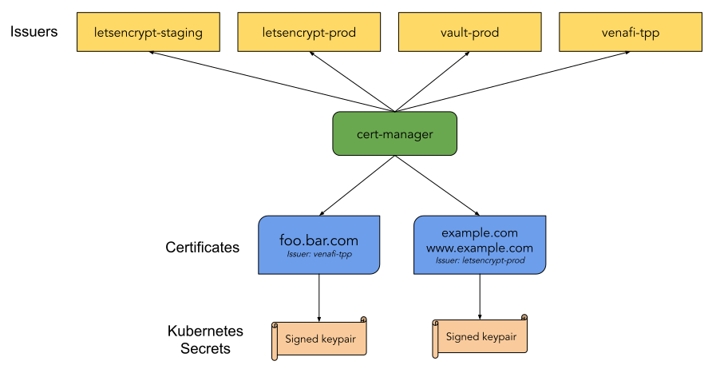
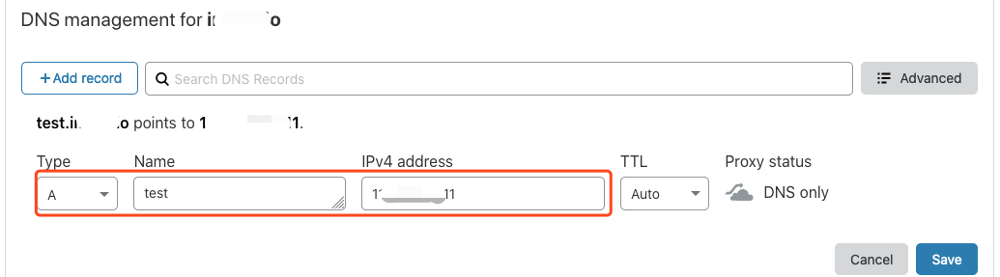
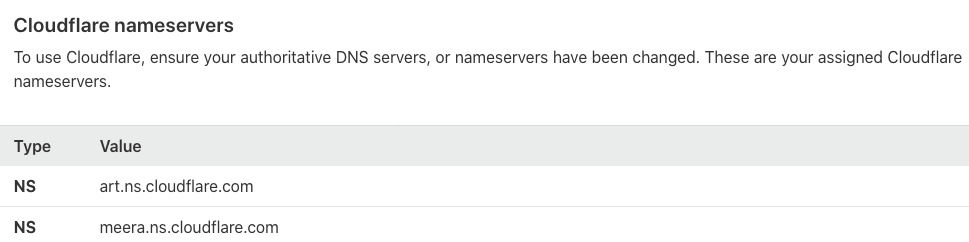
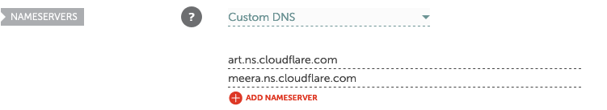

# k8s-ops
[k8s集群搭建](docker_k8s.md)

[yaml文件编写](yaml_concept.md)

[pod高级实战](pod_adv.md)

[kubectl管理k8s](./kubectl.md)

[k8s控制器 Replicaset 和 Deployment](./k8s_controllers_Replicaset_Deployment.md)

[存储类](./storages.md)

[ingress](./ingress.md)

[elk](./elk.md)

[pod自动扩展](./pod_autoscale.md)

[devops/CICD](./devops.md)

# 常用连接以及问题处理

## 相关镜像

[jenkins镜像](https://mirrors.tuna.tsinghua.edu.cn/jenkins/updates/update-center.json)

[docker源](https://2c2nqqhp.mirror.aliyuncs.com)

[阿里云镜像](https://developer.aliyun.com/mirror/)

## k8s调优的方向

1. 网络层面  网络插件
2. 存储 
3. iptables/ipvs

## 集群安装之后的操作

1. 所有节点安装metrics 
2. 安装监控
3. 配置基础的elk
4. 更新k8s证书时间

## 证书相关（let'sencrypt）

[kube-cert-manager](https://cert-manager.io/docs/installation/)

## 概述

随着 HTTPS 不断普及，大多数网站开始由 HTTP 升级到 HTTPS。使用 HTTPS 需要向权威机构申请证书，并且需要付出一定的成本，如果需求数量多，则开支也相对增加。cert-manager 是 Kubernetes 上的全能证书管理工具，支持利用 cert-manager 基于 [ACME](https://tools.ietf.org/html/rfc8555) 协议与 [Let's Encrypt](https://letsencrypt.org/) 签发免费证书并为证书自动续期，实现永久免费使用证书。

## 操作原理

### cert-manager 工作原理

cert-manager 部署到 Kubernetes 集群后会查阅其所支持的自定义资源 CRD，可通过创建 CRD 资源来指示 cert-manager 签发证书并为证书自动续期。如下图所示：


- Issuer/ClusterIssuer

  ：用于指示 cert-manager 签发证书的方式，本文主要讲解签发免费证书的 ACME 方式。

  > 说明：
  >
  > Issuer 与 ClusterIssuer 之间的区别是：Issuer 只能用来签发自身所在 namespace 下的证书，ClusterIssuer 可以签发任意 namespace 下的证书。

- **Certificate**：用于向 cert-manager 传递域名证书的信息、签发证书所需要的配置，以及对 Issuer/ClusterIssuer 的引用。

### 免费证书签发原理

Let’s Encrypt 利用 ACME 协议校验域名的归属，校验成功后可以自动颁发免费证书。免费证书有效期只有90天，需在到期前再校验一次实现续期。使用 cert-manager 可以自动续期，即实现永久使用免费证书。校验域名归属的两种方式分别是 **HTTP-01** 和 **DNS-01**，校验原理详情可参见 [Let's Encrypt 的运作方式](https://letsencrypt.org/zh-cn/how-it-works/)。

- HTTP-01 校验原理
-  

- DNS-01 校验原理

HTTP-01 的校验原理是给域名指向的 HTTP 服务增加一个临时 location。此方法仅适用于给使用 Ingress 暴露流量的服务颁发证书，并且不支持泛域名证书。
例如，Let’s Encrypt 会发送 HTTP 请求到 `http://<YOUR_DOMAIN>/.well-known/acme-challenge/<TOKEN>`。`YOUR_DOMAIN` 是被校验的域名。`TOKEN` 是 ACME 协议客户端负责放置的文件，在此处 ACME 客户端即 cert-manager，通过修改或创建 Ingress 规则来增加临时校验路径并指向提供 `TOKEN` 的服务。Let’s Encrypt 会对比 `TOKEN` 是否符合预期，校验成功后就会颁发证书。

### 校验方式对比

- HTTP-01 校验方式的优点是配置简单通用，不同 DNS 提供商均可使用相同的配置方法。缺点是需要依赖 Ingress，若仅适用于服务支持 Ingress 暴露流量，不支持泛域名证书。
- DNS-01 校验方式的优点是不依赖 Ingress，并支持泛域名。缺点是不同 DNS 提供商的配置方式不同，DNS 提供商过多而 cert-manager 的 Issuer 不能全部支持。部分可以通过部署实现 cert-manager 的 [Webhook](https://cert-manager.io/docs/concepts/webhook/) 服务来扩展 Issuer 进行支持。例如 DNSPod 和 阿里 DNS，详情请参见 [Webhook 列表](https://cert-manager.io/docs/configuration/acme/dns01/#webhook)。

本文向您推荐 `DNS-01` 方式，其限制较少，功能较全。

## 操作步骤

### 安装 cert-manager

通常使用 yaml 方式一键安装 cert-manager 到集群，可参考官网文档 [Installing with regular manifests](https://cert-manager.io/docs/installation/kubernetes/#installing-with-regular-manifests)。
cert-manager 官方使用的镜像在 `quay.io` 进行拉取。也可以执行以下命令，使用同步到国内 CCR 的镜像一键安装：

> 注意：
>
> 使用这种方式要求集群版本不得低于1.16。


```
kubectl apply --validate=false -f https://raw.githubusercontent.com/TencentCloudContainerTeam/manifest/master/cert-manager/cert-manager.yaml
```


### 配置 DNS

登录 DNS 提供商后台，配置域名的 DNS A 记录，指向所需要证书的后端服务对外暴露的 IP 地址。以 cloudflare 为例，如下图所示：


### HTTP-01 校验方式签发证书

若使用 HTTP-01 的校验方式，则需要用到 Ingress 来配合校验。cert-manager 会通过自动修改 Ingress 规则或自动新增 Ingress 来实现对外暴露校验所需的临时 HTTP 路径。为 Issuer 配置 HTTP-01 校验时，如果指定 Ingress 的 `name`，表示会自动修改指定 Ingress 的规则来暴露校验所需的临时 HTTP 路径，如果指定 `class`，则表示会自动新增 Ingress，可参考以下 [示例](https://cloud.tencent.com/document/product/457/49368#eg1)。

TKE 自带的 Ingress 中，每个 Ingress 资源都会对应一个负载均衡 CLB，如果使用 TKE 自带的 Ingress 暴露服务，并且使用 HTTP-01 方式校验，那么只能使用自动修改 Ingress 的方式，不能自动新增 Ingress。自动新增的 Ingress 会自动创建其他 CLB，使对外的 IP 地址与后端服务的 Ingress 不一致，Let's Encrypt 校验时将无法从服务的 Ingress 找到校验所需的临时路径，从而导致校验失败，无法签发证书。如果使用自建 Ingress，例如 [在 TKE 上部署 Nginx Ingress](https://cloud.tencent.com/document/product/457/47293)，同一个 Ingress class 的 Ingress 共享同一个 CLB，则支持使用自动新增 Ingress 的方式。

#### 示例

如果服务使用 TKE 自带的 Ingress 暴露服务，则不适合用 cert-manager 签发管理免费证书，证书从 [证书管理](https://console.cloud.tencent.com/ssl) 中被引用，不在 Kubernetes 中管理。
假设是 [在 TKE 上部署 Nginx Ingress](https://cloud.tencent.com/document/product/457/47293)，且后端服务的 Ingress 是 `prod/web`，可参考以下代码示例创建 Issuer：

```yaml
apiVersion: cert-manager.io/v1
kind: Issuer
metadata:
  name: letsencrypt-http01
  namespace: prod
spec:
  acme:
    server: https://acme-v02.api.letsencrypt.org/directory
    privateKeySecretRef:
      name: letsencrypt-http01-account-key
    solvers:
    - http01:
       ingress:
         name: web # 指定被自动修改的 Ingress 名称
```

使用 Issuer 签发证书，cert-manager 会自动创建 Ingress 资源，并自动修改 Ingress 的资源 `prod/web`，以暴露校验所需的临时路径。参考以下代码示例，自动新增 Ingress：

```yaml
apiVersion: cert-manager.io/v1
kind: Issuer
metadata:
  name: letsencrypt-http01
  namespace: prod
spec:
  acme:
    server: https://acme-v02.api.letsencrypt.org/directory
    privateKeySecretRef:
      name: letsencrypt-http01-account-key
    solvers:
    - http01:
       ingress:
         class: nginx # 指定自动创建的 Ingress 的 ingress class
```


成功创建 Issuer 后，参考以下代码示例，创建 Certificate 并引用 Issuer 进行签发：

```yaml
apiVersion: cert-manager.io/v1
kind: Certificate
metadata:
  name: test-mydomain-com
  namespace: prod
spec:
  dnsNames:
  - test.mydomain.com # 要签发证书的域名
  issuerRef:
    kind: Issuer
    name: letsencrypt-http01 # 引用 Issuer，指示采用 http01 方式进行校验
  secretName: test-mydomain-com-tls # 最终签发出来的证书会保存在这个 Secret 里面
```


### DNS-01 校验方式签发证书

若使用 DNS-01 的校验方式，则需要选择 DNS 提供商。cert-manager 内置 DNS 提供商的支持，详细列表和用法请参见 [Supported DNS01 providers](https://cert-manager.io/docs/configuration/acme/dns01/#supported-dns01-providers)。若需要使用列表外的 DNS 提供商，可参考以下两种方案：

- 方案1：设置 Custom Nameserver
-  

- 方案2：使用 Webhook

在 DNS 提供商后台设置 custom nameserver，指向例如 cloudflare 此类可管理其它 DNS 提供商域名的 nameserver 地址，具体地址可登录 cloudflare 后台查看。如下图所示：

namecheap 可以设置 custom nameserver，如下图所示：

最后配置 Issuer 指定 DNS-01 验证时，添加 cloudflare 的信息即可。

### 获取和使用证书

[创建 Certificate](https://cloud.tencent.com/document/product/457/49368#Certificate) 后，即可通过 kubectl 查看证书是否签发成功。

```shell
$ kubectl get certificate -n prod
NAME                READY   SECRET                  AGE
test-mydomain-com   True    test-mydomain-com-tls   1m
```

- `READY` 为 `False`：则表示签发失败，可以通过 describe 命令查看 event 来排查失败原因

  ```shell
   kubectl describe certificate test-mydomain-com -n prod
  ```

- `READY` 为 `True`：则表示签发成功，证书将保存在所指定的 Secret 中。例如，`default/test-mydomain-com-tls`。可以通过 kubectl 查看，其中 `tls.crt` 是证书，`tls.key` 是密钥。

  ```shell
  $ kubectl get secret test-mydomain-com-tls -n default
  ...
  data:
    tls.crt: <cert>
    tls.key: <private key>
  ```

  

您可以将其挂载到需要证书的应用中，或者直接在自建的 Ingress 中引用 secret。可参考以下示例：

```yaml
apiVersion: networking.k8s.io/v1beta1
kind: Ingress
metadata:
  name: test-ingress
  annotations:
    kubernetes.io/Ingress.class: nginx
spec:
  rules:
  - host: test.mydomain.com
    http:
      paths:
      - path: /web
        backend:
          serviceName: web
          servicePort: 80
  tls:
    hosts:
    - test.mydomain.com
    secretName: test-mydomain-com-tls
```

## jenkins 

1. 初始化 插件连接超时

   1. 在启动以后,输入密码,然后界面在缓冲 / 提示实例离线的时候, 打开`/pluginManager/advanced`

      在最下面设置`https://mirrors.tuna.tsinghua.edu.cn/jenkins/updates/update-center.json`,然后提交,然后chenk now一下
      

# kubectl 常用命令

Kubctl 命令是操作 kubernetes 集群的最直接和最 skillful 的途径，这个60多MB大小的二进制文件，到底有啥能耐呢？请看下文：

## Kubectl 自动补全

```bash
$ source <(kubectl completion bash) # setup autocomplete in bash, bash-completion package should be installed first.
$ source <(kubectl completion zsh)  # setup autocomplete in zsh
```

## Kubectl 上下文和配置

设置 `kubectl` 命令交互的 kubernetes 集群并修改配置信息。参阅 [使用 kubeconfig 文件进行跨集群验证](https://kubernetes.io/docs/tasks/access-application-cluster/configure-access-multiple-clusters) 获取关于配置文件的详细信息。

```bash
$ kubectl config view # 显示合并后的 kubeconfig 配置

# 同时使用多个 kubeconfig 文件并查看合并后的配置
$ KUBECONFIG=~/.kube/config:~/.kube/kubconfig2 kubectl config view

# 获取 e2e 用户的密码
$ kubectl config view -o jsonpath='{.users[?(@.name == "e2e")].user.password}'

$ kubectl config current-context              # 显示当前的上下文
$ kubectl config use-context my-cluster-name  # 设置默认上下文为 my-cluster-name

# 向 kubeconf 中增加支持基本认证的新集群
$ kubectl config set-credentials kubeuser/foo.kubernetes.com --username=kubeuser --password=kubepassword

# 使用指定的用户名和 namespace 设置上下文
$ kubectl config set-context gce --user=cluster-admin --namespace=foo \
  && kubectl config use-context gce
```

## 创建对象

Kubernetes 的清单文件可以使用 json 或 yaml 格式定义。可以以 `.yaml`、`.yml`、或者 `.json` 为扩展名。

```yaml
$ kubectl create -f ./my-manifest.yaml           # 创建资源
$ kubectl create -f ./my1.yaml -f ./my2.yaml     # 使用多个文件创建资源
$ kubectl create -f ./dir                        # 使用目录下的所有清单文件来创建资源
$ kubectl create -f https://git.io/vPieo         # 使用 url 来创建资源
$ kubectl run nginx --image=nginx                # 启动一个 nginx 实例
$ kubectl explain pods,svc                       # 获取 pod 和 svc 的文档

# 从 stdin 输入中创建多个 YAML 对象
$ cat <<EOF | kubectl create -f -
apiVersion: v1
kind: Pod
metadata:
  name: busybox-sleep
spec:
  containers:
  - name: busybox
    image: busybox
    args:
    - sleep
    - "1000000"
---
apiVersion: v1
kind: Pod
metadata:
  name: busybox-sleep-less
spec:
  containers:
  - name: busybox
    image: busybox
    args:
    - sleep
    - "1000"
EOF

# 创建包含几个 key 的 Secret
$ cat <<EOF | kubectl create -f -
apiVersion: v1
kind: Secret
metadata:
  name: mysecret
type: Opaque
data:
  password: $(echo "s33msi4" | base64)
  username: $(echo "jane" | base64)
EOF
```

## 显示和查找资源

```bash
# Get commands with basic output
$ kubectl get services                          # 列出所有 namespace 中的所有 service
$ kubectl get pods --all-namespaces             # 列出所有 namespace 中的所有 pod
$ kubectl get pods -o wide                      # 列出所有 pod 并显示详细信息
$ kubectl get deployment my-dep                 # 列出指定 deployment
$ kubectl get pods --include-uninitialized      # 列出该 namespace 中的所有 pod 包括未初始化的

# 使用详细输出来描述命令
$ kubectl describe nodes my-node
$ kubectl describe pods my-pod

$ kubectl get services --sort-by=.metadata.name # List Services Sorted by Name

# 根据重启次数排序列出 pod
$ kubectl get pods --sort-by='.status.containerStatuses[0].restartCount'

# 获取所有具有 app=cassandra 的 pod 中的 version 标签
$ kubectl get pods --selector=app=cassandra rc -o \
  jsonpath='{.items[*].metadata.labels.version}'

# 获取所有节点的 ExternalIP
$ kubectl get nodes -o jsonpath='{.items[*].status.addresses[?(@.type=="ExternalIP")].address}'

# 列出属于某个 PC 的 Pod 的名字
# “jq”命令用于转换复杂的 jsonpath，参考 https://stedolan.github.io/jq/
$ sel=${$(kubectl get rc my-rc --output=json | jq -j '.spec.selector | to_entries | .[] | "\(.key)=\(.value),"')%?}
$ echo $(kubectl get pods --selector=$sel --output=jsonpath={.items..metadata.name})

# 查看哪些节点已就绪
$ JSONPATH='{range .items[*]}{@.metadata.name}:{range @.status.conditions[*]}{@.type}={@.status};{end}{end}' \
 && kubectl get nodes -o jsonpath="$JSONPATH" | grep "Ready=True"

# 列出当前 Pod 中使用的 Secret
$ kubectl get pods -o json | jq '.items[].spec.containers[].env[]?.valueFrom.secretKeyRef.name' | grep -v null | sort | uniq
```

## 更新资源

```bash
$ kubectl rolling-update frontend-v1 -f frontend-v2.json           # 滚动更新 pod frontend-v1
$ kubectl rolling-update frontend-v1 frontend-v2 --image=image:v2  # 更新资源名称并更新镜像
$ kubectl rolling-update frontend --image=image:v2                 # 更新 frontend pod 中的镜像
$ kubectl rolling-update frontend-v1 frontend-v2 --rollback        # 退出已存在的进行中的滚动更新
$ cat pod.json | kubectl replace -f -                              # 基于 stdin 输入的 JSON 替换 pod

# 强制替换，删除后重新创建资源。会导致服务中断。
$ kubectl replace --force -f ./pod.json

# 为 nginx RC 创建服务，启用本地 80 端口连接到容器上的 8000 端口
$ kubectl expose rc nginx --port=80 --target-port=8000

# 更新单容器 pod 的镜像版本（tag）到 v4
$ kubectl get pod mypod -o yaml | sed 's/\(image: myimage\):.*$/\1:v4/' | kubectl replace -f -

$ kubectl label pods my-pod new-label=awesome                      # 添加标签
$ kubectl annotate pods my-pod icon-url=http://goo.gl/XXBTWq       # 添加注解
$ kubectl autoscale deployment foo --min=2 --max=10                # 自动扩展 deployment “foo”
```

## 修补资源

使用策略合并补丁并修补资源。

```bash
$ kubectl patch node k8s-node-1 -p '{"spec":{"unschedulable":true}}' # 部分更新节点

# 更新容器镜像； spec.containers[*].name 是必须的，因为这是合并的关键字
$ kubectl patch pod valid-pod -p '{"spec":{"containers":[{"name":"kubernetes-serve-hostname","image":"new image"}]}}'

# 使用具有位置数组的 json 补丁更新容器镜像
$ kubectl patch pod valid-pod --type='json' -p='[{"op": "replace", "path": "/spec/containers/0/image", "value":"new image"}]'

# 使用具有位置数组的 json 补丁禁用 deployment 的 livenessProbe
$ kubectl patch deployment valid-deployment  --type json   -p='[{"op": "remove", "path": "/spec/template/spec/containers/0/livenessProbe"}]'
```

## 编辑资源

在编辑器中编辑任何 API 资源。

```bash
$ kubectl edit svc/docker-registry                      # 编辑名为 docker-registry 的 service
$ KUBE_EDITOR="nano" kubectl edit svc/docker-registry   # 使用其它编辑器
```

## Scale 资源

```bash
$ kubectl scale --replicas=3 rs/foo                                 # Scale a replicaset named 'foo' to 3
$ kubectl scale --replicas=3 -f foo.yaml                            # Scale a resource specified in "foo.yaml" to 3
$ kubectl scale --current-replicas=2 --replicas=3 deployment/mysql  # If the deployment named mysql's current size is 2, scale mysql to 3
$ kubectl scale --replicas=5 rc/foo rc/bar rc/baz                   # Scale multiple replication controllers
```

## 删除资源

```bash
$ kubectl delete -f ./pod.json                                              # 删除 pod.json 文件中定义的类型和名称的 pod
$ kubectl delete pod,service baz foo                                        # 删除名为“baz”的 pod 和名为“foo”的 service
$ kubectl delete pods,services -l name=myLabel                              # 删除具有 name=myLabel 标签的 pod 和 serivce
$ kubectl delete pods,services -l name=myLabel --include-uninitialized      # 删除具有 name=myLabel 标签的 pod 和 service，包括尚未初始化的
$ kubectl -n my-ns delete po,svc --all                                      # 删除 my-ns namespace 下的所有 pod 和 serivce，包括尚未初始化的
```

## 与运行中的 Pod 交互

```bash
$ kubectl logs my-pod                                 # dump 输出 pod 的日志（stdout）
$ kubectl logs my-pod -c my-container                 # dump 输出 pod 中容器的日志（stdout，pod 中有多个容器的情况下使用）
$ kubectl logs -f my-pod                              # 流式输出 pod 的日志（stdout）
$ kubectl logs -f my-pod -c my-container              # 流式输出 pod 中容器的日志（stdout，pod 中有多个容器的情况下使用）
$ kubectl run -i --tty busybox --image=busybox -- sh  # 交互式 shell 的方式运行 pod
$ kubectl attach my-pod -i                            # 连接到运行中的容器
$ kubectl port-forward my-pod 5000:6000               # 转发 pod 中的 6000 端口到本地的 5000 端口
$ kubectl exec my-pod -- ls /                         # 在已存在的容器中执行命令（只有一个容器的情况下）
$ kubectl exec my-pod -c my-container -- ls /         # 在已存在的容器中执行命令（pod 中有多个容器的情况下）
$ kubectl top pod POD_NAME --containers               # 显示指定 pod 和容器的指标度量
```

## 与节点和集群交互

```bash
$ kubectl cordon my-node                                                # 标记 my-node 不可调度
$ kubectl drain my-node                                                 # 清空 my-node 以待维护
$ kubectl uncordon my-node                                              # 标记 my-node 可调度
$ kubectl top node my-node                                              # 显示 my-node 的指标度量
$ kubectl cluster-info                                                  # 显示 master 和服务的地址
$ kubectl cluster-info dump                                             # 将当前集群状态输出到 stdout                                    
$ kubectl cluster-info dump --output-directory=/path/to/cluster-state   # 将当前集群状态输出到 /path/to/cluster-state

# 如果该键和影响的污点（taint）已存在，则使用指定的值替换
$ kubectl taint nodes foo dedicated=special-user:NoSchedule
```

## 资源类型

下表列出的是 kubernetes 中所有支持的类型和缩写的别名。

| 资源类型                   | 缩写别名 |
| -------------------------- | -------- |
| `clusters`                 |          |
| `componentstatuses`        | `cs`     |
| `configmaps`               | `cm`     |
| `daemonsets`               | `ds`     |
| `deployments`              | `deploy` |
| `endpoints`                | `ep`     |
| `event`                    | `ev`     |
| `horizontalpodautoscalers` | `hpa`    |
| `ingresses`                | `ing`    |
| `jobs`                     |          |
| `limitranges`              | `limits` |
| `namespaces`               | `ns`     |
| `networkpolicies`          |          |
| `nodes`                    | `no`     |
| `statefulsets`             |          |
| `persistentvolumeclaims`   | `pvc`    |
| `persistentvolumes`        | `pv`     |
| `pods`                     | `po`     |
| `podsecuritypolicies`      | `psp`    |
| `podtemplates`             |          |
| `replicasets`              | `rs`     |
| `replicationcontrollers`   | `rc`     |
| `resourcequotas`           | `quota`  |
| `cronjob`                  |          |
| `secrets`                  |          |
| `serviceaccount`           | `sa`     |
| `services`                 | `svc`    |
| `storageclasses`           |          |
| `thirdpartyresources`      |          |

### 格式化输出

要以特定的格式向终端窗口输出详细信息，可以在 `kubectl` 命令中添加 `-o` 或者 `-output` 标志。

| 输出格式                            | 描述                                                         |
| ----------------------------------- | ------------------------------------------------------------ |
| `-o=custom-columns=<spec>`          | 使用逗号分隔的自定义列列表打印表格                           |
| `-o=custom-columns-file=<filename>` | 使用 文件中的自定义列模板打印表格                            |
| `-o=json`                           | 输出 JSON 格式的 API 对象                                    |
| `-o=jsonpath=<template>`            | 打印 [jsonpath](https://kubernetes.io/docs/user-guide/jsonpath) 表达式中定义的字段 |
| `-o=jsonpath-file=<filename>`       | 打印由 文件中的 [jsonpath](https://kubernetes.io/docs/user-guide/jsonpath) 表达式定义的字段 |
| `-o=name`                           | 仅打印资源名称                                               |
| `-o=wide`                           | 以纯文本格式输出任何附加信息，对于 Pod ，包含节点名称        |
| `-o=yaml`                           | 输出 YAML 格式的 API 对象                                    |

### Kubectl 详细输出和调试

使用 `-v` 或 `--v` 标志跟着一个整数来指定日志级别。

| 详细等级 | 描述                                                         |
| -------- | ------------------------------------------------------------ |
| `--v=0`  | 总是对操作人员可见。                                         |
| `--v=1`  | 合理的默认日志级别，如果您不需要详细输出。                   |
| `--v=2`  | 可能与系统的重大变化相关的，有关稳定状态的信息和重要的日志信息。这是对大多数系统推荐的日志级别。 |
| `--v=3`  | 有关更改的扩展信息。                                         |
| `--v=4`  | 调试级别详细输出。                                           |
| `--v=6`  | 显示请求的资源。                                             |
| `--v=7`  | 显示HTTP请求的header。                                       |
| `--v=8`  | 显示HTTP请求的内容。                                         |