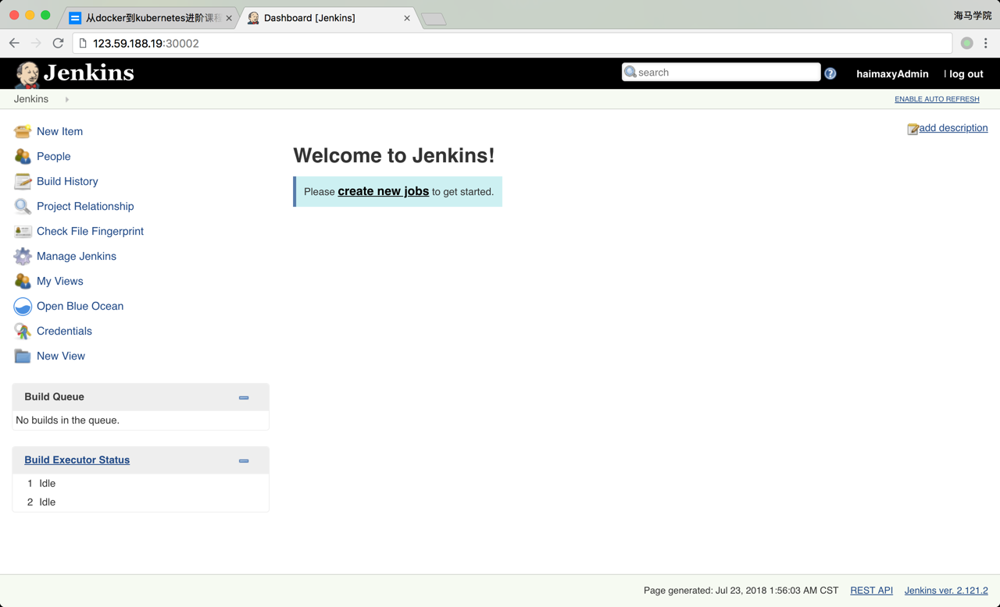

# jenkins 配置k8s互通以及pod 模版


# 基于 Jenkins 的 CI/CD (一)

前面的课程中我们学习了持久化数据存储在`Kubernetes`中的使用方法，其实接下来按照我们的课程进度来说应该是讲解服务发现这一部分的内容的，但是最近有很多同学要求我先讲解下 CI/CD 这块的内容，所以我们先把这块内容提前来讲解了。提到基于`Kubernete`的`CI/CD`，可以使用的工具有很多，比如`Jenkins`、`Gitlab CI`已经新兴的`drone`之类的，我们这里会使用大家最为熟悉的`Jenkins`来做`CI/CD`的工具。

## 安装

听我们课程的大部分同学应该都或多或少的听说过`Jenkins`，我们这里就不再去详细讲述什么是 Jenkins 了，直接进入正题，后面我们会单独的关于 Jenkins 的学习课程，想更加深入学习的同学也可以关注下。既然要基于`Kubernetes`来做`CI/CD`，当然我们这里需要将 Jenkins 安装到 Kubernetes 集群当中，新建一个 Deployment：(jenkins2.yaml)

```yaml
---
apiVersion: apps/v1
kind: Deployment
metadata:
  name: jenkins2
  namespace: kube-ops
spec: 
  selector:
    matchLabels:
      app: jenkins2
  template:
    metadata:
      labels:
        app: jenkins2
    spec:
      terminationGracePeriodSeconds: 10
      serviceAccount: jenkins2
      containers:
      - name: jenkins
        image: jenkins/jenkins:lts
        imagePullPolicy: IfNotPresent
        ports:
        - containerPort: 8080
          name: web
          protocol: TCP
        - containerPort: 50000
          name: agent
          protocol: TCP
        resources:
          limits:
            cpu: 1000m
            memory: 1Gi
          requests:
            cpu: 500m
            memory: 512Mi
        livenessProbe:
          httpGet:
            path: /login
            port: 8080
          initialDelaySeconds: 60
          timeoutSeconds: 5
          failureThreshold: 12
        readinessProbe:
          httpGet:
            path: /login
            port: 8080
          initialDelaySeconds: 60
          timeoutSeconds: 5
          failureThreshold: 12
        volumeMounts:
        - name: jenkinshome
          subPath: jenkins2
          mountPath: /var/jenkins_home
      securityContext:
        fsGroup: 1000
      volumes:
      - name: jenkinshome
        persistentVolumeClaim:
          claimName: opspvc

---
apiVersion: v1
kind: Service
metadata:
  name: jenkins2
  namespace: kube-ops
  labels:
    app: jenkins2
spec:
  selector:
    app: jenkins2
  type: NodePort
  ports:
  - name: web
    port: 8080
    targetPort: web
    nodePort: 30002
  - name: agent
    port: 50000
    targetPort: agent
```

为了方便演示，我们把本节课所有的对象资源都放置在一个名为 kube-ops 的 namespace 下面，所以我们需要添加创建一个 namespace：

```shell
$ kubectl create namespace kube-ops
```

我们这里使用一个名为 jenkins/jenkins:lts 的镜像，这是 jenkins 官方的 Docker 镜像，然后也有一些环境变量，当然我们也可以根据自己的需求来定制一个镜像，比如我们可以将一些插件打包在自定义的镜像当中，可以参考文档：https://github.com/jenkinsci/docker，我们这里使用默认的官方镜像就行，另外一个还需要注意的是我们将容器的 /var/jenkins_home 目录挂载到了一个名为 opspvc 的 PVC 对象上面，所以我们同样还得提前创建一个对应的 PVC 对象，当然我们也可以使用我们前面的 StorageClass 对象来自动创建：(pvc.yaml)

```yaml
apiVersion: v1
kind: PersistentVolume
metadata:
  name: opspv
spec:
  capacity:
    storage: 20Gi
  accessModes:
  - ReadWriteMany
  persistentVolumeReclaimPolicy: Delete
  nfs:
    server: 10.151.30.57
    path: /data/k8s

---
kind: PersistentVolumeClaim
apiVersion: v1
metadata:
  name: opspvc
  namespace: kube-ops
spec:
  accessModes:
    - ReadWriteMany
  resources:
    requests:
      storage: 20Gi
```

创建需要用到的 PVC 对象：

```shell
$ kubectl create -f pvc.yaml
```

另外我们这里还需要使用到一个拥有相关权限的 serviceAccount：jenkins2，我们这里只是给 jenkins 赋予了一些必要的权限，当然如果你对 serviceAccount 的权限不是很熟悉的话，我们给这个 sa 绑定一个 cluster-admin 的集群角色权限也是可以的，当然这样具有一定的安全风险：（rbac.yaml）

```yaml
apiVersion: v1
kind: ServiceAccount
metadata:
  name: jenkins2
  namespace: kube-ops

---

kind: ClusterRole
apiVersion: rbac.authorization.k8s.io/v1beta1
metadata:
  name: jenkins2
rules:
  - apiGroups: ["extensions", "apps"]
    resources: ["deployments"]
    verbs: ["create", "delete", "get", "list", "watch", "patch", "update"]
  - apiGroups: [""]
    resources: ["services"]
    verbs: ["create", "delete", "get", "list", "watch", "patch", "update"]
  - apiGroups: [""]
    resources: ["pods"]
    verbs: ["create","delete","get","list","patch","update","watch"]
  - apiGroups: [""]
    resources: ["pods/exec"]
    verbs: ["create","delete","get","list","patch","update","watch"]
  - apiGroups: [""]
    resources: ["pods/log"]
    verbs: ["get","list","watch"]
  - apiGroups: [""]
    resources: ["secrets"]
    verbs: ["get"]

---
apiVersion: rbac.authorization.k8s.io/v1beta1
kind: ClusterRoleBinding
metadata:
  name: jenkins2
  namespace: kube-ops
roleRef:
  apiGroup: rbac.authorization.k8s.io
  kind: ClusterRole
  name: jenkins2
subjects:
  - kind: ServiceAccount
    name: jenkins2
    namespace: kube-ops
```

创建 rbac 相关的资源对象：

```shell
$ kubectl create -f rbac.yaml
serviceaccount "jenkins2" created
role.rbac.authorization.k8s.io "jenkins2" created
rolebinding.rbac.authorization.k8s.io "jenkins2" created
```

最后为了方便我们测试，我们这里通过 NodePort 的形式来暴露 Jenkins 的 web 服务，固定为30002端口，另外还需要暴露一个 agent 的端口，这个端口主要是用于 Jenkins 的 master 和 slave 之间通信使用的。

一切准备的资源准备好过后，我们直接创建 Jenkins 服务：

```yaml
$ kubectl create -f jenkins2.yaml
deployment.extensions "jenkins2" created
service "jenkins2" created
```

创建完成后，要去拉取镜像可能需要等待一会儿，然后我们查看下 Pod 的状态：

```shell
$ kubectl get pods -n kube-ops
NAME                        READY     STATUS    RESTARTS   AGE
jenkins2-7f5494cd44-pqpzs   0/1       Running   0          2m
```

可以看到该 Pod 处于 Running 状态，但是 READY 值确为0，然后我们用 describe 命令去查看下该 Pod 的详细信息：

```shell
$ kubectl describe pod jenkins2-7f5494cd44-pqpzs -n kube-ops
...
Normal   Created                3m                kubelet, node01    Created container
  Normal   Started                3m                kubelet, node01    Started container
  Warning  Unhealthy              1m (x10 over 2m)  kubelet, node01    Liveness probe failed: Get http://10.244.1.165:8080/login: dial tcp 10.244.1.165:8080: getsockopt: connection refused
  Warning  Unhealthy              1m (x10 over 2m)  kubelet, node01    Readiness probe failed: Get http://10.244.1.165:8080/login: dial tcp 10.244.1.165:8080: getsockopt: connection refused
```

可以看到上面的 Warning 信息，健康检查没有通过，具体原因是什么引起的呢？可以通过查看日志进一步了解：

```shell
$ kubectl logs -f jenkins2-7f5494cd44-pqpzs -n kube-ops
touch: cannot touch '/var/jenkins_home/copy_reference_file.log': Permission denied
Can not write to /var/jenkins_home/copy_reference_file.log. Wrong volume permissions?
```

很明显可以看到上面的错误信息，意思就是我们没有权限在 jenkins 的 home 目录下面创建文件，这是因为默认的镜像使用的是 jenkins 这个用户，而我们通过 PVC 挂载到 nfs 服务器的共享数据目录下面却是 root 用户的，所以没有权限访问该目录，要解决该问题，也很简单，我只需要在 nfs 共享数据目录下面把我们的目录权限重新分配下即可：

```shell
$ chown -R 1000 /data/k8s/jenkins2
```

> 当然还有另外一种方法是我们自定义一个镜像，在镜像中指定使用 root 用户也可以

然后我们再重新创建：

```shell
$ kubectl delete -f jenkins.yaml
deployment.extensions "jenkins2" deleted
service "jenkins2" deleted
$ kubectl create -f jenkins.yaml
deployment.extensions "jenkins2" created
service "jenkins2" created
```

现在我们再去查看新生成的 Pod 已经没有错误信息了：

```shell
$ kubectl get pods -n kube-ops
NAME                        READY     STATUS        RESTARTS   AGE
jenkins2-7f5494cd44-smn2r   1/1       Running       0          25s
```

等到服务启动成功后，我们就可以根据任意节点的 IP:30002 端口就可以访问 jenkins 服务了，可以根据提示信息进行安装配置即可：  初始化的密码我们可以在 jenkins 的容器的日志中进行查看，也可以直接在 nfs 的共享数据目录中查看：

```shell
$ cat /data/k8s/jenkins2/secrets/initAdminPassword
```

然后选择安装推荐的插件即可。 

安装完成后添加管理员帐号即可进入到 jenkins 主界面： 

## 优点

Jenkins 安装完成了，接下来我们不用急着就去使用，我们要了解下在 Kubernetes 环境下面使用 Jenkins 有什么好处。

我们知道持续构建与发布是我们日常工作中必不可少的一个步骤，目前大多公司都采用 Jenkins 集群来搭建符合需求的 CI/CD 流程，然而传统的 Jenkins Slave 一主多从方式会存在一些痛点，比如：

- 主 Master 发生单点故障时，整个流程都不可用了
- 每个 Slave 的配置环境不一样，来完成不同语言的编译打包等操作，但是这些差异化的配置导致管理起来非常不方便，维护起来也是比较费劲
- 资源分配不均衡，有的 Slave 要运行的 job 出现排队等待，而有的 Slave 处于空闲状态
- 资源有浪费，每台 Slave 可能是物理机或者虚拟机，当 Slave 处于空闲状态时，也不会完全释放掉资源。

正因为上面的这些种种痛点，我们渴望一种更高效更可靠的方式来完成这个 CI/CD 流程，而 Docker 虚拟化容器技术能很好的解决这个痛点，又特别是在 Kubernetes 集群环境下面能够更好来解决上面的问题，下图是基于 Kubernetes 搭建 Jenkins 集群的简单示意图： 

从图上可以看到 Jenkins Master 和 Jenkins Slave 以 Pod 形式运行在 Kubernetes 集群的 Node 上，Master 运行在其中一个节点，并且将其配置数据存储到一个 Volume 上去，Slave 运行在各个节点上，并且它不是一直处于运行状态，它会按照需求动态的创建并自动删除。

这种方式的工作流程大致为：当 Jenkins Master 接受到 Build 请求时，会根据配置的 Label 动态创建一个运行在 Pod 中的 Jenkins Slave 并注册到 Master 上，当运行完 Job 后，这个 Slave 会被注销并且这个 Pod 也会自动删除，恢复到最初状态。

那么我们使用这种方式带来了哪些好处呢？

- **服务高可用**，当 Jenkins Master 出现故障时，Kubernetes 会自动创建一个新的 Jenkins Master 容器，并且将 Volume 分配给新创建的容器，保证数据不丢失，从而达到集群服务高可用。
- **动态伸缩**，合理使用资源，每次运行 Job 时，会自动创建一个 Jenkins Slave，Job 完成后，Slave 自动注销并删除容器，资源自动释放，而且 Kubernetes 会根据每个资源的使用情况，动态分配 Slave 到空闲的节点上创建，降低出现因某节点资源利用率高，还排队等待在该节点的情况。
- **扩展性好**，当 Kubernetes 集群的资源严重不足而导致 Job 排队等待时，可以很容易的添加一个 Kubernetes Node 到集群中，从而实现扩展。

是不是以前我们面临的种种问题在 Kubernetes 集群环境下面是不是都没有了啊？看上去非常完美。

## 配置

接下来我们就需要来配置 Jenkins，让他能够动态的生成 Slave 的 Pod。

第1步. 我们需要安装**kubernetes plugin**， 点击 Manage Jenkins -> Manage Plugins -> Available -> Kubernetes plugin 勾选安装即可。 

第2步. 安装完毕后，点击 Manage Jenkins —> Configure System —> (拖到最下方)Add a new cloud —> 选择 Kubernetes，然后填写 Kubernetes 和 Jenkins 配置信息。 

注意 namespace，我们这里填 kube-ops，然后点击**Test Connection**，如果出现 Connection test successful 的提示信息证明 Jenkins 已经可以和 Kubernetes 系统正常通信了，然后下方的 Jenkins URL 地址：**[http://jenkins2.kube-ops.svc.cluster.local:8080](http://jenkins2.kube-ops.svc.cluster.local:8080/)**，这里的格式为：服务名.namespace.svc.cluster.local:8080，**根据上面创建的jenkins 的服务名填写，我这里是之前创建的名为jenkins，如果是用上面我们创建的就应该是jenkins2**

> 另外需要注意，如果这里 Test Connection 失败的话，很有可能是权限问题，这里就需要把我们创建的 jenkins 的 serviceAccount 对应的 secret 添加到这里的 Credentials 里面。

第3步. 配置 Pod Template，其实就是配置 Jenkins Slave 运行的 Pod 模板，命名空间我们同样是用 kube-ops，Labels 这里也非常重要，对于后面执行 Job 的时候需要用到该值，然后我们这里使用的是 cnych/jenkins:jnlp 这个镜像，这个镜像是在官方的 jnlp 镜像基础上定制的，加入了 kubectl 等一些实用的工具。 

> 注意：由于新版本的 Kubernetes 插件变化较多，如果你使用的 Jenkins 版本在 2.176.x 版本以上，注意将上面的镜像替换成`cnych/jenkins:jnlp6`，否则使用会报错，配置如下图所示：

kubernetes slave image config

另外需要注意我们这里需要在下面挂载两个主机目录，一个是`/var/run/docker.sock`，该文件是用于 Pod 中的容器能够共享宿主机的 Docker，这就是大家说的 docker in docker 的方式，Docker 二进制文件我们已经打包到上面的镜像中了，另外一个目录下`/root/.kube`目录，我们将这个目录挂载到容器的`/root/.kube`目录下面这是为了让我们能够在 Pod 的容器中能够使用 kubectl 工具来访问我们的 Kubernetes 集群，方便我们后面在 Slave Pod 部署 Kubernetes 应用。 

另外还有几个参数需要注意，如下图中的**Time in minutes to retain slave when idle**，这个参数表示的意思是当处于空闲状态的时候保留 Slave Pod 多长时间，这个参数最好我们保存默认就行了，如果你设置过大的话，Job 任务执行完成后，对应的 Slave Pod 就不会立即被销毁删除。 

另外一些同学在配置了后运行 Slave Pod 的时候出现了权限问题，因为 Jenkins Slave Pod 中没有配置权限，所以需要配置上 ServiceAccount，在 Slave Pod 配置的地方点击下面的高级，添加上对应的 ServiceAccount 即可： 

还有一些同学在配置完成后发现启动 Jenkins Slave Pod 的时候，出现 Slave Pod 连接不上，然后尝试100次连接之后销毁 Pod，然后会再创建一个 Slave Pod 继续尝试连接，无限循环，类似于下面的信息： 

如果出现这种情况的话就需要将 Slave Pod 中的运行命令和参数两个值给清空掉 

到这里我们的 Kubernetes Plugin 插件就算配置完成了。

## 测试

Kubernetes 插件的配置工作完成了，接下来我们就来添加一个 Job 任务，看是否能够在 Slave Pod 中执行，任务执行完成后看 Pod 是否会被销毁。

在 Jenkins 首页点击**create new jobs**，创建一个测试的任务，输入任务名称，然后我们选择 Freestyle project 类型的任务： 

注意在下面的 Label Expression 这里要填入**haimaxy-jnlp**，就是前面我们配置的 Slave Pod 中的 Label，这两个地方必须保持一致 

然后往下拉，在 Build 区域选择**Execute shell** 

然后输入我们测试命令

```shell
echo "测试 Kubernetes 动态生成 jenkins slave"
echo "==============docker in docker==========="
docker info

echo "=============kubectl============="
kubectl get pods
```

最后点击保存 

现在我们直接在页面点击做成的 Build now 触发构建即可，然后观察 Kubernetes 集群中 Pod 的变化

```shell
$ kubectl get pods -n kube-ops
NAME                       READY     STATUS              RESTARTS   AGE
jenkins2-7c85b6f4bd-rfqgv   1/1       Running             3          1d
jnlp-hfmvd                 0/1       ContainerCreating   0          7s
```

我们可以看到在我们点击立刻构建的时候可以看到一个新的 Pod：jnlp-hfmvd 被创建了，这就是我们的 Jenkins Slave。任务执行完成后我们可以看到任务信息，比如我们这里是 花费了 5.2s 时间在 jnlp-hfmvd 这个 Slave上面 

同样也可以查看到对应的控制台信息： 

到这里证明我们的任务已经构建完成，然后这个时候我们再去集群查看我们的 Pod 列表，发现 kube-ops 这个 namespace 下面已经没有之前的 Slave 这个 Pod 了。

```shell
$ kubectl get pods -n kube-ops
NAME                       READY     STATUS    RESTARTS   AGE
jenkins2-7c85b6f4bd-rfqgv   1/1       Running   3          1d
```

到这里我们就完成了使用 Kubernetes 动态生成 Jenkins Slave 的方法。

## Jenkins Pipeline 介绍

要实现在 Jenkins 中的构建工作，可以有多种方式，我们这里采用比较常用的 Pipeline 这种方式。Pipeline，简单来说，就是一套运行在 Jenkins 上的工作流框架，将原来独立运行于单个或者多个节点的任务连接起来，实现单个任务难以完成的复杂流程**编排**和**可视化**的工作。

Jenkins Pipeline 有几个核心概念：

- Node：节点，一个 Node 就是一个 Jenkins 节点，Master 或者 Agent，是执行 Step 的具体运行环境，比如我们之前动态运行的 Jenkins Slave 就是一个 Node 节点
- Stage：阶段，一个 Pipeline 可以划分为若干个 Stage，每个 Stage 代表一组操作，比如：Build、Test、Deploy，Stage 是一个逻辑分组的概念，可以跨多个 Node
- Step：步骤，Step 是最基本的操作单元，可以是打印一句话，也可以是构建一个 Docker 镜像，由各类 Jenkins 插件提供，比如命令：sh 'make'，就相当于我们平时 shell 终端中执行 make 命令一样。

那么我们如何创建 Jenkins Pipline 呢？

- Pipeline 脚本是由 Groovy 语言实现的，但是我们没必要单独去学习 Groovy，当然你会的话最好
- Pipeline 支持两种语法：Declarative(声明式)和 Scripted Pipeline(脚本式)语法
- Pipeline 也有两种创建方法：可以直接在 Jenkins 的 Web UI 界面中输入脚本；也可以通过创建一个 Jenkinsfile 脚本文件放入项目源码库中
- 一般我们都推荐在 Jenkins 中直接从源代码控制(SCMD)中直接载入 Jenkinsfile Pipeline 这种方法

## 创建一个简单的 Pipeline

我们这里来给大家快速创建一个简单的 Pipeline，直接在 Jenkins 的 Web UI 界面中输入脚本运行。

- 新建 Job：在 Web UI 中点击 New Item -> 输入名称：pipeline-demo -> 选择下面的 Pipeline -> 点击 OK

- 配置：在最下方的 Pipeline 区域输入如下 Script 脚本，然后点击保存。

  ```shell
  node {
    stage('Clone') {
      echo "1.Clone Stage"
    }
    stage('Test') {
      echo "2.Test Stage"
    }
    stage('Build') {
      echo "3.Build Stage"
    }
    stage('Deploy') {
      echo "4. Deploy Stage"
    }
  }
  ```

- 构建：点击左侧区域的 Build Now，可以看到 Job 开始构建了

隔一会儿，构建完成，可以点击左侧区域的 Console Output，我们就可以看到如下输出信息：

 我们可以看到上面我们 Pipeline 脚本中的4条输出语句都打印出来了，证明是符合我们的预期的。

> 如果大家对 Pipeline 语法不是特别熟悉的，可以前往输入脚本的下面的链接[Pipeline Syntax](http://k8s.haimaxy.com:30001/job/pipeline-demo/pipeline-syntax/)中进行查看，这里有很多关于 Pipeline 语法的介绍，也可以自动帮我们生成一些脚本。

## 在 Slave 中构建任务

上面我们创建了一个简单的 Pipeline 任务，但是我们可以看到这个任务并没有在 Jenkins 的 Slave 中运行，那么如何让我们的任务跑在 Slave 中呢？还记得上节课我们在添加 Slave Pod 的时候，一定要记住添加的 label 吗？没错，我们就需要用到这个 label，我们重新编辑上面创建的 Pipeline 脚本，给 node 添加一个 label 属性，如下：

```shell
node('haimaxy-jnlp') {
    stage('Clone') {
      echo "1.Clone Stage"
    }
    stage('Test') {
      echo "2.Test Stage"
    }
    stage('Build') {
      echo "3.Build Stage"
    }
    stage('Deploy') {
      echo "4. Deploy Stage"
    }
}
```

我们这里只是给 node 添加了一个 haimaxy-jnlp 这样的一个label，然后我们保存，构建之前查看下 kubernetes 集群中的 Pod：

```shell
$ kubectl get pods -n kube-ops
NAME                       READY     STATUS              RESTARTS   AGE
jenkins-7c85b6f4bd-rfqgv   1/1       Running             4          6d
```

然后重新触发立刻构建：

```shell
$ kubectl get pods -n kube-ops
NAME                       READY     STATUS    RESTARTS   AGE
jenkins-7c85b6f4bd-rfqgv   1/1       Running   4          6d
jnlp-0hrrz                 1/1       Running   0          23s
```

我们发现多了一个名叫**jnlp-0hrrz**的 Pod 正在运行，隔一会儿这个 Pod 就不再了：

```
$ kubectl get pods -n kube-ops
NAME                       READY     STATUS    RESTARTS   AGE
jenkins-7c85b6f4bd-rfqgv   1/1       Running   4          6d
```

这也证明我们的 Job 构建完成了，同样回到 Jenkins 的 Web UI 界面中查看 Console Output，可以看到如下的信息：

 是不是也证明我们当前的任务在跑在上面动态生成的这个 Pod 中，也符合我们的预期。我们回到 [Job 的主界面](http://k8s.haimaxy.com:30001/job/pipeline-demo/)，也可以看到大家可能比较熟悉的 Stage View 界面：

pipeline demo3

## 部署 Kubernetes 应用

上面我们已经知道了如何在 Jenkins Slave 中构建任务了，那么如何来部署一个原生的 Kubernetes 应用呢？ 要部署 Kubernetes 应用，我们就得对我们之前部署应用的流程要非常熟悉才行，我们之前的流程是怎样的：

- 编写代码
- 测试
- 编写 Dockerfile
- 构建打包 Docker 镜像
- 推送 Docker 镜像到仓库
- 编写 Kubernetes YAML 文件
- 更改 YAML 文件中 Docker 镜像 TAG
- 利用 kubectl 工具部署应用

我们之前在 Kubernetes 环境中部署一个原生应用的流程应该基本上是上面这些流程吧？现在我们就需要把上面这些流程放入 Jenkins 中来自动帮我们完成(当然编码除外)，从测试到更新 YAML 文件属于 CI 流程，后面部署属于 CD 的流程。如果按照我们上面的示例，我们现在要来编写一个 Pipeline 的脚本，应该怎么编写呢？

```shell
node('haimaxy-jnlp') {
    stage('Clone') {
      echo "1.Clone Stage"
    }
    stage('Test') {
      echo "2.Test Stage"
    }
    stage('Build') {
      echo "3.Build Docker Image Stage"
    }
    stage('Push') {
      echo "4.Push Docker Image Stage"
    }
    stage('YAML') {
      echo "5. Change YAML File Stage"
    }
    stage('Deploy') {
      echo "6. Deploy Stage"
    }
}
```

这里我们来将一个简单 golang 程序，部署到 kubernetes 环境中，代码链接：https://github.com/cnych/jenkins-demo。如果按照之前的示例，我们是不是应该像这样来编写 Pipeline 脚本：

- 第一步，clone 代码，这个没得说吧
- 第二步，进行测试，如果测试通过了才继续下面的任务
- 第三步，由于 Dockerfile 基本上都是放入源码中进行管理的，所以我们这里就是直接构建 Docker 镜像了
- 第四步，镜像打包完成，就应该推送到镜像仓库中吧
- 第五步，镜像推送完成，是不是需要更改 YAML 文件中的镜像 TAG 为这次镜像的 TAG
- 第六步，万事俱备，只差最后一步，使用 kubectl 命令行工具进行部署了

到这里我们的整个 CI/CD 的流程是不是就都完成了。

接下来我们就来对每一步具体要做的事情进行详细描述就行了：

#### 第一步，Clone 代码

```shell
stage('Clone') {
    echo "1.Clone Stage"
    git url: "https://github.com/cnych/jenkins-demo.git"
}
```

#### 第二步，测试

由于我们这里比较简单，忽略该步骤即可

#### 第三步，构建镜像

```shell
stage('Build') {
    echo "3.Build Docker Image Stage"
    sh "docker build -t cnych/jenkins-demo:${build_tag} ."
}
```

我们平时构建的时候是不是都是直接使用`docker build`命令进行构建就行了，那么这个地方呢？我们上节课给大家提供的 Slave Pod 的镜像里面是不是采用的 Docker In Docker 的方式，也就是说我们也可以直接在 Slave 中使用 docker build 命令，所以我们这里直接使用 sh 直接执行 docker build 命令即可，但是镜像的 tag 呢？如果我们使用镜像 tag，则每次都是 latest 的 tag，这对于以后的排查或者回滚之类的工作会带来很大麻烦，我们这里采用和**git commit**的记录为镜像的 tag，这里有一个好处就是镜像的 tag 可以和 git 提交记录对应起来，也方便日后对应查看。但是由于这个 tag 不只是我们这一个 stage 需要使用，下一个推送镜像是不是也需要，所以这里我们把这个 tag 编写成一个公共的参数，把它放在 Clone 这个 stage 中，这样一来我们前两个 stage 就变成了下面这个样子：

```shell
stage('Clone') {
    echo "1.Clone Stage"
    git url: "https://github.com/cnych/jenkins-demo.git"
    script {
        build_tag = sh(returnStdout: true, script: 'git rev-parse --short HEAD').trim()
    }
}
stage('Build') {
    echo "3.Build Docker Image Stage"
    sh "docker build -t cnych/jenkins-demo:${build_tag} ."
}
```

#### 第四步，推送镜像

镜像构建完成了，现在我们就需要将此处构建的镜像推送到镜像仓库中去，当然如果你有私有镜像仓库也可以，我们这里还没有自己搭建私有的仓库，所以直接使用 docker hub 即可。

> 在后面的课程中我们学习了私有仓库 Harbor 的搭建后，再来更改成 Harbor 仓库

我们知道 docker hub 是公共的镜像仓库，任何人都可以获取上面的镜像，但是要往上推送镜像我们就需要用到一个帐号了，所以我们需要提前注册一个 docker hub 的帐号，记住用户名和密码，我们这里需要使用。正常来说我们在本地推送 docker 镜像的时候，是不是需要使用**docker login**命令，然后输入用户名和密码，认证通过后，就可以使用**docker push**命令来推送本地的镜像到 docker hub 上面去了，如果是这样的话，我们这里的 Pipeline 是不是就该这样写了：

```shell
stage('Push') {
    echo "4.Push Docker Image Stage"
    sh "docker login -u cnych -p xxxxx"
    sh "docker push cnych/jenkins-demo:${build_tag}"
}
```

如果我们只是在 Jenkins 的 Web UI 界面中来完成这个任务的话，我们这里的 Pipeline 是可以这样写的，但是我们是不是推荐使用 Jenkinsfile 的形式放入源码中进行版本管理，这样的话我们直接把 docker 仓库的用户名和密码暴露给别人这样很显然是非常非常不安全的，更何况我们这里使用的是 github 的公共代码仓库，所有人都可以直接看到我们的源码，所以我们应该用一种方式来隐藏用户名和密码这种私密信息，幸运的是 Jenkins 为我们提供了解决方法。

在首页点击 Credentials -> Stores scoped to Jenkins 下面的 Jenkins -> Global credentials (unrestricted) -> 左侧的 Add Credentials：添加一个 Username with password 类型的认证信息，如下：

 输入 docker hub 的用户名和密码，ID 部分我们输入**dockerHub**，注意，这个值非常重要，在后面 Pipeline 的脚本中我们需要使用到这个 ID 值。

有了上面的 docker hub 的用户名和密码的认证信息，现在我们可以在 Pipeline 中使用这里的用户名和密码了：

```shell
stage('Push') {
    echo "4.Push Docker Image Stage"
    withCredentials([usernamePassword(credentialsId: 'dockerHub', passwordVariable: 'dockerHubPassword', usernameVariable: 'dockerHubUser')]) {
        sh "docker login -u ${dockerHubUser} -p ${dockerHubPassword}"
        sh "docker push cnych/jenkins-demo:${build_tag}"
    }
}
```

注意我们这里在 stage 中使用了一个新的函数**withCredentials**，其中有一个 credentialsId 值就是我们刚刚创建的 ID 值，而对应的用户名变量就是 ID 值加上 User，密码变量就是 ID 值加上 Password，然后我们就可以在脚本中直接使用这里两个变量值来直接替换掉之前的登录 docker hub 的用户名和密码，现在是不是就很安全了，我只是传递进去了两个变量而已，别人并不知道我的真正用户名和密码，只有我们自己的 Jenkins 平台上添加的才知道。

#### 第五步，更改 YAML

上面我们已经完成了镜像的打包、推送的工作，接下来我们是不是应该更新 Kubernetes 系统中应用的镜像版本了，当然为了方便维护，我们都是用 YAML 文件的形式来编写应用部署规则，比如我们这里的 YAML 文件：(k8s.yaml)

```yaml
apiVersion: app/v1
kind: Deployment
metadata:
  name: jenkins-demo
spec:
  selector:
    matchLabels:
      app: jenkins-demo
  template:
    metadata:
      labels:
        app: jenkins-demo
    spec:
      containers:
      - image: cnych/jenkins-demo:<BUILD_TAG>
        imagePullPolicy: IfNotPresent
        name: jenkins-demo
        env:
        - name: branch
          value: <BRANCH_NAME>
```

对于 Kubernetes 比较熟悉的同学，对上面这个 YAML 文件一定不会陌生，我们使用一个 Deployment 资源对象来管理 Pod，该 Pod 使用的就是我们上面推送的镜像，唯一不同的地方是 Docker 镜像的 tag 不是我们平常见的具体的 tag，而是一个 的标识，实际上如果我们将这个标识替换成上面的 Docker 镜像的 tag，是不是就是最终我们本次构建需要使用到的镜像？怎么替换呢？其实也很简单，我们使用一个**sed**命令就可以实现了：

```shell
stage('YAML') {
    echo "5. Change YAML File Stage"
    sh "sed -i 's/<BUILD_TAG>/${build_tag}/' k8s.yaml"
    sh "sed -i 's/<BRANCH_NAME>/${env.BRANCH_NAME}/' k8s.yaml"
}
```

上面的 sed 命令就是将 k8s.yaml 文件中的 标识给替换成变量 build_tag 的值。

#### 第六步，部署

Kubernetes 应用的 YAML 文件已经更改完成了，之前我们手动的环境下，是不是直接使用 kubectl apply 命令就可以直接更新应用了啊？当然我们这里只是写入到了 Pipeline 里面，思路都是一样的：

```shell
stage('Deploy') {
    echo "6. Deploy Stage"
    sh "kubectl apply -f k8s.yaml"
}
```

这样到这里我们的整个流程就算完成了。

## 人工确认

理论上来说我们上面的6个步骤其实已经完成了，但是一般在我们的实际项目实践过程中，可能还需要一些人工干预的步骤，这是为什么呢？比如我们提交了一次代码，测试也通过了，镜像也打包上传了，但是这个版本并不一定就是要立刻上线到生产环境的，对吧，我们可能需要将该版本先发布到测试环境、QA 环境、或者预览环境之类的，总之直接就发布到线上环境去还是挺少见的，所以我们需要增加人工确认的环节，一般都是在 CD 的环节才需要人工干预，比如我们这里的最后两步，我们就可以在前面加上确认，比如：

```shell
stage('YAML') {
    echo "5. Change YAML File Stage"
    def userInput = input(
        id: 'userInput',
        message: 'Choose a deploy environment',
        parameters: [
            [
                $class: 'ChoiceParameterDefinition',
                choices: "Dev\nQA\nProd",
                name: 'Env'
            ]
        ]
    )
    echo "This is a deploy step to ${userInput.Env}"
    sh "sed -i 's/<BUILD_TAG>/${build_tag}/' k8s.yaml"
    sh "sed -i 's/<BRANCH_NAME>/${env.BRANCH_NAME}/' k8s.yaml"
}
```

我们这里使用了 input 关键字，里面使用一个 Choice 的列表来让用户进行选择，然后在我们选择了部署环境后，我们当然也可以针对不同的环境再做一些操作，比如可以给不同环境的 YAML 文件部署到不同的 namespace 下面去，增加不同的标签等等操作：

```shell
stage('Deploy') {
    echo "6. Deploy Stage"
    if (userInput.Env == "Dev") {
      // deploy dev stuff
    } else if (userInput.Env == "QA"){
      // deploy qa stuff
    } else {
      // deploy prod stuff
    }
    sh "kubectl apply -f k8s.yaml"
}
```

由于这一步也属于部署的范畴，所以我们可以将最后两步都合并成一步，我们最终的 Pipeline 脚本如下：

```shell
node('haimaxy-jnlp') {
    stage('Clone') {
        echo "1.Clone Stage"
        git url: "https://github.com/cnych/jenkins-demo.git"
        script {
            build_tag = sh(returnStdout: true, script: 'git rev-parse --short HEAD').trim()
        }
    }
    stage('Test') {
      echo "2.Test Stage"
    }
    stage('Build') {
        echo "3.Build Docker Image Stage"
        sh "docker build -t cnych/jenkins-demo:${build_tag} ."
    }
    stage('Push') {
        echo "4.Push Docker Image Stage"
        withCredentials([usernamePassword(credentialsId: 'dockerHub', passwordVariable: 'dockerHubPassword', usernameVariable: 'dockerHubUser')]) {
            sh "docker login -u ${dockerHubUser} -p ${dockerHubPassword}"
            sh "docker push cnych/jenkins-demo:${build_tag}"
        }
    }
    stage('Deploy') {
        echo "5. Deploy Stage"
        def userInput = input(
            id: 'userInput',
            message: 'Choose a deploy environment',
            parameters: [
                [
                    $class: 'ChoiceParameterDefinition',
                    choices: "Dev\nQA\nProd",
                    name: 'Env'
                ]
            ]
        )
        echo "This is a deploy step to ${userInput}"
        sh "sed -i 's/<BUILD_TAG>/${build_tag}/' k8s.yaml"
        sh "sed -i 's/<BRANCH_NAME>/${env.BRANCH_NAME}/' k8s.yaml"
        if (userInput == "Dev") {
            // deploy dev stuff
        } else if (userInput == "QA"){
            // deploy qa stuff
        } else {
            // deploy prod stuff
        }
        sh "kubectl apply -f k8s.yaml"
    }
}
```

现在我们在 Jenkins Web UI 中重新配置 jenkins-demo 这个任务，将上面的脚本粘贴到 Script 区域，重新保存，然后点击左侧的 Build Now，触发构建，然后过一会儿我们就可以看到 Stage View 界面出现了暂停的情况：

 这就是我们上面 Deploy 阶段加入了人工确认的步骤，所以这个时候构建暂停了，需要我们人为的确认下，比如我们这里选择 QA，然后点击 Proceed，就可以继续往下走了，然后构建就成功了，我们在 Stage View 的 Deploy 这个阶段可以看到如下的一些日志信息：

 打印出来了 QA，和我们刚刚的选择是一致的，现在我们去 Kubernetes 集群中观察下部署的应用：

```shell
$ kubectl get deployment -n kube-ops
NAME           DESIRED   CURRENT   UP-TO-DATE   AVAILABLE   AGE
jenkins        1         1         1            1           7d
jenkins-demo   1         1         1            0           1m
$ kubectl get pods -n kube-ops
NAME                           READY     STATUS      RESTARTS   AGE
jenkins-7c85b6f4bd-rfqgv       1/1       Running     4          7d
jenkins-demo-f6f4f646b-2zdrq   0/1       Completed   4          1m
$ kubectl logs jenkins-demo-f6f4f646b-2zdrq -n kube-ops
Hello, Kubernetes！I'm from Jenkins CI！
```

我们可以看到我们的应用已经正确的部署到了 Kubernetes 的集群环境中了。

## Jenkinsfile

万里长征，貌似我们的任务完成了，其实不然，我们这里只是完成了一次手动的添加任务的构建过程，在实际的工作实践中，我们更多的是将 Pipeline 脚本写入到 Jenkinsfile 文件中，然后和代码一起提交到代码仓库中进行版本管理。现在我们将上面的 Pipeline 脚本拷贝到一个 Jenkinsfile 中，将该文件放入上面的 git 仓库中，但是要注意的是，现在既然我们已经在 git 仓库中了，是不是就不需要 git clone 这一步骤了，所以我们需要将第一步 Clone 操作中的 git clone 这一步去掉，可以参考：https://github.com/cnych/jenkins-demo/

然后我们更改上面的 jenkins-demo 这个任务，点击 Configure -> 最下方的 Pipeline 区域 -> 将之前的 Pipeline Script 更改成 Pipeline Script from SCM，然后根据我们的实际情况填写上对应的仓库配置，要注意 Jenkinsfile 脚本路径：

 最后点击保存，现在我们随便更改下源码，比如把 Jenkinsfile 中第一步更改成 Prepare，然后提交代码。

# Jenkins BlueOcean

上节课我们讲解了使用 Jenkins Pipeline 来自动化部署一个 Kubernetes 应用的方法，在实际的项目中，往往一个代码仓库都会有很多分支的，比如开发、测试、线上这些分支都是分开的，一般情况下开发或者测试的分支我们希望提交代码后就直接进行 CI/CD 操作，而线上的话最好增加一个人工干预的步骤，这就需要 Jenkins 对代码仓库有多分支的支持，当然这个特性是被 Jenkins 支持的。

## Jenkinsfile

同样的，我们可以使用上节课的方法直接把要构建的脚本配置在 Jenkins Web UI 界面中就可以，但是我们也提到过最佳的方式是将脚本写入一个名为 Jenkinsfile 的文件中，跟随代码库进行统一的管理。

我们这里在之前的 git 库中新建一个 dev 分支，然后更改 main.go 的代码，打印当前运行的代码分支，通过环境变量注入进去，所以我们我们通过 k8s.yaml 文件的环境变量把当前代码分支注入进去，具体代码可以参考https://github.com/cnych/jenkins-demo/tree/dev。

然后新建一个 Jenkinsfile 文件，将上节课的构建脚本拷贝进来，但是我们需要对其做一些修改：(Jenkinsfile)

```shell
node('haimaxy-jnlp') {
    stage('Prepare') {
        echo "1.Prepare Stage"
        checkout scm
        script {
            build_tag = sh(returnStdout: true, script: 'git rev-parse --short HEAD').trim()
            if (env.BRANCH_NAME != 'master') {
                build_tag = "${env.BRANCH_NAME}-${build_tag}"
            }
        }
    }
    stage('Test') {
      echo "2.Test Stage"
    }
    stage('Build') {
        echo "3.Build Docker Image Stage"
        sh "docker build -t cnych/jenkins-demo:${build_tag} ."
    }
    stage('Push') {
        echo "4.Push Docker Image Stage"
        withCredentials([usernamePassword(credentialsId: 'dockerHub', passwordVariable: 'dockerHubPassword', usernameVariable: 'dockerHubUser')]) {
            sh "docker login -u ${dockerHubUser} -p ${dockerHubPassword}"
            sh "docker push cnych/jenkins-demo:${build_tag}"
        }
    }
    stage('Deploy') {
        echo "5. Deploy Stage"
        if (env.BRANCH_NAME == 'master') {
            input "确认要部署线上环境吗？"
        }
        sh "sed -i 's/<BUILD_TAG>/${build_tag}/' k8s.yaml"
        sh "sed -i 's/<BRANCH_NAME>/${env.BRANCH_NAME}/' k8s.yaml"
        sh "kubectl apply -f k8s.yaml --record"
    }
}
```

在第一步中我们增加了**checkout scm**命令，用来检出代码仓库中当前分支的代码，为了避免各个环境的镜像 tag 产生冲突，我们为非 master 分支的代码构建的镜像增加了一个分支的前缀，在第五步中如果是 master 分支的话我们才增加一个确认部署的流程，其他分支都自动部署，并且还需要替换 k8s.yaml 文件中的环境变量的值。

更改完成后，提交 dev 分支到 github 仓库中。

## BlueOcean

我们这里使用 BlueOcean 这种方式来完成此处 CI/CD 的工作，BlueOcean 是 Jenkins 团队从用户体验角度出发，专为 Jenkins Pipeline 重新设计的一套 UI 界面，仍然兼容以前的 fressstyle 类型的 job，BlueOcean 具有以下的一些特性：

- 连续交付（CD）Pipeline 的复杂可视化，允许快速直观的了解 Pipeline 的状态
- 可以通过 Pipeline 编辑器直观的创建 Pipeline
- 需要干预或者出现问题时快速定位，BlueOcean 显示了 Pipeline 需要注意的地方，便于异常处理和提高生产力
- 用于分支和拉取请求的本地集成可以在 GitHub 或者 Bitbucket 中与其他人进行代码协作时最大限度提高开发人员的生产力。

BlueOcean 可以安装在现有的 Jenkins 环境中，也可以使用 Docker 镜像的方式直接运行，我们这里直接在现有的 Jenkins 环境中安装 BlueOcean 插件：登录 Jenkins Web UI -> 点击左侧的 Manage Jenkins -> Manage Plugins -> Available -> 搜索查找 BlueOcean -> 点击下载安装并重启

install BlueOcean

> 一般来说 Blue Ocean 在安装后不需要额外的配置，现有 Pipeline 和 Job 将继续照常运行。但是，Blue Ocean 在首次创建或添加 Pipeline的时候需要访问您的存储库（Git或GitHub）的权限，以便根据这些存储库创建 Pipeline。

安装完成后，我们可以在 Jenkins Web UI 首页左侧看到会多一个 Open Blue Ocean 的入口，我们点击就可以打开，如果之前没有创建过 Pipeline，则打开 Blue Ocean 后会看到一个**Create a new pipeline**的对话框：

blue demo2

然后我们点击开始创建一个新的 Pipeline，我们可以看到可以选择 Git、Bitbucket、GitHub，我们这里选择 GitHub，可以看到这里需要一个访问我们 GitHub 仓库权限的 token，在 GitHub 的仓库中创建一个 Personal access token:

blue demo3

然后将生成的 token 填入下面的创建 Pipeline 的流程中，然后我们就有权限选择自己的仓库，包括下面需要构建的仓库，比如我们这里需要构建的是 jenkins-demo 这个仓库，然后创建 Pipeline 即可：

blue demo4

Blue Ocean 会自动扫描仓库中的每个分支，会为根文件夹中包含**Jenkinsfile**的每个分支创建一个 Pipeline，比如我们这里有 master 和 dev 两个分支，并且两个分支下面都有 Jenkinsfile 文件，所以创建完成后会生成两个 Pipeline:

blue demo5

我们可以看到有两个任务在运行了，我们可以把 master 分支的任务停止掉，我们只运行 dev 分支即可，然后我们点击 dev 这个 pipeline 就可以进入本次构建的详细页面：

blue demo6

在上面的图中每个阶段我们都可以点击进去查看对应的构建结果，比如我们可以查看 Push 阶段下面的日志信息：

```shell
...
[jenkins-demo_dev-I2WMFUIFQCIFGRPNHN3HU7IZIMHEQMHWPUN2TP6DCYSWHFFFFHOA] Running shell script

+ docker push ****/jenkins-demo:dev-ee90aa5

The push refers to a repository [docker.io/****/jenkins-demo]

...
```

我们可以看到本次构建的 Docker 镜像的 Tag 为**dev-ee90aa5**，是符合我们在 Jenkinsfile 中的定义的吧

现在我们更改下 k8s.yaml 将 环境变量的值的标记改成 BRANCH_NAME，当然 Jenkinsfile 也要对应的更改，然后提交代码到 dev 分支并且 push 到 Github 仓库，我们可以看到 Jenkins Blue Ocean 里面自动触发了一次构建工作，最好同样我们可以看到本次构建能够正常完成，最后我们查看下本次构建的结果：

```shell
$ kubectl get pods
NAME                                      READY     STATUS        RESTARTS   AGE
...
jenkins-demo-648876568d-q5mbx             0/1       Completed     3          57s
...
$ kubectl logs jenkins-demo-648876568d-q5mbx
Hello, Kubernetes！I'm from Jenkins CI！
BRANCH: dev
```

我们可以看到打印了一句 BRANCH: dev ，证明我本次 CI/CD 是正常的。

现在我们来把 dev 分支的代码合并到 master 分支，然后来触发一次自动构建：

```shell
☁  jenkins-demo [dev] git status
On branch dev
nothing to commit, working directory clean
☁  jenkins-demo [dev] git checkout master
Switched to branch 'master'
Your branch is up-to-date with 'origin/master'.
☁  jenkins-demo [master] git merge dev
Updating 50e0401..ee90aa5
Fast-forward
 Jenkinsfile | 29 +++++++++--------------------
 k8s.yaml    |  3 +++
 main.go     |  2 ++
 3 files changed, 14 insertions(+), 20 deletions(-)
☁  jenkins-demo [master] git push origin master
Total 0 (delta 0), reused 0 (delta 0)
To git@github.com:cnych/jenkins-demo.git
   50e0401..ee90aa5  master -> master
```

然后我们回到 Jenkins 的 Blue Ocean 页面中，可以看到一个 master 分支下面的任务被自动触发了，同样我们进入详情页可以查看 Push 阶段下面的日志：

```shell
...
[jenkins-demo_master-XA3VZ5LP4XTCFAHHXIN3G5ZB4XA4J5H6I4DNKOH6JAXZXARF7LYQ] Running shell script

+ docker push ****/jenkins-demo:ee90aa5
...
```

我们可以查看到此处推送的镜像 TAG 为 ee90aa5，没有分支的前缀，是不是和我们前面在 Jenkinsfile 中的定义是一致的，镜像推送完成后，进入 Deploy 阶段的时候我们可以看到出现了一个暂停的操作，让我们选择是否需要部署到线上，我们前面是不是定义的如果是 master 分支的话，在部署的阶段需要我们人工确认：

bule demo7

然后我们点击**Proceed**才会继续后面的部署工作，确认后，我们同样可以去 Kubernetes 环境中查看下部署的结果：

```shell
$ kubectl get pods
NAME                                      READY     STATUS             RESTARTS   AGE
...
jenkins-demo-c69dc6fdf-6ssjf              0/1       Completed   5          4m
...
$ kubectl logs jenkins-demo-c69dc6fdf-6ssjf
Hello, Kubernetes！I'm from Jenkins CI！
BRANCH: master
```

现在我们可以看到打印出来的信息是 master，证明部署是没有问题的。

到这里我们就实现了多分支代码仓库的完整的 CI/CD 流程。

当然我们这里的示例还是太简单，只是单纯为了说明 CI/CD 的步骤，在后面的课程中，我们会结合其他的工具进一步对我们现有的方式进行改造，比如使用 Helm、Gitlab 等等。

另外如果你对声明式的 Pipeline 比较熟悉的话，我们推荐使用这种方式来编写 Jenkinsfile 文件，因为使用声明式的方式编写的 Jenkinsfile 文件在 Blue Ocean 中不但支持得非常好，我们还可以直接在 Blue Ocean Editor 中可视化的对我们的 Pipeline 进行编辑操作，非常方便。

# Harbor

[harbor](https://www.qikqiak.com/k8s-book/post/harbor-code-analysis)

[Harbor](https://github.com/goharbor/harbor) 是一个`CNCF`基金会托管的开源的可信的云原生`docker registry`项目，可以用于存储、签名、扫描镜像内容，Harbor 通过添加一些常用的功能如安全性、身份权限管理等来扩展 docker registry 项目，此外还支持在 registry 之间复制镜像，还提供更加高级的安全功能，如用户管理、访问控制和活动审计等，在新版本中还添加了`Helm`仓库托管的支持。

`Harbor`最核心的功能就是给 docker registry 添加上一层权限保护的功能，要实现这个功能，就需要我们在使用 docker login、pull、push 等命令的时候进行拦截，先进行一些权限相关的校验，再进行操作，其实这一系列的操作 docker registry v2 就已经为我们提供了支持，v2 集成了一个安全认证的功能，将安全认证暴露给外部服务，让外部服务去实现。

## Harbor 认证原理

上面我们说了 docker registry v2 将安全认证暴露给了外部服务使用，那么是怎样暴露的呢？我们在命令行中输入`docker login https://registry.qikqiak.com`为例来为大家说明下认证流程：

- 1.docker client 接收到用户输入的 docker login 命令，将命令转化为调用 engine api 的 RegistryLogin 方法
- 2.在 RegistryLogin 方法中通过 http 盗用 registry 服务中的 auth 方法
- 3.因为我们这里使用的是 v2 版本的服务，所以会调用 loginV2 方法，在 loginV2 方法中会进行 /v2/ 接口调用，该接口会对请求进行认证
- 4.此时的请求中并没有包含 token 信息，认证会失败，返回 401 错误，同时会在 header 中返回去哪里请求认证的服务器地址
- 5.registry client 端收到上面的返回结果后，便会去返回的认证服务器那里进行认证请求，向认证服务器发送的请求的 header 中包含有加密的用户名和密码
- 6.认证服务器从 header 中获取到加密的用户名和密码，这个时候就可以结合实际的认证系统进行认证了，比如从数据库中查询用户认证信息或者对接 ldap 服务进行认证校验
- 7.认证成功后，会返回一个 token 信息，client 端会拿着返回的 token 再次向 registry 服务发送请求，这次需要带上得到的 token，请求验证成功，返回状态码就是200了
- 8.docker client 端接收到返回的200状态码，说明操作成功，在控制台上打印`Login Succeeded`的信息

至此，整个登录过程完成，整个过程可以用下面的流程图来说明：

docker login

要完成上面的登录认证过程有两个关键点需要注意：怎样让 registry 服务知道服务认证地址？我们自己提供的认证服务生成的 token 为什么 registry 就能够识别？

对于第一个问题，比较好解决，registry 服务本身就提供了一个配置文件，可以在启动 registry 服务的配置文件中指定上认证服务地址即可，其中有如下这样的一段配置信息：

```yaml
......
auth:
  token:
    realm: token-realm
    service: token-service
    issuer: registry-token-issuer
    rootcertbundle: /root/certs/bundle
......
```

其中 realm 就可以用来指定一个认证服务的地址，下面我们可以看到 Harbor 中该配置的内容

> 关于 registry 的配置，可以参考官方文档：https://docs.docker.com/registry/configuration/

第二个问题，就是 registry 怎么能够识别我们返回的 token 文件？如果按照 registry 的要求生成一个 token，是不是 registry 就可以识别了？所以我们需要在我们的认证服务器中按照 registry 的要求生成 token，而不是随便乱生成。那么要怎么生成呢？我们可以在 docker registry 的源码中可以看到 token 是通过`JWT（JSON Web Token）`来实现的，所以我们按照要求生成一个 JWT 的 token 就可以了。

对`golang`熟悉的同学可以去 clone 下 Harbor 的代码查看下，Harbor 采用 beego 这个 web 开发框架，源码阅读起来不是特别困难。我们可以很容易的看到 Harbor 中关于上面我们讲解的认证服务部分的实现方法。

## 安装 Harbor

Harbor 支持多种安装方式，源码目录下面默认有一个安装脚本（make/install.sh），采用 docker-compose 的形式运行 Harbor 各个组件，和前面的课程一样，我们这里依然还是将 Harbor 安装到 Kubernetes 集群中，如果我们对 Harbor 的各个组件之间的运行关系非常熟悉，同样的，我们可以自己手动编写资源清单文件进行部署，不过 Harbor 源码目录中也为我们提供了生成这些资源清单的脚本文件了（make/kubernetes/k8s-prepare），我们只需要执行下面的命令即可为我们生成所需要用到的 YAML 文件了：

```shell
$ python make/kubernetes/k8s-prepare
```

当然了如果上面的一些基本配置不能满足你的需求，你也可以做一些更高级的配置。你可以在`make/common/templates`目录下面找到所有的 Harbor 的配置模板，做相应的修改即可。

不过我们这里给大家介绍另外一种简单的安装方法：Helm，Harbor 官方提供了对应的 Helm Chart 包，所以我们可以很容易安装。

首先下载 Harbor Chart 包到要安装的集群上：

```shell
$ git clone https://github.com/goharbor/harbor-helm
```

切换到我们需要安装的分支，比如我们这里使用 1.0.0分支：

```bash
$ cd harbor-helm
$ git checkout 1.0.0
```

安装 Helm Chart 包最重要的当然是`values.yaml`文件了，我们可以通过覆盖该文件中的属性来改变配置：

```yaml
expose:
  # 设置暴露服务的方式。将类型设置为 ingress、clusterIP或nodePort并补充对应部分的信息。
  type: ingress
  tls:
    # 是否开启 tls，注意：如果类型是 ingress 并且tls被禁用，则在pull/push镜像时，则必须包含端口。详细查看文档：https://github.com/goharbor/harbor/issues/5291。
    enabled: true
    # 如果你想使用自己的 TLS 证书和私钥，请填写这个 secret 的名称，这个 secret 必须包含名为 tls.crt 和 tls.key 的证书和私钥文件，如果没有设置则会自动生成证书和私钥文件。
    secretName: ""
    # 默认 Notary 服务会使用上面相同的证书和私钥文件，如果你想用一个独立的则填充下面的字段，注意只有类型是 ingress 的时候才需要。
    notarySecretName: ""
    # common name 是用于生成证书的，当类型是 clusterIP 或者 nodePort 并且 secretName 为空的时候才需要
    commonName: ""
  ingress:
    hosts:
      core: core.harbor.domain
      notary: notary.harbor.domain
    annotations:
      ingress.kubernetes.io/ssl-redirect: "true"
      nginx.ingress.kubernetes.io/ssl-redirect: "true"
      ingress.kubernetes.io/proxy-body-size: "0"
      nginx.ingress.kubernetes.io/proxy-body-size: "0"
  clusterIP:
    # ClusterIP 服务的名称
    name: harbor
    ports:
      httpPort: 80
      httpsPort: 443
      # Notary 服务监听端口，只有当 notary.enabled 设置为 true 的时候有效
      notaryPort: 4443
  nodePort:
    # NodePort 服务名称
    name: harbor
    ports:
      http:
        port: 80
        nodePort: 30002
      https: 
        port: 443
        nodePort: 30003
      notary: 
        port: 4443
        nodePort: 30004

# Harbor 核心服务外部访问 URL。主要用于：
# 1) 补全 portal 页面上面显示的 docker/helm 命令
# 2) 补全返回给 docker/notary 客户端的 token 服务 URL

# 格式：protocol://domain[:port]。
# 1) 如果 expose.type=ingress，"domain"的值就是 expose.ingress.hosts.core 的值 
# 2) 如果 expose.type=clusterIP，"domain"的值就是 expose.clusterIP.name 的值
# 3) 如果 expose.type=nodePort，"domain"的值就是 k8s 节点的 IP 地址

# 如果在代理后面部署 Harbor，请将其设置为代理的 URL
externalURL: https://core.harbor.domain

# 默认情况下开启数据持久化，在k8s集群中需要动态的挂载卷默认需要一个StorageClass对象。
# 如果你有已经存在可以使用的持久卷，需要在"storageClass"中指定你的 storageClass 或者设置 "existingClaim"。
#
# 对于存储 docker 镜像和 Helm charts 包，你也可以用 "azure"、"gcs"、"s3"、"swift" 或者 "oss"，直接在 "imageChartStorage" 区域设置即可
persistence:
  enabled: true
  # 设置成"keep"避免在执行 helm 删除操作期间移除 PVC，留空则在 chart 被删除后删除 PVC
  resourcePolicy: "keep"
  persistentVolumeClaim:
    registry:
      # 使用一个存在的 PVC(必须在绑定前先手动创建)
      existingClaim: ""
      # 指定"storageClass"，或者使用默认的 StorageClass 对象，设置成"-"禁用动态分配挂载卷
      storageClass: ""
      subPath: ""
      accessMode: ReadWriteOnce
      size: 5Gi
    chartmuseum:
      existingClaim: ""
      storageClass: ""
      subPath: ""
      accessMode: ReadWriteOnce
      size: 5Gi
    jobservice:
      existingClaim: ""
      storageClass: ""
      subPath: ""
      accessMode: ReadWriteOnce
      size: 1Gi
    # 如果使用外部的数据库服务，下面的设置将会被忽略
    database:
      existingClaim: ""
      storageClass: ""
      subPath: ""
      accessMode: ReadWriteOnce
      size: 1Gi
    # 如果使用外部的 Redis 服务，下面的设置将会被忽略
    redis:
      existingClaim: ""
      storageClass: ""
      subPath: ""
      accessMode: ReadWriteOnce
      size: 1Gi
  # 定义使用什么存储后端来存储镜像和 charts 包，详细文档地址：https://github.com/docker/distribution/blob/master/docs/configuration.md#storage 
  imageChartStorage:
    # 正对镜像和chart存储是否禁用跳转，对于一些不支持的后端(例如对于使用minio的`s3`存储)，需要禁用它。为了禁止跳转，只需要设置`disableredirect=true`即可，详细文档地址：https://github.com/docker/distribution/blob/master/docs/configuration.md#redirect
    disableredirect: false
    # 指定存储类型："filesystem", "azure", "gcs", "s3", "swift", "oss"，在相应的区域填上对应的信息。
    # 如果你想使用 pv 则必须设置成"filesystem"类型
    type: filesystem
    filesystem:
      rootdirectory: /storage
      #maxthreads: 100
    azure:
      accountname: accountname
      accountkey: base64encodedaccountkey
      container: containername
      #realm: core.windows.net
    gcs:
      bucket: bucketname
      # The base64 encoded json file which contains the key
      encodedkey: base64-encoded-json-key-file
      #rootdirectory: /gcs/object/name/prefix
      #chunksize: "5242880"
    s3:
      region: us-west-1
      bucket: bucketname
      #accesskey: awsaccesskey
      #secretkey: awssecretkey
      #regionendpoint: http://myobjects.local
      #encrypt: false
      #keyid: mykeyid
      #secure: true
      #v4auth: true
      #chunksize: "5242880"
      #rootdirectory: /s3/object/name/prefix
      #storageclass: STANDARD
    swift:
      authurl: https://storage.myprovider.com/v3/auth
      username: username
      password: password
      container: containername
      #region: fr
      #tenant: tenantname
      #tenantid: tenantid
      #domain: domainname
      #domainid: domainid
      #trustid: trustid
      #insecureskipverify: false
      #chunksize: 5M
      #prefix:
      #secretkey: secretkey
      #accesskey: accesskey
      #authversion: 3
      #endpointtype: public
      #tempurlcontainerkey: false
      #tempurlmethods:
    oss:
      accesskeyid: accesskeyid
      accesskeysecret: accesskeysecret
      region: regionname
      bucket: bucketname
      #endpoint: endpoint
      #internal: false
      #encrypt: false
      #secure: true
      #chunksize: 10M
      #rootdirectory: rootdirectory

imagePullPolicy: IfNotPresent

logLevel: debug
# Harbor admin 初始密码，Harbor 启动后通过 Portal 修改该密码
harborAdminPassword: "Harbor12345"
# 用于加密的一个 secret key，必须是一个16位的字符串
secretKey: "not-a-secure-key"

# 如果你通过"ingress"保留服务，则下面的Nginx不会被使用
nginx:
  image:
    repository: goharbor/nginx-photon
    tag: v1.7.0
  replicas: 1
  # resources:
  #  requests:
  #    memory: 256Mi
  #    cpu: 100m
  nodeSelector: {}
  tolerations: []
  affinity: {}
  ## 额外的 Deployment 的一些 annotations
  podAnnotations: {}

portal:
  image:
    repository: goharbor/harbor-portal
    tag: v1.7.0
  replicas: 1
# resources:
#  requests:
#    memory: 256Mi
#    cpu: 100m
  nodeSelector: {}
  tolerations: []
  affinity: {}
  podAnnotations: {}

core:
  image:
    repository: goharbor/harbor-core
    tag: v1.7.0
  replicas: 1
# resources:
#  requests:
#    memory: 256Mi
#    cpu: 100m
  nodeSelector: {}
  tolerations: []
  affinity: {}
  podAnnotations: {}

adminserver:
  image:
    repository: goharbor/harbor-adminserver
    tag: v1.7.0
  replicas: 1
  # resources:
  #  requests:
  #    memory: 256Mi
  #    cpu: 100m
  nodeSelector: {}
  tolerations: []
  affinity: {}
  podAnnotations: {}

jobservice:
  image:
    repository: goharbor/harbor-jobservice
    tag: v1.7.0
  replicas: 1
  maxJobWorkers: 10
  # jobs 的日志收集器："file", "database" or "stdout"
  jobLogger: file
# resources:
#   requests:
#     memory: 256Mi
#     cpu: 100m
  nodeSelector: {}
  tolerations: []
  affinity: {}
  podAnnotations: {}

registry:
  registry:
    image:
      repository: goharbor/registry-photon
      tag: v2.6.2-v1.7.0
  controller:
    image:
      repository: goharbor/harbor-registryctl
      tag: v1.7.0
  replicas: 1
  nodeSelector: {}
  tolerations: []
  affinity: {}
  podAnnotations: {}

chartmuseum:
  enabled: true
  image:
    repository: goharbor/chartmuseum-photon
    tag: v0.7.1-v1.7.0
  replicas: 1
  # resources:
  #  requests:
  #    memory: 256Mi
  #    cpu: 100m
  nodeSelector: {}
  tolerations: []
  affinity: {}
  podAnnotations: {}

clair:
  enabled: true
  image:
    repository: goharbor/clair-photon
    tag: v2.0.7-v1.7.0
  replicas: 1
  # 用于从 Internet 更新漏洞数据库的http(s)代理
  httpProxy:
  httpsProxy:
  # clair 更新程序的间隔，单位为小时，设置为0来禁用
  updatersInterval: 12
  # resources:
  #  requests:
  #    memory: 256Mi
  #    cpu: 100m
  nodeSelector: {}
  tolerations: []
  affinity: {}
  podAnnotations: {}

notary:
  enabled: true
  server:
    image:
      repository: goharbor/notary-server-photon
      tag: v0.6.1-v1.7.0
    replicas: 1
    # resources:
    #  requests:
    #    memory: 256Mi
    #    cpu: 100m
  signer:
    image:
      repository: goharbor/notary-signer-photon
      tag: v0.6.1-v1.7.0
    replicas: 1
    # resources:
    #  requests:
    #    memory: 256Mi
    #    cpu: 100m
  nodeSelector: {}
  tolerations: []
  affinity: {}
  podAnnotations: {}

database:
  # 如果使用外部的数据库，则设置 type=external，然后填写 external 区域的一些连接信息
  type: internal
  internal:
    image:
      repository: goharbor/harbor-db
      tag: v1.7.0
    # 内部的数据库的初始化超级用户的密码
    password: "changeit"
    # resources:
    #  requests:
    #    memory: 256Mi
    #    cpu: 100m
    nodeSelector: {}
    tolerations: []
    affinity: {}
  external:
    host: "192.168.0.1"
    port: "5432"
    username: "user"
    password: "password"
    coreDatabase: "registry"
    clairDatabase: "clair"
    notaryServerDatabase: "notary_server"
    notarySignerDatabase: "notary_signer"
    sslmode: "disable"
  podAnnotations: {}

redis:
  # 如果使用外部的 Redis 服务，设置 type=external，然后补充 external 部分的连接信息。
  type: internal
  internal:
    image:
      repository: goharbor/redis-photon
      tag: v1.7.0
    # resources:
    #  requests:
    #    memory: 256Mi
    #    cpu: 100m
    nodeSelector: {}
    tolerations: []
    affinity: {}
  external:
    host: "192.168.0.2"
    port: "6379"
    # coreDatabaseIndex 必须设置为0
    coreDatabaseIndex: "0"
    jobserviceDatabaseIndex: "1"
    registryDatabaseIndex: "2"
    chartmuseumDatabaseIndex: "3"
    password: ""
  podAnnotations: {}
```

有了上面的配置说明，则我们可以根据自己的需求来覆盖上面的值，比如我们这里新建一个 qikqiak-values.yaml 的文件，文件内容如下：

```yaml
expose:
  type: ingress
  tls:
    enabled: true
  ingress:
    hosts:
      core: registry.qikqiak.com
      notary: notary.qikqiak.com
    annotations:
      kubernetes.io/ingress.class: "traefik"
      ingress.kubernetes.io/ssl-redirect: "true"
      ingress.kubernetes.io/proxy-body-size: "0"

externalURL: https://registry.qikqiak.com

persistence:
  enabled: true
  resourcePolicy: "keep"
  persistentVolumeClaim:
    registry:
      storageClass: "harbor-data"
    chartmuseum:
      storageClass: "harbor-data"
    jobservice:
      storageClass: "harbor-data"
    database:
      storageClass: "harbor-data"
    redis:
      storageClass: "harbor-data"
```

其中需要我们定制的部分很少，我们将域名替换成我们自己的，使用默认的 Ingress 方式暴露服务，其他需要我们手动配置的部分就是数据持久化的部分，我们需要提前为上面的这些服务创建好可用的 PVC 或者 StorageClass 对象，比如我们这里使用一个名为 harbor-data 的 StorageClass 资源对象，当然也可以根据我们实际的需求修改 accessMode 或者存储容量：(harbor-data-sc.yaml)

```yaml
apiVersion: storage.k8s.io/v1
kind: StorageClass
metadata:
  name: harbor-data
provisioner: fuseim.pri/ifs
```

先新建上面的 StorageClass 资源对象：

```shell
$ kubectl create -f harbor-data-sc.yaml
storageclass.storage.k8s.io "harbor-data" created
```

创建完成后，使用上面自定义的 values 文件安装：

```shell
$ helm install --name harbor -f qikqiak-values.yaml . --namespace kube-ops
NAME:   harbor
LAST DEPLOYED: Fri Feb 22 22:39:22 2019
NAMESPACE: kube-ops
STATUS: DEPLOYED

RESOURCES:
==> v1/StatefulSet
NAME                    DESIRED  CURRENT  AGE
harbor-harbor-database  1        1        0s
harbor-harbor-redis     1        1        0s

==> v1beta1/Ingress
NAME                   HOSTS                                    ADDRESS  PORTS  AGE
harbor-harbor-ingress  registry.qikqiak.com,notary.qikqiak.com  80, 443  0s

==> v1/Pod(related)
NAME                                          READY  STATUS             RESTARTS  AGE
harbor-harbor-adminserver-58c855568c-jnpvq    0/1    ContainerCreating  0         0s
harbor-harbor-chartmuseum-58d6c9b898-4csmd    0/1    Pending            0         0s
harbor-harbor-clair-5c7689585-hd2br           0/1    ContainerCreating  0         0s
harbor-harbor-core-6f56879469-rbthd           0/1    ContainerCreating  0         0s
harbor-harbor-jobservice-74d7795cdb-bhzdm     0/1    ContainerCreating  0         0s
harbor-harbor-notary-server-69cdbdfb56-ggc49  0/1    Pending            0         0s
harbor-harbor-notary-signer-8499dc4db7-f78cd  0/1    Pending            0         0s
harbor-harbor-portal-55c45c558d-dmj48         0/1    Pending            0         0s
harbor-harbor-registry-5569fcbf78-5grds       0/2    Pending            0         0s
harbor-harbor-database-0                      0/1    Pending            0         0s
harbor-harbor-redis-0                         0/1    Pending            0         0s

==> v1/Secret
NAME                       TYPE               DATA  AGE
harbor-harbor-adminserver  Opaque             4     1s
harbor-harbor-chartmuseum  Opaque             1     1s
harbor-harbor-core         Opaque             4     1s
harbor-harbor-database     Opaque             1     1s
harbor-harbor-ingress      kubernetes.io/tls  3     1s
harbor-harbor-jobservice   Opaque             1     1s
harbor-harbor-registry     Opaque             1     1s

==> v1/ConfigMap
NAME                         DATA  AGE
harbor-harbor-adminserver    39    1s
harbor-harbor-chartmuseum    24    1s
harbor-harbor-clair          1     1s
harbor-harbor-core           1     1s
harbor-harbor-jobservice     1     1s
harbor-harbor-notary-server  5     1s
harbor-harbor-registry       2     1s

==> v1/PersistentVolumeClaim
NAME                       STATUS   VOLUME                                    CAPACITY  ACCESS MODES  STORAGECLASS  AGE
harbor-harbor-chartmuseum  Pending  harbor-data                               1s
harbor-harbor-jobservice   Bound    pvc-a8a35d0e-36af-11e9-bcd8-525400db4df7  1Gi  RWO  harbor-data  1s
harbor-harbor-registry     Bound    pvc-a8a466e9-36af-11e9-bcd8-525400db4df7  5Gi  RWO  harbor-data  1s

==> v1/Service
NAME                         TYPE       CLUSTER-IP      EXTERNAL-IP  PORT(S)            AGE
harbor-harbor-adminserver    ClusterIP  10.108.3.242    <none>       80/TCP             1s
harbor-harbor-chartmuseum    ClusterIP  10.101.49.103   <none>       80/TCP             1s
harbor-harbor-clair          ClusterIP  10.110.173.153  <none>       6060/TCP           1s
harbor-harbor-core           ClusterIP  10.105.178.198  <none>       80/TCP             1s
harbor-harbor-database       ClusterIP  10.102.101.155  <none>       5432/TCP           0s
harbor-harbor-jobservice     ClusterIP  10.100.127.32   <none>       80/TCP             0s
harbor-harbor-notary-server  ClusterIP  10.105.25.64    <none>       4443/TCP           0s
harbor-harbor-notary-signer  ClusterIP  10.108.92.82    <none>       7899/TCP           0s
harbor-harbor-portal         ClusterIP  10.103.111.161  <none>       80/TCP             0s
harbor-harbor-redis          ClusterIP  10.107.205.3    <none>       6379/TCP           0s
harbor-harbor-registry       ClusterIP  10.100.87.29    <none>       5000/TCP,8080/TCP  0s

==> v1/Deployment
NAME                         DESIRED  CURRENT  UP-TO-DATE  AVAILABLE  AGE
harbor-harbor-adminserver    1        1        1           0          0s
harbor-harbor-chartmuseum    1        1        1           0          0s
harbor-harbor-clair          1        1        1           0          0s
harbor-harbor-core           1        1        1           0          0s
harbor-harbor-jobservice     1        1        1           0          0s
harbor-harbor-notary-server  1        1        1           0          0s
harbor-harbor-notary-signer  1        1        1           0          0s
harbor-harbor-portal         1        1        1           0          0s
harbor-harbor-registry       1        0        0           0          0s


NOTES:
Please wait for several minutes for Harbor deployment to complete.
Then you should be able to visit the Harbor portal at https://registry.qikqiak.com.
For more details, please visit https://github.com/goharbor/harbor.
```

上面是我们通过 Helm 安装所有涉及到的一些资源对象，稍微等一会儿，就可以安装成功了，查看对应的 Pod 状态：

```shell
$ kubectl get pods -n kube-ops
NAME                                           READY     STATUS    RESTARTS   AGE
harbor-harbor-adminserver-58c855568c-7dqqb     1/1       Running   0          37m
harbor-harbor-chartmuseum-58d6c9b898-4csmd     1/1       Running   0          49m
harbor-harbor-clair-5c7689585-hd2br            1/1       Running   0          49m
harbor-harbor-core-6f56879469-rbthd            1/1       Running   8          49m
harbor-harbor-database-0                       1/1       Running   0          49m
harbor-harbor-jobservice-74d7795cdb-bhzdm      1/1       Running   7          49m
harbor-harbor-notary-server-69cdbdfb56-vklbt   1/1       Running   0          20m
harbor-harbor-notary-signer-8499dc4db7-f78cd   1/1       Running   0          49m
harbor-harbor-portal-55c45c558d-dmj48          1/1       Running   0          49m
harbor-harbor-redis-0                          1/1       Running   0          49m
harbor-harbor-registry-5569fcbf78-5grds        2/2       Running   0          49m
```

现在都是`Running`状态了，都成功运行起来了，查看下对应的 Ingress 对象：

```shell
$ kubectl get ingress -n kube-ops
NAME                    HOSTS                                     ADDRESS   PORTS     AGE
harbor-harbor-ingress   registry.qikqiak.com,notary.qikqiak.com             80, 443   50m
```

如果你有自己的真正的域名，则将上面的两个域名解析到你的任意一个 Ingress Controller 的 Pod 所在的节点即可，我们这里为了演示方便，还是自己在本地的`/etc/hosts`里面添加上`registry.qikqiak.com`和`notary.qikqiak.com`的映射。

## Harbor 使用

### Harbor Portal

添加完成后，在浏览器中输入`registry.qikqiak.com`就可以打开熟悉的 Harbor 的 Portal 界面了，当然我们配置的 Ingress 中会强制跳转到 https，所以如果你的浏览器有什么安全限制的话，需要信任我们这里 Ingress 对应的证书，证书文件可以通过查看 Secret 资源对象获取：

Harbor Portal

然后输入用户名：admin，密码：Harbor12345（当然我们也可以通过 Helm 安装的时候自己覆盖 harborAdminPassword）即可登录进入 Portal 首页：

Harbor Portal Home

我们可以看到有很多功能，默认情况下会有一个名叫`library`的项目，改项目默认是公开访问权限的，进入项目可以看到里面还有 Helm Chart 包的管理，可以手动在这里上传，也可以对改项目里面的镜像进行一些配置，比如是否开启自动扫描镜像功能：

Harbor project settings

### docker cli

然后我们来测试下使用 docker cli 来进行 pull/push 镜像，由于上面我们安装的时候通过 Ingress 来暴露的 Harbor 的服务，而且强制使用了 https，所以如果我们要在终端中使用我们这里的私有仓库的话，就需要配置上相应的证书：

```shell
$ docker login registry.qikqiak.com
Warning: failed to get default registry endpoint from daemon (Cannot connect to the Docker daemon at unix:///var/run/docker.sock. Is the docker daemon running?). Using system default: https://index.docker.io/v1/
Username: admin
Password:
INFO[0007] Error logging in to v2 endpoint, trying next endpoint: Get https://registry.qikqiak.com/v2/: x509: certificate has expired or is not yet valid
INFO[0007] Error logging in to v1 endpoint, trying next endpoint: Get https://registry.qikqiak.com/v1/users/: x509: certificate has expired or is not yet valid
Get https://registry.qikqiak.com/v1/users/: x509: certificate has expired or is not yet valid
```

这是因为我们没有提供证书文件，我们将使用到的`ca.crt`文件复制到`/etc/docker/certs.d/registry.qikqiak.com`目录下面，如果该目录不存在，则创建它。ca.crt 这个证书文件我们可以通过 Ingress 中使用的 Secret 资源对象来提供：

```shell
$ kubectl get secret harbor-harbor-ingress -n kube-ops -o yaml
apiVersion: v1
data:
  ca.crt: <ca.crt>
  tls.crt: <tls.crt>
  tls.key: <tls.key>
kind: Secret
metadata:
  creationTimestamp: 2019-02-22T14:39:28Z
  labels:
    app: harbor
    chart: harbor
    heritage: Tiller
    release: harbor
  name: harbor-harbor-ingress
  namespace: kube-ops
  resourceVersion: "50400208"
  selfLink: /api/v1/namespaces/kube-ops/secrets/harbor-harbor-ingress
  uid: a899c57a-36af-11e9-bcd8-525400db4df7
type: kubernetes.io/tls
```

其中 data 区域中 ca.crt 对应的值就是我们需要证书，不过需要注意还需要做一个 base64 的解码，这样证书配置上以后就可以正常访问了。

不过由于上面的方法较为繁琐，所以一般情况下面我们在使用 docker cli 的时候是在 docker 启动参数后面添加一个`--insecure-registry`参数来忽略证书的校验的，在 docker 启动配置文件`/usr/lib/systemd/system/docker.service`中修改`ExecStart`的启动参数：

```shell
ExecStart=/usr/bin/dockerd --insecure-registry registry.qikqiak.com
```

然后保存重启 docker，再使用 docker cli 就没有任何问题了：

```shell
$ docker login registry.qikqiak.com
Username: admin
Password:
Login Succeeded
```

比如我们本地现在有一个名为 busybox 的镜像，现在我们想要将该镜像推送到我们的私有仓库中去，应该怎样操作呢？首先我们需要给该镜像重新打一个 registry.qikqiak.com 的前缀，然后推送的时候就可以识别到推送到哪个镜像仓库：

```shell
$ docker tag busybox registry.qikqiak.com/library/busybox
$ docker push registry.qikqiak.com/library/busybox
The push refers to repository [registry.qikqiak.com/library/busybox]
adab5d09ba79: Pushed
latest: digest: sha256:4415a904b1aca178c2450fd54928ab362825e863c0ad5452fd020e92f7a6a47e size: 527
```

推送完成后，我们同样可以在 Portal 页面上看到这个镜像的信息：

Harbor image info

镜像 push 成功，同样可以测试下 pull：

```shell
$ docker rmi registry.qikqiak.com/library/busybox
Untagged: registry.qikqiak.com/library/busybox:latest
Untagged: registry.qikqiak.com/library/busybox@sha256:4415a904b1aca178c2450fd54928ab362825e863c0ad5452fd020e92f7a6a47e

$ docker pull registry.qikqiak.com/library/busybox:latest
latest: Pulling from library/busybox
Digest: sha256:4415a904b1aca178c2450fd54928ab362825e863c0ad5452fd020e92f7a6a47e
Status: Downloaded newer image for registry.qikqiak.com/library/busybox:latest

$ docker images |grep busybox
busybox                                latest              d8233ab899d4        7 days ago          1.2MB
registry.qikqiak.com/library/busybox   latest              d8233ab899d4        7 days ago          1.2MB
```

到这里证明上面我们的私有 docker 仓库搭建成功了，大家可以尝试去创建一个私有的项目，然后创建一个新的用户，使用这个用户来进行 pull/push 镜像，Harbor 还具有其他的一些功能，比如镜像复制，大家可以自行测试，感受下 Harbor 和官方自带的 registry 仓库的差别。

# Gitlab 的安装使用

`Gitlab`官方提供了 Helm 的方式在 Kubernetes 集群中来快速安装，但是在使用的过程中发现 Helm 提供的 Chart 包中有很多其他额外的配置，所以我们这里使用自定义的方式来安装，也就是自己来定义一些资源清单文件。

`Gitlab`主要涉及到3个应用：Redis、Postgresql、Gitlab 核心程序，实际上我们只要将这3个应用分别启动起来，然后加上对应的配置就可以很方便的安装 Gitlab 了，我们这里选择使用的镜像不是官方的，而是 Gitlab 容器化中使用非常多的一个第三方镜像：`sameersbn/gitlab`，基本上和官方保持同步更新，地址：http://www.damagehead.com/docker-gitlab/

如果我们已经有可使用的 Redis 或 Postgresql 服务的话，那么直接配置在 Gitlab 环境变量中即可，如果没有的话就单独部署。

首先部署需要的 Redis 服务，对应的资源清单文件如下：(gitlab-redis.yaml)

```yaml
apiVersion: apps/v1
kind: Deployment
metadata:
  name: redis
  namespace: kube-ops
  labels:
    name: redis
spec:
  selector:
    matchLabels:
      name: redis
  template:
    metadata:
      labels:
        name: redis
    spec:
      containers:
      - name: redis
        image: sameersbn/redis
        imagePullPolicy: IfNotPresent
        ports:
        - name: redis
          containerPort: 6379
        volumeMounts:
        - mountPath: /var/lib/redis
          name: data
        livenessProbe:
          exec:
            command:
            - redis-cli
            - ping
          initialDelaySeconds: 30
          timeoutSeconds: 5
        readinessProbe:
          exec:
            command:
            - redis-cli
            - ping
          initialDelaySeconds: 5
          timeoutSeconds: 1
      volumes:
      - name: data
        emptyDir: {}

---
apiVersion: v1
kind: Service
metadata:
  name: redis
  namespace: kube-ops
  labels:
    name: redis
spec:
  ports:
    - name: redis
      port: 6379
      targetPort: redis
  selector:
    name: redis
```

然后是数据库 Postgresql，对应的资源清单文件如下：(gitlab-postgresql.yaml)

```yaml
apiVersion: apps/v1
kind: Deployment
metadata:
  name: postgresql
  namespace: kube-ops
  labels:
    name: postgresql
spec:
  selector:
    matchLabels:
      name: postgresql
  template:
    metadata:
      labels:
        name: postgresql
    spec:
      containers:
      - name: postgresql
        image: sameersbn/postgresql:10
        imagePullPolicy: IfNotPresent
        env:
        - name: DB_USER
          value: gitlab
        - name: DB_PASS
          value: passw0rd
        - name: DB_NAME
          value: gitlab_production
        - name: DB_EXTENSION
          value: pg_trgm
        ports:
        - name: postgres
          containerPort: 5432
        volumeMounts:
        - mountPath: /var/lib/postgresql
          name: data
        livenessProbe:
          exec:
            command:
            - pg_isready
            - -h
            - localhost
            - -U
            - postgres
          initialDelaySeconds: 30
          timeoutSeconds: 5
        readinessProbe:
          exec:
            command:
            - pg_isready
            - -h
            - localhost
            - -U
            - postgres
          initialDelaySeconds: 5
          timeoutSeconds: 1
      volumes:
      - name: data
        emptyDir: {}

---
apiVersion: v1
kind: Service
metadata:
  name: postgresql
  namespace: kube-ops
  labels:
    name: postgresql
spec:
  ports:
    - name: postgres
      port: 5432
      targetPort: postgres
  selector:
    name: postgresql
```

然后就是我们最核心的 Gitlab 的应用，对应的资源清单文件如下：(gitlab.yaml)

```yaml
apiVersion: apps/v1
kind: Deployment
metadata:
  name: gitlab
  namespace: kube-ops
  labels:
    name: gitlab
spec:
  selector:
    matchLabels:
      name: gitlab
  template:
    metadata:
      name: gitlab
      labels:
        name: gitlab
    spec:
      containers:
      - name: gitlab
        image: sameersbn/gitlab:11.8.1
        imagePullPolicy: IfNotPresent
        env:
        - name: TZ
          value: Asia/Shanghai
        - name: GITLAB_TIMEZONE
          value: Beijing
        - name: GITLAB_SECRETS_DB_KEY_BASE
          value: long-and-random-alpha-numeric-string
        - name: GITLAB_SECRETS_SECRET_KEY_BASE
          value: long-and-random-alpha-numeric-string
        - name: GITLAB_SECRETS_OTP_KEY_BASE
          value: long-and-random-alpha-numeric-string
        - name: GITLAB_ROOT_PASSWORD
          value: admin321
        - name: GITLAB_ROOT_EMAIL
          value: 517554016@qq.com
        - name: GITLAB_HOST
          value: git.qikqiak.com
        - name: GITLAB_PORT
          value: "80"
        - name: GITLAB_SSH_PORT
          value: "22"
        - name: GITLAB_NOTIFY_ON_BROKEN_BUILDS
          value: "true"
        - name: GITLAB_NOTIFY_PUSHER
          value: "false"
        - name: GITLAB_BACKUP_SCHEDULE
          value: daily
        - name: GITLAB_BACKUP_TIME
          value: 01:00
        - name: DB_TYPE
          value: postgres
        - name: DB_HOST
          value: postgresql
        - name: DB_PORT
          value: "5432"
        - name: DB_USER
          value: gitlab
        - name: DB_PASS
          value: passw0rd
        - name: DB_NAME
          value: gitlab_production
        - name: REDIS_HOST
          value: redis
        - name: REDIS_PORT
          value: "6379"
        ports:
        - name: http
          containerPort: 80
        - name: ssh
          containerPort: 22
        volumeMounts:
        - mountPath: /home/git/data
          name: data
        livenessProbe:
          httpGet:
            path: /
            port: 80
          initialDelaySeconds: 180
          timeoutSeconds: 5
        readinessProbe:
          httpGet:
            path: /
            port: 80
          initialDelaySeconds: 5
          timeoutSeconds: 1
      volumes:
      - name: data
        emptyDir: {}

---
apiVersion: v1
kind: Service
metadata:
  name: gitlab
  namespace: kube-ops
  labels:
    name: gitlab
spec:
  ports:
    - name: http
      port: 80
      targetPort: http
    - name: ssh
      port: 22
      targetPort: ssh
  selector:
    name: gitlab

---
apiVersion: extensions/v1beta1
kind: Ingress
metadata:
  name: gitlab
  namespace: kube-ops
  annotations:
    kubernetes.io/ingress.class: traefik
spec:
  rules:
  - host: git.qikqiak.com
    http:
      paths:
      - backend:
          serviceName: gitlab
          servicePort: http
```

> 要注意我们这里应用数据没有做数据持久化，只是使用的`emptyDir: {}`类型的 volume，Pod 挂掉后，对应的数据也就没有了，所以要在正式的环境中使用一定要做数据的持久化，比如添加 PV/PVC 或者 StorageClass。

要注意的是其中 Redis 和 Postgresql 相关的环境变量配置，另外，我们这里添加了一个 Ingress 对象，来为我们的 Gitlab 配置一个域名`git.qikqiak.com`，这样应用部署完成后，我们就可以通过该域名来访问了，然后直接部署即可：

```shell
$ kubectl create -f gitlab-redis.yaml gitlab-postgresql.yaml gitlab.yaml
```

创建完成后，查看 Pod 的部署状态：

```shell
$ kubectl get pods -n kube-ops
NAME                                           READY     STATUS    RESTARTS   AGE
gitlab-7d855554cb-twh7c                        1/1       Running   0          10m
postgresql-8566bb959c-2tnvr                    1/1       Running   0          17h
redis-8446f57bdf-4v62p                         1/1       Running   0          17h
```

可以看到都已经部署成功了，然后我们可以通过 Ingress 中定义的域名`git.qikqiak.com`(需要做 DNS 解析或者在本地 /etc/hosts 中添加映射)来访问 Portal：

gitlab portal

使用用户名 root，和部署的时候指定的超级用户密码`GITLAB_ROOT_PASSWORD=admin321`即可登录进入到首页：

gitlab homepage

Gitlab 运行后，我们可以注册为新用户并创建一个项目，还可以做很多的其他系统设置，比如设置语言、设置应用风格样式等等。

点击`Create a project`创建一个新的项目，和之前 Github 使用上没有多大的差别：

create gitlab project

创建完成后，我们可以添加本地用户的一个`SSH-KEY`，这样我们就可以通过 SSH 来拉取或者推送代码了。SSH 公钥通常包含在`~/.ssh/id_rsa.pub` 文件中，并以`ssh-rsa`开头。如果没有的话可以使用`ssh-keygen`命令来生成，`id_rsa.pub`里面的内容就是我们需要的 SSH 公钥，然后添加到 Gitlab 中。

由于平时使用的 ssh 默认是 22 端口，现在如果用默认的 22 端口去连接，是没办法和 Gitlab 容器中的 22 端口进行映射的，因为我们只是通过 Service 的 22 端口进行了映射，要想通过节点去进行 ssh 链接就需要在节点上一个端口和容器内部的22端口进行绑定，所以这里我们可以通过 NodePort 去映射 Gitlab 容器内部的22端口，比如我们将环境变量设置为`GITLAB_SSH_PORT=30022`，将 Gitlab 的 Service 也设置为 NodePort 类型：

```yaml
apiVersion: v1
kind: Service
metadata:
  name: gitlab
  namespace: kube-ops
  labels:
    name: gitlab
spec:
  ports:
    - name: http
      port: 80
      targetPort: http
    - name: ssh
      port: 22
      targetPort: ssh
      nodePort: 30022
  type: NodePort
  selector:
    name: gitlab
```

注意上面 ssh 对应的 nodePort 端口设置为 30022，这样就不会随机生成了，重新更新下 Deployment 和 Service，更新完成后，现在我们在项目上面 Clone 的时候使用 ssh 就会带上端口号了：

gitlab ssh

现在就可以使用`Clone with SSH`的地址了，由于上面我们配置了 SSH 公钥，所以就可以直接访问上面的仓库了：

```shell
$ git clone ssh://git@git.qikqiak.com:30022/root/gitlab-demo.git
Cloning into 'gitlab-demo'...
warning: You appear to have cloned an empty repository.
Checking connectivity... done.
```

然后随便在该项目下面添加一些资源：

```shell
$ echo "# hello world" >  README.md
$ git add .
$ git commit -m 'hello world'
[master (root-commit) 63de7cb] hello world
 1 file changed, 1 insertion(+)
 create mode 100644 README.md
$ git push origin master
Counting objects: 3, done.
Writing objects: 100% (3/3), 224 bytes | 0 bytes/s, done.
Total 3 (delta 0), reused 0 (delta 0)
To ssh://git@git.qikqiak.com:30022/root/gitlab-demo.git
 * [new branch]      master -> master
```

然后刷新浏览器，就可以看到刚刚创建的 Git 仓库中多了一个 README.md 的文件：

git commit

到这里就表明我们的 Gitlab 就成功部署到了 Kubernetes 集群当中了。

#  Gitlab CI

上节课我们使用 Helm 快速的将 Gitlab 安装到了我们的 Kubernetes 集群中，这节课来和大家介绍如何使用 Gitlab CI 来做持续集成。

## 简介

从 Gitlab 8.0 开始，Gitlab CI 就已经集成在 Gitlab 中，我们只要在项目中添加一个`.gitlab-ci.yml`文件，然后添加一个`Runner`，即可进行持续集成。在介绍 Gitlab CI 之前，我们先看看一些 Gitlab CI 的一些相关概念。

### Pipeline

一次 Pipeline 其实相当于一次构建任务，里面可以包含很多个流程，如安装依赖、运行测试、编译、部署测试服务器、部署生产服务器等流程。任何提交或者 Merge Request 的合并都可以触发 Pipeline 构建，如下图所示：

```
+------------------+           +----------------+
|                  |  trigger  |                |
|   Commit / MR    +---------->+    Pipeline    |
|                  |           |                |
+------------------+           +----------------+
```

### Stages

Stages 表示一个构建阶段，也就是上面提到的一个流程。我们可以在一次 Pipeline 中定义多个 Stages，这些 Stages 会有以下特点：

- 所有 Stages 会按照顺序运行，即当一个 Stage 完成后，下一个 Stage 才会开始
- 只有当所有 Stages 完成后，该构建任务 (Pipeline) 才会成功
- 如果任何一个 Stage 失败，那么后面的 Stages 不会执行，该构建任务 (Pipeline) 失败

Stages 和 Pipeline 的关系如下所示：

```+--------------------------------------------------------+
|                                                        |
|  Pipeline                                              |
|                                                        |
|  +-----------+     +------------+      +------------+  |
|  |  Stage 1  |---->|   Stage 2  |----->|   Stage 3  |  |
|  +-----------+     +------------+      +------------+  |
|                                                        |
+--------------------------------------------------------+
```

### Jobs

Jobs 表示构建工作，表示某个 Stage 里面执行的工作。我们可以在 Stages 里面定义多个 Jobs，这些 Jobs 会有以下特点：

- 相同 Stage 中的 Jobs 会并行执行
- 相同 Stage 中的 Jobs 都执行成功时，该 Stage 才会成功
- 如果任何一个 Job 失败，那么该 Stage 失败，即该构建任务 (Pipeline) 失败

Jobs 和 Stage 的关系如下所示：

```+------------------------------------------+
|                                          |
|  Stage 1                                 |
|                                          |
|  +---------+  +---------+  +---------+   |
|  |  Job 1  |  |  Job 2  |  |  Job 3  |   |
|  +---------+  +---------+  +---------+   |
|                                          |
+------------------------------------------+
```

## Gitlab Runner

如果理解了上面的基本概念之后，可能我们就会发现一个问题，我们的构建任务在什么地方来执行呢，以前用 Jenkins 在 Master 和 Slave 节点都可以用来运行构建任务，而来执行我们的 Gitlab CI 构建任务的就是 Gitlab Runner。

我们知道大多数情况下构建任务都是会占用大量的系统资源的，如果直接让 Gitlab 本身来运行构建任务的话，显然 Gitlab 的性能会大幅度下降的。GitLab CI 最大的作用是管理各个项目的构建状态，因此，运行构建任务这种浪费资源的事情交给一个独立的 Gitlab Runner 来做就会好很多，更重要的是 Gitlab Runner 可以安装到不同的机器上，甚至是我们本机，这样完全就不会影响到 Gitlab 本身了。

### 安装

安装 Gitlab Runner 非常简单，我们可以完全安装官方文档：https://docs.gitlab.com/runner/install/即可，比如可以直接使用二进制、Docker 等来安装。同样的，我们这里还是将 Gitlab Runner 安装到 Kubernetes 集群中来，让我们的集群来统一管理 Gitlab 相关的服务。

1.验证 Kubernetes 集群

执行下面的命令验证 Kubernetes 集群：

```shell
$ kubectl cluster-info
Kubernetes master is running at https://10.151.30.11:6443
KubeDNS is running at https://10.151.30.11:6443/api/v1/namespaces/kube-system/services/kube-dns:dns/proxy

To further debug and diagnose cluster problems, use 'kubectl cluster-info dump'.
```

`cluster-info`这个命令会显示当前链接的集群状态和可用的集群服务列表。

2.获取 Gitlab CI Register Token

前面的章节中我们已经成功安装了 Gitlab，在浏览器中打开`git.qikqiak.com`页面，然后登录后进入到管理页面`http://git.qikqiak.com/admin`，然后点击导航栏中的`Runner`，可以看到该页面中有两个总要的参数，一个是 URL，另外一个就是 Register Token，下面的步骤中需要用到这两个参数值。

gitlab runner

> 注意：不要随便泄露 Token

3.编写 Gitlab CI Runner 资源清单文件

同样我们将 Runner 相关的资源对象都安装到`kube-ops`这个 namespace 下面，首先，我们通过 ConfigMap 资源来传递 Runner 镜像所需的环境变量（runner-cm.yaml）:

```yaml
apiVersion: v1
data:
  REGISTER_NON_INTERACTIVE: "true"
  REGISTER_LOCKED: "false"
  METRICS_SERVER: "0.0.0.0:9100"
  CI_SERVER_URL: "http://gitlab.kube-ops.svc.cluster.local/ci"
  RUNNER_REQUEST_CONCURRENCY: "4"
  RUNNER_EXECUTOR: "kubernetes"
  KUBERNETES_NAMESPACE: "kube-ops"
  KUBERNETES_PRIVILEGED: "true"
  KUBERNETES_CPU_LIMIT: "1"
  KUBERNETES_CPU_REQUEST: "500m"
  KUBERNETES_MEMORY_LIMIT: "1Gi"
  KUBERNETES_SERVICE_CPU_LIMIT: "1"
  KUBERNETES_SERVICE_MEMORY_LIMIT: "1Gi"
  KUBERNETES_HELPER_CPU_LIMIT: "500m"
  KUBERNETES_HELPER_MEMORY_LIMIT: "100Mi"
  KUBERNETES_PULL_POLICY: "if-not-present"
  KUBERNETES_TERMINATIONGRACEPERIODSECONDS: "10"
  KUBERNETES_POLL_INTERVAL: "5"
  KUBERNETES_POLL_TIMEOUT: "360"
kind: ConfigMap
metadata:
  labels:
    app: gitlab-ci-runner
  name: gitlab-ci-runner-cm
  namespace: kube-ops
```

要注意`CI_SERVER_URL`对应的值需要指向我们的 Gitlab 实例的 URL（可以是外网地址，也可以是 Kubernetes 集群内部的 Service DNS 地址，因为 Runner 也是运行在 Kubernetes 集群中的），并加上`/ci`（ http://gitlab.kube-ops.svc.cluster.local/ci ）。此外还添加了一些构建容器运行的资源限制，我们可以自己根据需要进行更改即可。

> 注意：在向 ConfigMap 添加新选项后，需要删除 GitLab CI Runner Pod。因为我们是使用 `envFrom`来注入上面的这些环境变量而不是直接使用`env`的（envFrom 通过将环境变量放置到`ConfigMaps`或`Secrets`来帮助减小清单文件。

另外如果要添加其他选项的话，我们可以在 Pod 中运行`gitlab-ci-multi-runner register --help`命令来查看所有可使用的选项，只需为要配置的标志添加 env 变量即可，如下所示：

```shell
gitlab-runner@gitlab-ci-runner-0:/$ gitlab-ci-multi-runner register --help
[...]
--kubernetes-cpu-limit value                          The CPU allocation given to build containers (default: "1") [$KUBERNETES_CPU_LIMIT]
--kubernetes-memory-limit value                       The amount of memory allocated to build containers (default: "4Gi") [$KUBERNETES_MEMORY_LIMIT]
--kubernetes-service-cpu-limit value                  The CPU allocation given to build service containers (default: "1") [$KUBERNETES_SERVICE_CPU_LIMIT]
--kubernetes-service-memory-limit value               The amount of memory allocated to build service containers (default: "1Gi") [$KUBERNETES_SERVICE_MEMORY_LIMIT]
--kubernetes-helper-cpu-limit value                   The CPU allocation given to build helper containers (default: "500m") [$KUBERNETES_HELPER_CPU_LIMIT]
--kubernetes-helper-memory-limit value                The amount of memory allocated to build helper containers (default: "3Gi") [$KUBERNETES_HELPER_MEMORY_LIMIT]
--kubernetes-cpu-request value                        The CPU allocation requested for build containers [$KUBERNETES_CPU_REQUEST]
...
--pre-clone-script value                              Runner-specific command script executed before code is pulled [$RUNNER_PRE_CLONE_SCRIPT]
[...]
```

如果定义的 Gitlab 域名并不是通过外网的 DNS 进行解析的，而是通过 /etc/hosts 俩进行映射的，那么我们就需要在 runner 的 Pod 中去添加 git.qikqiak.com 对应的 hosts 了，那么如何添加呢？我们可以想到的是 Pod 的 hostAlias 可以实现这个需求，但是 runner 的 Pod 是自动生成的，没办法直接去定义 hostAlias。这里我们就可以通过上面的`--pre-clone-script`参数来指定一段脚本来添加 hosts 信息，也就是在上面的 ConfigMap 中添加环境变量`RUNNER_PRE_CLONE_SCRIPT`的值即可：

```yaml
RUNNER_PRE_CLONE_SCRIPT = "echo 'xx.xx.xxx.xx git.qikqiak.com' >> /etc/hosts"
```

除了上面的一些环境变量相关的配置外，还需要一个用于注册、运行和取消注册 Gitlab CI Runner 的小脚本。只有当 Pod 正常通过 Kubernetes（TERM信号）终止时，才会触发转轮取消注册。 如果强制终止 Pod（SIGKILL信号），Runner 将不会注销自身。必须手动完成对这种**被杀死的** Runner 的清理，配置清单文件如下：（runner-scripts-cm.yaml）

```yaml
apiVersion: v1
data:
  run.sh: |
    #!/bin/bash
    unregister() {
        kill %1
        echo "Unregistering runner ${RUNNER_NAME} ..."
        /usr/bin/gitlab-ci-multi-runner unregister -t "$(/usr/bin/gitlab-ci-multi-runner list 2>&1 | tail -n1 | awk '{print $4}' | cut -d'=' -f2)" -n ${RUNNER_NAME}
        exit $?
    }
    trap 'unregister' EXIT HUP INT QUIT PIPE TERM
    echo "Registering runner ${RUNNER_NAME} ..."
    /usr/bin/gitlab-ci-multi-runner register -r ${GITLAB_CI_TOKEN}
    sed -i 's/^concurrent.*/concurrent = '"${RUNNER_REQUEST_CONCURRENCY}"'/' /home/gitlab-runner/.gitlab-runner/config.toml
    echo "Starting runner ${RUNNER_NAME} ..."
    /usr/bin/gitlab-ci-multi-runner run -n ${RUNNER_NAME} &
    wait
kind: ConfigMap
metadata:
  labels:
    app: gitlab-ci-runner
  name: gitlab-ci-runner-scripts
  namespace: kube-ops
```

我们可以看到需要一个 GITLAB_CI_TOKEN，然后我们用 Gitlab CI runner token 来创建一个 Kubernetes secret 对象。将 token 进行 base64 编码：

```shell
$ echo rcVZF-mdHt9qCyyrCDgS | base64 -w0
cmNWWkYtbWRIdDlxQ3l5ckNEZ1MK
```

> base64 命令在大部分 Linux 发行版中都是可用的。

然后使用上面的 token 创建一个 Secret 对象：(gitlab-ci-token-secret.yaml)

```yaml
apiVersion: v1
kind: Secret
metadata:
  name: gitlab-ci-token
  namespace: kube-ops
  labels:
    app: gitlab-ci-runner
data:
  GITLAB_CI_TOKEN: cmNWWkYtbWRIdDlxQ3l5ckNEZ1MK
```

然后接下来我们就可以来编写一个用于真正运行 Runner 的控制器对象，我们这里使用 Statefulset。首先，在开始运行的时候，尝试取消注册所有的同名 Runner，当节点丢失时（即`NodeLost`事件），这尤其有用。然后再尝试重新注册自己并开始运行。在正常停止 Pod 的时候，Runner 将会运行`unregister`命令来尝试取消自己，所以 Gitlab 就不能再使用这个 Runner 了，这个是通过 Kubernetes Pod 生命周期中的`hooks`来完成的。

另外我们通过使用`envFrom`来指定`Secrets`和`ConfigMaps`来用作环境变量，对应的资源清单文件如下：(runner-statefulset.yaml)

```yaml
apiVersion: apps/v1
kind: StatefulSet
metadata:
  name: gitlab-ci-runner
  namespace: kube-ops
  labels:
    app: gitlab-ci-runner
spec:
  updateStrategy:
    type: RollingUpdate
  replicas: 2
  serviceName: gitlab-ci-runner
  selector:
    matchLabels:
      app: gitlab-ci-runner
  template:
    metadata:
      labels:
        app: gitlab-ci-runner
    spec:
      volumes:
      - name: gitlab-ci-runner-scripts
        projected:
          sources:
          - configMap:
              name: gitlab-ci-runner-scripts
              items:
              - key: run.sh
                path: run.sh
                mode: 0755
      serviceAccountName: gitlab-ci
      securityContext:
        runAsNonRoot: true
        runAsUser: 999
        supplementalGroups: [999]
      containers:
      - image: gitlab/gitlab-runner:latest
        name: gitlab-ci-runner
        command:
        - /scripts/run.sh
        envFrom:
        - configMapRef:
            name: gitlab-ci-runner-cm
        - secretRef:
            name: gitlab-ci-token
        env:
        - name: RUNNER_NAME
          valueFrom:
            fieldRef:
              fieldPath: metadata.name
        ports:
        - containerPort: 9100
          name: http-metrics
          protocol: TCP
        volumeMounts:
        - name: gitlab-ci-runner-scripts
          mountPath: "/scripts"
          readOnly: true
      restartPolicy: Always
```

可以看到上面我们使用了一个名为 gitlab-ci 的 serviceAccount，新建一个 rbac 资源清单文件：(runner-rbac.yaml)

```yaml
apiVersion: v1
kind: ServiceAccount
metadata:
  name: gitlab-ci
  namespace: kube-ops
---
kind: Role
apiVersion: rbac.authorization.k8s.io/v1
metadata:
  name: gitlab-ci
  namespace: kube-ops
rules:
  - apiGroups: [""]
    resources: ["*"]
    verbs: ["*"]
---
kind: RoleBinding
apiVersion: rbac.authorization.k8s.io/v1
metadata:
  name: gitlab-ci
  namespace: kube-ops
subjects:
  - kind: ServiceAccount
    name: gitlab-ci
    namespace: kube-ops
roleRef:
  kind: Role
  name: gitlab-ci
  apiGroup: rbac.authorization.k8s.io
```

4.创建 Runner 资源对象

资源清单文件准备好后，我们直接创建上面的资源对象：

```shell
$ ls
gitlab-ci-token-secret.yaml  runner-cm.yaml  runner-rbac.yaml  runner-scripts-cm.yaml  runner-statefulset.yaml
$ kubectl create -f .
secret "gitlab-ci-token" created
configmap "gitlab-ci-runner-cm" created
serviceaccount "gitlab-ci" created
role.rbac.authorization.k8s.io "gitlab-ci" created
rolebinding.rbac.authorization.k8s.io "gitlab-ci" created
configmap "gitlab-ci-runner-scripts" created
statefulset.apps "gitlab-ci-runner" created
```

创建完成后，可以通过查看 Pod 状态判断 Runner 是否运行成功：

```shell
$ kubectl get pods -n kube-ops
NAME                                           READY     STATUS    RESTARTS   AGE
gitlab-7bff969fbc-k5zl4                        1/1       Running   0          4d
gitlab-ci-runner-0                             1/1       Running   0          3m
gitlab-ci-runner-1                             1/1       Running   0          3m
......
```

可以看到已经成功运行了两个（具体取决于`StatefulSet`清单中的副本数) Runner 实例，然后切换到 Gitlab Admin 页面下面的 Runner 页面：

gitlab runner list

当然我们也可以根据需要更改 Runner 的一些配置，比如添加 tag 标签等。

## Gitlab CI

### 基本配置

接下来使用 Gitlab CI 所用到的代码库可以从 Github 上获得：[cnych/presentation-gitlab-k8s](https://github.com/cnych/presentation-gitlab-k8s)，可以在 Gitlab 上新建一个项目导入该仓库，当然也可以新建一个空白的仓库，然后将 Github 上面的项目 Clone 到本地后，更改远程仓库地址即可：

```shell
$ git clone https://github.com/cnych/presentation-gitlab-k8s.git
$ cd presentation-gitlab-k8s
# Change the remote of the repository
$ git remote set-url origin ssh://git@git.qikqiak.com:30022/root/presentation-gitlab-k8s.git
# Now to push/"import" the repository run:
$ git push -u origin master
```

当我们把仓库推送到 Gitlab 以后，应该可以看到 Gitlab CI 开始执行构建任务了: 

此时 Runner Pod 所在的 namespace 下面也会出现两个新的 Pod：

```shell
$ kubectl get pods -n kube-ops
NAME                                           READY     STATUS              RESTARTS   AGE
gitlab-7bff969fbc-k5zl4                        1/1       Running             0          4d
gitlab-ci-runner-0                             1/1       Running             0          4m
gitlab-ci-runner-1                             1/1       Running             0          4m
runner-9rixsyft-project-2-concurrent-06g5w4    0/2       ContainerCreating   0          4m
runner-9rixsyft-project-2-concurrent-1t74t9    0/2       ContainerCreating   0          4m
......
```

这两个新的 Pod 就是用来执行具体的 Job 任务的，这里同时出现两个证明第一步是并行执行的两个任务，从上面的 Pipeline 中也可以看到是 test 和 test2 这两个 Job。我们可以看到在执行 image_build 任务的时候出现了错误：

pipeline

我们可以点击查看这个 Job 失败详细信息：

```shell
$ docker login -u "${CI_REGISTRY_USER}" -p "${CI_REGISTRY_PASSWORD}" "${CI_REGISTRY}"
WARNING! Using --password via the CLI is insecure. Use --password-stdin.
Error response from daemon: Get https://registry-1.docker.io/v2/: unauthorized: incorrect username or password
ERROR: Job failed: command terminated with exit code 1
```

出现上面的错误是因为我们并没有在 Gitlab 中开启 Container Registry，所以环境变量中并没有这些值，还记得前面章节中我们安装的 Harbor 吗？我们这里使用 Harbor 来作为我们的镜像仓库，这里我们只需要把 Harbor 相关的配置以参数的形式配置到环境中就可以了。

定位到项目 -> 设置 -> CI/CD，展开`Environment variables`栏目，配置镜像仓库相关的参数值：

gitlab ci env

配置上后，我们在上面失败的 Job 任务上点击“重试”，在重试过后依然可以看到会出现下面的错误信息：

```shell
$ docker login -u "${CI_REGISTRY_USER}" -p "${CI_REGISTRY_PASSWORD}" "${CI_REGISTRY}"
WARNING! Using --password via the CLI is insecure. Use --password-stdin.
Error response from daemon: Get https://registry.qikqiak.com/v2/: x509: certificate signed by unknown authority
ERROR: Job failed: command terminated with exit code 1
```

从错误信息可以看出这是因为登录私有镜像仓库的时候证书验证错误，因为我们根本就没有提供任何证书，所以肯定会失败的，还记得我们之前在介绍 Harbor 的时候的解决方法吗？第一种是在 Docker 的启动参数中添加上`insecure-registries`，另外一种是在目录`/etc/docker/certs.d/`下面添加上私有仓库的 CA 证书，同样，我们只需要在 dind 中添加 insecure 的参数即可：

```yaml
services:
- name: docker:dind
  command: ["--insecure-registry=registry.qikqiak.com"]
```

> 其中`registry.qikqiak.com`就是我们之前配置的私有镜像仓库地址。

然后保存`.gitlab-ci.yml`文件，重新提交到代码仓库，可以看到又触发了正常的流水线构建了，在最后的阶段`deploy_review`仍然可以看到失败了，这是因为在最后的部署阶段我们使用`kubectl`工具操作集群的时候并没有关联上任何集群。

我们在 Gitlab CI 中部署阶段使用到的镜像是`cnych/kubectl`，该镜像的`Dockerfile`文件可以在仓库`https://github.com/cnych/docker-kubectl`中获取：

```yaml
FROM alpine:3.8

MAINTAINER cnych <icnych@gmail.com>

ENV KUBE_LATEST_VERSION="v1.13.4"

RUN apk add --update ca-certificates \
 && apk add --update -t deps curl \
 && apk add --update gettext \
 && apk add --update git \
 && curl -L https://storage.googleapis.com/kubernetes-release/release/${KUBE_LATEST_VERSION}/bin/linux/amd64/kubectl -o /usr/local/bin/kubectl \
 && chmod +x /usr/local/bin/kubectl \
 && apk del --purge deps \
 && rm /var/cache/apk/*

 ENTRYPOINT ["kubectl"]
 CMD ["--help"]
```

我们知道`kubectl`在使用的时候默认会读取当前用户目录下面的`~/.kube/config`文件来链接集群，当然我们可以把连接集群的信息直接内置到上面的这个镜像中去，这样就可以直接操作集群了，但是也有一个不好的地方就是不方便操作，假如要切换一个集群还得重新制作一个镜像。所以一般我们这里直接在 Gitlab 上配置集成 Kubernetes 集群。

在项目页面点击`Add Kubernetes Cluster` -> `Add existing cluster`：

1.Kubernetes cluster name 可以随便填

2.API URL 是你的集群的`apiserver`的地址， 一般可以通过输入`kubectl cluster-info`获取，Kubernetes master 地址就是需要的

```shell
$ kubectl cluster-info
Kubernetes master is running at https://10.151.30.11:6443
KubeDNS is running at https://10.151.30.11:6443/api/v1/namespaces/kube-system/services/kube-dns:dns/proxy

To further debug and diagnose cluster problems, use 'kubectl cluster-info dump'.
```

3.CA证书、Token、项目命名空间

对于我们这个项目准备部署在一个名为`gitlab`的 namespace 下面，所以首先我们需要到目标集群中创建一个 namespace:

```shell
$ kubectl create ns gitlab
```

由于我们在部署阶段需要去创建、删除一些资源对象，所以我们也需要对象的 RBAC 权限，这里为了简单，我们直接新建一个 ServiceAccount，绑定上一个`cluster-admin`的权限：(gitlab-sa.yaml)

```yaml
---
apiVersion: v1
kind: ServiceAccount
metadata:
  name: gitlab
  namespace: gitlab

---
apiVersion: rbac.authorization.k8s.io/v1beta1
kind: ClusterRoleBinding
metadata:
  name: gitlab
  namespace: gitlab
subjects:
  - kind: ServiceAccount
    name: gitlab
    namespace: gitlab
roleRef:
  apiGroup: rbac.authorization.k8s.io
  kind: ClusterRole
  name: cluster-admin
```

然后创建上面的 ServiceAccount 对象：

```shell
$ kubectl apply -f sa.yaml
serviceaccount "gitlab" created
clusterrolebinding.rbac.authorization.k8s.io "gitlab" created
```

可以通过上面创建的 ServiceAccount 获取 CA 证书和 Token：

```shell
$ kubectl get serviceaccount gitlab -n gitlab -o json | jq -r '.secrets[0].name'
gitlab-token-f9zp7

# 然后根据上面的Secret找到CA证书
$ kubectl get secret gitlab-token-f9zp7 -n gitlab -o json | jq -r '.data["ca.crt"]' | base64 -d
xxxxxCA证书内容xxxxx

# 当然要找到对应的 Token 也很简单
$ kubectl get secret gitlab-token-f9zp7  -n gitlab -o json | jq -r '.data.token' | base64 -d
xxxxxxtoken值xxxx
```

填写上面对应的值添加集群：

add k8s cluster

### .gitlab-ci.yml

现在 Gitlab CI 的环境都准备好了，我们可以来看下用于描述 Gitlab CI 的`.gitlab-ci.yml`文件。

一个 Job 在`.gitlab-ci.yml`文件中一般如下定义：

```yaml
# 运行golang测试用例
test:
  stage: test
  script:
    - go test ./...
```

上面这个 Job 会在 test 这个 Stage 阶段运行。

为了指定运行的 Stage 阶段，可以在`.gitlab-ci.yml`文件中放置任意一个简单的列表：

```yaml
# 所有 Stage
stages:
  - test
  - build
  - release
  - deploy
```

你可以指定用于在全局或者每个作业上执行命令的镜像：

```yaml
# 对于未指定镜像的作业，会使用下面的镜像
image: golang:1.10.3-stretch
# 或者对于特定的job使用指定的镜像
test:
  stage: test
  image: python:3
  script:
    - echo Something in the test step in a python:3 image
```

> 对于`.gitlab-ci.yml`文件的的其他部分，请查看如下文档介绍：[https：//docs.gitlab.com/ce/ci/yaml/README.html](https://www.qikqiak.com/k8s-book/docs/https：/docs.gitlab.com/ce/ci/yaml/README.html)。

在我们当前的项目中定义了 4 个构建阶段：test、build、release、review、deploy，完整的`.gitlab-ci.yml`文件如下：

```yaml
image:
  name: golang:1.10.3-stretch
  entrypoint: ["/bin/sh", "-c"]

# 为了能够使用go get，需要将代码放在 $GOPATH 中，比如你的 gitlab 域名是 mydomain.com，你的代码仓库是 repos/projectname，默认的 GOPATH 是 /go，然后你就需要将你的代码放置到 GOPATH 下面，/go/src/mydomain.com/repos/projectname，用一个软链接指过来就可以了
before_script:
  - mkdir -p "/go/src/git.qikqiak.com/${CI_PROJECT_NAMESPACE}"
  - ln -sf "${CI_PROJECT_DIR}" "/go/src/git.qikqiak.com/${CI_PROJECT_PATH}"
  - cd "/go/src/git.qikqiak.com/${CI_PROJECT_PATH}/"

stages:
  - test
  - build
  - release
  - review
  - deploy

test:
  stage: test
  script:
    - make test

test2:
  stage: test
  script:
    - sleep 3
    - echo "We did it! Something else runs in parallel!"

compile:
  stage: build
  script:
    # 添加所有的依赖，或者使用 glide/govendor/...
    - make build
  artifacts:
    paths:
      - app

image_build:
  stage: release
  image: docker:latest
  variables:
    DOCKER_DRIVER: overlay
    DOCKER_HOST: tcp://localhost:2375
  services:
    - name: docker:17.03-dind
      command: ["--insecure-registry=registry.qikqiak.com"]
  script:
    - docker info
    - docker login -u "${CI_REGISTRY_USER}" -p "${CI_REGISTRY_PASSWORD}" registry.qikqiak.com
    - docker build -t "${CI_REGISTRY_IMAGE}:latest" .
    - docker tag "${CI_REGISTRY_IMAGE}:latest" "${CI_REGISTRY_IMAGE}:${CI_COMMIT_REF_NAME}"
    - test ! -z "${CI_COMMIT_TAG}" && docker push "${CI_REGISTRY_IMAGE}:latest"
    - docker push "${CI_REGISTRY_IMAGE}:${CI_COMMIT_REF_NAME}"

deploy_review:
  image: cnych/kubectl
  stage: review
  only:
    - branches
  except:
    - tags
  environment:
    name: dev
    url: https://dev-gitlab-k8s-demo.qikqiak.com
    on_stop: stop_review
  script:
    - kubectl version
    - cd manifests/
    - sed -i "s/__CI_ENVIRONMENT_SLUG__/${CI_ENVIRONMENT_SLUG}/" deployment.yaml ingress.yaml service.yaml
    - sed -i "s/__VERSION__/${CI_COMMIT_REF_NAME}/" deployment.yaml ingress.yaml service.yaml
    - |
      if kubectl apply -f deployment.yaml | grep -q unchanged; then
          echo "=> Patching deployment to force image update."
          kubectl patch -f deployment.yaml -p "{\"spec\":{\"template\":{\"metadata\":{\"annotations\":{\"ci-last-updated\":\"$(date +'%s')\"}}}}}"
      else
          echo "=> Deployment apply has changed the object, no need to force image update."
      fi
    - kubectl apply -f service.yaml || true
    - kubectl apply -f ingress.yaml
    - kubectl rollout status -f deployment.yaml
    - kubectl get all,ing -l ref=${CI_ENVIRONMENT_SLUG}

stop_review:
  image: cnych/kubectl
  stage: review
  variables:
    GIT_STRATEGY: none
  when: manual
  only:
    - branches
  except:
    - master
    - tags
  environment:
    name: dev
    action: stop
  script:
    - kubectl version
    - kubectl delete ing -l ref=${CI_ENVIRONMENT_SLUG}
    - kubectl delete all -l ref=${CI_ENVIRONMENT_SLUG}

deploy_live:
  image: cnych/kubectl
  stage: deploy
  environment:
    name: live
    url: https://live-gitlab-k8s-demo.qikqiak.com
  only:
    - tags
  when: manual
  script:
    - kubectl version
    - cd manifests/
    - sed -i "s/__CI_ENVIRONMENT_SLUG__/${CI_ENVIRONMENT_SLUG}/" deployment.yaml ingress.yaml service.yaml
    - sed -i "s/__VERSION__/${CI_COMMIT_REF_NAME}/" deployment.yaml ingress.yaml service.yaml
    - kubectl apply -f deployment.yaml
    - kubectl apply -f service.yaml
    - kubectl apply -f ingress.yaml
    - kubectl rollout status -f deployment.yaml
    - kubectl get all,ing -l ref=${CI_ENVIRONMENT_SLUG}
```

上面的`.gitlab-ci.yml`文件中还有一些特殊的属性，如限制运行的的`when`和`only`参数，例如`only: ["tags"]`表示只为创建的标签运行，更多的信息，我可以通过查看 Gitlab CI YAML 文件查看：https://docs.gitlab.com/ce/ci/yaml/README.html

由于我们在`.gitlab-ci.yml`文件中将应用的镜像构建完成后推送到了我们的私有仓库，而 Kubernetes 资源清单文件中使用的私有镜像，所以我们需要配置一个`imagePullSecret`，否则在 Kubernetes 集群中是无法拉取我们的私有镜像的：(替换下面相关信息为自己的)

```shell
$ kubectl create secret docker-registry myregistry --docker-server=registry.qikqiak.com --docker-username=xxxx --docker-password=xxxxxx --docker-email=xxxx -n gitlab
secret "myregistry" created
```

在下面的 Deployment 的资源清单文件中会使用到创建的`myregistry`。

接下来为应用创建 Kubernetes 资源清单文件，添加到代码仓库中。首先创建 Deployment 资源：（deployment.yaml）

```yaml
---
apiVersion: apps/v1
kind: Deployment
metadata:
  name: gitlab-k8s-demo-__CI_ENVIRONMENT_SLUG__
  namespace: gitlab
  labels:
    app: gitlab-k8s-demo
    ref: __CI_ENVIRONMENT_SLUG__
    track: stable
spec:
  replicas: 2
  selector:
    matchLabels:
      app: gitlab-k8s-demo
      ref: __CI_ENVIRONMENT_SLUG__
  template:
    metadata:
      labels:
        app: gitlab-k8s-demo
        ref: __CI_ENVIRONMENT_SLUG__
        track: stable
    spec:
      imagePullSecrets:
        - name: myregistry
      containers:
      - name: app
        image: registry.qikqiak.com/gitdemo/gitlab-k8s:__VERSION__
        imagePullPolicy: Always
        ports:
        - name: http-metrics
          protocol: TCP
          containerPort: 8000
        livenessProbe:
          httpGet:
            path: /health
            port: 8000
          initialDelaySeconds: 3
          timeoutSeconds: 2
        readinessProbe:
          httpGet:
            path: /health
            port: 8000
          initialDelaySeconds: 3
          timeoutSeconds: 2
```

> 注意用上面创建的 myregistry 替换 imagePullSecrets。

这是一个基本的 Deployment 资源清单的描述，像`__CI_ENVIRONMENT_SLUG__`和`__VERSION__`这样的占位符用于区分不同的环境，`__CI_ENVIRONMENT_SLUG__`将由 dev 或 live（环境名称）和`__VERSION__`替换为镜像标签。

为了能够连接到部署的 Pod，还需要 Service。对应的 Service 资源清单如下（service.yaml）：

```yaml
---
apiVersion: v1
kind: Service
metadata:
  name: gitlab-k8s-demo-__CI_ENVIRONMENT_SLUG__
  namespace: gitlab
  labels:
    app: gitlab-k8s-demo
    ref: __CI_ENVIRONMENT_SLUG__
  annotations:
    prometheus.io/scrape: "true"
    prometheus.io/port: "8000"
    prometheus.io/scheme: "http"
    prometheus.io/path: "/metrics"
spec:
  type: ClusterIP
  ports:
    - name: http-metrics
      port: 8000
      protocol: TCP
  selector:
    app: gitlab-k8s-demo
    ref: __CI_ENVIRONMENT_SLUG__
```

我们的应用程序运行8000端口上，端口名为`http-metrics`，如果你还记得前面我们监控的课程中应该还记得我们使用`prometheus-operator`为 Prometheus 创建了`自动发现`的配置，所以我们在`annotations`里面配置上上面的这几个注释后，Prometheus 就可以自动获取我们应用的监控指标数据了。

现在 Service 创建成功了，但是外部用户还不能访问到我们的应用，当然我们可以把 Service 设置成 NodePort 类型，另外一个常见的方式当然就是使用 Ingress 了，我们可以通过 Ingress 来将应用暴露给外面用户使用，对应的资源清单文件如下：（ingress.yaml）

```yaml
---
apiVersion: extensions/v1beta1
kind: Ingress
metadata:
  name: gitlab-k8s-demo-__CI_ENVIRONMENT_SLUG__
  namespace: gitlab
  labels:
    app: gitlab-k8s-demo
    ref: __CI_ENVIRONMENT_SLUG__
  annotations:
    kubernetes.io/ingress.class: "traefik"
spec:
  rules:
  - host: __CI_ENVIRONMENT_SLUG__-gitlab-k8s-demo.qikqiak.com
    http:
      paths:
      - path: /
        backend:
          serviceName: gitlab-k8s-demo-__CI_ENVIRONMENT_SLUG__
          servicePort: 8000
```

> 当然如果想配置 https 访问的话我们可以自己用 CA 证书创建一个 tls 密钥，也可以使用`cert-manager`来自动为我们的应用程序添加 https。

当然要通过上面的域名进行访问，还需要进行 DNS 解析的，`__CI_ENVIRONMENT_SLUG__-gitlab-k8s-demo.qikqiak.com`其中`__CI_ENVIRONMENT_SLUG__`值为 live 或 dev，所以需要创建`dev-gitlab-k8s-demo.qikqiak.com` 和 `live-gitlab-k8s-demo.qikqiak.com` 两个域名的解析。

> 我们可以使用 DNS 解析服务商的 API 来自动创建域名解析，也可以使用 [Kubernetes incubator](https://github.com/kubernetes-incubator) 孵化的项目 [external-dns operator](https://github.com/kubernetes-incubator/external-dns) 来进行操作。

所需要的资源清单和`.gitlab-ci.yml`文件已经准备好了，我们可以小小的添加一个文件去触发下 Gitlab CI 构建：

```shell
$ touch test1
$ git add .
$ git commit -m"Testing the GitLab CI functionality #1"
$ git push origin master
```

现在回到 Gitlab 中可以看到我们的项目触发了一个新的 Pipeline 的构建：

gitlab pipeline

可以查看最后一个阶段（stage）是否正确，如果通过了，证明我们已经成功将应用程序部署到 Kubernetes 集群中了，一个成功的`review`阶段如下所示：

review success

整个 Pipeline 构建成功后，我们可以在项目的环境菜单下面看到多了一个环境：

env

如果我们点击`终止`，就会调用`.gitlab-ci.yml`中定义的钩子`on_stop: stop_review`，点击`View deployment`就可以看到这次我们的部署结果（前提是DNS解析已经完成）：

view deployment

这就是关于 Gitlab CI 结合 Kubernetes 进行 CI/CD 的过程，具体详细的构建任务还需要结合我们自己的应用实际情况而定。下节课给大家介绍使用 Jenkins + Gitlab + Harbor + Helm + Kubernetes 来实现一个完整的 CI/CD 流水线作业。

# Devops

上节课和大家介绍了[Gitlab CI 结合 Kubernetes 进行 CI/CD 的完整过程](https://www.qikqiak.com/post/gitlab-ci-k8s-cluster-feature/)。这节课结合前面所学的知识点给大家介绍一个完整的示例：使用 Jenkins + Gitlab + Harbor + Helm + Kubernetes 来实现一个完整的 CI/CD 流水线作业。

其实前面的课程中我们就[已经学习了 Jenkins Pipeline 与 Kubernetes 的完美结合](https://www.qikqiak.com/post/kubernetes-jenkins1/)，我们利用 Kubernetes 来动态运行 Jenkins 的 Slave 节点，可以和好的来解决传统的 Jenkins Slave 浪费大量资源的缺点。之前的示例中我们是将项目放置在 Github 仓库上的，将 Docker 镜像推送到了 Docker Hub，这节课我们来结合我们前面学习的知识点来综合运用下，使用 Jenkins、Gitlab、Harbor、Helm、Kubernetes 来实现一个完整的持续集成和持续部署的流水线作业。

## 流程

下图是我们当前示例的流程图

ci/cd demo

- 1. 开发人员提交代码到 Gitlab 代码仓库
- 1. 通过 Gitlab 配置的 Jenkins Webhook 触发 Pipeline 自动构建
- 1. Jenkins 触发构建构建任务，根据 Pipeline 脚本定义分步骤构建
- 1. 先进行代码静态分析，单元测试
- 1. 然后进行 Maven 构建（Java 项目）
- 1. 根据构建结果构建 Docker 镜像
- 1. 推送 Docker 镜像到 Harbor 仓库
- 1. 触发更新服务阶段，使用 Helm 安装/更新 Release
- 1. 查看服务是否更新成功。

## 项目

本次示例项目是一个完整的基于 Spring Boot、Spring Security、JWT、React 和 Ant Design 构建的一个开源的投票应用，项目地址：https://github.com/callicoder/spring-security-react-ant-design-polls-app。

polling app1

我们将会在该项目的基础上添加部分代码，并实践 CI/CD 流程。

### 服务端

首先需要更改的是服务端配置，我们需要将数据库链接的配置更改成环境变量的形式，写死了的话就没办法进行定制了，修改服务端文件`src/main/resources/application.properties`，将下面的数据库配置部分修改成如下形式：

```
spring.datasource.url= jdbc:mysql://${DB_HOST:localhost}:${DB_PORT:3306}/${DB_NAME:polling_app}?useSSL=false&serverTimezone=UTC&useLegacyDatetimeCode=false
spring.datasource.username= ${DB_USER:root}
spring.datasource.password= ${DB_PASSWORD:root}
```

当环境变量中有上面的数据配置的时候，就会优先使用环境变量中的值，没有的时候就会用默认的值进行数据库配置。

由于我们要将项目部署到 Kubernetes 集群中去，所以我们需要将服务端进行容器化，所以我们在项目根目录下面添加一个`Dockerfile`文件进行镜像构建：

```docker
FROM openjdk:8-jdk-alpine

MAINTAINER cnych <icnych@gmail.com>

ENV LANG en_US.UTF-8
ENV LANGUAGE en_US:en
ENV LC_ALL en_US.UTF-8
ENV TZ=Asia/Shanghai

RUN mkdir /app

WORKDIR /app

COPY target/polls-0.0.1-SNAPSHOT.jar /app/polls.jar

EXPOSE 8080

ENTRYPOINT ["java", "-Djava.security.egd=file:/dev/./urandom", "-jar","/app/polls.jar"]
```

由于服务端代码是基于`Spring Boot`构建的，所以我们这里使用一个`openjdk`的基础镜像，将打包过后的`jar`包放入镜像之中，然后用过`java -jar`命令直接启动即可，这里就会存在一个问题了，我们是在 Jenkins 的 Pipeline 中去进行镜像构建的，这个时候项目中并没有打包好的`jar`包文件，那么我们应该如何获取打包好的`jar`包文件呢？这里我们可以使用两种方法：

第一种就是如果你用于镜像打包的 Docker 版本大于`17.06`版本的话，那么我墙裂推荐你使用 Docker 的多阶段构建功能来完成镜像的打包过程，我们只需要将上面的`Dockerfile`文件稍微更改下即可，将使用`maven`进行构建的工作放到同一个文件中：

```docker
FROM maven:3.6-alpine as BUILD

COPY src /usr/app/src
COPY pom.xml /usr/app

RUN mvn -f /usr/app/pom.xml clean package -Dmaven.test.skip=true

FROM openjdk:8-jdk-alpine

MAINTAINER cnych <icnych@gmail.com>

ENV LANG en_US.UTF-8
ENV LANGUAGE en_US:en
ENV LC_ALL en_US.UTF-8
ENV TZ=Asia/Shanghai

RUN mkdir /app

WORKDIR /app

COPY --from=BUILD /usr/app/target/polls-0.0.1-SNAPSHOT.jar /app/polls.jar

EXPOSE 8080

ENTRYPOINT ["java", "-Djava.security.egd=file:/dev/./urandom", "-jar","/app/polls.jar"]
```

前面课程中我们就讲解过 Docker 的多阶段构建，这里我们定义了两个阶段，第一个阶段利用`maven:3.6-alpine`这个基础镜像将我们的项目进行打包，然后将该阶段打包生成的`jar`包文件复制到第二阶段进行最后的镜像打包，这样就可以很好的完成我们的 Docker 镜像的构建工作。

第二种方式就是我们传统的方式，在 Jenkins Pipeline 中添加一个`maven`构建的阶段，然后在第二个 Docker 构建的阶段就可以直接获取到前面的`jar`包了，也可以很方便的完成镜像的构建工作，为了更加清楚的说明 Jenkins Pipeline 的用法，我们这里采用这种方式，所以 Dockerfile 文件还是使用第一个就行。

现在我们可以将服务端的代码推送到 Gitlab 上去，我们这里的仓库地址为：http://git.qikqiak.com/course/polling-app-server.git

> 注意，这里我们只推送的服务端代码。

### 客户端

客户端我们需要修改 API 的链接地址，修改文件`src/constants/index.js`中`API_BASE_URL`的地址，我们同样通过环境变量来进行区分，如果有环境变量`APISERVER_URL`，则优先使用这个环境变量来作为 API 请求的地址：

```javascript
let API_URL = 'http://localhost:8080/api';
if (process.env.APISERVER_URL) {
    API_URL = `${process.env.APISERVER_URL}/api`;
}
export const API_BASE_URL = API_URL;
```

因为我们这里的项目使用的就是前后端分离的架构，所以我们同样需要将前端代码进行单独的部署，同样我们要将项目部署到 Kubernetes 环境中，所以也需要做容器化，同样在项目根目录下面添加一个`Dockerfile`文件：

```docker
FROM nginx:1.15.10-alpine
ADD build /usr/share/nginx/html

ADD nginx.conf
/etc/nginx/conf.d/default.conf
```

由于前端页面是单纯的静态页面，所以一般我们使用一个`nginx`镜像来运行，所以我们提供一个`nginx.conf`配置文件：

```
server {
    gzip on;

    listen       80;
    server_name  localhost;

    root   /usr/share/nginx/html;
    location / {
        try_files $uri /index.html;
        expires 1h;
    }

    error_page   500 502 503 504  /50x.html;
    location = /50x.html {
        root   /usr/share/nginx/html;
    }

}
```

这里我们可以看到我们需要将前面页面打包到一个`build`目录，然后将改目录添加到 nginx 镜像中的`/usr/share/nginx/html`目录，这样当 nginx 镜像启动的时候就是直接使用的改文件夹下面的文件。

所以现在我们需要获取打包后的目录`build`，同样的，和上面服务端项目一样，我们可以使用两种方式来完成这个工作。

第一种方式自然是推荐的 Docker 的多阶段构建，我们在一个`node`镜像的环境中就可以打包我们的前端项目了，所以我们可以更改下`Dockerfile`文件，先进行 node 打包，然后再进行 nginx 启动：

```docker
FROM node:alpine as BUILD

WORKDIR /usr/src/app

RUN mkdir -p /usr/src/app

ADD . /usr/src/app

RUN npm install && \
    npm run build

FROM nginx:1.15.10-alpine
MAINTAINER cnych <icnych@gmail.com>

COPY --from=BUILD /usr/src/app/build /usr/share/nginx/html

ADD nginx.conf
/etc/nginx/conf.d/default.conf
```

第二种方式和上面一样在 Jenkins Pipeline 中添加一个打包构建的阶段即可，我们这里采用这种方式，所以 Dockerfile 文件还是使用第一个就行。

现在我们可以将客户端的代码推送到 Gitlab 上去，我们这里的仓库地址为：http://git.qikqiak.com/course/polling-app-client.git

## Jenkins

现在项目准备好了，接下来我们可以开始 Jenkins 的配置，还记得前面在 Pipeline 结合 Kubernetes 的课程中我们使用了一个`kubernetes`的 Jenkins 插件，但是之前使用的方式有一些不妥的地方，我们 Jenkins Pipeline 构建任务绑定到了一个固定的 Slave Pod 上面，这样就需要我们的 Slave Pod 中必须包含一系列构建所需要的依赖，比如 docker、maven、node、java 等等，这样就难免需要我们自己定义一个很庞大的 Slave 镜像，我们直接直接在 Pipeline 中去自定义 Slave Pod 中所需要用到的容器模板，这样我们需要什么镜像只需要在 Slave Pod Template 中声明即可，完全不需要去定义一个庞大的 Slave 镜像了。

首先去掉 Jenkins 中 kubernetes 插件中的 Pod Template 的定义，Jenkins -> 系统管理 -> 系统设置 -> 云 -> Kubernetes区域，删除下方的`Kubernetes Pod Template` -> 保存。

jenkins kubernetes plugin

然后新建一个名为`polling-app-server`类型为`流水线(Pipeline)`的任务：

new pipeline task

然后在这里需要勾选`触发远程构建`的触发器，其中令牌我们可以随便写一个字符串，然后记住下面的 URL，将 JENKINS_URL 替换成 Jenkins 的地址,我们这里的地址就是：`http://jenkins.qikqiak.com/job/polling-app-server/build?token=server321`

trigger

然后在下面的`流水线`区域我们可以选择`Pipeline script`然后在下面测试流水线脚本，我们这里选择`Pipeline script from SCM`，意思就是从代码仓库中通过`Jenkinsfile`文件获取`Pipeline script`脚本定义，然后选择 SCM 来源为`Git`，在出现的列表中配置上仓库地址`http://git.qikqiak.com/course/polling-app-server.git`，由于我们是在一个 Slave Pod 中去进行构建，所以如果使用 SSH 的方式去访问 Gitlab 代码仓库的话就需要频繁的去更新 SSH-KEY，所以我们这里采用直接使用用户名和密码的形式来方式：

pipeline scm

在`Credentials`区域点击`添加`按钮添加我们访问 Gitlab 的用户名和密码：

gitlab auth

然后需要我们配置用于构建的分支，如果所有的分支我们都想要进行构建的话，只需要将`Branch Specifier`区域留空即可，一般情况下不同的环境对应的分支才需要构建，比如 master、develop、test 等，平时开发的 feature 或者 bugfix 的分支没必要频繁构建，我们这里就只配置 master 和 develop 两个分支用户构建：

gitlab branch config

然后前往 Gitlab 中配置项目`polling-app-server` Webhook，settings -> Integrations，填写上面得到的 trigger 地址：

webhook

保存后，可以直接点击`Test` -> `Push Event`测试是否可以正常访问 Webhook 地址，这里需要注意的是我们需要配置下 Jenkins 的安全配置，否则这里的触发器没权限访问 Jenkins，系统管理 -> 全局安全配置：取消`防止跨站点请求伪造`，勾选上`匿名用户具有可读权限`：

security config

如果测试出现了`Hook executed successfully: HTTP 201`则证明 Webhook 配置成功了，否则就需要检查下 Jenkins 的安全配置是否正确了。

配置成功后我们只需要往 Gitlab 仓库推送代码就会触发 Pipeline 构建了。接下来我们直接在服务端代码仓库根目录下面添加`Jenkinsfile`文件，用于描述流水线构建流程。

首先定义最简单的流程，要注意这里和前面课程的不同之处，这里我们使用`podTemplate`来定义不同阶段使用的的容器，有哪些阶段呢？

Clone 代码 -> 代码静态分析 -> 单元测试 -> Maven 打包 -> Docker 镜像构建/推送 -> Helm 更新服务。

Clone 代码在默认的 Slave 容器中即可；静态分析和单元测试我们这里直接忽略，有需要这个阶段的同学自己添加上即可；Maven 打包肯定就需要 Maven 的容器了；Docker 镜像构建/推送是不是就需要 Docker 环境了呀；最后的 Helm 更新服务是不是就需要一个有 Helm 的容器环境了，所以我们这里就可以很简单的定义`podTemplate`了，如下定义：(添加一个`kubectl`工具用于测试)

```groovy
def label = "slave-${UUID.randomUUID().toString()}"

podTemplate(label: label, containers: [
  containerTemplate(name: 'maven', image: 'maven:3.6-alpine', command: 'cat', ttyEnabled: true),
  containerTemplate(name: 'docker', image: 'docker', command: 'cat', ttyEnabled: true),
  containerTemplate(name: 'kubectl', image: 'cnych/kubectl', command: 'cat', ttyEnabled: true),
  containerTemplate(name: 'helm', image: 'cnych/helm', command: 'cat', ttyEnabled: true)
], volumes: [
  hostPathVolume(mountPath: '/root/.m2', hostPath: '/var/run/m2'),
  hostPathVolume(mountPath: '/home/jenkins/.kube', hostPath: '/root/.kube'),
  hostPathVolume(mountPath: '/var/run/docker.sock', hostPath: '/var/run/docker.sock')
]) {
  node(label) {
    def myRepo = checkout scm
    def gitCommit = myRepo.GIT_COMMIT
    def gitBranch = myRepo.GIT_BRANCH

    stage('单元测试') {
      echo "测试阶段"
    }
    stage('代码编译打包') {
      container('maven') {
        echo "代码编译打包阶段"
      }
    }
    stage('构建 Docker 镜像') {
      container('docker') {
        echo "构建 Docker 镜像阶段"
      }
    }
    stage('运行 Kubectl') {
      container('kubectl') {
        echo "查看 K8S 集群 Pod 列表"
        sh "kubectl get pods"
      }
    }
    stage('运行 Helm') {
      container('helm') {
        echo "查看 Helm Release 列表"
        sh "helm list"
      }
    }
  }
}
```

上面这段`groovy`脚本比较简单，我们需要注意的是`volumes`区域的定义，将容器中的`/root/.m2`目录挂载到宿主机上是为了给`Maven`构建添加缓存的，不然每次构建的时候都需要去重新下载依赖，这样就非常慢了；挂载`.kube`目录是为了能够让`kubectl`和`helm`两个工具可以读取到 Kubernetes 集群的连接信息，不然我们是没办法访问到集群的；最后挂载`/var/run/docker.sock`文件是为了能够让我们的`docker`这个容器获取到`Docker Daemon`的信息的，因为`docker`这个镜像里面只有客户端的二进制文件，我们需要使用宿主机的`Docker Daemon`来构建镜像，当然我们也需要在运行 Slave Pod 的节点上拥有访问集群的文件，然后在每个`Stage`阶段使用特定需要的容器来进行任务的描述即可，所以这几个`volumes`都是非常重要的

```groovy
volumes: [
  hostPathVolume(mountPath: '/root/.m2', hostPath: '/var/run/m2'),
  hostPathVolume(mountPath: '/home/jenkins/.kube', hostPath: '/root/.kube'),
  hostPathVolume(mountPath: '/var/run/docker.sock', hostPath: '/var/run/docker.sock')
]
```

另外一个值得注意的就是`label`标签的定义，我们这里使用 UUID 生成一个随机的字符串，这样可以让 Slave Pod 每次的名称都不一样，而且这样就不会被固定在一个 Pod 上面了，以后有多个构建任务的时候就不会存在等待的情况了，这和我们之前的课程中讲到的固定在一个 label 标签上有所不同。

然后我们将上面的`Jenkinsfile`文件提交到 Gitlab 代码仓库上：

```shell
$ git add Jenkinsfile
$ git commit -m "添加 Jenkinsfile 文件"
$ git push origin master
```

然后切换到 Jenkins 页面上，正常情况就可以看到我们的流水线任务`polling-app-server`已经被触发构建了，然后回到我们的 Kubernetes 集群中可以看到多了一个 slave 开头的 Pod，里面有5个容器，就是我们上面 podTemplate 中定义的4个容器，加上一个默认的 jenkins slave 容器，同样的，构建任务完成后，这个 Pod 也会被自动销毁掉：

```shell
$ kubectl get pods -n kube-ops
NAME                                                      READY     STATUS    RESTARTS   AGE
jenkins-7fbfcc5ddc-xsqmt                                  1/1       Running   0          1d
slave-6e898009-62a2-4798-948f-9c80c3de419b-0jwml-6t6hb   5/5       Running   0          36s
......
```

正常可以看到 Jenkins 中的任务构建成功了：

build successfully

接下来的工作就是来实现上面具体的 Pipeline 脚本了。

## Pipeline

第一个阶段：单元测试，我们可以在这个阶段是运行一些单元测试或者静态代码分析的脚本，我们这里直接忽略。

第二个阶段：代码编译打包，我们可以看到我们是在一个`maven`的容器中来执行的，所以我们只需要在该容器中获取到代码，然后在代码目录下面执行 maven 打包命令即可，如下所示：

```groovy
  stage('代码编译打包') {
    try {
      container('maven') {
        echo "2. 代码编译打包阶段"
        sh "mvn clean package -Dmaven.test.skip=true"
      }
    } catch (exc) {
      println "构建失败 - ${currentBuild.fullDisplayName}"
      throw(exc)
    }
  }
```

第三个阶段：构建 Docker 镜像，要构建 Docker 镜像，就需要提供镜像的名称和 tag，要推送到 Harbor 仓库，就需要提供登录的用户名和密码，所以我们这里使用到了`withCredentials`方法，在里面可以提供一个`credentialsId`为`dockerhub`的认证信息，如下：

```groovy
stage('构建 Docker 镜像') {
  withCredentials([[$class: 'UsernamePasswordMultiBinding',
    credentialsId: 'dockerhub',
    usernameVariable: 'DOCKER_HUB_USER',
    passwordVariable: 'DOCKER_HUB_PASSWORD']]) {
      container('docker') {
        echo "3. 构建 Docker 镜像阶段"
        sh """
          docker login ${dockerRegistryUrl} -u ${DOCKER_HUB_USER} -p ${DOCKER_HUB_PASSWORD}
          docker build -t ${image}:${imageTag} .
          docker push ${image}:${imageTag}
          """
      }
  }
}
```

其中 ${image} 和 ${imageTag} 我们可以在上面定义成全局变量：

```groovy
def imageTag = sh(script: "git rev-parse --short HEAD", returnStdout: true).trim()
def dockerRegistryUrl = "registry.qikqiak.com"
def imageEndpoint = "course/polling-app-server"
def image = "${dockerRegistryUrl}/${imageEndpoint}"
```

docker 的用户名和密码信息则需要通过`凭据`来进行添加，进入 jenkins 首页 -> 左侧菜单`凭据` -> `添加凭据`，选择用户名和密码类型的，其中 ID 一定要和上面的`credentialsId`的值保持一致：

add docker hub credential

第四个阶段：运行 kubectl 工具，其实在我们当前使用的流水线中是用不到 kubectl 工具的，那么为什么我们这里要使用呢？这还不是因为我们暂时还没有去写应用的 Helm Chart 包吗？所以我们先去用原始的 YAML 文件来编写应用部署的资源清单文件，这也是我们写出 Chart 包前提，因为只有知道了应用如何部署才可能知道 Chart 包如何编写，所以我们先编写应用部署资源清单。

首先当然就是 Deployment 控制器了，如下所示：（k8s.yaml）

```yaml
apiVersion: apps/v1
kind: Deployment
metadata:
  name: polling-server
  namespace: course
  labels:
    app: polling-server
spec:
  strategy:
    rollingUpdate:
      maxSurge: 1
      maxUnavailable: 1
    type: RollingUpdate
  selector:
    matchLabels:
      app: polling-server
  template:
    metadata:
      labels:
        app: polling-server
    spec:
      restartPolicy: Always
      imagePullSecrets:
        - name: myreg
      containers:
      - image: <IMAGE>:<IMAGE_TAG>
        name: polling-server
        imagePullPolicy: IfNotPresent
        ports:
        - containerPort: 8080
          name: api
        env:
        - name: DB_HOST
          value: mysql
        - name: DB_PORT
          value: "3306"
        - name: DB_NAME
          value: polling_app
        - name: DB_USER
          value: polling
        - name: DB_PASSWORD
          value: polling321

---

kind: Service
apiVersion: v1
metadata:
  name: polling-server
  namespace: course
spec:
  selector:
    app: polling-server
  type:  ClusterIP
  ports:
  - name: api-port
    port: 8080
    targetPort:  api

---
apiVersion: apps/v1
kind: Deployment
metadata:
  name: mysql
  namespace: course
spec:
  selector:
    matchLabels:
      app: mysql
  template:
    metadata:
      labels:
        app: mysql
    spec:
      restartPolicy: Always
      containers:
      - name: mysql
        image: mysql:5.7
        imagePullPolicy: IfNotPresent
        ports:
        - containerPort: 3306
          name: dbport
        env:
        - name: MYSQL_ROOT_PASSWORD
          value: rootPassW0rd
        - name: MYSQL_DATABASE
          value: polling_app
        - name: MYSQL_USER
          value: polling
        - name: MYSQL_PASSWORD
          value: polling321
        volumeMounts:
        - name: db
          mountPath: /var/lib/mysql
      volumes:
      - name: db
        hostPath:
          path: /var/lib/mysql

---
kind: Service
apiVersion: v1
metadata:
  name: mysql
  namespace: course
spec:
  selector:
    app: mysql
  type:  ClusterIP
  ports:
  - name: dbport
    port: 3306
    targetPort: dbport
```

可以看到我们上面的 YAML 文件中添加使用的镜像是用标签代替的：`<IMAGE>:<IMAGE_TAG>`，这是因为我们的镜像地址是动态的，下依赖我们在上一个阶段打包出来的镜像地址的，所以我们这里用标签代替，然后将标签替换成真正的值即可，另外为了保证应用的稳定性，我们还在应用中添加了健康检查，所以需要在代码中添加一个健康检查的 Controller：（src/main/java/com/example/polls/controller/StatusController.java）

```java
package com.example.polls.controller;

import org.springframework.web.bind.annotation.*;

@RestController
@RequestMapping("/api/_status/healthz")
public class StatusController {

    @GetMapping
    public String healthCheck() {
        return "UP";
    }

}
```

最后就是环境变量了，还记得前面我们更改了资源文件中数据库的配置吗？（src/main/resources/application.properties）因为要尽量通用，我们在部署应用的时候很有可能已经有一个外部的数据库服务了，所以这个时候通过环境变量传入进来即可。另外由于我们这里使用的是私有镜像仓库，所以需要在集群中提前创建一个对应的 Secret 对象：

```shell
$ kubectl create secret docker-registry myreg --docker-server=registry.qikqiak.com --docker-username=DOCKER_USER --docker-password=DOCKER_PASSWORD --docker-email=DOCKER_EMAIL --namespace course
```

在代码根目录下面创建一个 manifests 的目录，用来存放上面的资源清单文件，正常来说是不是我们只需要在镜像构建成功后，将上面的 k8s.yaml 文件中的镜像标签替换掉就 OK，所以这一步的动作如下：

```groovy
stage('运行 Kubectl') {
  container('kubectl') {
    echo "查看 K8S 集群 Pod 列表"
    sh "kubectl get pods"
    sh """
      sed -i "s/<IMAGE>/${image}" manifests/k8s.yaml
      sed -i "s/<IMAGE_TAG>/${imageTag}" manifests/k8s.yaml
      kubectl apply -f k8s.yaml
    """
  }
}
```

第五阶段：运行 Helm 工具，就是直接使用 Helm 来部署应用了，现在有了上面的基本的资源对象了，要创建 Chart 模板就相对容易了，Chart 模板仓库地址：https://github.com/cnych/polling-helm，我们可以根据`values.yaml`文件来进行自定义安装，模板中我们定义了可以指定使用外部数据库服务或者内部独立的数据库服务，具体的我们可以去看模板中的定义。首先我们可以先使用这个模板在集群中来测试下。首先在集群中 Clone 上面的 Chart 模板：

```shell
$ git clone https://github.com/cnych/polling-helm.git
```

然后我们使用内部的数据库服务，新建一个 custom.yaml 文件来覆盖 values.yaml 文件中的值：

```yaml
persistence:
  enabled: true
  persistentVolumeClaim:
    database:
      storageClass: "database"

database:
  type: internal
  internal:
    database: "polling"
    # 数据库用户
    username: "polling"
    # 数据库用户密码
    password: "polling321"
```

可以看到我们这里使用了一个名为`database`的 StorgeClass 对象，所以还得创建先创建这个资源对象：

```yaml
apiVersion: storage.k8s.io/v1
kind: StorageClass
metadata:
  name: database
provisioner: fuseim.pri/ifs
```

然后我们就可以在 Chart 根目录下面安装应用，执行下面的命令：

```shell
$ helm upgrade --install polling -f custom.yaml . --namespace course
Release "polling" does not exist. Installing it now.
NAME:   polling
LAST DEPLOYED: Sat May  4 23:31:42 2019
NAMESPACE: course
STATUS: DEPLOYED

RESOURCES:
==> v1/Pod(related)
NAME                                  READY  STATUS             RESTARTS  AGE
polling-polling-api-6b699478d6-lqwhw  0/1    ContainerCreating  0         0s
polling-polling-ui-587bbfb7b5-xr2ff   0/1    ContainerCreating  0         0s
polling-polling-database-0            0/1    Pending            0         0s

==> v1/Secret
NAME                      TYPE    DATA  AGE
polling-polling-database  Opaque  1     0s

==> v1/Service
NAME                      TYPE       CLUSTER-IP     EXTERNAL-IP  PORT(S)   AGE
polling-polling-api       ClusterIP  10.109.19.220  <none>       8080/TCP  0s
polling-polling-database  ClusterIP  10.98.136.190  <none>       3306/TCP  0s
polling-polling-ui        ClusterIP  10.108.170.43  <none>       80/TCP    0s

==> v1beta2/Deployment
NAME                 DESIRED  CURRENT  UP-TO-DATE  AVAILABLE  AGE
polling-polling-api  1        1        1           0          0s
polling-polling-ui   1        1        1           0          0s

==> v1/StatefulSet
NAME                      DESIRED  CURRENT  AGE
polling-polling-database  1        1        0s

==> v1beta1/Ingress
NAME                     HOSTS              ADDRESS  PORTS  AGE
polling-polling-ingress  ui.polling.domain  80       0s


NOTES:
1. Get the application URL by running these commands:
  http://ui.polling.domain

You have new mail in /var/spool/mail/root
```

> 注意我们这里安装也是使用的`helm upgrade`命令，这样有助于安装和更新的时候命令统一。

安装完成后，查看下 Pod 的运行状态：

```shell
$ kubectl get pods -n course
NAME                                   READY     STATUS    RESTARTS   AGE
polling-polling-api-6b699478d6-lqwhw   1/1       Running   0          3m
polling-polling-database-0             1/1       Running   0          3m
polling-polling-ui-587bbfb7b5-xr2ff    1/1       Running   0          3m
```

然后我们可以在本地`/etc/hosts`里面加上`http://ui.polling.domain`的的映射，这样我们就可以通过这个域名来访问我们安装的应用了，可以注册、登录、发表投票内容了：

polling app

这样我们就完成了使用 Helm Chart 安装应用的过程，但是现在我们使用的包还是直接使用的 git 仓库中的，平常我们正常安装的时候都是使用的 Chart 仓库中的包，所以我们需要将该 Chart 包上传到一个仓库中去，比较幸运的是我们的 Harbor 也是支持 Helm Chart 包的。我们可以选择手动通过 Harbor 的 Dashboard 将 Chart 包进行上传，也可以通过使用`Helm Push`插件：

```shell
$ helm plugin install https://github.com/chartmuseum/helm-push
Downloading and installing helm-push v0.7.1 ...
https://github.com/chartmuseum/helm-push/releases/download/v0.7.1/helm-push_0.7.1_linux_amd64.tar.gz

Installed plugin: push
```

当然我们需要首先将 Harbor 提供的仓库添加到 helm repo 中，由于是私有仓库，所以在添加的时候我们需要添加用户名和密码：

```shell
$ helm repo add course https://registry.qikqiak.com/chartrepo/course --username=<harbor用户名> --password=<harbor密码>
"course" has been added to your repositories
```

这里的 repo 的地址是`<Harbor URL>/chartrepo/<Harbor中项目名称>`，Harbor 中每个项目是分开的 repo，如果不提供项目名称，则默认使用`library`这个项目。

> 需要注意的是如果你的 Harbor 是采用的自建的 https 证书，这里就需要提供 ca 证书和私钥文件了，否则会出现证书校验失败的错误`x509: certificate signed by unknown authority`。我们这里是通过`cert-manager`为 Harbor 提供的一个信任的 https 证书，所以没有指定 ca 证书相关的参数。

然后我们将上面的`polling-helm`这个 Chart 包上传到 Harbor 仓库中去：

```shell
$ helm push polling-helm course
Pushing polling-0.1.0.tgz to course...
Done.
```

这个时候我们登录的 Harbor 仓库中去，查看 course 这个项目下面的`Helm Charts`就可以发现多了一个 polling 的应用了：

helm chart

我们也可以在右下角看到有添加仓库和安装 Chart 的相关命令。

到这里 Helm 相关的工作就准备好了。那么我们如何在 Jenkins Pipeline 中去使用 Helm 呢？我们可以回顾下，我们平时的一个 CI/CD 的流程：开发代码 -> 提交代码 -> 触发镜像构建 -> 修改镜像tag -> 推送到镜像仓库中去 -> 然后更改 YAML 文件镜像版本 -> 使用 kubectl 工具更新应用。

现在我们是不是直接使用 Helm 了，就不需要去手动更改 YAML 文件了，也不需要使用 kubectl 工具来更新应用了，而是只需要去覆盖下 helm 中的镜像版本，直接 upgrade 是不是就可以达到应用更新的结果了。我们可以去查看下 chart 包的 values.yaml 文件中关于 api 服务的定义：

```yaml
api:
  image:
    repository: cnych/polling-api
    tag: 0.0.7
    pullPolicy: IfNotPresent
```

我们是不是只需要将上面关于 api 服务使用的镜像用我们这里 Jenkins 构建后的替换掉就可以了，这样我们更改上面的最后`运行 Helm`的阶段如下：

```groovy
stage('运行 Helm') {
  container('helm') {
    echo "更新 polling 应用"
    sh """
      helm upgrade --install polling polling --set persistence.persistentVolumeClaim.database.storageClass=database --set database.type=internal --set database.internal.database=polling --set database.internal.username=polling --set database.internal.password=polling321 --set api.image.repository=${image} --set api.image.tag=${imageTag} --set imagePullSecrets[0].name=myreg --namespace course
    """
  }
}
```

当然我们可以将需要更改的值都放入一个 YAML 之中来进行修改，我们这里通过`--set`来覆盖对应的值，这样整个 API 服务的完整 Jenkinsfile 文件如下所示：

```groovy
def label = "slave-${UUID.randomUUID().toString()}"

def helmLint(String chartDir) {
    println "校验 chart 模板"
    sh "helm lint ${chartDir}"
}

def helmInit() {
  println "初始化 helm client"
  sh "helm init --client-only --stable-repo-url https://mirror.azure.cn/kubernetes/charts/"
}

def helmRepo(Map args) {
  println "添加 course repo"
  sh "helm repo add --username ${args.username} --password ${args.password} course https://registry.qikqiak.com/chartrepo/course"

  println "更新 repo"
  sh "helm repo update"

  println "获取 Chart 包"
  sh """
    helm fetch course/polling
    tar -xzvf polling-0.1.0.tgz
    """
}

def helmDeploy(Map args) {
    helmInit()
    helmRepo(args)

    if (args.dry_run) {
        println "Debug 应用"
        sh "helm upgrade --dry-run --debug --install ${args.name} ${args.chartDir} --set persistence.persistentVolumeClaim.database.storageClass=database --set api.image.repository=${args.image} --set api.image.tag=${args.tag} --set imagePullSecrets[0].name=myreg --namespace=${args.namespace}"
    } else {
        println "部署应用"
        sh "helm upgrade --install ${args.name} ${args.chartDir} --set persistence.persistentVolumeClaim.database.storageClass=database --set api.image.repository=${args.image} --set api.image.tag=${args.tag} --set imagePullSecrets[0].name=myreg --namespace=${args.namespace}"
        echo "应用 ${args.name} 部署成功. 可以使用 helm status ${args.name} 查看应用状态"
    }
}


podTemplate(label: label, containers: [
  containerTemplate(name: 'maven', image: 'maven:3.6-alpine', command: 'cat', ttyEnabled: true),
  containerTemplate(name: 'docker', image: 'docker', command: 'cat', ttyEnabled: true),
  containerTemplate(name: 'helm', image: 'cnych/helm', command: 'cat', ttyEnabled: true)
], volumes: [
  hostPathVolume(mountPath: '/root/.m2', hostPath: '/var/run/m2'),
  hostPathVolume(mountPath: '/home/jenkins/.kube', hostPath: '/root/.kube'),
  hostPathVolume(mountPath: '/var/run/docker.sock', hostPath: '/var/run/docker.sock')
]) {
  node(label) {
    def myRepo = checkout scm
    def gitCommit = myRepo.GIT_COMMIT
    def gitBranch = myRepo.GIT_BRANCH
    def imageTag = sh(script: "git rev-parse --short HEAD", returnStdout: true).trim()
    def dockerRegistryUrl = "registry.qikqiak.com"
    def imageEndpoint = "course/polling-api"
    def image = "${dockerRegistryUrl}/${imageEndpoint}"

    stage('单元测试') {
      echo "1.测试阶段"
    }
    stage('代码编译打包') {
      try {
        container('maven') {
          echo "2. 代码编译打包阶段"
          sh "mvn clean package -Dmaven.test.skip=true"
        }
      } catch (exc) {
        println "构建失败 - ${currentBuild.fullDisplayName}"
        throw(exc)
      }
    }
    stage('构建 Docker 镜像') {
      withCredentials([[$class: 'UsernamePasswordMultiBinding',
        credentialsId: 'dockerhub',
        usernameVariable: 'DOCKER_HUB_USER',
        passwordVariable: 'DOCKER_HUB_PASSWORD']]) {
          container('docker') {
            echo "3. 构建 Docker 镜像阶段"
            sh """
              docker login ${dockerRegistryUrl} -u ${DOCKER_HUB_USER} -p ${DOCKER_HUB_PASSWORD}
              docker build -t ${image}:${imageTag} .
              docker push ${image}:${imageTag}
              """
          }
      }
    }
    stage('运行 Helm') {
      withCredentials([[$class: 'UsernamePasswordMultiBinding',
        credentialsId: 'dockerhub',
        usernameVariable: 'DOCKER_HUB_USER',
        passwordVariable: 'DOCKER_HUB_PASSWORD']]) {
          container('helm') {
            // todo，可以做分支判断
            echo "4. [INFO] 开始 Helm 部署"
            helmDeploy(
                dry_run     : false,
                name        : "polling",
                chartDir    : "polling",
                namespace   : "course",
                tag         : "${imageTag}",
                image       : "${image}",
                username    : "${DOCKER_HUB_USER}",
                password    : "${DOCKER_HUB_PASSWORD}"
            )
            echo "[INFO] Helm 部署应用成功..."
          }
      }
    }
  }
}
```

由于我们没有将 chart 包放入到 API 服务的代码仓库中，这是因为我们这里使用的 chart 包涉及到两个应用，一个 API 服务，一个是前端展示的服务，所以我们这里是通过脚本里面去主动获取到 chart 包来进行安装的，如果 chart 包跟随代码仓库一起管理当然就要简单许多了。

现在我们去更新 Jenkinsfile 文件，然后提交到 gitlab 中，然后去观察下 Jenkins 中的构建是否成功，我们重点观察下 Helm 阶段：

jenkins helm console

当然我们还可以去做一些必要的判断工作，比如根据分支判断是否需要自动部署等等，同样也可以切换到 Blue Occean 界面查看构建结果。

jenkins blue occean

现在大家可以尝试去修改下代码，然后提交代码到 gitlab 上，观察下 Jenkins 是否能够自动帮我们完成整个 CI/CD 的过程。