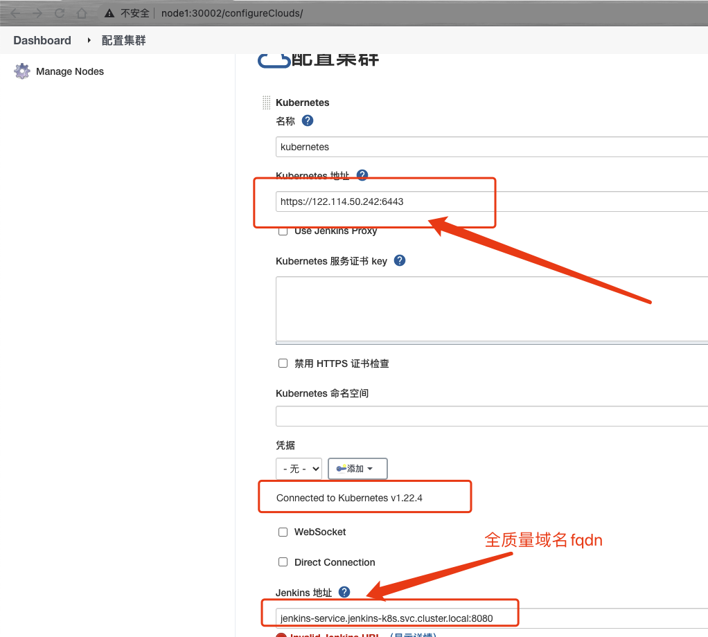

# jenkins 配置k8s互通以及pod 模版




- jenkins slave 需要调用宿主机的docker 打镜像 所以需要共享宿主机的docker 命令等

- slave需要和k8s集群通信，kubectl apply yaml 文件，所以需要k8s集群的认证信息


# 添加docker hub 凭据

[系统管理]---->[管理凭据]


```bash
$ kubectl create ns development
namespace/development created
$ kubectl create ns qatest    
namespace/qatest created
$ kubectl create ns production                                                                                                          
namespace/production created
$ kubectl get ns               
NAME              STATUS   AGE
default           Active   12d
development       Active   40s
jenkins-k8s       Active   23h
kube-node-lease   Active   12d
kube-public       Active   12d
kube-system       Active   12d
production        Active   67s
qatest            Active   59s
```


# 添加harbor