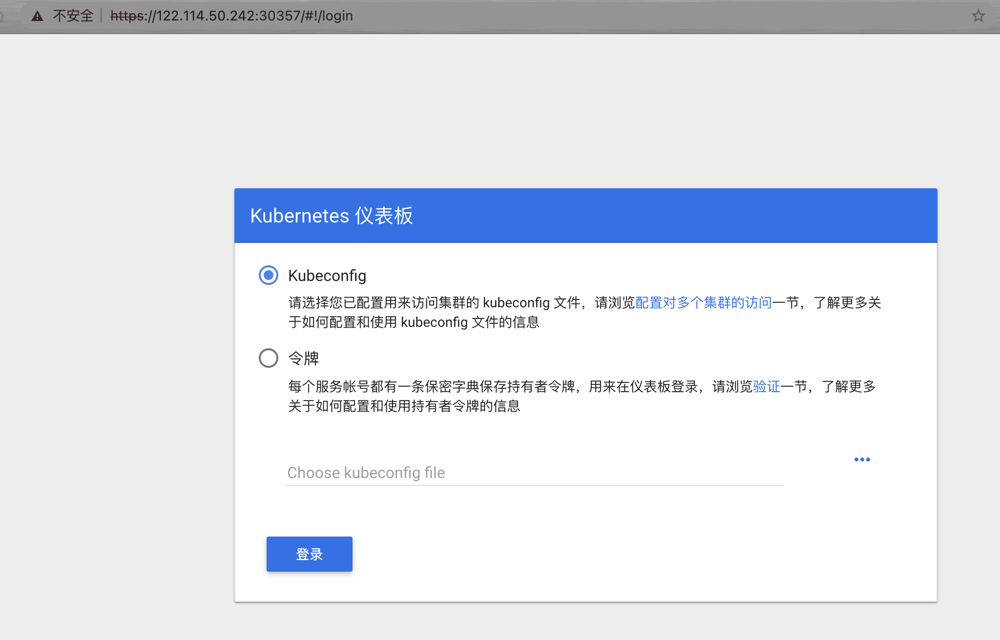

#   k8s 集群安装


# kubeadmin 安装

## k8s配置信息

主机密码：YbB2YZ4omsa231t

| 内网ip             | 版本               | 角色   | 公网ip |
| ------------------ | ------------------ | ------ | ------ |
| 192.168.187.145/16 | ubuntu 20.04.3 LTS | master | master |
| 192.168.0.110/16   | ubuntu 20.04.3 LTS | Node1  | node1  |
| 192.168.247.34/16  | ubuntu 20.04.3 LTS | Node2  | node2  |

开放端口

Master Node Inbound

 Protocol | Port Range | Source                                    | Purpose                
-----------|------------|-------------------------------------------|------------------------
 TCP      | 8443       | Worker Nodes, API Requests, and End-Users | Kubernetes API server. 
 UDP      | 8285       | Master & Worker Nodes                   | flannel overlay network - *udp backend*. This is the default network configuration (only required if using flannel) 
 UDP      | 8472       | Master & Worker Nodes                   | flannel overlay network - *vxlan backend* (only required if using flannel) 

Worker Node Inbound

| Protocol | Port Range  | Source                         | Purpose                                                                |
-----------|-------------|--------------------------------|------------------------------------------------------------------------|
| TCP      | 10250       | Master Nodes                   | Worker node Kubelet API for exec and logs.                                  |
| TCP      | 10255       | Heapster                       | Worker node read-only Kubelet API.                                  |
| TCP      | 30000-32767 | External Application Consumers | Default port range for [external service][external-service] ports. Typically, these ports would need to be exposed to external load-balancers, or other external consumers of the application itself. |
| TCP      | ALL         | Master & Worker Nodes          | Intra-cluster communication (unnecessary if `vxlan` is used for networking)           |
| UDP      | 8285        | Master & Worker Nodes                   | flannel overlay network - *udp backend*. This is the default network configuration (only required if using flannel) |
| UDP      | 8472        | Master & Worker Nodes                   | flannel overlay network - *vxlan backend* (only required if using flannel) |
| TCP      | 179         | Worker Nodes                   | Calico BGP network (only required if the BGP backend is used) |

etcd Node Inbound

 Protocol | Port Range | Source        | Purpose                                                  
-----------|------------|---------------|----------------------------------------------------------
 TCP      | 2379-2380  | Master Nodes  | etcd server client API                                   
 TCP      | 2379-2380  | Worker Nodes  | etcd server client API (only required if using flannel or Calico).                 \| 


## 本地主机名解析

```bash
# 初始化本地主机解析
cat > /etc/hosts << EOF
127.0.0.1   localhost localhost.localdomain localhost4 localhost4.localdomain4
::1         localhost localhost.localdomain localhost6 localhost6.localdomain6
192.168.187.145    master
192.168.0.110      node1
192.168.247.34     node2
EOF
	
	
ssh-copy-id -p 22000 root@master #master
ssh-copy-id -p 22000 root@node1  #node1
ssh-copy-id -p 22000 root@node2  #node2
```

防火墙规则

```bash
-A INPUT -m state --state RELATED,ESTABLISHED -j ACCEPT
-A INPUT -p icmp -j ACCEPT
-A INPUT -i lo -j ACCEPT
-A INPUT -p tcp -m state --state NEW -m tcp --dport 22000 -j ACCEPT
-A INPUT -p tcp -m tcp --dport 2379:2380 -j ACCEPT
-A INPUT -p tcp -m tcp --dport 30000:32767 -j ACCEPT
-A INPUT -p tcp -m tcp --dport 10200:10270 -j ACCEPT
-A INPUT -p tcp -m tcp --dport 6443 -j ACCEPT
-A INPUT -p tcp -m tcp --dport 9099 -j ACCEPT
-A INPUT -p tcp -m tcp --dport 5353 -j ACCEPT
-A INPUT -p tcp -m tcp --dport 10256 -j ACCEPT
-A INPUT -p tcp -m tcp --dport 10250 -j ACCEPT
-A INPUT -p tcp -m tcp --dport 8181 -j ACCEPT 
-A INPUT -p tcp -m tcp --dport 53 -j ACCEPT
-A INPUT -p udp  --dport 53 -j ACCEPT
-A INPUT -p udp  --dport 5353 -j ACCEPT
-A INPUT -p tcp -m tcp --dport 9153 -j ACCEPT
-A INPUT -p tcp -m tcp --dport 8472 -j ACCEPT
-A INPUT -p tcp -m tcp --dport 179 -j ACCEPT
-A INPUT -j REJECT --reject-with icmp-host-prohibited
-A FORWARD -j REJECT --reject-with icmp-host-prohibited
~
```


## 系统初始化

```bash
	yum install epel-release -y >/dev/null 2>&1
	sed -i 's/mirrorlist/#mirrorlist/g' /etc/yum.repos.d/epel.repo
	sed -i 's/#baseurl/baseurl/g' /etc/yum.repos.d/epel.repo
	sed -i '6s/enabled=0/enabled=1/g' /etc/yum.repos.d/epel.repo
	sed -i '7s/gpgcheck=1/gpgcheck=0/g' /etc/yum.repos.d/epel.repo
	yum clean all >/dev/null 2>&1
	

cat > /etc/security/limits.conf <<EOF
* soft noproc 65536
* hard noproc 65536
* soft nofile 65536
* hard nofile 65536
EOF


# 优化ssh

[ -f /etc/ssh/sshd_config ]  && sed -ir '13 iUseDNS no\nGSSAPIAuthentication no' /etc/ssh/sshd_config && systemctl restart  sshd >/dev/null 2>&1


#内核优化
cat > /etc/sysctl.conf <<EOF
fs.file-max = 65536
net.core.netdev_max_backlog = 32768
net.core.rmem_default = 8388608
net.core.rmem_max = 16777216
net.core.somaxconn = 32768
net.core.wmem_default = 8388608
net.core.wmem_max = 16777216
net.ipv4.conf.all.arp_ignore = 0
net.ipv4.conf.lo.arp_announce = 0
net.ipv4.conf.lo.arp_ignore = 0
net.ipv4.ip_local_port_range = 5000 65000
net.ipv4.tcp_fin_timeout = 30
net.ipv4.tcp_keepalive_intvl = 30
net.ipv4.tcp_keepalive_probes = 3
net.ipv4.tcp_keepalive_time = 300
net.ipv4.tcp_max_orphans = 3276800
net.ipv4.tcp_max_syn_backlog = 65536
net.ipv4.tcp_max_tw_buckets = 5000
net.ipv4.tcp_mem = 94500000 915000000 927000000
net.ipv4.tcp_syn_retries = 2
net.ipv4.tcp_synack_retries = 2
net.ipv4.tcp_syncookies = 1
net.ipv4.tcp_timestamps = 0
net.ipv4.tcp_tw_recycle = 1
net.ipv4.tcp_tw_reuse = 1
net.ipv4.ip_forward = 1
net.ipv6.conf.all.disable_ipv6 =1
net.ipv6.conf.default.disable_ipv6 =1
EOF
sysctl -p >/dev/null 2>&1


#增加历史记录
if ! grep "HISTTIMEFORMAT" /etc/profile >/dev/null 2>&1
then echo '
UserIP=$(who -u am i | cut -d"("  -f 2 | sed -e "s/[()]//g")
export HISTTIMEFORMAT="[%F %T] [`whoami`] [${UserIP}] " ' >> /etc/profile;
fi
sed -i "s/HISTSIZE=1000/HISTSIZE=999999999/" /etc/profile

#安装常用组件

yum groupinstall Development tools -y 
yum install -y vim wget  traceroute iotop iftop tree  ipvsadm conntrack \
 yum-utils ipset jq sysstat curl iptables  \
 ncftp axel  zlib-devel openssl-devel unzip  libxslt-devel \
libxml2-devel libcurl-devel chrony 
	
# 启动相关模块
cat <<EOF | sudo tee /etc/modules-load.d/k8s.conf
br_netfilter
overlay
EOF
# 启用模块
sudo modprobe overlay
sudo modprobe br_netfilter


cat > /etc/sysconfig/modules/ipvs.modules <<EOF
#!/bin/bash
modprobe -- ip_vs
modprobe -- ip_vs_rr
modprobe -- ip_vs_wrr
modprobe -- ip_vs_sh
modprobe -- nf_conntrack_ipv4
EOF
chmod 755 /etc/sysconfig/modules/ipvs.modules && bash /etc/sysconfig/modules/ipvs.modules \
&& lsmod | grep -e ip_vs -e nf_conntrack_ipv4
# 开启内核转发
cat <<EOF | sudo tee /etc/sysctl.d/k8s.conf
net.bridge.bridge-nf-call-iptables  = 1
net.ipv4.ip_forward                 = 1
net.bridge.bridge-nf-call-ip6tables = 1
EOF
sudo sysctl --system	
# 时间同步
systemctl enable chronyd
systemctl start chronyd


chronyc sources
210 Number of sources = 4
MS Name/IP address         Stratum Poll Reach LastRx Last sample
===============================================================================
^- time.cloudflare.com           3   6    17     3    -30ms[  -30ms] +/-  133ms
^- pingless.com                  2   6    17     3    +14ms[  +14ms] +/-  165ms
^* 061239100101.ctinets.com      1   6    17     5   -549us[-1850ms] +/-   24ms
^? 120.25.115.20                 2   6    30     9  -4217us[-1854ms] +/-   19ms


# 更改源
# 国外 yum
cat <<EOF | sudo tee /etc/yum.repos.d/kubernetes.repo
[kubernetes]
name=Kubernetes
baseurl=https://packages.cloud.google.com/yum/repos/kubernetes-el7-\$basearch
enabled=1
gpgcheck=1
repo_gpgcheck=1
gpgkey=https://packages.cloud.google.com/yum/doc/yum-key.gpg https://packages.cloud.google.com/yum/doc/rpm-package-key.gpg
exclude=kubelet kubeadm kubectl
EOF

#国外 debian

sudo apt-get update
sudo apt-get install -y apt-transport-https ca-certificates curl
sudo curl -fsSLo /usr/share/keyrings/kubernetes-archive-keyring.gpg https://packages.cloud.google.com/apt/doc/apt-key.gpg
echo "deb [signed-by=/usr/share/keyrings/kubernetes-archive-keyring.gpg] https://apt.kubernetes.io/ kubernetes-xenial main" | sudo tee /etc/apt/sources.list.d/kubernetes.list
sudo apt-get update
sudo apt-get install -y kubelet kubeadm kubectl
sudo apt-mark hold kubelet kubeadm kubectl


# 国内Debian/Ubuntu
apt-get update && apt-get install -y apt-transport-https
curl -s https://mirrors.aliyun.com/kubernetes/apt/doc/apt-key.gpg | apt-key add -
cat <<EOF >/etc/apt/sources.list.d/kubernetes.list
deb https://mirrors.aliyun.com/kubernetes/apt/ kubernetes-xenial main
EOF
apt-get update
apt-get install -y kubelet kubeadm kubectl

# 国内CentOS/RHEL/Fedora
cat <<EOF |tee /etc/yum.repos.d/kubernetes.repo
[kubernetes]
name=Kubernetes
baseurl=https://mirrors.aliyun.com/kubernetes/yum/repos/kubernetes-el7-x86_64/
enabled=1
gpgcheck=1
repo_gpgcheck=0
gpgkey=https://mirrors.aliyun.com/kubernetes/yum/doc/yum-key.gpg https://mirrors.aliyun.com/kubernetes/yum/doc/rpm-package-key.gpg
EOF
rpm --import  https://mirrors.aliyun.com/kubernetes/yum/doc/yum-key.gpg
rpm --import https://mirrors.aliyun.com/kubernetes/yum/doc/rpm-package-key.gpg 

# 安装docker 源
sudo yum-config-manager \
    --add-repo \
    https://download.docker.com/linux/centos/docker-ce.repo
```

## 设置免认证登陆[各主机都要执行]

```bash
[root@node1 .ssh]# ssh-keygen
Generating public/private rsa key pair.
Enter file in which to save the key (/root/.ssh/id_rsa):
Enter passphrase (empty for no passphrase):
Enter same passphrase again:
Your identification has been saved in /root/.ssh/id_rsa.
Your public key has been saved in /root/.ssh/id_rsa.pub.
The key fingerprint is:
SHA256:2XYYGPGt9PV9XlZj53GNswv2NKOcs1FC9M1+QaIrSfA root@node1
The key's randomart image is:
+---[RSA 2048]----+
|       .o.  .. . |
|        o+ o..o+.|
|        .E+.o ==B|
|        .+.*...*O|
|        So=.* * X|
|         ..+ O *+|
|            * o .|
|             +   |
|            .    |
+----[SHA256]-----+
[root@node1 .ssh]# ssh-copy-id master -p 22000
/usr/bin/ssh-copy-id: INFO: Source of key(s) to be installed: "/root/.ssh/id_rsa.pub"
/usr/bin/ssh-copy-id: INFO: attempting to log in with the new key(s), to filter out any that are already installed
/usr/bin/ssh-copy-id: INFO: 1 key(s) remain to be installed -- if you are prompted now it is to install the new keys
root@master's password:

Number of key(s) added: 1

Now try logging into the machine, with:   "ssh -p '22000' 'master'"
and check to make sure that only the key(s) you wanted were added.

[root@node1 .ssh]# ssh-copy-id node1 -p 22000
/usr/bin/ssh-copy-id: INFO: Source of key(s) to be installed: "/root/.ssh/id_rsa.pub"
The authenticity of host '[node1]:22000 ([192.168.0.110]:22000)' can't be established.
ECDSA key fingerprint is SHA256:+Sx9nRIZkPzxVM82QhpiPjfcEIwH0LSWNQcAYdQZZgA.
ECDSA key fingerprint is MD5:c6:00:28:f0:ee:ba:d1:98:2d:6b:be:cd:e0:c1:89:f2.
Are you sure you want to continue connecting (yes/no)? yes
/usr/bin/ssh-copy-id: INFO: attempting to log in with the new key(s), to filter out any that are already installed
/usr/bin/ssh-copy-id: INFO: 1 key(s) remain to be installed -- if you are prompted now it is to install the new keys
root@node1's password:

Number of key(s) added: 1

Now try logging into the machine, with:   "ssh -p '22000' 'node1'"
and check to make sure that only the key(s) you wanted were added.

[root@node1 .ssh]# ssh-copy-id node2 -p 22000
/usr/bin/ssh-copy-id: INFO: Source of key(s) to be installed: "/root/.ssh/id_rsa.pub"
The authenticity of host '[node2]:22000 ([192.168.247.34]:22000)' can't be established.
ECDSA key fingerprint is SHA256:+Sx9nRIZkPzxVM82QhpiPjfcEIwH0LSWNQcAYdQZZgA.
ECDSA key fingerprint is MD5:c6:00:28:f0:ee:ba:d1:98:2d:6b:be:cd:e0:c1:89:f2.
Are you sure you want to continue connecting (yes/no)? yes
/usr/bin/ssh-copy-id: INFO: attempting to log in with the new key(s), to filter out any that are already installed
/usr/bin/ssh-copy-id: INFO: 1 key(s) remain to be installed -- if you are prompted now it is to install the new keys
root@node2's password:

Number of key(s) added: 1

Now try logging into the machine, with:   "ssh -p '22000' 'node2'"
and check to make sure that only the key(s) you wanted were added.
```


## 初始化集群


```bash
yum install -y device-mapper-persistent-data lvm2
yum install -y kubelet kubeadm kubectl --disableexcludes=kubernetes
systemctl  enable kubelet && systemctl start kubelet

```

- Kubelet 运行在所有节点，用于启动pod和容器等对象

- Kubeadm: 用于初始化集群，启动集群命令

- kubectl：其余和集群通信的命令行，通过kubectl可以部署和管理应用，查看各种资源，创建、删除、更新组件


- 更新docker 加速器,更改docker文件驱动为systemd 与kubelet 保持一致

  ```bash
  sudo mkdir -p /etc/docker
  sudo tee /etc/docker/daemon.json <<-'EOF'
  {
    "registry-mirrors": ["https://2c2nqqhp.mirror.aliyuncs.com"],
    "exec-opts": ["native.cgroupdriver=systemd"],
    "insecure-registries": ["harbor.justbeta.pro"]
  }
  EOF
  yum install -y docker-ce docker-ce-cli containerd.io
  sudo systemctl daemon-reload
  sudo systemctl enable docker.service
  sudo systemctl restart docker
  
  ```

  

- Kubeadm 初始化集群 [所有节点均要执行]

  ```bash
   # 登陆阿里镜像管理
  sudo docker login --username=陆仁佳 registry.cn-shanghai.aliyuncs.com
  Password: gavin2aliyun
  WARNING! Your password will be stored unencrypted in /root/.docker/config.json.
  Configure a credential helper to remove this warning. See
  https://docs.docker.com/engine/reference/commandline/login/#credentials-store
  
  Login Succeeded
  
  #查询需要下载的镜像
  [root@master docker]# kubeadm config images list
  k8s.gcr.io/kube-apiserver:v1.23.5
  k8s.gcr.io/kube-controller-manager:v1.23.5
  k8s.gcr.io/kube-scheduler:v1.23.5
  k8s.gcr.io/kube-proxy:v1.23.5
  k8s.gcr.io/pause:3.6
  k8s.gcr.io/etcd:3.5.1-0
  k8s.gcr.io/coredns/coredns:v1.8.6
  
  #生成默认配置文件
  kubeadm config print init-defaults > kubeadm.yaml
  
  
  # 初始化镜像  使用阿里云的容器镜像加速
  
  cat <<EOF | sudo tee  kubeadm.yaml
  apiVersion: kubeadm.k8s.io/v1beta2
  bootstrapTokens:
  - groups:
    - system:bootstrappers:kubeadm:default-node-token
    token: abcdef.0123456789abcdef
    ttl: 24h0m0s
    usages:
    - signing
    - authentication
  kind: InitConfiguration
  localAPIEndpoint:
    advertiseAddress:  192.168.187.145 # apiserver 节点内网IP
    bindPort: 6443
  nodeRegistration:
    criSocket: /var/run/dockershim.sock
    name: master
    taints:
    - effect: NoSchedule
      key: node-role.kubernetes.io/master
  ---
  apiServer:
    timeoutForControlPlane: 4m0s
  apiVersion: kubeadm.k8s.io/v1beta2
  certificatesDir: /etc/kubernetes/pki
  clusterName: kubernetes
  controllerManager: {}
  dns:
    type: CoreDNS  # dns类型
  etcd:
    local:
      dataDir: /var/lib/etcd
  imageRepository: registry.cn-hangzhou.aliyuncs.com/google_containers
  kind: ClusterConfiguration
  kubernetesVersion: v1.23.5  # k8s版本
  networking:
    dnsDomain: cluster.local
    podSubnet: 192.2.0.0/16
    serviceSubnet: 10.96.0.0/12
  scheduler: {}
  ---
  apiVersion: kubeproxy.config.k8s.io/v1alpha1
  kind: KubeProxyConfiguration
  mode: ipvs  # kube-proxy 模式
  EOF
  
  #查看需要的镜像
  kubeadm config images list  --config kubeadm.yaml
  registry.cn-hangzhou.aliyuncs.com/google_containers/kube-apiserver:v1.23.5
  registry.cn-hangzhou.aliyuncs.com/google_containers/kube-controller-manager:v1.23.5
  registry.cn-hangzhou.aliyuncs.com/google_containers/kube-scheduler:v1.23.5
  registry.cn-hangzhou.aliyuncs.com/google_containers/kube-proxy:v1.23.5
  registry.cn-hangzhou.aliyuncs.com/google_containers/pause:3.6
  registry.cn-hangzhou.aliyuncs.com/google_containers/etcd:3.5.1-0
  registry.cn-hangzhou.aliyuncs.com/google_containers/coredns:v1.8.6
  # 更新器镜像
  kubeadm config images pull --config kubeadm.yaml
  [config/images] Pulled registry.cn-hangzhou.aliyuncs.com/google_containers/kube-apiserver:v1.23.5
  [config/images] Pulled registry.cn-hangzhou.aliyuncs.com/google_containers/kube-controller-manager:v1.23.5
  [config/images] Pulled registry.cn-hangzhou.aliyuncs.com/google_containers/kube-scheduler:v1.23.5
  [config/images] Pulled registry.cn-hangzhou.aliyuncs.com/google_containers/kube-proxy:v1.23.5
  [config/images] Pulled registry.cn-hangzhou.aliyuncs.com/google_containers/pause:3.6
  [config/images] Pulled registry.cn-hangzhou.aliyuncs.com/google_containers/etcd:3.5.1-0
  [config/images] Pulled registry.cn-hangzhou.aliyuncs.com/google_containers/coredns:v1.8.6
  ```
  
  
  
  修改好的 [kubeadm.yaml](https://raw.githubusercontent.com/Cerberus2077/private-code/main/k8syaml/kubeadm.yaml?token=AAJPAAJVRFBW4GSCYPYBBN3BT6Q4W) 文件

## 使用配置文件初始化

```bash
kubeadm  init --config kubeadm.yaml
[init] Using Kubernetes version: v1.23.5
[preflight] Running pre-flight checks
[preflight] Pulling images required for setting up a Kubernetes cluster
[preflight] This might take a minute or two, depending on the speed of your internet connection
[preflight] You can also perform this action in beforehand using 'kubeadm config images pull'
[certs] Using certificateDir folder "/etc/kubernetes/pki"
[certs] Generating "ca" certificate and key
[certs] Generating "apiserver" certificate and key
[certs] apiserver serving cert is signed for DNS names [kubernetes kubernetes.default kubernetes.default.svc kubernetes.default.svc.cluster.local master] and IPs [10.96.0.1 192.168.187.145]
[certs] Generating "apiserver-kubelet-client" certificate and key
[certs] Generating "front-proxy-ca" certificate and key
[certs] Generating "front-proxy-client" certificate and key
[certs] Generating "etcd/ca" certificate and key
[certs] Generating "etcd/server" certificate and key
[certs] etcd/server serving cert is signed for DNS names [localhost master] and IPs [192.168.187.145 127.0.0.1 ::1]
[certs] Generating "etcd/peer" certificate and key
[certs] etcd/peer serving cert is signed for DNS names [localhost master] and IPs [192.168.187.145 127.0.0.1 ::1]
[certs] Generating "etcd/healthcheck-client" certificate and key
[certs] Generating "apiserver-etcd-client" certificate and key
[certs] Generating "sa" key and public key
[kubeconfig] Using kubeconfig folder "/etc/kubernetes"
[kubeconfig] Writing "admin.conf" kubeconfig file
[kubeconfig] Writing "kubelet.conf" kubeconfig file
[kubeconfig] Writing "controller-manager.conf" kubeconfig file
[kubeconfig] Writing "scheduler.conf" kubeconfig file
[kubelet-start] Writing kubelet environment file with flags to file "/var/lib/kubelet/kubeadm-flags.env"
[kubelet-start] Writing kubelet configuration to file "/var/lib/kubelet/config.yaml"
[kubelet-start] Starting the kubelet
[control-plane] Using manifest folder "/etc/kubernetes/manifests"
[control-plane] Creating static Pod manifest for "kube-apiserver"
[control-plane] Creating static Pod manifest for "kube-controller-manager"
[control-plane] Creating static Pod manifest for "kube-scheduler"
[etcd] Creating static Pod manifest for local etcd in "/etc/kubernetes/manifests"
[wait-control-plane] Waiting for the kubelet to boot up the control plane as static Pods from directory "/etc/kubernetes/manifests". This can take up to 4m0s
[apiclient] All control plane components are healthy after 13.504543 seconds
[upload-config] Storing the configuration used in ConfigMap "kubeadm-config" in the "kube-system" Namespace
[kubelet] Creating a ConfigMap "kubelet-config-1.23" in namespace kube-system with the configuration for the kubelets in the cluster
NOTE: The "kubelet-config-1.23" naming of the kubelet ConfigMap is deprecated. Once the UnversionedKubeletConfigMap feature gate graduates to Beta the default name will become just "kubelet-config". Kubeadm upgrade will handle this transition transparently.
[upload-certs] Skipping phase. Please see --upload-certs
[mark-control-plane] Marking the node master as control-plane by adding the labels: [node-role.kubernetes.io/master(deprecated) node-role.kubernetes.io/control-plane node.kubernetes.io/exclude-from-external-load-balancers]
[mark-control-plane] Marking the node master as control-plane by adding the taints [node-role.kubernetes.io/master:NoSchedule]
[bootstrap-token] Using token: abcdef.0123456789abcdef
[bootstrap-token] Configuring bootstrap tokens, cluster-info ConfigMap, RBAC Roles
[bootstrap-token] configured RBAC rules to allow Node Bootstrap tokens to get nodes
[bootstrap-token] configured RBAC rules to allow Node Bootstrap tokens to post CSRs in order for nodes to get long term certificate credentials
[bootstrap-token] configured RBAC rules to allow the csrapprover controller automatically approve CSRs from a Node Bootstrap Token
[bootstrap-token] configured RBAC rules to allow certificate rotation for all node client certificates in the cluster
[bootstrap-token] Creating the "cluster-info" ConfigMap in the "kube-public" namespace
[kubelet-finalize] Updating "/etc/kubernetes/kubelet.conf" to point to a rotatable kubelet client certificate and key
[addons] Applied essential addon: CoreDNS
[addons] Applied essential addon: kube-proxy

Your Kubernetes control-plane has initialized successfully!

To start using your cluster, you need to run the following as a regular user:

  mkdir -p $HOME/.kube
  sudo cp -i /etc/kubernetes/admin.conf $HOME/.kube/config
  sudo chown $(id -u):$(id -g) $HOME/.kube/config

Alternatively, if you are the root user, you can run:

  export KUBECONFIG=/etc/kubernetes/admin.conf

You should now deploy a pod network to the cluster.
Run "kubectl apply -f [podnetwork].yaml" with one of the options listed at:
  https://kubernetes.io/docs/concepts/cluster-administration/addons/

Then you can join any number of worker nodes by running the following on each as root:

kubeadm join 192.168.187.145:6443 --token abcdef.0123456789abcdef \
	--discovery-token-ca-cert-hash sha256:ba7ac7a0b1db834ebdfbc94e235404936cd4a449383d1913f8a161bdf023922c
```

## 拷贝kube配置到从节点

```bash
mkdir -p $HOME/.kube
sudo cp -i /etc/kubernetes/admin.conf $HOME/.kube/config
sudo chown $(id -u):$(id -g) $HOME/.kube/config
rsync -aP -e "ssh " ~/.kube/config node1:~/.kube/
rsync -aP -e "ssh " ~/.kube/config node2:~/.kube/
```


## 安装网络组件

下载编辑calico 模版文件

```bash
[root@master ~]# wget https://docs.projectcalico.org/master/manifests/calico.yaml
# 4160行添加
           - name: DATASTORE_TYPE
              value: kubernetes
            - name: IP_AUTODETECTION_METHOD  # DaemonSet中添加该环境变量
              value: interface=eth1    # 指定内网网卡
            - name: WAIT_FOR_DATASTORE
              value: "true"
```

修改好的 [calico.yaml](./yml/chpt0/calico.yaml )  文件

安装calico

```bash
kubectl apply -f calico.yaml 
watch "kubectl  get pod --all-namespaces"
NAMESPACE     NAME                                       READY   STATUS    RESTARTS        AGE
kube-system   calico-kube-controllers-55b9d67d69-xjmpx   1/1     Running   1 (4m3s ago)    44m
kube-system   calico-node-8wpwr                          1/1     Running   1 (4m3s ago)    44m
kube-system   coredns-7d89d9b6b8-dzmft                   1/1     Running   2 (3m58s ago)   5h3m
kube-system   coredns-7d89d9b6b8-mmb49                   1/1     Running   2 (3m58s ago)   5h3m
kube-system   etcd-master                                1/1     Running   3 (4m3s ago)    5h3m
kube-system   kube-apiserver-master                      1/1     Running   2 (4m3s ago)    5h3m
kube-system   kube-controller-manager-master             1/1     Running   2 (4m3s ago)    5h3m
kube-system   kube-proxy-74njc                           1/1     Running   2 (4m3s ago)    5h3m
kube-system   kube-scheduler-master                      1/1     Running   2 (4m3s ago)    5h3m

```


查看node 状态

```
[root@master ~]# kubectl get nodes
NAME     STATUS   ROLES                  AGE   VERSION
master   Ready    control-plane,master   14m   v1.22.4

```


## node 节点加入集群

```bash
[root@node1 ~]# kubeadm join 122.114.50.242:6443 --token emolqb.ikv3u41ite6oscky --discovery-token-ca-cert-hash sha256:95cd888563a4e6b20e729a0b705a1c9daee75c303866aa31e9bdfc55e10c80b7 --v=5
I1126 08:53:40.731939   28117 join.go:405] [preflight] found NodeName empty; using OS hostname as NodeName
I1126 08:53:40.732133   28117 initconfiguration.go:116] detected and using CRI socket: /var/run/dockershim.sock
[preflight] Running pre-flight checks
I1126 08:53:40.732261   28117 preflight.go:92] [preflight] Running general checks
I1126 08:53:40.732342   28117 checks.go:245] validating the existence and emptiness of directory /etc/kubernetes/manifests
I1126 08:53:40.732363   28117 checks.go:282] validating the existence of file /etc/kubernetes/kubelet.conf
I1126 08:53:40.732375   28117 checks.go:282] validating the existence of file /etc/kubernetes/bootstrap-kubelet.conf
I1126 08:53:40.732388   28117 checks.go:106] validating the container runtime
I1126 08:53:40.883825   28117 checks.go:132] validating if the "docker" service is enabled and active
I1126 08:53:40.898085   28117 checks.go:331] validating the contents of file /proc/sys/net/bridge/bridge-nf-call-iptables
I1126 08:53:40.898181   28117 checks.go:331] validating the contents of file /proc/sys/net/ipv4/ip_forward
I1126 08:53:40.898227   28117 checks.go:649] validating whether swap is enabled or not
I1126 08:53:40.898273   28117 checks.go:372] validating the presence of executable conntrack
I1126 08:53:40.898301   28117 checks.go:372] validating the presence of executable ip
I1126 08:53:40.898324   28117 checks.go:372] validating the presence of executable iptables
I1126 08:53:40.898345   28117 checks.go:372] validating the presence of executable mount
I1126 08:53:40.898367   28117 checks.go:372] validating the presence of executable nsenter
I1126 08:53:40.898391   28117 checks.go:372] validating the presence of executable ebtables
I1126 08:53:40.898427   28117 checks.go:372] validating the presence of executable ethtool
I1126 08:53:40.898448   28117 checks.go:372] validating the presence of executable socat
I1126 08:53:40.898468   28117 checks.go:372] validating the presence of executable tc
I1126 08:53:40.898486   28117 checks.go:372] validating the presence of executable touch
I1126 08:53:40.898510   28117 checks.go:520] running all checks
I1126 08:53:41.057912   28117 checks.go:403] checking whether the given node name is valid and reachable using net.LookupHost
I1126 08:53:41.058198   28117 checks.go:618] validating kubelet version
I1126 08:53:41.138299   28117 checks.go:132] validating if the "kubelet" service is enabled and active
I1126 08:53:41.149138   28117 checks.go:205] validating availability of port 10250
I1126 08:53:41.149717   28117 checks.go:282] validating the existence of file /etc/kubernetes/pki/ca.crt
I1126 08:53:41.149744   28117 checks.go:432] validating if the connectivity type is via proxy or direct
I1126 08:53:41.149825   28117 join.go:475] [preflight] Discovering cluster-info
I1126 08:53:41.149896   28117 token.go:80] [discovery] Created cluster-info discovery client, requesting info from "122.114.50.242:6443"
I1126 08:53:41.173288   28117 token.go:118] [discovery] Requesting info from "122.114.50.242:6443" again to validate TLS against the pinned public key
I1126 08:53:41.185548   28117 token.go:135] [discovery] Cluster info signature and contents are valid and TLS certificate validates against pinned roots, will use API Server "122.114.50.242:6443"
I1126 08:53:41.185636   28117 discovery.go:52] [discovery] Using provided TLSBootstrapToken as authentication credentials for the join process
I1126 08:53:41.185659   28117 join.go:489] [preflight] Fetching init configuration
I1126 08:53:41.185669   28117 join.go:534] [preflight] Retrieving KubeConfig objects
[preflight] Reading configuration from the cluster...
[preflight] FYI: You can look at this config file with 'kubectl -n kube-system get cm kubeadm-config -o yaml'
I1126 08:53:41.202519   28117 interface.go:431] Looking for default routes with IPv4 addresses
I1126 08:53:41.202573   28117 interface.go:436] Default route transits interface "eth0"
I1126 08:53:41.202776   28117 interface.go:208] Interface eth0 is up
I1126 08:53:41.202847   28117 interface.go:256] Interface "eth0" has 1 addresses :[node1/24].
I1126 08:53:41.202888   28117 interface.go:223] Checking addr  node1/24.
I1126 08:53:41.202902   28117 interface.go:230] IP found node1
I1126 08:53:41.202926   28117 interface.go:262] Found valid IPv4 address node1 for interface "eth0".
I1126 08:53:41.202939   28117 interface.go:442] Found active IP node1
I1126 08:53:41.208031   28117 preflight.go:103] [preflight] Running configuration dependant checks
I1126 08:53:41.208086   28117 controlplaneprepare.go:219] [download-certs] Skipping certs download
I1126 08:53:41.208116   28117 kubelet.go:112] [kubelet-start] writing bootstrap kubelet config file at /etc/kubernetes/bootstrap-kubelet.conf
I1126 08:53:41.209598   28117 kubelet.go:120] [kubelet-start] writing CA certificate at /etc/kubernetes/pki/ca.crt
I1126 08:53:41.210682   28117 kubelet.go:141] [kubelet-start] Checking for an existing Node in the cluster with name "node1" and status "Ready"
I1126 08:53:41.214575   28117 kubelet.go:155] [kubelet-start] Stopping the kubelet
[kubelet-start] Writing kubelet configuration to file "/var/lib/kubelet/config.yaml"
[kubelet-start] Writing kubelet environment file with flags to file "/var/lib/kubelet/kubeadm-flags.env"
[kubelet-start] Starting the kubelet
[kubelet-start] Waiting for the kubelet to perform the TLS Bootstrap...
I1126 08:53:46.371493   28117 cert_rotation.go:137] Starting client certificate rotation controller
I1126 08:53:46.377819   28117 kubelet.go:190] [kubelet-start] preserving the crisocket information for the node
I1126 08:53:46.377849   28117 patchnode.go:31] [patchnode] Uploading the CRI Socket information "/var/run/dockershim.sock" to the Node API object "node1" as an annotation

This node has joined the cluster:
* Certificate signing request was sent to apiserver and a response was received.
* The Kubelet was informed of the new secure connection details.

Run 'kubectl get nodes' on the control-plane to see this node join the cluster.
```

获取状态 直到 node/pod  全部变为ready

```bash
[root@node1 ~]# kubectl get nodes
NAME     STATUS     ROLES                  AGE   VERSION
master   Ready      control-plane,master   32m   v1.22.4
node1    NotReady   <none>                 55s   v1.22.4
node2    NotReady   <none>                 28s   v1.22.4
[root@master ~]#  kubectl get nodes
NAME     STATUS   ROLES                  AGE     VERSION
master   Ready    control-plane,master   9m47s   v1.22.4
node1    Ready    <none>                 110s    v1.22.4
node2    Ready    <none>                 106s    v1.22.4
# 给节点打上标签
[root@master ~]# kubectl  label node node1 node-role.kubernetes.io/worker=worker
node/node1 labeled
[root@master ~]# kubectl  label node node2 node-role.kubernetes.io/worker=worker
node/node2 labeled
[root@master ~]# kubectl  get node
NAME     STATUS   ROLES                  AGE   VERSION
master   Ready    control-plane,master   8h    v1.22.4
node1    Ready    worker                 8h    v1.22.4
node2    Ready    worker                 8h    v1.22.4

[root@node1 ~]#  kubectl get pod --all-namespaces
NAMESPACE     NAME                                       READY   STATUS    RESTARTS   AGE
kube-system   calico-kube-controllers-7ddfd446c5-d5rfq   1/1     Running   0          23m
kube-system   calico-node-4mpg5                          1/1     Running   0          15m
kube-system   calico-node-q6wfh                          1/1     Running   0          23m
kube-system   calico-node-rmcpz                          1/1     Running   0          16m
kube-system   coredns-7d89d9b6b8-7664x                   1/1     Running   0          47m
kube-system   coredns-7d89d9b6b8-dks4f                   1/1     Running   0          47m
kube-system   etcd-master                                1/1     Running   0          48m
kube-system   kube-apiserver-master                      1/1     Running   0          48m
kube-system   kube-controller-manager-master             1/1     Running   0          48m
kube-system   kube-proxy-72dcm                           1/1     Running   0          15m
kube-system   kube-proxy-chj58                           1/1     Running   0          47m
kube-system   kube-proxy-fbgbr                           1/1     Running   0          16m
kube-system   kube-scheduler-master                      1/1     Running   0          48m
```


## 安装dashboard

```bash
get https://raw.githubusercontent.com/kubernetes/dashboard/v2.4.0/aio/deploy/recommended.yaml  -O kubernetes-dashboard-v2.4.yaml
cat <<EOF | sudo tee  kubernetes-dashboard-v2.4.yaml
# Copyright 2017 The Kubernetes Authors.
#
# Licensed under the Apache License, Version 2.0 (the "License");
# you may not use this file except in compliance with the License.
# You may obtain a copy of the License at
#
#     http://www.apache.org/licenses/LICENSE-2.0
#
# Unless required by applicable law or agreed to in writing, software
# distributed under the License is distributed on an "AS IS" BASIS,
# WITHOUT WARRANTIES OR CONDITIONS OF ANY KIND, either express or implied.
# See the License for the specific language governing permissions and
# limitations under the License.

apiVersion: v1
kind: Namespace
metadata:
  name: kubernetes-dashboard

---

apiVersion: v1
kind: ServiceAccount
metadata:
  labels:
    k8s-app: kubernetes-dashboard
  name: kubernetes-dashboard
  namespace: kubernetes-dashboard

---

kind: Service
apiVersion: v1
metadata:
  labels:
    k8s-app: kubernetes-dashboard
  name: kubernetes-dashboard
  namespace: kubernetes-dashboard
spec:
  ports:
    - port: 443
      targetPort: 8443
  selector:
    k8s-app: kubernetes-dashboard

---

apiVersion: v1
kind: Secret
metadata:
  labels:
    k8s-app: kubernetes-dashboard
  name: kubernetes-dashboard-certs
  namespace: kubernetes-dashboard
type: Opaque

---

apiVersion: v1
kind: Secret
metadata:
  labels:
    k8s-app: kubernetes-dashboard
  name: kubernetes-dashboard-csrf
  namespace: kubernetes-dashboard
type: Opaque
data:
  csrf: ""

---

apiVersion: v1
kind: Secret
metadata:
  labels:
    k8s-app: kubernetes-dashboard
  name: kubernetes-dashboard-key-holder
  namespace: kubernetes-dashboard
type: Opaque

---

kind: ConfigMap
apiVersion: v1
metadata:
  labels:
    k8s-app: kubernetes-dashboard
  name: kubernetes-dashboard-settings
  namespace: kubernetes-dashboard

---

kind: Role
apiVersion: rbac.authorization.k8s.io/v1
metadata:
  labels:
    k8s-app: kubernetes-dashboard
  name: kubernetes-dashboard
  namespace: kubernetes-dashboard
rules:
  # Allow Dashboard to get, update and delete Dashboard exclusive secrets.
  - apiGroups: [""]
    resources: ["secrets"]
    resourceNames: ["kubernetes-dashboard-key-holder", "kubernetes-dashboard-certs", "kubernetes-dashboard-csrf"]
    verbs: ["get", "update", "delete"]
    # Allow Dashboard to get and update 'kubernetes-dashboard-settings' config map.
  - apiGroups: [""]
    resources: ["configmaps"]
    resourceNames: ["kubernetes-dashboard-settings"]
    verbs: ["get", "update"]
    # Allow Dashboard to get metrics.
  - apiGroups: [""]
    resources: ["services"]
    resourceNames: ["heapster", "dashboard-metrics-scraper"]
    verbs: ["proxy"]
  - apiGroups: [""]
    resources: ["services/proxy"]
    resourceNames: ["heapster", "http:heapster:", "https:heapster:", "dashboard-metrics-scraper", "http:dashboard-metrics-scraper"]
    verbs: ["get"]

---

kind: ClusterRole
apiVersion: rbac.authorization.k8s.io/v1
metadata:
  labels:
    k8s-app: kubernetes-dashboard
  name: kubernetes-dashboard
rules:
  # Allow Metrics Scraper to get metrics from the Metrics server
  - apiGroups: ["metrics.k8s.io"]
    resources: ["pods", "nodes"]
    verbs: ["get", "list", "watch"]

---

apiVersion: rbac.authorization.k8s.io/v1
kind: RoleBinding
metadata:
  labels:
    k8s-app: kubernetes-dashboard
  name: kubernetes-dashboard
  namespace: kubernetes-dashboard
roleRef:
  apiGroup: rbac.authorization.k8s.io
  kind: Role
  name: kubernetes-dashboard
subjects:
  - kind: ServiceAccount
    name: kubernetes-dashboard
    namespace: kubernetes-dashboard

---

apiVersion: rbac.authorization.k8s.io/v1
kind: ClusterRoleBinding
metadata:
  name: kubernetes-dashboard
roleRef:
  apiGroup: rbac.authorization.k8s.io
  kind: ClusterRole
  name: kubernetes-dashboard
subjects:
  - kind: ServiceAccount
    name: kubernetes-dashboard
    namespace: kubernetes-dashboard

---

kind: Deployment
apiVersion: apps/v1
metadata:
  labels:
    k8s-app: kubernetes-dashboard
  name: kubernetes-dashboard
  namespace: kubernetes-dashboard
spec:
  replicas: 1
  revisionHistoryLimit: 10
  selector:
    matchLabels:
      k8s-app: kubernetes-dashboard
  template:
    metadata:
      labels:
        k8s-app: kubernetes-dashboard
    spec:
      containers:
        - name: kubernetes-dashboard
          image: kubernetesui/dashboard:v2.4.0
          imagePullPolicy: IfNotPresent 
          ports:
            - containerPort: 8443
              protocol: TCP
          args:
            - --auto-generate-certificates
            - --namespace=kubernetes-dashboard
            # Uncomment the following line to manually specify Kubernetes API server Host
            # If not specified, Dashboard will attempt to auto discover the API server and connect
            # to it. Uncomment only if the default does not work.
            # - --apiserver-host=http://my-address:port
          volumeMounts:
            - name: kubernetes-dashboard-certs
              mountPath: /certs
              # Create on-disk volume to store exec logs
            - mountPath: /tmp
              name: tmp-volume
          livenessProbe:
            httpGet:
              scheme: HTTPS
              path: /
              port: 8443
            initialDelaySeconds: 30
            timeoutSeconds: 30
          securityContext:
            allowPrivilegeEscalation: false
            readOnlyRootFilesystem: true
            runAsUser: 1001
            runAsGroup: 2001
      volumes:
        - name: kubernetes-dashboard-certs
          secret:
            secretName: kubernetes-dashboard-certs
        - name: tmp-volume
          emptyDir: {}
      serviceAccountName: kubernetes-dashboard
      nodeSelector:
        "kubernetes.io/os": linux
      # Comment the following tolerations if Dashboard must not be deployed on master
      tolerations:
        - key: node-role.kubernetes.io/master
          effect: NoSchedule

---

kind: Service
apiVersion: v1
metadata:
  labels:
    k8s-app: dashboard-metrics-scraper
  name: dashboard-metrics-scraper
  namespace: kubernetes-dashboard
spec:
  ports:
    - port: 8000
      targetPort: 8000
  selector:
    k8s-app: dashboard-metrics-scraper

---

kind: Deployment
apiVersion: apps/v1
metadata:
  labels:
    k8s-app: dashboard-metrics-scraper
  name: dashboard-metrics-scraper
  namespace: kubernetes-dashboard
spec:
  replicas: 1
  revisionHistoryLimit: 10
  selector:
    matchLabels:
      k8s-app: dashboard-metrics-scraper
  template:
    metadata:
      labels:
        k8s-app: dashboard-metrics-scraper
    spec:
      securityContext:
        seccompProfile:
          type: RuntimeDefault
      containers:
        - name: dashboard-metrics-scraper
          image: kubernetesui/metrics-scraper:v1.0.7
          ports:
            - containerPort: 8000
              protocol: TCP
          livenessProbe:
            httpGet:
              scheme: HTTP
              path: /
              port: 8000
            initialDelaySeconds: 30
            timeoutSeconds: 30
          volumeMounts:
          - mountPath: /tmp
            name: tmp-volume
          securityContext:
            allowPrivilegeEscalation: false
            readOnlyRootFilesystem: true
            runAsUser: 1001
            runAsGroup: 2001
      serviceAccountName: kubernetes-dashboard
      nodeSelector:
        "kubernetes.io/os": linux
      # Comment the following tolerations if Dashboard must not be deployed on master
      tolerations:
        - key: node-role.kubernetes.io/master
          effect: NoSchedule
      volumes:
        - name: tmp-volume
          emptyDir: {}
EOF


[root@master ~]# kubectl apply -f kubernetes-dashboard-v2.4.yaml
namespace/kubernetes-dashboard created
serviceaccount/kubernetes-dashboard created
service/kubernetes-dashboard created
secret/kubernetes-dashboard-certs created
secret/kubernetes-dashboard-csrf created
secret/kubernetes-dashboard-key-holder created
configmap/kubernetes-dashboard-settings created
role.rbac.authorization.k8s.io/kubernetes-dashboard created
clusterrole.rbac.authorization.k8s.io/kubernetes-dashboard created
rolebinding.rbac.authorization.k8s.io/kubernetes-dashboard created
clusterrolebinding.rbac.authorization.k8s.io/kubernetes-dashboard created
deployment.apps/kubernetes-dashboard created
service/dashboard-metrics-scraper created
deployment.apps/dashboard-metrics-scraper created
[root@master ~]# kubectl  get pod --all-namespaces
NAMESPACE              NAME                                        READY   STATUS             RESTARTS      AGE
kube-system            calico-kube-controllers-7ddfd446c5-2bz2d    1/1     Running            0             109m
kube-system            calico-node-55j9m                           1/1     Running            0             103m
kube-system            calico-node-d89bh                           1/1     Running            0             103m
kube-system            calico-node-pzfzs                           1/1     Running            0             109m
kube-system            coredns-7d89d9b6b8-gpbh4                    1/1     Running            0             111m
kube-system            coredns-7d89d9b6b8-vp27x                    1/1     Running            0             111m
kube-system            dashboard-metrics-scraper-c45b7869d-ff9lg   1/1     Running            0             3m23s
kube-system            etcd-master                                 1/1     Running            0             111m
kube-system            kube-apiserver-master                       1/1     Running            0             111m
kube-system            kube-controller-manager-master              1/1     Running            0             111m
kube-system            kube-proxy-84nfc                            1/1     Running            0             103m
kube-system            kube-proxy-dpxl5                            1/1     Running            0             111m
kube-system            kube-proxy-ndm8x                            1/1     Running            0             103m
kube-system            kube-scheduler-master                       1/1     Running            0             111m
kube-system            kubernetes-dashboard-576cb95f94-hmkdx       0/1     CrashLoopBackOff   4 (29s ago)   3m23s
kubernetes-dashboard   dashboard-metrics-scraper-c45b7869d-b9krw   1/1     Running            0             17s
kubernetes-dashboard   kubernetes-dashboard-576cb95f94-vqhfl       1/1     Running            0             18s

[root@master ~]# kubectl get svc -n kubernetes-dashboard  -l k8s-app=kubernetes-dashboard
NAME                   TYPE        CLUSTER-IP      EXTERNAL-IP   PORT(S)   AGE
kubernetes-dashboard   ClusterIP   10.108.233.72   <none>        443/TCP   4m32s
```

## 创建kubedashboard用户

```bash
cat <<EOF | sudo tee    kubernetes-dashboard-admin.yaml
apiVersion: rbac.authorization.k8s.io/v1
kind: ClusterRoleBinding
metadata:
  name: admin
  annotations:
    rbac.authorization.kubernetes.io/autoupdate: "true"
roleRef:
  kind: ClusterRole
  name: cluster-admin
  apiGroup: rbac.authorization.k8s.io
subjects:
- kind: ServiceAccount
  name: admin
  namespace: kube-system

---
apiVersion: v1
kind: ServiceAccount
metadata:
  name: admin
  namespace: kube-system
  labels:
    kubernetes.io/cluster-service: "true"
    addonmanager.kubernetes.io/mode: Reconcile
EOF

[root@master ~]# kubectl apply -f kubernetes-dashboard-admin.yaml
clusterrolebinding.rbac.authorization.k8s.io/admin unchanged
serviceaccount/admin unchanged
# 查看服务端口
[root@master ~]# kubectl get svc -n kubernetes-dashboard
NAME                        TYPE        CLUSTER-IP      EXTERNAL-IP   PORT(S)    AGE
dashboard-metrics-scraper   ClusterIP   10.110.42.167   <none>        8000/TCP   40m
kubernetes-dashboard        ClusterIP   10.108.233.72   <none>        443/TCP    40m

# 修改暴露端口为node port
kubectl edit svc kubernetes-dashboard -n kubernetes-dashboard 
apiVersion: v1
kind: Service
metadata:
  annotations:
    kubectl.kubernetes.io/last-applied-configuration: |
      {"apiVersion":"v1","kind":"Service","metadata":{"annotations":{},"labels":{"k8s-app":"kubernetes-dashboard"},"name":"kubernetes-dashboard","namespace":"kubernetes-dashboard"},"spec":{"ports":[{"port":443,"targetPort":8443}],"selector":{"k8s-app":"kubernetes-dashboard"}}}
  creationTimestamp: "2021-11-26T06:49:07Z"
  labels:
    k8s-app: kubernetes-dashboard
  name: kubernetes-dashboard
  namespace: kubernetes-dashboard
  resourceVersion: "10825"
  uid: 3937741f-1a6a-4b70-b6a1-8596f4e58f5d
spec:
  clusterIP: 10.108.233.72
  clusterIPs:
  - 10.108.233.72
  internalTrafficPolicy: Cluster
  ipFamilies:
  - IPv4
  ipFamilyPolicy: SingleStack
  ports:
  - port: 8443
    protocol: TCP
    targetPort: 8443
  selector:
    k8s-app: kubernetes-dashboard
  sessionAffinity: None
  type: NodePort

# 查看修改后的端口
[root@master ~]# kubectl get svc -n kubernetes-dashboard
NAME                        TYPE        CLUSTER-IP      EXTERNAL-IP   PORT(S)          AGE
dashboard-metrics-scraper   ClusterIP   10.110.42.167   <none>        8000/TCP         49m
kubernetes-dashboard        NodePort    10.108.233.72   <none>        8443:31503/TCP   49m
[root@master ~]#
[root@master ~]# kubectl get secret -n kubernetes-dashboard|grep dashboard-token
kubernetes-dashboard-token-k4lwh   kubernetes.io/service-account-token   3      12m

[root@master ~]# kubectl -n kubernetes-dashboard describe secret kubernetes-dashboard-token-k4lwh
Name:         kubernetes-dashboard-token-k4lwh
Namespace:    kubernetes-dashboard
Labels:       <none>
Annotations:  kubernetes.io/service-account.name: kubernetes-dashboard
              kubernetes.io/service-account.uid: af62d873-fdf0-4f87-a799-44ec436b28db

Type:  kubernetes.io/service-account-token

Data
====
ca.crt:     1099 bytes
namespace:  20 bytes
token:      eyJhbGciOiJSUzI1NiIsImtpZCI6ImVtemVxRGpUbzRUTktCejVweG5WN2g5b1BpNmZ5MnZEUDBkS1VDWTVYek0ifQ.eyJpc3MiOiJrdWJlcm5ldGVzL3NlcnZpY2VhY2NvdW50Iiwia3ViZXJuZXRlcy5pby9zZXJ2aWNlYWNjb3VudC9uYW1lc3BhY2UiOiJrdWJlcm5ldGVzLWRhc2hib2FyZCIsImt1YmVybmV0ZXMuaW8vc2VydmljZWFjY291bnQvc2VjcmV0Lm5hbWUiOiJrdWJlcm5ldGVzLWRhc2hib2FyZC10b2tlbi1rNGx3aCIsImt1YmVybmV0ZXMuaW8vc2VydmljZWFjY291bnQvc2VydmljZS1hY2NvdW50Lm5hbWUiOiJrdWJlcm5ldGVzLWRhc2hib2FyZCIsImt1YmVybmV0ZXMuaW8vc2VydmljZWFjY291bnQvc2VydmljZS1hY2NvdW50LnVpZCI6ImFmNjJkODczLWZkZjAtNGY4Ny1hNzk5LTQ0ZWM0MzZiMjhkYiIsInN1YiI6InN5c3RlbTpzZXJ2aWNlYWNjb3VudDprdWJlcm5ldGVzLWRhc2hib2FyZDprdWJlcm5ldGVzLWRhc2hib2FyZCJ9.H9-OK7Twu3Jd6ko1wCU5jMOuKBgZDBCzcNN5mkjJLLStt9yqD3EtYkzRyCDGAHUECSc7yh6EHLTzcXzoRJO5Z9UYFE1emeUSzBCm9Qxf1McQsK69RX8JoOXHa6vq0s3hDqFVY6YZjLRtUBdtaY_lyUFoHKgTXggkXWqT5--CECoZNVySGZdg47_ZyScGaYCKjhvujvHS7sNmEs78qb9P0lNhd56a2CMF986RffihKb5QYQcvVzI3D0KSAg5rgaKMF74R6adkL2Kh7FiwI8bfzl-Dqilf3SsRPTD0VrmsiybUv78DvjlhaY1olJbg7NpZvfffiYqFt5EgN9C_LcHtqw
```




# k8s高可用(keepalived+nginx)

```bash
192.168.187.145    master1
192.168.0.110    node1
192.168.247.34   master2
```

## nginx 安装

```
[root@master1 ~]# yum install -y nginx keepalived nginx-mod-stream -y
已加载插件：fastestmirror
Loading mirror speeds from cached hostfile
 * base: mirrors.aliyun.com
 * epel: mirror.sjtu.edu.cn
 * extras: mirrors.163.com
 * updates: mirrors.163.com
正在解决依赖关系
--> 正在检查事务
---> 软件包 keepalived.x86_64.0.1.3.5-19.el7 将被 安装
--> 正在处理依赖关系 libnetsnmpmibs.so.31()(64bit)，它被软件包 keepalived-1.3.5-19.el7.x86_64 需要
--> 正在处理依赖关系 libnetsnmpagent.so.31()(64bit)，它被软件包 keepalived-1.3.5-19.el7.x86_64 需要
--> 正在处理依赖关系 libnetsnmp.so.31()(64bit)，它被软件包 keepalived-1.3.5-19.el7.x86_64 需要
---> 软件包 nginx.x86_64.1.1.20.1-9.el7 将被 安装
--> 正在处理依赖关系 nginx-filesystem = 1:1.20.1-9.el7，它被软件包 1:nginx-1.20.1-9.el7.x86_64 需要
--> 正在处理依赖关系 libcrypto.so.1.1(OPENSSL_1_1_0)(64bit)，它被软件包 1:nginx-1.20.1-9.el7.x86_64 需要
--> 正在处理依赖关系 libssl.so.1.1(OPENSSL_1_1_0)(64bit)，它被软件包 1:nginx-1.20.1-9.el7.x86_64 需要
--> 正在处理依赖关系 libssl.so.1.1(OPENSSL_1_1_1)(64bit)，它被软件包 1:nginx-1.20.1-9.el7.x86_64 需要
--> 正在处理依赖关系 nginx-filesystem，它被软件包 1:nginx-1.20.1-9.el7.x86_64 需要
--> 正在处理依赖关系 redhat-indexhtml，它被软件包 1:nginx-1.20.1-9.el7.x86_64 需要
--> 正在处理依赖关系 libcrypto.so.1.1()(64bit)，它被软件包 1:nginx-1.20.1-9.el7.x86_64 需要
--> 正在处理依赖关系 libprofiler.so.0()(64bit)，它被软件包 1:nginx-1.20.1-9.el7.x86_64 需要
--> 正在处理依赖关系 libssl.so.1.1()(64bit)，它被软件包 1:nginx-1.20.1-9.el7.x86_64 需要
--> 正在检查事务
---> 软件包 centos-indexhtml.noarch.0.7-9.el7.centos 将被 安装
---> 软件包 gperftools-libs.x86_64.0.2.6.1-1.el7 将被 安装
---> 软件包 net-snmp-agent-libs.x86_64.1.5.7.2-49.el7_9.1 将被 安装
---> 软件包 net-snmp-libs.x86_64.1.5.7.2-49.el7_9.1 将被 安装
---> 软件包 nginx-filesystem.noarch.1.1.20.1-9.el7 将被 安装
---> 软件包 openssl11-libs.x86_64.1.1.1.1k-2.el7 将被 安装
--> 解决依赖关系完成

依赖关系解决

================================================================================
 Package                 架构       版本                      源           大小
================================================================================
正在安装:
 keepalived              x86_64     1.3.5-19.el7              base        332 k
 nginx                   x86_64     1:1.20.1-9.el7            epel        587 k
为依赖而安装:
 centos-indexhtml        noarch     7-9.el7.centos            base         92 k
 gperftools-libs         x86_64     2.6.1-1.el7               base        272 k
 net-snmp-agent-libs     x86_64     1:5.7.2-49.el7_9.1        updates     707 k
 net-snmp-libs           x86_64     1:5.7.2-49.el7_9.1        updates     751 k
 nginx-filesystem        noarch     1:1.20.1-9.el7            epel         24 k
 openssl11-libs          x86_64     1:1.1.1k-2.el7            epel        1.5 M

事务概要
================================================================================
安装  2 软件包 (+6 依赖软件包)

总下载量：4.2 M
安装大小：13 M
Downloading packages:
(1/8): centos-indexhtml-7-9.el7.centos.noarch.rpm          |  92 kB   00:00
(2/8): keepalived-1.3.5-19.el7.x86_64.rpm                  | 332 kB   00:00
(3/8): gperftools-libs-2.6.1-1.el7.x86_64.rpm              | 272 kB   00:00
(4/8): net-snmp-libs-5.7.2-49.el7_9.1.x86_64.rpm           | 751 kB   00:00
(5/8): net-snmp-agent-libs-5.7.2-49.el7_9.1.x86_64.rpm     | 707 kB   00:00
(6/8): nginx-1.20.1-9.el7.x86_64.rpm                       | 587 kB   00:00
(7/8): nginx-filesystem-1.20.1-9.el7.noarch.rpm            |  24 kB   00:00
(8/8): openssl11-libs-1.1.1k-2.el7.x86_64.rpm              | 1.5 MB   00:00
--------------------------------------------------------------------------------
总计                                               4.0 MB/s | 4.2 MB  00:01
Running transaction check
Running transaction test
Transaction test succeeded
Running transaction
  正在安装    : 1:net-snmp-libs-5.7.2-49.el7_9.1.x86_64                     1/8
  正在安装    : 1:net-snmp-agent-libs-5.7.2-49.el7_9.1.x86_64               2/8
  正在安装    : gperftools-libs-2.6.1-1.el7.x86_64                          3/8
  正在安装    : centos-indexhtml-7-9.el7.centos.noarch                      4/8
  正在安装    : 1:openssl11-libs-1.1.1k-2.el7.x86_64                        5/8
  正在安装    : 1:nginx-filesystem-1.20.1-9.el7.noarch                      6/8
  正在安装    : 1:nginx-1.20.1-9.el7.x86_64                                 7/8
  正在安装    : keepalived-1.3.5-19.el7.x86_64                              8/8
  验证中      : keepalived-1.3.5-19.el7.x86_64                              1/8
  验证中      : 1:nginx-filesystem-1.20.1-9.el7.noarch                      2/8
  验证中      : 1:nginx-1.20.1-9.el7.x86_64                                 3/8
  验证中      : 1:openssl11-libs-1.1.1k-2.el7.x86_64                        4/8
  验证中      : 1:net-snmp-agent-libs-5.7.2-49.el7_9.1.x86_64               5/8
  验证中      : 1:net-snmp-libs-5.7.2-49.el7_9.1.x86_64                     6/8
  验证中      : centos-indexhtml-7-9.el7.centos.noarch                      7/8
  验证中      : gperftools-libs-2.6.1-1.el7.x86_64                          8/8

已安装:
  keepalived.x86_64 0:1.3.5-19.el7          nginx.x86_64 1:1.20.1-9.el7

作为依赖被安装:
  centos-indexhtml.noarch 0:7-9.el7.centos
  gperftools-libs.x86_64 0:2.6.1-1.el7
  net-snmp-agent-libs.x86_64 1:5.7.2-49.el7_9.1
  net-snmp-libs.x86_64 1:5.7.2-49.el7_9.1
  nginx-filesystem.noarch 1:1.20.1-9.el7
  openssl11-libs.x86_64 1:1.1.1k-2.el7

完毕！
```

修改nginx配置文件

```bash
cat  << EOF|tee /etc/nginx/nginx.conf
user nginx;
worker_processes auto;
error_log /var/log/nginx/error.log;
pid /run/nginx.pid;

include /usr/share/nginx/modules/*.conf;

events {
    worker_connections 1024;
}

# 四层负载均衡，为两台Master apiserver组件提供负载均衡
stream {

    log_format  main  '  - []  ';

    access_log  /var/log/nginx/k8s-access.log  main;

    upstream k8s-apiserver {
       server master1:6443;   # Master1 APISERVER IP:PORT
       server master2:6443;   # Master2 APISERVER IP:PORT
    }

    server {
       listen 16443; # 由于nginx与master节点复用，这个监听端口不能是6443，否则会冲突
       proxy_pass k8s-apiserver;
    }
}

http {
    log_format  main  ' -  [] "" '
                      '  "" '
                      '"" ""';

    access_log  /var/log/nginx/access.log  main;

    sendfile            on;
    tcp_nopush          on;
    tcp_nodelay         on;
    keepalive_timeout   65;
    types_hash_max_size 2048;

    include             /etc/nginx/mime.types;
    default_type        application/octet-stream;

    server {
        listen       80 default_server;
        server_name  _;

        location / {
        }
    }
}
EOF
```

## keepalived 主配置文件

```bash
cat << EOF |tee /etc/keepalived/keepalived.conf
global_defs {
   notification_email {
     acassen@firewall.loc
     failover@firewall.loc
     sysadmin@firewall.loc
   }
   notification_email_from Alexandre.Cassen@firewall.loc
   smtp_server 127.0.0.1
   smtp_connect_timeout 30
   router_id NGINX_MASTER
}

vrrp_script check_nginx {
    script "/etc/keepalived/check_nginx.sh"
}

vrrp_instance VI_1 {
    state MASTER
    interface eth1  # 修改为实际网卡名
    virtual_router_id 51 # VRRP 路由 ID实例，每个实例是唯一的
    priority 100    # 优先级，备服务器设置 90
    advert_int 1    # 指定VRRP 心跳包通告间隔时间，默认1秒
    authentication {
        auth_type PASS
        auth_pass 1111
    }
    # 虚拟IP
    virtual_ipaddress {
        192.168.0.1/16
    }
    track_script {
        check_nginx
    }
}
EOF

#vrrp_script：指定检查nginx工作状态脚本（根据nginx状态判断是否故障转移）
#virtual_ipaddress：虚拟IP（VIP）
```

## nginx 主检测脚本

```bash
[root@master1 keepalived]# cat /etc/keepalived/check_nginx.sh
#!/bin/bash
# 如果进程中没有nginx则将keepalived进程kill掉
A=`ps -C nginx --no-header |wc -l`      ## 查看是否有 nginx进程 把值赋给变量A
if [ $A -eq 0 ];then                    ## 如果没有进程值得为 零
       service keepalived stop          ## 则结束 keepalived 进程
fi
```

备用节点 keepalived 配置

```bash
[root@master2 ~]# cat  << EOF |tee /etc/keepalived/keepalived.conf
global_defs {
   notification_email {
     acassen@firewall.loc
     failover@firewall.loc
     sysadmin@firewall.loc
   }
   notification_email_from Alexandre.Cassen@firewall.loc
   smtp_server 127.0.0.1
   smtp_connect_timeout 30
   router_id NGINX_MASTER
}

vrrp_script check_nginx {
    script "/etc/keepalived/check_nginx.sh"
}

vrrp_instance VI_1 {
    state BACKUP
    interface eth1  # 修改为实际网卡名
    virtual_router_id 51 # VRRP 路由 ID实例，每个实例是唯一的
    priority 90    # 优先级，备服务器设置 90
    advert_int 1    # 指定VRRP 心跳包通告间隔时间，默认1秒
    authentication {
        auth_type PASS
        auth_pass 1111
    }
    # 虚拟IP
    virtual_ipaddress {
        192.168.0.1/16
    }
    track_script {
        check_nginx
    }
}
EOF

```

 

## 备检测脚本

```bash
 vi /etc/keepalived/check_nginx.sh
#!/bin/bash
# 如果进程中没有nginx则将keepalived进程kill掉
A=`ps -C nginx --no-header |wc -l`      ## 查看是否有 nginx进程 把值赋给变量A
if [ $A -eq 0 ];then                    ## 如果没有进程值得为 零
       service keepalived stop          ## 则结束 keepalived 进程
fi
```

## 重载配置（主从都要做）

```bash
 chmod  +x /etc/keepalived/check_nginx.sh
 systemctl  daemon-reload
 systemctl enable nginx keepalived
 systemctl start nginx
 systemctl  start keepalived
 
```

## 检测keepalived 是否生效

停用主的keepalived ，查看vip是否漂移到备用服务器上

```bash
[root@master1 ~]# ip a
1: lo: <LOOPBACK,UP,LOWER_UP> mtu 65536 qdisc noqueue state UNKNOWN group default qlen 1
    link/loopback 00:00:00:00:00:00 brd 00:00:00:00:00:00
    inet 127.0.0.1/8 scope host lo
       valid_lft forever preferred_lft forever
2: eth0: <BROADCAST,MULTICAST,UP,LOWER_UP> mtu 1500 qdisc pfifo_fast state UP group default qlen 1000
    link/ether 52:54:00:40:46:d4 brd ff:ff:ff:ff:ff:ff
    inet 122.114.50.242/24 brd 122.114.50.255 scope global eth0
       valid_lft forever preferred_lft forever
3: eth1: <BROADCAST,MULTICAST,UP,LOWER_UP> mtu 1450 qdisc pfifo_fast state UP group default qlen 1000
    link/ether 52:54:00:bf:89:a4 brd ff:ff:ff:ff:ff:ff
    inet 192.168.187.145/16 brd 192.168.255.255 scope global eth1
       valid_lft forever preferred_lft forever
    inet 192.168.0.1/16 scope global secondary eth1
       valid_lft forever preferred_lft forever
4: docker0: <NO-CARRIER,BROADCAST,MULTICAST,UP> mtu 1500 qdisc noqueue state DOWN group default
    link/ether 02:42:a1:30:6b:22 brd ff:ff:ff:ff:ff:ff
    inet 172.17.0.1/16 brd 172.17.255.255 scope global docker0
       valid_lft forever preferred_lft forever
[root@master1 ~]# systemctl  stop keepalived
[root@master1 ~]# ip a
1: lo: <LOOPBACK,UP,LOWER_UP> mtu 65536 qdisc noqueue state UNKNOWN group default qlen 1
    link/loopback 00:00:00:00:00:00 brd 00:00:00:00:00:00
    inet 127.0.0.1/8 scope host lo
       valid_lft forever preferred_lft forever
2: eth0: <BROADCAST,MULTICAST,UP,LOWER_UP> mtu 1500 qdisc pfifo_fast state UP group default qlen 1000
    link/ether 52:54:00:40:46:d4 brd ff:ff:ff:ff:ff:ff
    inet 122.114.50.242/24 brd 122.114.50.255 scope global eth0
       valid_lft forever preferred_lft forever
3: eth1: <BROADCAST,MULTICAST,UP,LOWER_UP> mtu 1450 qdisc pfifo_fast state UP group default qlen 1000
    link/ether 52:54:00:bf:89:a4 brd ff:ff:ff:ff:ff:ff
    inet 192.168.187.145/16 brd 192.168.255.255 scope global eth1
       valid_lft forever preferred_lft forever
4: docker0: <NO-CARRIER,BROADCAST,MULTICAST,UP> mtu 1500 qdisc noqueue state DOWN group default
    link/ether 02:42:a1:30:6b:22 brd ff:ff:ff:ff:ff:ff
    inet 172.17.0.1/16 brd 172.17.255.255 scope global docker0
       valid_lft forever preferred_lft forever
 
 [root@master2 ~]# ip a
1: lo: <LOOPBACK,UP,LOWER_UP> mtu 65536 qdisc noqueue state UNKNOWN group default qlen 1
    link/loopback 00:00:00:00:00:00 brd 00:00:00:00:00:00
    inet 127.0.0.1/8 scope host lo
       valid_lft forever preferred_lft forever
2: eth0: <BROADCAST,MULTICAST,UP,LOWER_UP> mtu 1500 qdisc pfifo_fast state UP group default qlen 1000
    link/ether 52:54:00:e7:5a:3c brd ff:ff:ff:ff:ff:ff
    inet node2/25 brd 116.255.247.127 scope global eth0
       valid_lft forever preferred_lft forever
3: eth1: <BROADCAST,MULTICAST,UP,LOWER_UP> mtu 1450 qdisc pfifo_fast state UP group default qlen 1000
    link/ether 52:54:00:ec:02:ff brd ff:ff:ff:ff:ff:ff
    inet 192.168.247.34/16 brd 192.168.255.255 scope global eth1
       valid_lft forever preferred_lft forever
    inet 192.168.0.1/16 scope global secondary eth1
       valid_lft forever preferred_lft forever
4: docker0: <NO-CARRIER,BROADCAST,MULTICAST,UP> mtu 1500 qdisc noqueue state DOWN group default
    link/ether 02:42:d5:59:c3:cc brd ff:ff:ff:ff:ff:ff
    inet 172.17.0.1/16 brd 172.17.255.255 scope global docker0
       valid_lft forever preferred_lft forever
 
 
 
[root@master1 ~]# systemctl  start keepalived
[root@master1 ~]# ip a
1: lo: <LOOPBACK,UP,LOWER_UP> mtu 65536 qdisc noqueue state UNKNOWN group default qlen 1
    link/loopback 00:00:00:00:00:00 brd 00:00:00:00:00:00
    inet 127.0.0.1/8 scope host lo
       valid_lft forever preferred_lft forever
2: eth0: <BROADCAST,MULTICAST,UP,LOWER_UP> mtu 1500 qdisc pfifo_fast state UP group default qlen 1000
    link/ether 52:54:00:40:46:d4 brd ff:ff:ff:ff:ff:ff
    inet 122.114.50.242/24 brd 122.114.50.255 scope global eth0
       valid_lft forever preferred_lft forever
3: eth1: <BROADCAST,MULTICAST,UP,LOWER_UP> mtu 1450 qdisc pfifo_fast state UP group default qlen 1000
    link/ether 52:54:00:bf:89:a4 brd ff:ff:ff:ff:ff:ff
    inet 192.168.187.145/16 brd 192.168.255.255 scope global eth1
       valid_lft forever preferred_lft forever
    inet 192.168.0.1/16 scope global secondary eth1
       valid_lft forever preferred_lft forever
4: docker0: <NO-CARRIER,BROADCAST,MULTICAST,UP> mtu 1500 qdisc noqueue state DOWN group default
    link/ether 02:42:a1:30:6b:22 brd ff:ff:ff:ff:ff:ff
    inet 172.17.0.1/16 brd 172.17.255.255 scope global docker0
       valid_lft forever preferred_lft forever
```

## 初始化集群

```bash
cat << EOF |tee kubeadm-config.yaml
apiVersion: kubeadm.k8s.io/v1beta2
kind: ClusterConfiguration
kubernetesVersion: v1.22.4
kube-controller-manager: v1.22.4
controlPlaneEndpoint: 192.168.0.1:16443
imageRepository: registry.aliyuncs.com/google_containers
apiServer:
 certSANs:
 - 192.168.187.145
 - 192.168.0.110
 - 192.168.247.34
 - 192.168.0.1
 - 122.114.50.242
 
networking:
  podSubnet: 10.244.0.0/16
  serviceSubnet: 10.10.0.0/16
---
apiVersion: kubeproxy.config.k8s.io/v1alpha1
kind:  KubeProxyConfiguration
mode: ipvs
EOF

[root@master1 ~]# kubeadm  init --config kubeadm-config.yaml
W1206 23:36:53.129324   24183 strict.go:55] error unmarshaling configuration schema.GroupVersionKind{Group:"kubeadm.k8s.io", Version:"v1beta2", Kind:"ClusterConfiguration"}: error unmarshaling JSON: while decoding JSON: json: unknown field "kube-controller-manager"
[init] Using Kubernetes version: v1.22.4
[preflight] Running pre-flight checks
[preflight] Pulling images required for setting up a Kubernetes cluster
[preflight] This might take a minute or two, depending on the speed of your internet connection
[preflight] You can also perform this action in beforehand using 'kubeadm config images pull'
[certs] Using certificateDir folder "/etc/kubernetes/pki"
[certs] Generating "ca" certificate and key
[certs] Generating "apiserver" certificate and key
[certs] apiserver serving cert is signed for DNS names [kubernetes kubernetes.default kubernetes.default.svc kubernetes.default.svc.cluster.local master1] and IPs [10.10.0.1 122.114.50.242 192.168.0.1 192.168.187.145 192.168.0.110 192.168.247.34]
[certs] Generating "apiserver-kubelet-client" certificate and key
[certs] Generating "front-proxy-ca" certificate and key
[certs] Generating "front-proxy-client" certificate and key
[certs] Generating "etcd/ca" certificate and key
[certs] Generating "etcd/server" certificate and key
[certs] etcd/server serving cert is signed for DNS names [localhost master1] and IPs [122.114.50.242 127.0.0.1 ::1]
[certs] Generating "etcd/peer" certificate and key
[certs] etcd/peer serving cert is signed for DNS names [localhost master1] and IPs [122.114.50.242 127.0.0.1 ::1]
[certs] Generating "etcd/healthcheck-client" certificate and key
[certs] Generating "apiserver-etcd-client" certificate and key
[certs] Generating "sa" key and public key
[kubeconfig] Using kubeconfig folder "/etc/kubernetes"
[endpoint] WARNING: port specified in controlPlaneEndpoint overrides bindPort in the controlplane address
[kubeconfig] Writing "admin.conf" kubeconfig file
[endpoint] WARNING: port specified in controlPlaneEndpoint overrides bindPort in the controlplane address
[kubeconfig] Writing "kubelet.conf" kubeconfig file
[endpoint] WARNING: port specified in controlPlaneEndpoint overrides bindPort in the controlplane address
[kubeconfig] Writing "controller-manager.conf" kubeconfig file
[endpoint] WARNING: port specified in controlPlaneEndpoint overrides bindPort in the controlplane address
[kubeconfig] Writing "scheduler.conf" kubeconfig file
[kubelet-start] Writing kubelet environment file with flags to file "/var/lib/kubelet/kubeadm-flags.env"
[kubelet-start] Writing kubelet configuration to file "/var/lib/kubelet/config.yaml"
[kubelet-start] Starting the kubelet
[control-plane] Using manifest folder "/etc/kubernetes/manifests"
[control-plane] Creating static Pod manifest for "kube-apiserver"
[control-plane] Creating static Pod manifest for "kube-controller-manager"
[control-plane] Creating static Pod manifest for "kube-scheduler"
[etcd] Creating static Pod manifest for local etcd in "/etc/kubernetes/manifests"
[wait-control-plane] Waiting for the kubelet to boot up the control plane as static Pods from directory "/etc/kubernetes/manifests". This can take up to 4m0s
[apiclient] All control plane components are healthy after 13.570847 seconds
[upload-config] Storing the configuration used in ConfigMap "kubeadm-config" in the "kube-system" Namespace
[kubelet] Creating a ConfigMap "kubelet-config-1.22" in namespace kube-system with the configuration for the kubelets in the cluster
[upload-certs] Skipping phase. Please see --upload-certs
[mark-control-plane] Marking the node master1 as control-plane by adding the labels: [node-role.kubernetes.io/master(deprecated) node-role.kubernetes.io/control-plane node.kubernetes.io/exclude-from-external-load-balancers]
[mark-control-plane] Marking the node master1 as control-plane by adding the taints [node-role.kubernetes.io/master:NoSchedule]
[bootstrap-token] Using token: ypy6x2.i20xwih0twmuhjse
[bootstrap-token] Configuring bootstrap tokens, cluster-info ConfigMap, RBAC Roles
[bootstrap-token] configured RBAC rules to allow Node Bootstrap tokens to get nodes
[bootstrap-token] configured RBAC rules to allow Node Bootstrap tokens to post CSRs in order for nodes to get long term certificate credentials
[bootstrap-token] configured RBAC rules to allow the csrapprover controller automatically approve CSRs from a Node Bootstrap Token
[bootstrap-token] configured RBAC rules to allow certificate rotation for all node client certificates in the cluster
[bootstrap-token] Creating the "cluster-info" ConfigMap in the "kube-public" namespace
[kubelet-finalize] Updating "/etc/kubernetes/kubelet.conf" to point to a rotatable kubelet client certificate and key
[addons] Applied essential addon: CoreDNS
[endpoint] WARNING: port specified in controlPlaneEndpoint overrides bindPort in the controlplane address
[addons] Applied essential addon: kube-proxy

Your Kubernetes control-plane has initialized successfully!

To start using your cluster, you need to run the following as a regular user:

  mkdir -p $HOME/.kube
  sudo cp -i /etc/kubernetes/admin.conf $HOME/.kube/config
  sudo chown $(id -u):$(id -g) $HOME/.kube/config

Alternatively, if you are the root user, you can run:

  export KUBECONFIG=/etc/kubernetes/admin.conf

You should now deploy a pod network to the cluster.
Run "kubectl apply -f [podnetwork].yaml" with one of the options listed at:
  https://kubernetes.io/docs/concepts/cluster-administration/addons/

You can now join any number of control-plane nodes by copying certificate authorities
and service account keys on each node and then running the following as root:

  kubeadm join 192.168.0.1:16443 --token ypy6x2.i20xwih0twmuhjse \
	--discovery-token-ca-cert-hash sha256:b9ec0cac3dcdaa322e5dd21541d3a4a1e42cc3a41f5dbdd03bff65fde6a6736d \
	--control-plane

Then you can join any number of worker nodes by running the following on each as root:

kubeadm join 192.168.0.1:16443 --token ypy6x2.i20xwih0twmuhjse \
	--discovery-token-ca-cert-hash sha256:b9ec0cac3dcdaa322e5dd21541d3a4a1e42cc3a41f5dbdd03bff65fde6a6736d


```

## 添加另一个主节点

拷贝证书

```bash
[root@master2 ~]# mkdir -p /etc/kubernetes/pki/etcd
[root@master1 ~]# rsync -aP -e "ssh " /etc/kubernetes/pki/ca.* master2:/etc/kubernetes/pki/

[root@master1 ~]# rsync -aP -e "ssh " /etc/kubernetes/pki/sa.* master2:/etc/kubernetes/pki/
[root@master1 ~]# rsync -aP -e "ssh " /etc/kubernetes/pki/front-proxy-ca.* master2:/etc/kubernetes/pki/
[root@master1 ~]# rsync -aP -e "ssh " /etc/kubernetes/pki/etcd/ca.* master2:/etc/kubernetes/pki/etcd/

```

查询加入token,加入集群

```bash
[root@master1 ~]# kubeadm token create --print-join-command
kubeadm join 192.168.0.1:16443 --token eqlf70.9e3q0vbslezmur4m --discovery-token-ca-cert-hash sha256:b9ec0cac3dcdaa322e5dd21541d3a4a1e42cc3a41f5dbdd03bff65fde6a6736d
[root@master2 pki]# kubeadm join 192.168.0.1:16443 --token eqlf70.9e3q0vbslezmur4m --discovery-token-ca-cert-hash sha256:b9ec0cac3dcdaa322e5dd21541d3a4a1e42cc3a41f5dbdd03bff65fde6a6736d  --control-plane
[preflight] Running pre-flight checks
[preflight] Reading configuration from the cluster...
[preflight] FYI: You can look at this config file with 'kubectl -n kube-system get cm kubeadm-config -o yaml'
[preflight] Running pre-flight checks before initializing the new control plane instance
[preflight] Pulling images required for setting up a Kubernetes cluster
[preflight] This might take a minute or two, depending on the speed of your internet connection
[preflight] You can also perform this action in beforehand using 'kubeadm config images pull'
[certs] Using certificateDir folder "/etc/kubernetes/pki"
[certs] Generating "apiserver" certificate and key
[certs] apiserver serving cert is signed for DNS names [kubernetes kubernetes.default kubernetes.default.svc kubernetes.default.svc.cluster.local master2] and IPs [10.10.0.1 node2 192.168.0.1 192.168.187.145 192.168.0.110 192.168.247.34 122.114.50.242]
[certs] Generating "apiserver-kubelet-client" certificate and key
[certs] Generating "etcd/server" certificate and key
[certs] etcd/server serving cert is signed for DNS names [localhost master2] and IPs [node2 127.0.0.1 ::1]
[certs] Generating "etcd/peer" certificate and key
[certs] etcd/peer serving cert is signed for DNS names [localhost master2] and IPs [node2 127.0.0.1 ::1]
[certs] Generating "etcd/healthcheck-client" certificate and key
[certs] Generating "apiserver-etcd-client" certificate and key
[certs] Generating "front-proxy-client" certificate and key
[certs] Valid certificates and keys now exist in "/etc/kubernetes/pki"
[certs] Using the existing "sa" key
[kubeconfig] Generating kubeconfig files
[kubeconfig] Using kubeconfig folder "/etc/kubernetes"
[endpoint] WARNING: port specified in controlPlaneEndpoint overrides bindPort in the controlplane address
[kubeconfig] Writing "admin.conf" kubeconfig file
[endpoint] WARNING: port specified in controlPlaneEndpoint overrides bindPort in the controlplane address
[kubeconfig] Writing "controller-manager.conf" kubeconfig file
[endpoint] WARNING: port specified in controlPlaneEndpoint overrides bindPort in the controlplane address
[kubeconfig] Writing "scheduler.conf" kubeconfig file
[control-plane] Using manifest folder "/etc/kubernetes/manifests"
[control-plane] Creating static Pod manifest for "kube-apiserver"
[control-plane] Creating static Pod manifest for "kube-controller-manager"
[control-plane] Creating static Pod manifest for "kube-scheduler"
[check-etcd] Checking that the etcd cluster is healthy
[kubelet-start] Writing kubelet configuration to file "/var/lib/kubelet/config.yaml"
[kubelet-start] Writing kubelet environment file with flags to file "/var/lib/kubelet/kubeadm-flags.env"
[kubelet-start] Starting the kubelet
[kubelet-start] Waiting for the kubelet to perform the TLS Bootstrap...

```

## node节点配置

node节点加入集群

```bash
[root@node1 ~]# kubeadm join 192.168.0.1:16443 --token r4n6k4.ku9jwxg9f7l65jlu \
> --discovery-token-ca-cert-hash sha256:e2f2e2e8600a7a6c5710ba88593220a9f553769e8517f419e029b85380ea7e36
[preflight] Running pre-flight checks
[preflight] Reading configuration from the cluster...
[preflight] FYI: You can look at this config file with 'kubectl -n kube-system get cm kubeadm-config -o yaml'
[kubelet-start] Writing kubelet configuration to file "/var/lib/kubelet/config.yaml"
[kubelet-start] Writing kubelet environment file with flags to file "/var/lib/kubelet/kubeadm-flags.env"
[kubelet-start] Starting the kubelet
[kubelet-start] Waiting for the kubelet to perform the TLS Bootstrap...

This node has joined the cluster:
* Certificate signing request was sent to apiserver and a response was received.
* The Kubelet was informed of the new secure connection details.

Run 'kubectl get nodes' on the control-plane to see this node join the cluster.
```

no de 节点拷贝配置文件

```bash
[root@master1 ~]# rsync -aP -e "ssh " ~/.kube/config node2:~/.kube/

kubectl get nodes
NAME      STATUS     ROLES                  AGE   VERSION
master1   NotReady   control-plane,master   19m   v1.22.4
master2   NotReady   control-plane,master   12m   v1.22.4
node1     NotReady   <none>                 17m   v1.22.4
# 给节点打标签
 [root@node1 ~]# kubectl  label node node1 node-role.kubernetes.io/worker=worker
node/node1 labeled
[root@node1 ~]# kubectl get nodes
NAME      STATUS     ROLES                  AGE   VERSION
master1   NotReady   control-plane,master   25m   v1.22.4
master2   NotReady   control-plane,master   19m   v1.22.4
node1     NotReady   worker                 24m   v1.22.4
```

## 安装网络插件

 [calico.yaml](../../../media/k8s/1-中级班-Docker-K8S-容器架构师-v2/第6章-使用kubeadm搭建生产环境的多master节点k8s高可用集群/课程资料/calico.yaml) 


```bash
[root@master1 ~]# kubectl  apply -f calico.yaml
configmap/calico-config created
customresourcedefinition.apiextensions.k8s.io/bgpconfigurations.crd.projectcalico.org created
customresourcedefinition.apiextensions.k8s.io/bgppeers.crd.projectcalico.org created
customresourcedefinition.apiextensions.k8s.io/blockaffinities.crd.projectcalico.org created
customresourcedefinition.apiextensions.k8s.io/clusterinformations.crd.projectcalico.org created
customresourcedefinition.apiextensions.k8s.io/felixconfigurations.crd.projectcalico.org created
customresourcedefinition.apiextensions.k8s.io/globalnetworkpolicies.crd.projectcalico.org created
customresourcedefinition.apiextensions.k8s.io/globalnetworksets.crd.projectcalico.org created
customresourcedefinition.apiextensions.k8s.io/hostendpoints.crd.projectcalico.org created
customresourcedefinition.apiextensions.k8s.io/ipamblocks.crd.projectcalico.org created
customresourcedefinition.apiextensions.k8s.io/ipamconfigs.crd.projectcalico.org created
customresourcedefinition.apiextensions.k8s.io/ipamhandles.crd.projectcalico.org created
customresourcedefinition.apiextensions.k8s.io/ippools.crd.projectcalico.org created
customresourcedefinition.apiextensions.k8s.io/kubecontrollersconfigurations.crd.projectcalico.org created
customresourcedefinition.apiextensions.k8s.io/networkpolicies.crd.projectcalico.org created
customresourcedefinition.apiextensions.k8s.io/networksets.crd.projectcalico.org created
clusterrole.rbac.authorization.k8s.io/calico-kube-controllers created
clusterrolebinding.rbac.authorization.k8s.io/calico-kube-controllers created
clusterrole.rbac.authorization.k8s.io/calico-node created
clusterrolebinding.rbac.authorization.k8s.io/calico-node created
daemonset.apps/calico-node created
serviceaccount/calico-node created
deployment.apps/calico-kube-controllers created
serviceaccount/calico-kube-controllers created
Warning: policy/v1beta1 PodDisruptionBudget is deprecated in v1.21+, unavailable in v1.25+; use policy/v1 PodDisruptionBudget
poddisruptionbudget.policy/calico-kube-controllers created
```

确认集群状态

```bash
[root@master1 ~]# kubectl get nodes
NAME      STATUS   ROLES                  AGE   VERSION
master1   Ready    control-plane,master   37m   v1.22.4
master2   Ready    control-plane,master   30m   v1.22.4
node1     Ready    worker                 35m   v1.22.4
[root@master1 ~]# kubectl get pods -n kube-system
NAME                                       READY   STATUS    RESTARTS      AGE
calico-kube-controllers-67bb5696f5-lv2cr   1/1     Running   0             102s
calico-node-5xfk8                          1/1     Running   0             104s
calico-node-cslcq                          1/1     Running   0             104s
calico-node-jg6rj                          1/1     Running   0             104s
coredns-7f6cbbb7b8-dn26x                   1/1     Running   0             37m
coredns-7f6cbbb7b8-gm2tp                   1/1     Running   0             37m
etcd-master1                               1/1     Running   1 (29m ago)   37m
etcd-master2                               1/1     Running   0             30m
kube-apiserver-master1                     1/1     Running   1 (28m ago)   37m
kube-apiserver-master2                     1/1     Running   3 (29m ago)   30m
kube-controller-manager-master1            1/1     Running   2 (47s ago)   37m
kube-controller-manager-master2            1/1     Running   0             30m
kube-proxy-65h9b                           1/1     Running   0             37m
kube-proxy-n7dtj                           1/1     Running   0             35m
kube-proxy-xbbcv                           1/1     Running   0             30m
kube-scheduler-master1                     1/1     Running   1 (30m ago)   37m
kube-scheduler-master2                     1/1     Running   1 (47s ago)   30m

[root@master1 ~]# kubectl get pods -n kube-system -o wide
NAME                                       READY   STATUS    RESTARTS       AGE     IP                NODE      NOMINATED NODE   READINESS GATES
calico-kube-controllers-67bb5696f5-lv2cr   1/1     Running   0              2m48s   10.244.180.2      master2   <none>           <none>
calico-node-5xfk8                          1/1     Running   0              2m50s   192.168.247.34    node1     <none>           <none>
calico-node-cslcq                          1/1     Running   0              2m50s   192.168.187.145   master1   <none>           <none>
calico-node-jg6rj                          1/1     Running   0              2m50s   192.168.0.110     master2   <none>           <none>
coredns-7f6cbbb7b8-dn26x                   1/1     Running   0              38m     10.244.180.1      master2   <none>           <none>
coredns-7f6cbbb7b8-gm2tp                   1/1     Running   0              38m     10.244.137.65     master1   <none>           <none>
etcd-master1                               1/1     Running   1 (30m ago)    38m     192.168.187.145   master1   <none>           <none>
etcd-master2                               1/1     Running   0              31m     192.168.0.110     master2   <none>           <none>
kube-apiserver-master1                     1/1     Running   1 (30m ago)    38m     192.168.187.145   master1   <none>           <none>
kube-apiserver-master2                     1/1     Running   3 (30m ago)    31m     192.168.0.110     master2   <none>           <none>
kube-controller-manager-master1            1/1     Running   2 (113s ago)   38m     192.168.187.145   master1   <none>           <none>
kube-controller-manager-master2            1/1     Running   0              31m     192.168.0.110     master2   <none>           <none>
kube-proxy-65h9b                           1/1     Running   0              38m     192.168.187.145   master1   <none>           <none>
kube-proxy-n7dtj                           1/1     Running   0              37m     192.168.247.34    node1     <none>           <none>
kube-proxy-xbbcv                           1/1     Running   0              31m     192.168.0.110     master2   <none>           <none>
kube-scheduler-master1                     1/1     Running   1 (31m ago)    38m     192.168.187.145   master1   <none>           <none>
kube-scheduler-master2                     1/1     Running   1 (113s ago)   31m     192.168.0.110     master2   <none>           <none>
```

## 测试k8s

将测试压缩包传输到工作节点 [busybox-1-28.tar.gz](./gz/busybox-1-28.tar.gz) 

```bash
[root@node1 ~]# docker load -i busybox-1-28.tar.gz
432b65032b94: Loading layer [==================================================>]   1.36MB/1.36MB
Loaded image: busybox:1.28
[root@node1 ~]#

```

控制节点deploy 创建一个临时pod

```bash
[root@master1 ~]# kubectl  run busbox --image busybox:1.28 --restart=Never --rm -it busybox -- sh
If you don't see a command prompt, try pressing enter.
/ #
[root@master1 ~]# kubectl  run busbox --image busybox:1.28 --restart=Never --rm -it busybox -- sh
If you don't see a command prompt, try pressing enter.
/ # ping www.baidu.com
PING www.baidu.com (110.242.68.3): 56 data bytes
64 bytes from 110.242.68.3: seq=0 ttl=52 time=18.711 ms
64 bytes from 110.242.68.3: seq=1 ttl=52 time=18.602 ms
64 bytes from 110.242.68.3: seq=2 ttl=52 time=18.603 ms
^C
--- www.baidu.com ping statistics ---
3 packets transmitted, 3 packets received, 0% packet loss
round-trip min/avg/max = 18.602/18.638/18.711 ms
# 容器里面检测coredns
/ # nslookup  kubernetes.default.svc.cluster.local
Server:    10.10.0.10
Address 1: 10.10.0.10 kube-dns.kube-system.svc.cluster.local

Name:      kubernetes.default.svc.cluster.local
Address 1: 10.10.0.1 kubernetes.default.svc.cluster.local

```

查看服务状态

```bash
[root@master1 ~]# kubectl  get svc
NAME         TYPE        CLUSTER-IP   EXTERNAL-IP   PORT(S)   AGE
kubernetes   ClusterIP   10.10.0.1    <none>        443/TCP   46m
[root@master1 ~]#

```

## 移除master节点

```bash
[root@master1 ~]# kubectl drain master2 --delete-local-data --force --ignore-daemonsets
Flag --delete-local-data has been deprecated, This option is deprecated and will be deleted. Use --delete-emptydir-data.
node/master2 cordoned
WARNING: ignoring DaemonSet-managed Pods: kube-system/calico-node-jg6rj, kube-system/kube-proxy-xbbcv
evicting pod kube-system/coredns-7f6cbbb7b8-dn26x
evicting pod kube-system/calico-kube-controllers-67bb5696f5-lv2cr
pod/calico-kube-controllers-67bb5696f5-lv2cr evicted
pod/coredns-7f6cbbb7b8-dn26x evicted
node/master2 evicted
[root@master2 ~]# kubeadm reset
[reset] Reading configuration from the cluster...
[reset] FYI: You can look at this config file with 'kubectl -n kube-system get cm kubeadm-config -o yaml'
[reset] WARNING: Changes made to this host by 'kubeadm init' or 'kubeadm join' will be reverted.
[reset] Are you sure you want to proceed? [y/N]: y
[preflight] Running pre-flight checks
The 'update-cluster-status' phase is deprecated and will be removed in a future release. Currently it performs no operation
[reset] Stopping the kubelet service
[reset] Unmounting mounted directories in "/var/lib/kubelet"
[reset] Deleting contents of config directories: [/etc/kubernetes/manifests /etc/kubernetes/pki]
[reset] Deleting files: [/etc/kubernetes/admin.conf /etc/kubernetes/kubelet.conf /etc/kubernetes/bootstrap-kubelet.conf /etc/kubernetes/controller-manager.conf /etc/kubernetes/scheduler.conf]
[reset] Deleting contents of stateful directories: [/var/lib/etcd /var/lib/kubelet /var/lib/dockershim /var/run/kubernetes /var/lib/cni]

The reset process does not clean CNI configuration. To do so, you must remove /etc/cni/net.d

The reset process does not reset or clean up iptables rules or IPVS tables.
If you wish to reset iptables, you must do so manually by using the "iptables" command.

If your cluster was setup to utilize IPVS, run ipvsadm --clear (or similar)
to reset your system's IPVS tables.

The reset process does not clean your kubeconfig files and you must remove them manually.
Please, check the contents of the $HOME/.kube/config file.
```

## 安装dashboard

 [kubernetes-dashboard.yaml](./yml/kubernetes-dashboard.yaml) 

```bash
[root@master1 ~]# kubectl  apply -f  kubernetes-dashboard.yaml
[root@master1 ~]# kubectl  edit svc  kubernetes-dashboard  -n kubernetes-dashboard
[root@master1 ~]# kubectl  get svc  kubernetes-dashboard  -n kubernetes-dashboard
NAME                   TYPE       CLUSTER-IP      EXTERNAL-IP   PORT(S)         AGE
kubernetes-dashboard   NodePort   10.109.69.179   <none>        443:32263/TCP   10m
```


创建管理员token

```bash
[root@master1 ~]# kubectl create clusterrolebinding dashboard-cluster-admin --clusterrole=cluster-admin --serviceaccount=kubernetes-dashboard:kubernetes-dashboard
clusterrolebinding.rbac.authorization.k8s.io/dashboard-cluster-admin created
[root@master1 ~]# kubectl  get secret -n kubernetes-dashboard
NAME                               TYPE                                  DATA   AGE
default-token-v4jn5                kubernetes.io/service-account-token   3      15m
kubernetes-dashboard-certs         Opaque                                0      15m
kubernetes-dashboard-csrf          Opaque                                1      15m
kubernetes-dashboard-key-holder    Opaque                                2      15m
kubernetes-dashboard-token-7mwfm   kubernetes.io/service-account-token   3      15m
[root@master1 ~]# kubectl  describe secret kubernetes-dashboard-token-7mwfm -n kubernetes-dashboard
Name:         kubernetes-dashboard-token-7mwfm
Namespace:    kubernetes-dashboard
Labels:       <none>
Annotations:  kubernetes.io/service-account.name: kubernetes-dashboard
              kubernetes.io/service-account.uid: 03469ba1-8791-4c30-9cdb-74ea8f23f641

Type:  kubernetes.io/service-account-token

Data
====
ca.crt:     1099 bytes
namespace:  20 bytes
token:      eyJhbGciOiJSUzI1NiIsImtpZCI6ImdIcGZOeFhDTWRHUXpVSWttNXRsTTh2SHp3aUhqYnpiUHF0SUhQam1FanMifQ.eyJpc3MiOiJrdWJlcm5ldGVzL3NlcnZpY2VhY2NvdW50Iiwia3ViZXJuZXRlcy5pby9zZXJ2aWNlYWNjb3VudC9uYW1lc3BhY2UiOiJrdWJlcm5ldGVzLWRhc2hib2FyZCIsImt1YmVybmV0ZXMuaW8vc2VydmljZWFjY291bnQvc2VjcmV0Lm5hbWUiOiJrdWJlcm5ldGVzLWRhc2hib2FyZC10b2tlbi03bXdmbSIsImt1YmVybmV0ZXMuaW8vc2VydmljZWFjY291bnQvc2VydmljZS1hY2NvdW50Lm5hbWUiOiJrdWJlcm5ldGVzLWRhc2hib2FyZCIsImt1YmVybmV0ZXMuaW8vc2VydmljZWFjY291bnQvc2VydmljZS1hY2NvdW50LnVpZCI6IjAzNDY5YmExLTg3OTEtNGMzMC05Y2RiLTc0ZWE4ZjIzZjY0MSIsInN1YiI6InN5c3RlbTpzZXJ2aWNlYWNjb3VudDprdWJlcm5ldGVzLWRhc2hib2FyZDprdWJlcm5ldGVzLWRhc2hib2FyZCJ9.Q4Nur1AHnYle61InQo15qUyVkbIZCOKgS28Xq3Y1q6C4r0S3Z3zmUndACMGo_-IgvBGVkv9njjalVLahu6SNBP552Xa4_xdh0jgIvU5LLGi3dHj4uHsd03qCIR8YkffTbb56yfLhB6j6GDsV0NoCPyBLLxvWwStSNxqo6Yf-JWXXkce5M2Py7kGf_z-wEmBDHj0A45EMDd2kgkdMj2FOgK-Z23prv10AF7CVyTfA95MtgoVop0KtbDUbdKqnNh3E5AA12oYfZn0LJmh4Ffbj6-cutbi3eyPDM1hbVawQqSvjweBqdhQH0KYgXA6xKSN6oAD7oNPCgOuZ2WON5krOWg
```


# 二进制安装k8s集群

## 安装环境说明

| 内网ip             | 版本               | 角色   | 公网ip |
| ------------------ | ------------------ | ------ | ------ |
| 192.168.187.145/16 | ubuntu 20.04.3 LTS | master | master |
| 192.168.0.110/16   | ubuntu 20.04.3 LTS | Node1  | node1  |
| 192.168.247.34/16  | ubuntu 20.04.3 LTS | Node2  | node2  |

## 本地主机名解析

```bash
# 初始化本地主机解析
cat > /etc/hosts << EOF
127.0.0.1   localhost localhost.localdomain localhost4 localhost4.localdomain4
::1         localhost localhost.localdomain localhost6 localhost6.localdomain6
192.168.187.145    master
192.168.0.110      node1
192.168.247.34     node2
EOF
	
	
ssh-copy-id -p 22000 root@master #master
ssh-copy-id -p 22000 root@node1  #node1
ssh-copy-id -p 22000 root@node2  #node2
```

## 环境初始化

```shell
	yum install epel-release -y >/dev/null 2>&1
	sed -i 's/mirrorlist/#mirrorlist/g' /etc/yum.repos.d/epel.repo
	sed -i 's/#baseurl/baseurl/g' /etc/yum.repos.d/epel.repo
	sed -i '6s/enabled=0/enabled=1/g' /etc/yum.repos.d/epel.repo
	sed -i '7s/gpgcheck=1/gpgcheck=0/g' /etc/yum.repos.d/epel.repo
	yum clean all >/dev/null 2>&1
	

cat > /etc/security/limits.conf <<EOF
* soft noproc 65536
* hard noproc 65536
* soft nofile 65536
* hard nofile 65536
EOF


# 优化ssh

[ -f /etc/ssh/sshd_config ]  && sed -ir '13 iUseDNS no\nGSSAPIAuthentication no' /etc/ssh/sshd_config && systemctl restart  sshd >/dev/null 2>&1


#内核优化
cat > /etc/sysctl.conf <<EOF
fs.file-max = 65536
net.core.netdev_max_backlog = 32768
net.core.rmem_default = 8388608
net.core.rmem_max = 16777216
net.core.somaxconn = 32768
net.core.wmem_default = 8388608
net.core.wmem_max = 16777216
net.ipv4.conf.all.arp_ignore = 0
net.ipv4.conf.lo.arp_announce = 0
net.ipv4.conf.lo.arp_ignore = 0
net.ipv4.ip_local_port_range = 5000 65000
net.ipv4.tcp_fin_timeout = 30
net.ipv4.tcp_keepalive_intvl = 30
net.ipv4.tcp_keepalive_probes = 3
net.ipv4.tcp_keepalive_time = 300
net.ipv4.tcp_max_orphans = 3276800
net.ipv4.tcp_max_syn_backlog = 65536
net.ipv4.tcp_max_tw_buckets = 5000
net.ipv4.tcp_mem = 94500000 915000000 927000000
net.ipv4.tcp_syn_retries = 2
net.ipv4.tcp_synack_retries = 2
net.ipv4.tcp_syncookies = 1
net.ipv4.tcp_timestamps = 0
net.ipv4.tcp_tw_recycle = 1
net.ipv4.tcp_tw_reuse = 1
net.ipv4.ip_forward = 1
net.ipv6.conf.all.disable_ipv6 =1
net.ipv6.conf.default.disable_ipv6 =1
EOF
sysctl -p >/dev/null 2>&1


#增加历史记录
if ! grep "HISTTIMEFORMAT" /etc/profile >/dev/null 2>&1
then echo '
UserIP=$(who -u am i | cut -d"("  -f 2 | sed -e "s/[()]//g")
export HISTTIMEFORMAT="[%F %T] [`whoami`] [${UserIP}] " ' >> /etc/profile;
fi
sed -i "s/HISTSIZE=1000/HISTSIZE=999999999/" /etc/profile

#安装常用组件

yum groupinstall Development tools -y 
yum install -y vim wget  traceroute iotop iftop tree  ipvsadm conntrack \
 yum-utils ipset jq sysstat curl iptables  \
 ncftp axel  zlib-devel openssl-devel unzip  libxslt-devel \
libxml2-devel libcurl-devel chrony  golang
	
# 启动相关模块
cat <<EOF | sudo tee /etc/modules-load.d/k8s.conf
br_netfilter
overlay
EOF
# 启用模块
sudo modprobe overlay
sudo modprobe br_netfilter


cat > /etc/sysconfig/modules/ipvs.modules <<EOF
#!/bin/bash
modprobe -- ip_vs
modprobe -- ip_vs_rr
modprobe -- ip_vs_wrr
modprobe -- ip_vs_sh
modprobe -- nf_conntrack_ipv4
EOF
chmod 755 /etc/sysconfig/modules/ipvs.modules && bash /etc/sysconfig/modules/ipvs.modules \
&& lsmod | grep -e ip_vs -e nf_conntrack_ipv4
# 开启内核转发
cat <<EOF | sudo tee /etc/sysctl.d/k8s.conf
net.bridge.bridge-nf-call-iptables  = 1
net.ipv4.ip_forward                 = 1
net.bridge.bridge-nf-call-ip6tables = 1
EOF
sudo sysctl --system	
# 时间同步
systemctl enable chronyd
systemctl start chronyd


[root@master ~]# chronyc sources
210 Number of sources = 4
MS Name/IP address         Stratum Poll Reach LastRx Last sample
===============================================================================
^- time.cloudflare.com           3   6    17     3    -30ms[  -30ms] +/-  133ms
^- pingless.com                  2   6    17     3    +14ms[  +14ms] +/-  165ms
^* 061239100101.ctinets.com      1   6    17     5   -549us[-1850ms] +/-   24ms
^? 120.25.115.20                 2   6    30     9  -4217us[-1854ms] +/-   19ms


# 更改源
# 国外 yum
cat <<EOF | sudo tee /etc/yum.repos.d/kubernetes.repo
[kubernetes]
name=Kubernetes
baseurl=https://packages.cloud.google.com/yum/repos/kubernetes-el7-\$basearch
enabled=1
gpgcheck=1
repo_gpgcheck=1
gpgkey=https://packages.cloud.google.com/yum/doc/yum-key.gpg https://packages.cloud.google.com/yum/doc/rpm-package-key.gpg
exclude=kubelet kubeadm kubectl
EOF

#国外 debian

sudo apt-get update
sudo apt-get install -y apt-transport-https ca-certificates curl
sudo curl -fsSLo /usr/share/keyrings/kubernetes-archive-keyring.gpg https://packages.cloud.google.com/apt/doc/apt-key.gpg
echo "deb [signed-by=/usr/share/keyrings/kubernetes-archive-keyring.gpg] https://apt.kubernetes.io/ kubernetes-xenial main" | sudo tee /etc/apt/sources.list.d/kubernetes.list
sudo apt-get update
sudo apt-get install -y kubelet kubeadm kubectl
sudo apt-mark hold kubelet kubeadm kubectl


# 国内Debian/Ubuntu
apt-get update && apt-get install -y apt-transport-https
curl -s https://mirrors.aliyun.com/kubernetes/apt/doc/apt-key.gpg | apt-key add -
cat <<EOF >/etc/apt/sources.list.d/kubernetes.list
deb https://mirrors.aliyun.com/kubernetes/apt/ kubernetes-xenial main
EOF
apt-get update
apt-get install -y kubelet kubeadm kubectl

# 国内CentOS/RHEL/Fedora
cat <<EOF |tee /etc/yum.repos.d/kubernetes.repo
[kubernetes]
name=Kubernetes
baseurl=https://mirrors.aliyun.com/kubernetes/yum/repos/kubernetes-el7-x86_64/
enabled=1
gpgcheck=1
repo_gpgcheck=0
gpgkey=https://mirrors.aliyun.com/kubernetes/yum/doc/yum-key.gpg https://mirrors.aliyun.com/kubernetes/yum/doc/rpm-package-key.gpg
EOF
rpm --import  https://mirrors.aliyun.com/kubernetes/yum/doc/yum-key.gpg
rpm --import https://mirrors.aliyun.com/kubernetes/yum/doc/rpm-package-key.gpg 

# 安装docker 源
sudo yum-config-manager \
    --add-repo \
    https://download.docker.com/linux/centos/docker-ce.repo
# 修改docker 配置文件
tee /etc/docker/daemon.json  << 'EOF'
{
  "registry-mirrors": ["https://2c2nqqhp.mirror.aliyuncs.com"],
  "exec-opts": ["native.cgroupdriver=systemd"],
  "insecure-registries": ["harbor.justbeta.pro"]
}
EOF
# 重新启动docker
systemctl  daemon-reload
systemctl  restart docker
systemctl  status docker

```


- ## 搭建etcd集群

```shell
# 配置etcd工作目录
mkdir -p /etc/etcd
mkdir -p /etc/etcd/ssl
# 安装证书签发工具
mkdir -p /data/work 
cd /data/work
git clone https://github.com/cloudflare/cfssl.git
cd cfssl && make
tree bin
	bin
├── cfssl
├── cfssl-bundle
├── cfssl-certinfo
├── cfssljson
├── cfssl-newkey
├── cfssl-scan
├── mkbundle
├── multirootca
└── rice
cd bin
cp -rp cfssl cfssl-certinfo cfssljson /usr/local/bin/
ls -al /usr/local/bin/
drwxr-xr-x.  2 root root     4096 4月   3 15:13 .
drwxr-xr-x. 12 root root     4096 4月  11 2018 ..
-rwxr-xr-x   1 root root 14121648 4月   3 15:08 cfssl
-rwxr-xr-x   1 root root 10997008 4月   3 15:08 cfssl-certinfo
-rwxr-xr-x   1 root root  7663616 4月   3 15:08 cfssljson
```

[cfssl项目地址](https://github.com/cloudflare/cfssl)

```shell
# 配置ca 证书请求文件
cat << EOF |tee ca-csr.json
{
  "CN": "kubernetes",
  "key": {
      "algo": "rsa",
      "size": 2048
  },
  "names": [
    {
      "C": "CN",
      "ST": "Hubei",
      "L": "Wuhan",
      "O": "k8s",
      "OU": "system"
    }
  ],
  "ca": {
          "expiry": "87600h"
  }
}
EOF
cfssl gencert -initca ca-csr.json |cfssljson -bare ca
2022/04/03 15:20:35 [INFO] generating a new CA key and certificate from CSR
2022/04/03 15:20:35 [INFO] generate received request
2022/04/03 15:20:35 [INFO] received CSR
2022/04/03 15:20:35 [INFO] generating key: rsa-2048
2022/04/03 15:20:35 [INFO] encoded CSR
2022/04/03 15:20:35 [INFO] signed certificate with serial number 546406214190446500262980409669170993831046078654
# cn kube-apiserver 从证书中提取该字段作为请求的用户名； 
# o kube-apiserver从证书中提取该字段作为请求用户所属的组，对ssl证书而言一般是网站的域名，对代码签名证书则为申请单位的名称，对客户端单位证书则为证书申请者所在的单位名称
# 生成ca证书文件
cat << EOF |tee ca-config.json
{
  "signing": {
      "default": {
          "expiry": "87600h"
        },
      "profiles": {
          "kubernetes": {
              "usages": [
                  "signing",
                  "key encipherment",
                  "server auth",
                  "client auth"
              ],
              "expiry": "87600h"
          }
      }
  }
}
EOF

#生成etcd证书文件
cat << EOF |tee etcd-csr.json
{
  "CN": "etcd",
  "hosts": [
    "127.0.0.1",
    "192.168.182.145",
    "192.168.0.110",
    "192.168.247.34",
    "122.114.50.242"
  ],
  "key": {
    "algo": "rsa",
    "size": 2048
  },
  "names": [{
    "C": "CN",
    "ST": "Hubei",
    "L": "Wuhan",
    "O": "k8s",
    "OU": "system"
  }]
}
EOF
cfssl gencert -ca=ca.pem -ca-key=ca-key.pem -config=ca-config.json -profile=kubernetes etcd-csr.json|cfssljson -bare etcd
2022/04/03 15:32:24 [INFO] generate received request
2022/04/03 15:32:24 [INFO] received CSR
2022/04/03 15:32:24 [INFO] generating key: rsa-2048
2022/04/03 15:32:24 [INFO] encoded CSR
2022/04/03 15:32:24 [INFO] signed certificate with serial number 499740931781712901009738124167876954403601859183
```

## 部署etcd集群[下载地址](https://github.com/etcd-io/etcd/releases/download/v3.5.2/etcd-v3.5.2-linux-amd64.tar.gz)

```sh
wget https://github.com/etcd-io/etcd/releases/download/v3.5.2/etcd-v3.5.2-linux-amd64.tar.gz
tar xf etcd-v3.5.2-linux-amd64.tar.gz
cp -ar etcd-v3.5.2-linux-amd64/etcd* /usr/local/bin/
chmod +x /usr/local/bin/etcd*
chown -R root.root /usr/local/bin/etcd*
rsync -avzP -e "ssh -p 22000 " /usr/local/bin/etcd* node1:/usr/local/bin/
rsync -avzP -e "ssh -p 22000 " /usr/local/bin/etcd* node2:/usr/local/bin/

cat << EOF |tee etcd.conf
#[Member]
ETCD_NAME="etcd1"
ETCD_DATA_DIR="/var/lib/etcd/default.etcd"
ETCD_LISTEN_PEER_URLS="https://192.168.187.145:2380"
ETCD_LISTEN_CLIENT_URLS="https://192.168.187.145:2379,http://127.0.0.1:2379"
#[Clustering]
ETCD_INITIAL_ADVERTISE_PEER_URLS="https://192.168.187.145:2380"
ETCD_ADVERTISE_CLIENT_URLS="https://192.168.187.145:2379"
ETCD_INITIAL_CLUSTER="etcd1=https://192.168.187.145:2380,etcd2=https://192.168.0.110:2380,etcd3=https://192.168.247.34:2380"
ETCD_INITIAL_CLUSTER_TOKEN="etcd-cluster"
ETCD_INITIAL_CLUSTER_STATE="new"
EOF


```

**#注：**

**ETCD_NAME：节点名称，集群中唯一**

**ETCD_DATA_DIR：数据目录**

**ETCD_LISTEN_PEER_URLS：集群通信监听地址**

**ETCD_LISTEN_CLIENT_URLS：客户端访问监听地址**

**ETCD_INITIAL_ADVERTISE_PEER_URLS：集群通告地址**

**ETCD_ADVERTISE_CLIENT_URLS：客户端通告地址**

**ETCD_INITIAL_CLUSTER：集群节点地址**

**ETCD_INITIAL_CLUSTER_TOKEN：集群Token**

**ETCD_INITIAL_CLUSTER_STATE：加入集群的当前状态，new是新集群，existing表示加入已有集群**

```shell
cat << EOF |tee etcd.service
[Unit]
Description=Etcd Server
After=network.target
After=network-online.target
Wants=network-online.target

[Service]
Type=notify
EnvironmentFile=-/etc/etcd/etcd.conf
WorkingDirectory=/var/lib/etcd/
ExecStart=/usr/local/bin/etcd \
  --cert-file=/etc/etcd/ssl/etcd.pem \
  --key-file=/etc/etcd/ssl/etcd-key.pem \
  --trusted-ca-file=/etc/etcd/ssl/ca.pem \
  --peer-cert-file=/etc/etcd/ssl/etcd.pem \
  --peer-key-file=/etc/etcd/ssl/etcd-key.pem \
  --peer-trusted-ca-file=/etc/etcd/ssl/ca.pem \
  --peer-client-cert-auth \
  --client-cert-auth
Restart=on-failure
RestartSec=5
LimitNOFILE=65536

[Install]
WantedBy=multi-user.target
EOF
# 拷贝相关文件到对应位置
cp ca*.pem /etc/etcd/ssl/
cp etcd*.pem /etc/etcd/ssl/
cp etcd.conf /etc/etcd/
cp etcd.service /usr/lib/systemd/system/
# 创建etcd 启动需要的目录
mkdir  /var/lib/etcd/default.etcd
# 拷贝到远程主机
for i in node1 node2 ; do rsync --delete -avzP -e "ssh -p 22000 " /etc/etcd/ssl/ $i:/etc/etcd/ssl/; done
for i in node1 node2 ; do rsync -avzP -e "ssh -p 22000 " /usr/lib/systemd/system/etcd.service $i:/usr/lib/systemd/system/; done
for i in node1 node2 ; do rsync -avzP -e "ssh -p 22000 " /var/lib/etcd $i:/var/lib/; done
```

登录node1,node2 修改配置文件

```shell
[root@node1 etcd]# cat etcd.conf
#[Member]
ETCD_NAME="etcd2"
ETCD_DATA_DIR="/var/lib/etcd/default.etcd"
ETCD_LISTEN_PEER_URLS="https://192.168.0.110:2380"
ETCD_LISTEN_CLIENT_URLS="https://192.168.0.110:2379,http://127.0.0.1:2379"
#[Clustering]
ETCD_INITIAL_ADVERTISE_PEER_URLS="https://192.168.0.110:2380"
ETCD_ADVERTISE_CLIENT_URLS="https://192.168.0.110:2379"
ETCD_INITIAL_CLUSTER="etcd1=https://192.168.187.145:2380,etcd2=https://192.168.0.110:2380,etcd3=https://192.168.247.34:2380"
ETCD_INITIAL_CLUSTER_TOKEN="etcd-cluster"
ETCD_INITIAL_CLUSTER_STATE="existing"


[root@node2 etcd]# cat /etc/etcd/etcd.conf
#[Member]
ETCD_NAME="etcd3"
ETCD_DATA_DIR="/var/lib/etcd/default.etcd"
ETCD_LISTEN_PEER_URLS="https://192.168.247.34:2380"
ETCD_LISTEN_CLIENT_URLS="https://192.168.247.34:2379,http://127.0.0.1:2379"
#[Clustering]
ETCD_INITIAL_ADVERTISE_PEER_URLS="https://192.168.247.34:2380"
ETCD_ADVERTISE_CLIENT_URLS="https://192.168.247.34:2379"
ETCD_INITIAL_CLUSTER="etcd1=https://192.168.187.145:2380,etcd2=https://192.168.0.110:2380,etcd3=https://192.168.247.34:2380"
ETCD_INITIAL_CLUSTER_TOKEN="etcd-cluster"
ETCD_INITIAL_CLUSTER_STATE="existing"
```

设置开启自启动(各节点均要设置)

```shell
systemctl  daemon-reload
systemctl enable etcd
systemctl start etcd

```

查看etcd的状态

```bash
 ETCDCTL_API=3
 etcdctl --write-out=table --cacert=/etc/etcd/ssl/ca.pem --cert=/etc/etcd/ssl/etcd.pem \
--key=/etc/etcd/ssl/etcd-key.pem \
--endpoints=https://192.168.247.34:2379,https://192.168.187.145:2379,https://192.168.0.110:2379\
 endpoint health
 +------------------------------+--------+-------------+-------+
|           ENDPOINT           | HEALTH |    TOOK     | ERROR |
+------------------------------+--------+-------------+-------+
| https://192.168.187.145:2379 |   true | 27.043642ms |       |
|  https://192.168.247.34:2379 |   true | 33.369909ms |       |
|   https://192.168.0.110:2379 |   true | 33.172653ms |       |
+------------------------------+--------+-------------+-------+
```

## 安装kubernetes组件

[kubernetes下载地址](https://github.com/kubernetes/kubernetes/blob/master/CHANGELOG/CHANGELOG-1.23.md#server-binaries-2)

master 执行

```bash
tar -xf kubernetes1.23-server-linux-amd64.tar.gz
cd kubernetes/server/bin/
cp kube-apiserver kube-controller-manager kube-scheduler kubectl /usr/local/bin/
rsync -avzP kubelet  kube-proxy node1:/usr/local/bin/
rsync -avzP kubelet  kube-proxy node2:/usr/local/bin/
mkdir -p /etc/kubernetes/ssl
mkdir -p /var/log/kubernetes
```

### 部署 apiserver

创建token.csv

```bash
cat > token.csv << EOF
$(head -c 16 /dev/urandom | od -An -t x | tr -d ' '),kubelet-bootstrap,10001,"system:kubelet bootstrap"
EOF
```

创建csr请求文件

```bash
cat > kube-apiserver-csr.json<< EOF
{
  "CN": "kubernetes",
  "hosts": [
    "127.0.0.1",
    "192.168.187.145",
    "192.168.0.110",
    "192.168.247.34",
    "122.114.50.242",
    "10.0.0.1",
    "10.255.0.1",
    "kubernetes",
    "kubernetes.default",
    "kubernetes.default.svc",
    "kubernetes.default.svc.cluster",
    "kubernetes.default.svc.cluster.local"
  ],
  "key": {
    "algo": "rsa",
    "size": 2048
  },
  "names": [
    {
      "C": "CN",
      "ST": "Hubei",
      "L": "Wuhan",
      "O": "k8s",
      "OU": "system"
    }
  ]
 }

EOF
```

生成证书

```bash
 cfssl gencert -ca=ca.pem -ca-key=ca-key.pem -config=ca-config.json -profile=kubernetes kube-apiserver-csr.json | cfssljson -bare kube-apiserver
2022/04/03 22:17:45 [INFO] generate received request
2022/04/03 22:17:45 [INFO] received CSR
2022/04/03 22:17:45 [INFO] generating key: rsa-2048
2022/04/03 22:17:46 [INFO] encoded CSR
2022/04/03 22:17:46 [INFO] signed certificate with serial number 730647621810457433953842090986085263101249309671
```

创建kube-apiserver的配置文件

```bash
cat << EOF |tee kube-apiserver.conf
KUBE_APISERVER_OPTS="--enable-admission-plugins=NamespaceLifecycle,NodeRestriction,LimitRanger,ServiceAccount,DefaultStorageClass,ResourceQuota \
  --anonymous-auth=false \
  --bind-address=122.114.50.242 \
  --secure-port=6443 \
  --advertise-address=192.168.187.145 \
  --insecure-port=0 \
  --authorization-mode=Node,RBAC \
  --runtime-config=api/all=true \
  --enable-bootstrap-token-auth \
  --service-cluster-ip-range=10.255.0.0/16 \
  --token-auth-file=/etc/kubernetes/token.csv \
  --service-node-port-range=30000-50000 \
  --tls-cert-file=/etc/kubernetes/ssl/kube-apiserver.pem  \
  --tls-private-key-file=/etc/kubernetes/ssl/kube-apiserver-key.pem \
  --client-ca-file=/etc/kubernetes/ssl/ca.pem \
  --kubelet-client-certificate=/etc/kubernetes/ssl/kube-apiserver.pem \
  --kubelet-client-key=/etc/kubernetes/ssl/kube-apiserver-key.pem \
  --service-account-key-file=/etc/kubernetes/ssl/ca-key.pem \
  --service-account-signing-key-file=/etc/kubernetes/ssl/ca-key.pem  \
  --service-account-issuer=https://kubernetes.default.svc.cluster.local \
  --etcd-cafile=/etc/etcd/ssl/ca.pem \
  --etcd-certfile=/etc/etcd/ssl/etcd.pem \
  --etcd-keyfile=/etc/etcd/ssl/etcd-key.pem \
  --etcd-servers=https://192.168.40.63:2379,https://192.168.40.64:2379 \
  --enable-swagger-ui=true \
  --allow-privileged=true \
  --apiserver-count=3 \
  --audit-log-maxage=30 \
  --audit-log-maxbackup=3 \
  --audit-log-maxsize=100 \
  --audit-log-path=/var/log/kube-apiserver-audit.log \
  --event-ttl=1h \
  --alsologtostderr=true \
  --logtostderr=false \
  --log-dir=/var/log/kubernetes \
  --v=4"
EOF
```

注释

> 
>
> --logtostderr ：启用日志
>
> --v ：日志等级
>
> --log dir ：日志目录
>
> --etcd servers etcd 集群地址
>
> --bind address ：监听地址
>
> --secure port https 安全端口
>
> --advertise address ：集群通告地址
>
> --allow privileged ：启用授权
>
> --service cluster ip range Service 虚拟 IP 地址段
>
> --enable admission plugins ：准入控制模块
>
> --authorization mode ：认证授权，启用 RBAC 授权和节点自管理
>
> --enable bootstrap token auth ：启用 TLS bootstrap 机制
>
> --token auth file bootstrap token 文件
>
> --service node port range Service nodeport 类型默认分配端口 范围
>
> --kubelet client xxx apiserver 访问 kubelet 客户端证书
>
> --tls xxx file apiserver https 证书
>
> --etcd xxxfile 连接 Etcd 集群证书 
>
> -audit log xxx ：审计日志

创建服务启动文件

```bash
cat << “EOF” |tee kube-apiserver.service
[Unit]
Description=Kubernetes API Server
Documentation=https://github.com/kubernetes/kubernetes
After=etcd.service
Wants=etcd.service

[Service]
EnvironmentFile=-/etc/kubernetes/kube-apiserver.conf
ExecStart=/usr/local/bin/kube-apiserver $KUBE_APISERVER_OPTS
Restart=on-failure
RestartSec=5
Type=notify
LimitNOFILE=65536

[Install]
WantedBy=multi-user.target
EOF
```

拷贝相关证书

```shell
cp ca*.pem /etc/kubernetes/ssl/
cp kube-apiserver*.pem /etc/kubernetes/ssl/
cp token.csv /etc/kubernetes/
cp kube-apiserver.conf /etc/kubernetes/
cp kube-apiserver.service  /usr/lib/systemd/system/
```

重载服务

```shell
 systemctl  daemon-reload
 systemctl  start kube-apiserver
 systemctl status kube-apiserver.service
● kube-apiserver.service - Kubernetes API Server
   Loaded: loaded (/usr/lib/systemd/system/kube-apiserver.service; enabled; vendor preset: disabled)
   Active: active (running) since 三 2022-04-13 16:59:15 CST; 22s ago
     Docs: https://github.com/kubernetes/kubernetes
 Main PID: 10420 (kube-apiserver)
    Tasks: 11
   Memory: 244.2M
   CGroup: /system.slice/kube-apiserver.service
           └─10420 /usr/local/bin/kube-apiserver --enable-admission-plugins=NamespaceLifecycle,NodeRestriction,LimitRanger,ServiceAccount,DefaultStorageCla...

4月 13 16:59:15 master kube-apiserver[10420]: +         LastTransitionTime: v1.Time{Time: s"2022-04-13 16:59:15.373138461 +0800 CST m=+6.616318200"},
4月 13 16:59:15 master kube-apiserver[10420]: -         Reason:             "",
4月 13 16:59:15 master kube-apiserver[10420]: +         Reason:             "NotFound",
4月 13 16:59:15 master kube-apiserver[10420]: -         Message:            "",
4月 13 16:59:15 master kube-apiserver[10420]: +         Message:            `This FlowSchema references the PriorityLevelConfiguration object nam... object`,
4月 13 16:59:15 master kube-apiserver[10420]: }
4月 13 16:59:15 master kube-apiserver[10420]: I0413 16:59:15.376566   10420 apiservice_controller.go:170] Adding v1.apiextensions.k8s.io
4月 13 16:59:15 master kube-apiserver[10420]: I0413 16:59:15.371666   10420 httplog.go:129] "HTTP" verb="POST" URI="/apis/apiregistration.k8s.io/... resp=201
4月 13 16:59:15 master kube-apiserver[10420]: I0413 16:59:15.388578   10420 available_controller.go:532] Adding v1.apps
4月 13 16:59:15 master kube-apiserver[10420]: I0413 16:59:15.388604   10420 available_controller.go:532] Adding v1.apiextensions.k8s.io
# 进行验证
curl --insecure https://122.114.50.242:6443/
{
  "kind": "Status",
  "apiVersion": "v1",
  "metadata": {},
  "status": "Failure",
  "message": "Unauthorized",
  "reason": "Unauthorized",
  "code": 401
}
```

### 部署kubelet

设置KUBECONFIG 环境变量

```shell
export KUBECONFIG=/etc/kubernetes/admin.conf
# 创建csr请求文件
 cat << "EOF" |tee admin-csr.json
{
  "CN": "admin",
  "hosts": [],
  "key": {
    "algo": "rsa",
    "size": 2048
  },
  "names": [
    {
      "C": "CN",
      "ST": "Hubei",
      "L": "Wuhan",
      "O": "system:masters",
      "OU": "system"
    }
  ]
}
EOF
# 生成证书
cfssl gencert -ca=ca.pem -ca-key=ca-key.pem -config=ca-config.json -profile=kubernetes admin-csr.json | cfssljson  -bare admin
2022/04/13 17:25:45 [INFO] generate received request
2022/04/13 17:25:45 [INFO] received CSR
2022/04/13 17:25:45 [INFO] generating key: rsa-2048
2022/04/13 17:25:46 [INFO] encoded CSR
2022/04/13 17:25:46 [INFO] signed certificate with serial number 277662678611995767951934115695512876709056454442
2022/04/13 17:25:46 [WARNING] This certificate lacks a "hosts" field. This makes it unsuitable for
websites. For more information see the Baseline Requirements for the Issuance and Management
of Publicly-Trusted Certificates, v.1.1.6, from the CA/Browser Forum (https://cabforum.org);
specifically, section 10.2.3 ("Information Requirements").
# 拷贝证书
cp admin*.pem /etc/kubernetes/ssl/
# 配置安全上下文
# 设置集群参数
kubectl  config set-cluster kubernetes --certificate-authority=ca.pem --embed-certs=true --server=https://122.114.50.242:6443 --kubeconfig=kube.config
Cluster "kubernetes" set.
# 查看kube.conf的配置内容
cat kube.config
apiVersion: v1
clusters:
- cluster:
    certificate-authority-data: LS0tLS1CRUdJTiBDRVJUSUZJQ0FURS0tLS0tCk1JSURrakNDQW5xZ0F3SUJBZ0lVWDdXenVSWndxOGNCM2RkN0lsdk1hNkE4NEw0d0RRWUpLb1pJaHZjTkFRRUwKQlFBd1lURUxNQWtHQTFVRUJoTUNRMDR4RGpBTUJnTlZCQWdUQlVoMVltVnBNUTR3REFZRFZRUUhFd1ZYZFdoaApiakVNTUFvR0ExVUVDaE1EYXpoek1ROHdEUVlEVlFRTEV3WnplWE4wWlcweEV6QVJCZ05WQkFNVENtdDFZbVZ5CmJtVjBaWE13SGhjTk1qSXdOREF6TURjeE5qQXdXaGNOTXpJd016TXhNRGN4TmpBd1dqQmhNUXN3Q1FZRFZRUUcKRXdKRFRqRU9NQXdHQTFVRUNCTUZTSFZpWldreERqQU1CZ05WQkFjVEJWZDFhR0Z1TVF3d0NnWURWUVFLRXdOcgpPSE14RHpBTkJnTlZCQXNUQm5ONWMzUmxiVEVUTUJFR0ExVUVBeE1LYTNWaVpYSnVaWFJsY3pDQ0FTSXdEUVlKCktvWklodmNOQVFFQkJRQURnZ0VQQURDQ0FRb0NnZ0VCQUpvSldrM0lNczFiamU0UUJUTFB5LzRQMmQ5NHdHdEgKZUJJUGEvYXNsTEhZQ0x3ck52bm9hYjVDbTY2TUpkb3BXRlMreUlnT1krMWZMUXdKdmhwSjBiZjdZM2xOS1Q1aApYRUVISE9GTmZJdjBFZ1ZiUEN4VDRMWnJNMSs0cUZyRlI2S3AvRXY5bktSUWNSQVFkMUpQb2VGb0d3TGtNRE93ClRwbkFrWXVvMWJOUFZDQU5GVi9yWmJuYk1BZ0UyZGFLN3JpNm11eWIyNHFnSGFTN3lBSmlOOEtIOG0vSkJrZ2sKMVN1dy80Z2s0NFFDY0dtTXZwditpTjJXOUxtRG9ob1YvR0NaSGNiRWRTQWlMS0pTbXR0Y3c5RnJPN3JtcC9nMQpvZFRTZnU1MUhQRjg2VG0zaVM1aVdEYlJvWnRRUWs4KytITmxHd3ZyeTVlNFJpS0dmRHJKZVZVQ0F3RUFBYU5DCk1FQXdEZ1lEVlIwUEFRSC9CQVFEQWdFR01BOEdBMVVkRXdFQi93UUZNQU1CQWY4d0hRWURWUjBPQkJZRUZBYzMKdndCcWxMS21rMm1XT2ZjbFNMUnpsTHhDTUEwR0NTcUdTSWIzRFFFQkN3VUFBNElCQVFCRkNvQ3p2Z1phazMzdApqNXdpTXgxZW13YU4xdzNNelpMUXU2YmRmazZBK0doQWtITjBQdFNoQU9paFliT0kvMmRYVWtxc21seExiby91CjVGMHhKYzUzVENGRzhROTNWYWMwTVg4UnpaVDBnZnE1a2haVGRNQnZGVm81ZFowaXlPQUpDN0l2YkFMYzhGWkEKVGVLUkVVZFAwSEhJSWlBUkUzU3FUQ25Cc2gySHZlK2diSFl1a09IOVpPM2FQay84VFF6ZnlQREZhdzEwK2xyWgpjZVYvbkdhZGhScC9Hd0g2MnpjMUJZRmhZb1FSNVhsL3lBZU55c2JMOWFCc05RUVRVK0phS1poOW15aXQwU1ZtCmJieGd3TFNhVzJNaitycDZINnMxVmwvTkV2RHVGcVkzM2dJbWpad0QybUtUQVE2dTRjMnJKK2ltZldOSlBiOFMKWkY1c1ZRZWMKLS0tLS1FTkQgQ0VSVElGSUNBVEUtLS0tLQo=
    server: https://122.114.50.242:6443
  name: kubernetes
contexts: null
current-context: ""
kind: Config
preferences: {}
users: null

# 设置客户端认证参数
kubectl  config  set-credentials admin --client-certificate=admin.pem --client-key=admin-key.pem --embed-certs=true --kubeconfig=kube.config
User "admin" set.
# 设置上下文参数
 kubectl  config  set-context kubernetes --cluster=kubernetes --user=admin --kubeconfig=kube.config
Context "kubernetes" created.
# 设置当前上下文
 kubectl config use-context kubernetes --kubeconfig=kube.config
Switched to context "kubernetes".
# 拷贝配置文件
cp kube.config  ~/.kube/config
cp kube.config  /etc/kubernetes/admin.conf
# 授权kubernetes证书访问kubelet api 权限
kubectl create clusterrolebinding kube-apiserver:kubelet-apis \
--clusterrole=system:tem:kubelet-api-admin --user kubernetes
clusterrolebinding.rbac.authorization.k8s.io/kube-apiserver:kubelet-apis created
# 查看集群状态
k cluster-info
Kubernetes control plane is running at https://122.114.50.242:6443

To further debug and diagnose cluster problems, use 'kubectl cluster-info dump'.
k get componentstatuses
Warning: v1 ComponentStatus is deprecated in v1.19+
NAME                 STATUS      MESSAGE                                                                                        ERROR
controller-manager   Unhealthy   Get "https://127.0.0.1:10257/healthz": dial tcp 127.0.0.1:10257: connect: connection refused
scheduler            Unhealthy   Get "https://127.0.0.1:10259/healthz": dial tcp 127.0.0.1:10259: connect: connection refused
etcd-2               Healthy     {"health":"true","reason":""}
etcd-1               Healthy     {"health":"true","reason":""}
etcd-0               Healthy     {"health":"true","reason":""}
#同步配置文件到其他节点
rsync -avz /root/.kube/config  node2:/root/.kube/
rsync -avz /root/.kube/config  node1:/root/.kube/
```

### 安装部署controller-manager

#### 创建csr请求文件

```shell
 cat << "EOF" |tee kube-controller-manager-csr.json
{
    "CN": "system:kube-controller-manager",
    "key": {
        "algo": "rsa",
        "size": 2048
    },
    "hosts": [
    "127.0.0.1",
    "192.168.187.145",
    "192.168.0.110",
    "192.168.247.34",
    "122.114.50.242",
    "10.0.0.1",
    "10.255.0.1"
    ],
    "names": [
      {
        "C": "CN",
        "ST": "Hubei",
        "L": "Wuhan",
        "O": "system:kube-controller-manager",
        "OU": "system"
      }
    ]
}
EOF
```

#### 生成证书

```shell
cfssl gencert -ca=ca.pem -ca-key=ca-key.pem -config=ca-config.json -profile=kubernetes kube-controller-manager-csr.json |cfssljson -bare kube-controller-manager
2022/04/19 11:15:23 [INFO] generate received request
2022/04/19 11:15:23 [INFO] received CSR
2022/04/19 11:15:23 [INFO] generating key: rsa-2048
2022/04/19 11:15:24 [INFO] encoded CSR
2022/04/19 11:15:24 [INFO] signed certificate with serial number 145499148068308654729524650684792529171305417485
```

#### 设置集群

```shell
#设置集群参数
kubectl  config set-cluster  kubernetes --certificate-authority=ca.pem --embed-certs=true --server=https://122.114.50.242:6443 --kubeconfig=kube-controller-manager.kubeconfig
#设置客户端认证参数
kubectl  config  set-credentials system:kube-controller-manager --client-certificate=kube-controller-manager.pem --client-key=kube-controller-manager-key.pem --embed-certs=true --kubeconfig=kube-controller-manager.kubeconfig
User "system:kube-controller-manager" set.
#设置上下文参数
kubectl  config set-context system:kube-controller-manager --cluster=kubernetes --user=system:kube-controller-manager --kubeconfig=kube-controller-manager.kubeconfig
Context "system:kube-controller-manager" created.
#设置当前上下文
kubectl  config  use-context system:kube-controller-manager --kubeconfig=kube-controller-manager.kubeconfig
Switched to context "system:kube-controller-manager".
```

#### 创建配置、启动文件

```shell
 # 创建配置文件
 cat << "EOF" |tee kube-controller-manager.conf
 KUBE_CONTROLLER_MANAGER_OPTS="--port=0 \
  --secure-port=10257 \
  --bind-address=127.0.0.1 \
  --kubeconfig=/etc/kubernetes/kube-controller-manager.kubeconfig \
  --service-cluster-ip-range=10.255.0.0/16 \
  --cluster-name=kubernetes \
  --cluster-signing-cert-file=/etc/kubernetes/ssl/ca.pem \
  --cluster-signing-key-file=/etc/kubernetes/ssl/ca-key.pem \
  --allocate-node-cidrs=true \
  --cluster-cidr=10.0.0.0/16 \
  --experimental-cluster-signing-duration=87600h \
  --root-ca-file=/etc/kubernetes/ssl/ca.pem \
  --service-account-private-key-file=/etc/kubernetes/ssl/ca-key.pem \
  --leader-elect=true \
  --feature-gates=RotateKubeletServerCertificate=true \
  --controllers=*,bootstrapsigner,tokencleaner \
  --horizontal-pod-autoscaler-sync-period=10s \
  --tls-cert-file=/etc/kubernetes/ssl/kube-controller-manager.pem \
  --tls-private-key-file=/etc/kubernetes/ssl/kube-controller-manager-key.pem \
  --use-service-account-credentials=true \
  --alsologtostderr=true \
  --logtostderr=false \
  --log-dir=/var/log/kubernetes \
  --v=2"
EOF
# 创建启动文件
cat << "EOF" |tee kube-controller-manager.service
[Unit]
Description=Kubernetes Controller Manager
Documentation=https://github.com/kubernetes/kubernetes
[Service]
EnvironmentFile=-/etc/kubernetes/kube-controller-manager.conf
ExecStart=/usr/local/bin/kube-controller-manager $KUBE_CONTROLLER_MANAGER_OPTS
Restart=on-failure
RestartSec=5
[Install]
WantedBy=multi-user.target
EOF
```

启动服务

```shell
cp -rp kube-controller-manager*.pem /etc/kubernetes/ssl/
cp -rp kube-controller-manager.kubeconfig /etc/kubernetes/
cp -rp kube-controller-manager.conf /etc/kubernetes/
cp -rp kube-controller-manager.service /usr/lib/systemd/system/
systemctl  daemon-reload
systemctl  enable kube-controller-manager
systemctl  start kube-controller-manager
systemctl  status kube-controller-manager
```

### 安装部署scheduler组件

#### 创建csr请求文件

```shell
 cat << "EOF" |tee kube-scheduler-csr.json
{
    "CN": "system:kube-scheduler",
    "key": {
        "algo": "rsa",
        "size": 2048
    },
    "hosts": [
    "127.0.0.1",
    "192.168.187.145",
    "192.168.0.110",
    "192.168.247.34",
    "122.114.50.242",
    "10.0.0.1",
    "10.255.0.1"
    ],
    "names": [
      {
        "C": "CN",
        "ST": "Hubei",
        "L": "Wuhan",
        "O": "system:kube-scheduler",
        "OU": "system"
      }
    ]
}
EOF
```

#### 证书相关操作

```shell
# 生成证书
cfssl gencert -ca=ca.pem -ca-key=ca-key.pem -config=ca-config.json -profile=kubernetes kube-scheduler-csr.json |cfssljson -bare kube-scheduler
# 设置集群参数
kubectl  config  set-cluster kubernetes --certificate-authority=ca.pem --embed-certs=true --server=https://122.114.50.242:6443 --kubeconfig=kube-scheduler.kubeconfig
# 设置客户端参数
kubectl config  set-credentials system:kube-schduler --client-certificate=kube-scheduler.pem --client-key=kube-scheduler-key.pem --embed-certs=true --kubeconfig=kube-scheduler.kubeconfig
# 设置上下文参数
kubectl config  set-context  system:kube-scheduler --cluster=kubernetes --user=system:kube-scheduler --kubeconfig=kube-scheduler.kubeconfig
#设置当前上下文
kubectl config  use-context system:kube-scheduler --kubeconfig=kube-scheduler.kubeconfig
```

#### 创建配置文件

```bash
cat << "EOF" |tee kube-scheduler.conf
KUBE_SCHEDULER_OPTS="--address=127.0.0.1 \
--kubeconfig=/etc/kubernetes/kube-scheduler.kubeconfig \
--leader-elect=true \
--alsologtostderr=true \
--logtostderr=false \
--log-dir=/var/log/kubernetes \
--v=2"
EOF
```

#### 创建服务启动文件

```bash
cat << "EOF" | tee kube-scheduler.service
[Unit]
Description=Kubernetes Scheduler
Documentation=https://github.com/kubernetes/kubernetes

[Service]
EnvironmentFile=-/etc/kubernetes/kube-scheduler.conf
ExecStart=/usr/local/bin/kube-scheduler $KUBE_SCHEDULER_OPTS
Restart=on-failure
RestartSec=5

[Install]
WantedBy=multi-user.target
EOF
```

#### 拷贝相关文件

```bash
cp kube-scheduler*.pem /etc/kubernetes/ssl/
cp kube-scheduler.kubeconfig /etc/kubernetes/
cp kube-scheduler.service /usr/lib/systemd/system/
```

#### 设置相关服务

```bash
systemctl  daemon-reload
systemctl  enable kube-scheduler
systemctl  start kube-scheduler
systemctl  status kube-scheduler
```

### 配置coredns

```
 docker load -i ~/pause-cordns.tar.gz
 
```

### 部署kubelet组件

```bash
#定义 BOOTSTRAP_TOKEN 的变量
BOOTSTRAP_TOKEN=$(awk -F "," '{print $1}' /etc/kubernetes/token.csv)
#设置集群参数
kubectl  config set-cluster kubernetes --certificate-authority=ca.pem --embed-certs=true --server=https://122.114.50.242:6443 --kubeconfig=kubelet-bootstrap.kubeconfig
#设置客户端认证
kubectl  config  set-credentials kubelet-bootstrap --token=$BOOTSTRAP_TOKEN --kubeconfig=kubelet-bootstrap.kubeconfig
# 配置上下文
kubectl  config  set-context default --cluster=kubernetes --user=kubelet-bootstrap --kubeconfig=kubelet-bootstrap.kubeconfig
# 设置当前上下文
kubectl  config  use-context default --kubeconfig=kubelet-bootstrap.kubeconfig
# 设置cluster role binding
kubectl create clusterrolebinding  kubelet-bootstrap --clusterrole=system:node-bootstrapper --user=kubelet-bootstrap
```

#### 创建配置文件服务化

- node1配置

```bash
cat << "EOF"|tee kubelet.json
{
  "kind": "KubeletConfiguration",
  "apiVersion": "kubelet.config.k8s.io/v1beta1",
  "authentication": {
    "x509": {
      "clientCAFile": "/etc/kubernetes/ssl/ca.pem"
    },
    "webhook": {
      "enabled": true,
      "cacheTTL": "2m0s"
    },
    "anonymous": {
      "enabled": false
    }
  },
  "authorization": {
    "mode": "Webhook",
    "webhook": {
      "cacheAuthorizedTTL": "5m0s",
      "cacheUnauthorizedTTL": "30s"
    }
  },
  "address": "192.168.0.110",
  "port": 10250,
  "readOnlyPort": 10255,
  "cgroupDriver": "systemd",
  "hairpinMode": "promiscuous-bridge",
  "serializeImagePulls": false,
  "featureGates": {
    "RotateKubeletServerCertificate": true
  },
  "clusterDomain": "cluster.local.",
  "clusterDNS": ["10.255.0.2"]
}
EOF
```

- node2配置

  ```bash
  cat << "EOF"|tee kubelet.json
  {
    "kind": "KubeletConfiguration",
    "apiVersion": "kubelet.config.k8s.io/v1beta1",
    "authentication": {
      "x509": {
        "clientCAFile": "/etc/kubernetes/ssl/ca.pem"
      },
      "webhook": {
        "enabled": true,
        "cacheTTL": "2m0s"
      },
      "anonymous": {
        "enabled": false
      }
    },
    "authorization": {
      "mode": "Webhook",
      "webhook": {
        "cacheAuthorizedTTL": "5m0s",
        "cacheUnauthorizedTTL": "30s"
      }
    },
    "address": "192.168.247.34",
    "port": 10250,
    "readOnlyPort": 10255,
    "cgroupDriver": "systemd",
    "hairpinMode": "promiscuous-bridge",
    "serializeImagePulls": false,
    "featureGates": {
      "RotateKubeletServerCertificate": true
    },
    "clusterDomain": "cluster.local.",
    "clusterDNS": ["10.255.0.2"]
  }
  EOF
  ```

  #### 服务化

  ```bash
  cat << "EOF"|tee  kubelet.service
  [Unit]
  Description=Kubernetes Kubelet
  Documentation=https://github.com/kubernetes/kubernetes
  After=docker.service
  Requires=docker.service
  [Service]
  WorkingDirectory=/var/lib/kubelet
  ExecStart=/usr/local/bin/kubelet \
    --bootstrap-kubeconfig=/etc/kubernetes/kubelet-bootstrap.kubeconfig \
    --cert-dir=/etc/kubernetes/ssl \
    --kubeconfig=/etc/kubernetes/kubelet.kubeconfig \
    --config=/etc/kubernetes/kubelet.json \
    --network-plugin=cni \
    --pod-infra-container-image=k8s.gcr.io/pause:3.2 \
    --alsologtostderr=true \
    --logtostderr=false \
    --log-dir=/var/log/kubernetes \
    --v=2
  Restart=on-failure
  RestartSec=5
  
  [Install]
  WantedBy=multi-user.target
  EOF
  ```

  #### 同步相关文件

  ```bash
  ssh node1 -C "mkdir -p /etc/kubernetes/ssl -p "
  ssh node2 -C "mkdir -p /etc/kubernetes/ssl -p "
  scp kubelet-bootstrap.kubeconfig  kubelet.json  node1:/etc/kubernetes/
  scp ca.pem  node1:/etc/kubernetes/ssl/
  scp kubelet.service  node1:/usr/lib/systemd/system/
  scp kubelet-bootstrap.kubeconfig  kubelet.json  node2:/etc/kubernetes/
  scp ca.pem  node2:/etc/kubernetes/ssl/
  scp kubelet.service  node2:/usr/lib/systemd/system/
  ssh node1 -C "mkdir -p /var/lib/kubelet"
  ssh node1 -C "mkdir -p /var/log/kubernetes"
  ssh node2 -C "mkdir -p /var/lib/kubelet"
  ssh node2 -C "mkdir -p /var/log/kubernetes"
  
  ```

  #### 设置服务开机自启动

  ```bash
   ssh node1 systemctl  daemon-reload
   ssh node1 systemctl  enable kubelet
   ssh node1 systemctl  start kubelet
   ssh node1 systemctl  status kubelet
   ssh node2 systemctl  daemon-reload
   ssh node2 systemctl  enable kubelet
   ssh node2 systemctl  start kubelet
   ssh node2 systemctl  status kubelet
   
   
   
  ```

  #### 批准请求

  ```shell
  kubectl  get csr
  ```

  

  ```bash
  NAME                                                   AGE     SIGNERNAME                                    REQUESTOR           REQUESTEDDURATION   CONDITION
  node-csr-47FJ3OkKLhoGJREHouMHqbxbR3rLh8g0gt88nPzSSWI   3m13s   kubernetes.io/kube-apiserver-client-kubelet   kubelet-bootstrap   <none>              Pending
  node-csr-xNHvyv4e-ZWLN1XMrnGCb6wzImhvvfAEFhsKCcft5CM   3m41s   kubernetes.io/kube-apiserver-client-kubelet   kubelet-bootstrap   <none>              Pending
  ```

  ```bash
  kubectl  certificate  approve node-csr-47FJ3OkKLhoGJREHouMHqbxbR3rLh8g0gt88nPzSSWI
  kubectl  certificate  approve node-csr-xNHvyv4e-ZWLN1XMrnGCb6wzImhvvfAEFhsKCcft5CM
  ```

  #### 查看节点状态

  ```sh
  k get nodes
  NAME    STATUS     ROLES    AGE     VERSION
  node1   NotReady   <none>   3m38s   v1.23.1
  node2   NotReady   <none>   3m26s   v1.23.1
  ```

  

  # k8s集群常用命令

## 更改k8s有效期

查看ca证书有效期

```bash
[root@master1 ~]# openssl  x509 -in /etc/kubernetes/pki/ca.crt -noout -text |grep Not
            Not Before: Dec  7 03:39:02 2021 GMT
            Not After : Dec  5 03:39:02 2031 GMT
```

查看apiserver 有效期

```bash
[root@master1 ~]# openssl  x509 -in /etc/kubernetes/pki/apiserver.crt  -noout -text |grep Not
            Not Before: Dec  7 03:39:02 2021 GMT
            Not After : Dec  7 03:39:02 2022 GMT
[root@master1 ~]#
```

 [update-kubeadm-cert.sh](scripts/update-kubeadm-cert.sh)  上传更新脚本到所有控制节点

```bash
[root@master1 ~]# ./update-kubeadm-cert.sh  all
[2021-12-07T12:46:58.174875870+0800]: INFO: backup /etc/kubernetes to /etc/kubernetes.old-20211207
Signature ok
subject=/CN=etcd-server
Getting CA Private Key
[2021-12-07T12:46:58.231833566+0800]: INFO: generated /etc/kubernetes/pki/etcd/server.crt
Signature ok
subject=/CN=etcd-peer
Getting CA Private Key
[2021-12-07T12:46:58.287808676+0800]: INFO: generated /etc/kubernetes/pki/etcd/peer.crt
Signature ok
subject=/O=system:masters/CN=kube-etcd-healthcheck-client
Getting CA Private Key
[2021-12-07T12:46:58.320330817+0800]: INFO: generated /etc/kubernetes/pki/etcd/healthcheck-client.crt
Signature ok
subject=/O=system:masters/CN=kube-apiserver-etcd-client
Getting CA Private Key
[2021-12-07T12:46:58.352528695+0800]: INFO: generated /etc/kubernetes/pki/apiserver-etcd-client.crt
bb7a92edf226
[2021-12-07T12:46:58.845420034+0800]: INFO: restarted etcd
Signature ok
subject=/CN=kube-apiserver
Getting CA Private Key
[2021-12-07T12:46:58.926324416+0800]: INFO: generated /etc/kubernetes/pki/apiserver.crt
Signature ok
subject=/O=system:masters/CN=kube-apiserver-kubelet-client
Getting CA Private Key
[2021-12-07T12:46:58.966022072+0800]: INFO: generated /etc/kubernetes/pki/apiserver-kubelet-client.crt
Signature ok
subject=/CN=system:kube-controller-manager
Getting CA Private Key
[2021-12-07T12:46:59.049451549+0800]: INFO: generated /etc/kubernetes/controller-manager.crt
[2021-12-07T12:46:59.058964791+0800]: INFO: generated new /etc/kubernetes/controller-manager.conf
Signature ok
subject=/CN=system:kube-scheduler
Getting CA Private Key
[2021-12-07T12:46:59.139084377+0800]: INFO: generated /etc/kubernetes/scheduler.crt
[2021-12-07T12:46:59.145598614+0800]: INFO: generated new /etc/kubernetes/scheduler.conf
Signature ok
subject=/O=system:masters/CN=kubernetes-admin
Getting CA Private Key
[2021-12-07T12:46:59.205237404+0800]: INFO: generated /etc/kubernetes/admin.crt
[2021-12-07T12:46:59.212151237+0800]: INFO: generated new /etc/kubernetes/admin.conf
[2021-12-07T12:46:59.219273176+0800]: INFO: copy the admin.conf to ~/.kube/config for kubectl
[2021-12-07T12:46:59.222542642+0800]: WARNING: does not need to update kubelet.conf
Signature ok
subject=/CN=front-proxy-client
Getting CA Private Key
[2021-12-07T12:46:59.255257930+0800]: INFO: generated /etc/kubernetes/pki/front-proxy-client.crt
a29d7e7a1414
[2021-12-07T12:47:09.789261315+0800]: INFO: restarted kube-apiserver
cc978e4f4807
[2021-12-07T12:47:10.478880200+0800]: INFO: restarted kube-controller-manager
[2021-12-07T12:47:10.635680900+0800]: INFO: restarted kube-scheduler
[2021-12-07T12:47:10.770763437+0800]: INFO: restarted kubelet
```

查验

```bash
[root@master1 ~]# openssl  x509 -in /etc/kubernetes/pki/apiserver.crt  -noout -text |grep Not
            Not Before: Dec  7 04:46:58 2021 GMT
            Not After : Dec  5 04:46:58 2031 GMT
[root@master1 ~]# openssl  x509 -in /etc/kubernetes/pki/apiserver-etcd-client.crt  -noout -text |grep Not
            Not Before: Dec  7 04:46:58 2021 GMT
            Not After : Dec  5 04:46:58 2031 GMT
[root@master1 ~]# openssl  x509 -in /etc/kubernetes/pki/front-proxy-ca.crt  -noout -text |grep Not
            Not Before: Dec  7 03:39:03 2021 GMT
            Not After : Dec  5 03:39:03 2031 GMT            
```

## 远程连接k8s

本地安装kubectl

```bash
# cerberus @ cerberusdeMacBook-Pro in ~ [16:56:51]
$ brew install kubernetes-cli
Updating Homebrew...
==> Auto-updated Homebrew!
Updated 5 taps (homebrew/cask-versions, homebrew/core, homebrew/cask, homebrew/cask-fonts and homebrew/cask-drivers).
==> New Formulae
goplus                                        lua-language-server                           pip-audit                                     pocsuite3                                     tsduck
==> Updated Formulae
Updated 372 formulae.
==> Deleted Formulae
sdhash
==> New Casks
camengine              cron                   grammarly-desktop      ludwig                 semeru-jdk11-open      semeru-jdk8-open       soundtoys              spaceid                teamspeak-client       volley
==> Updated Casks
Updated 449 casks.
==> Deleted Casks
air-connect                                   aja-system-test                               asc-timetables                                chameleon-ssd-optimizer                       chocolat

kubernetes-cli 1.22.3 is already installed but outdated
==> Downloading https://ghcr.io/v2/homebrew/core/kubernetes-cli/manifests/1.22.4
######################################################################## 100.0%
==> Downloading https://ghcr.io/v2/homebrew/core/kubernetes-cli/blobs/sha256:4d0ce9724fe4f4056a78b105d3b9bd4479b70a9925a985698cf67fd67332a178
==> Downloading from https://pkg-containers.githubusercontent.com/ghcr1/blobs/sha256:4d0ce9724fe4f4056a78b105d3b9bd4479b70a9925a985698cf67fd67332a178?se=2021-12-08T09%3A10%3A00Z&sig=ur%2FDR5sTEoZ947NgfSzSOsStUseX6%2FMkHkm5QqVmBqw%3
######################################################################## 100.0%
==> Upgrading kubernetes-cli
  1.22.3 -> 1.22.4

==> Pouring kubernetes-cli--1.22.4.monterey.bottle.tar.gz
==> Caveats
zsh completions have been installed to:
  /usr/local/share/zsh/site-functions
==> Summary
🍺  /usr/local/Cellar/kubernetes-cli/1.22.4: 226 files, 57.2MB
Removing: /usr/local/Cellar/kubernetes-cli/1.22.3... (226 files, 57.2MB)
Removing: /Users/cerberus/Library/Caches/Homebrew/kubernetes-cli--1.22.3... (15.2MB)
==> Upgrading 1 dependent:
weaveworks/tap/eksctl 0.73.0 -> 0.75.0
==> Downloading https://github.com/weaveworks/eksctl/releases/download/v0.75.0/eksctl_Darwin_amd64.tar.gz
######################################################################## 100.0%-=O#-#   #   #
==> Upgrading weaveworks/tap/eksctl
  0.73.0 -> 0.75.0

==> Caveats
zsh completions have been installed to:
  /usr/local/share/zsh/site-functions
==> Summary
🍺  /usr/local/Cellar/eksctl/0.75.0: 5 files, 86.4MB, built in 6 seconds
Removing: /usr/local/Cellar/eksctl/0.73.0... (5 files, 86.3MB)
Removing: /Users/cerberus/Library/Caches/Homebrew/eksctl--0.73.0.tar.gz... (20.4MB)
==> Checking for dependents of upgraded formulae...
==> No broken dependents found!
==> Caveats
==> kubernetes-cli
zsh completions have been installed to:
  /usr/local/share/zsh/site-functions
==> eksctl
zsh completions have been installed to:
  /usr/local/share/zsh/site-functions
(base)
```

获取集群地址

```bash
[root@master1 pki]# 
cd /etc/kubernetes/pki
[root@master1 pki]#openssl x509 -in apiserver.crt -noout -text | grep DNS
               DNS:kubernetes, DNS:kubernetes.default, DNS:kubernetes.default.svc, DNS:kubernetes.default.svc.cluster.local, DNS:master, IP Address:10.96.0.1, IP Address:外网ip
```

修改本地的hosts

```bash
sudo echo "<服务器外网IP>    kubernetes"    >> /etc/hosts
```


下载服务器端的~/.kube/config到本地 将相关cluster context users 字段加入文件中/Users/cerberus/.kube

修改本地~/.kube/config中的server地址为 [http://kubernetes:6443](https://www.oschina.net/action/GoToLink?url=http%3A%2F%2Fkubernetes%3A6443)，如下图

```bash
$ kubectx
arn:aws-cn:eks:cn-northwest-1:083057233987:cluster/anywhere-devrn:aws-cn:eks:cn-northwest-1:083057233987:cluster/shopforcelite-dev
arn:aws-cn:eks:cn-northwest-1:851654390883:cluster/apple-pro
k8s-westcn
(base)
# cerberus @ cerberusdeMacBook-Pro in ~/.kube [17:44:14]
$ kubectx k8s-westcn
Switched to context "k8s-westcn".
(base)
# cerberus @ cerberusdeMacBook-Pro in ~/.kube [17:44:53]
$ kubectl get nodes
NAME     STATUS   ROLES                  AGE   VERSION
master   Ready    control-plane,master   30h   v1.22.4
node1    Ready    worker                 30h   v1.22.4
node2    Ready    worker                 30h   v1.22.4
```


