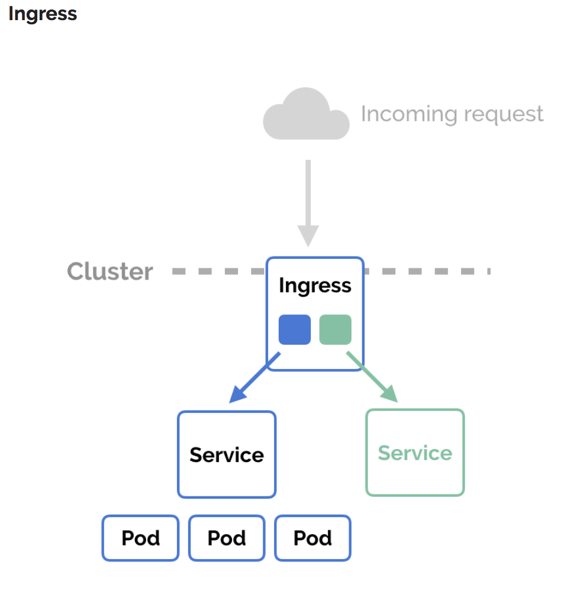
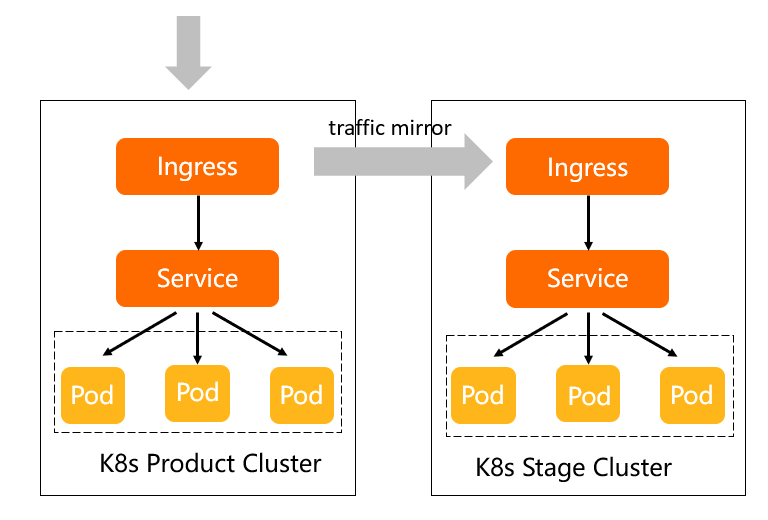

# Ingress  && 


[ingress](https://kubernetes.io/zh/docs/concepts/services-networking/ingress/)

**FEATURE STATE:** `Kubernetes v1.19 [stable]`

Ingress 是对集群中服务的外部访问进行管理的 API 对象，典型的访问方式是 HTTP。

Ingress 可以提供负载均衡、SSL 终结和基于名称的虚拟托管。


## 术语

为了表达更加清晰，本指南定义了以下术语：

- 节点（Node）: Kubernetes 集群中其中一台工作机器，是集群的一部分。
- 集群（Cluster）: 一组运行由 Kubernetes 管理的容器化应用程序的节点。 在此示例和在大多数常见的 Kubernetes 部署环境中，集群中的节点都不在公共网络中。
- 边缘路由器（Edge router）: 在集群中强制执行防火墙策略的路由器（router）。 可以是由云提供商管理的网关，也可以是物理硬件。
- 集群网络（Cluster network）: 一组逻辑的或物理的连接，根据 Kubernetes [网络模型](https://kubernetes.io/zh/docs/concepts/cluster-administration/networking/) 在集群内实现通信。
- 服务（Service）：Kubernetes [服务](https://kubernetes.io/zh/docs/concepts/services-networking/service/)使用 [标签](https://kubernetes.io/zh/docs/concepts/overview/working-with-objects/labels/)选择算符（selectors）标识的一组 Pod。 除非另有说明，否则假定服务只具有在集群网络中可路由的虚拟 IP。

## Ingress 是什么？

[Ingress](https://kubernetes.io/docs/reference/generated/kubernetes-api/v1.23/#ingress-v1beta1-networking-k8s-io) 公开了从集群外部到集群内[服务](https://kubernetes.io/zh/docs/concepts/services-networking/service/)的 HTTP 和 HTTPS 路由。 流量路由由 Ingress 资源上定义的规则控制。

下面是一个将所有流量都发送到同一 Service 的简单 Ingress 示例：

简单模式



流量镜像



clusterIngress-管理的
负载均衡器路由规则IngressPodServicePod客户端

可以将 Ingress 配置为服务提供外部可访问的 URL、负载均衡流量、终止 SSL/TLS，以及提供基于名称的虚拟主机等能力。 [Ingress 控制器](https://kubernetes.io/zh/docs/concepts/services-networking/ingress-controllers) 通常负责通过负载均衡器来实现 Ingress，尽管它也可以配置边缘路由器或其他前端来帮助处理流量。

Ingress 不会公开任意端口或协议。 将 HTTP 和 HTTPS 以外的服务公开到 Internet 时，通常使用 [Service.Type=NodePort](https://kubernetes.io/zh/docs/concepts/services-networking/service/#nodeport) 或 [Service.Type=LoadBalancer](https://kubernetes.io/zh/docs/concepts/services-networking/service/#loadbalancer) 类型的服务。

## 环境准备

你必须具有 [Ingress 控制器](https://kubernetes.io/zh/docs/concepts/services-networking/ingress-controllers) 才能满足 Ingress 的要求。 仅创建 Ingress 资源本身没有任何效果。

你可能需要部署 Ingress 控制器，例如 [ingress-nginx](https://kubernetes.github.io/ingress-nginx/deploy/)。 你可以从许多 [Ingress 控制器](https://kubernetes.io/zh/docs/concepts/services-networking/ingress-controllers) 中进行选择。

理想情况下，所有 Ingress 控制器都应符合参考规范。但实际上，不同的 Ingress 控制器操作略有不同。

**说明：** 确保你查看了 Ingress 控制器的文档，以了解选择它的注意事项。

## Ingress 资源 

一个最小的 Ingress 资源示例：

[`service/networking/minimal-ingress.yaml` ](https://raw.githubusercontent.com/kubernetes/website/main/content/zh/examples/service/networking/minimal-ingress.yaml)

```yaml
apiVersion: networking.k8s.io/v1
kind: Ingress
metadata:
  name: minimal-ingress
  annotations:
    nginx.ingress.kubernetes.io/rewrite-target: /
spec:
  rules:
  - http:
      paths:
      - path: /testpath
        pathType: Prefix
        backend:
          service:
            name: test
            port:
              number: 80
```

与所有其他 Kubernetes 资源一样，Ingress 需要使用 `apiVersion`、`kind` 和 `metadata` 字段。 Ingress 对象的命名必须是合法的 [DNS 子域名名称](https://kubernetes.io/zh/docs/concepts/overview/working-with-objects/names#dns-subdomain-names)。 有关使用配置文件的一般信息，请参见[部署应用](https://kubernetes.io/zh/docs/tasks/run-application/run-stateless-application-deployment/)、 [配置容器](https://kubernetes.io/zh/docs/tasks/configure-pod-container/configure-pod-configmap/)、 [管理资源](https://kubernetes.io/zh/docs/concepts/cluster-administration/manage-deployment/)。 Ingress 经常使用注解（annotations）来配置一些选项，具体取决于 Ingress 控制器，例如 [重写目标注解](https://github.com/kubernetes/ingress-nginx/blob/master/docs/examples/rewrite/README.md)。 不同的 [Ingress 控制器](https://kubernetes.io/zh/docs/concepts/services-networking/ingress-controllers) 支持不同的注解。查看文档以供你选择 Ingress 控制器，以了解支持哪些注解。

Ingress [规约](https://git.k8s.io/community/contributors/devel/sig-architecture/api-conventions.md#spec-and-status) 提供了配置负载均衡器或者代理服务器所需的所有信息。 最重要的是，其中包含与所有传入请求匹配的规则列表。 Ingress 资源仅支持用于转发 HTTP 流量的规则。

### Ingress 规则 

每个 HTTP 规则都包含以下信息：

- 可选的 `host`。在此示例中，未指定 `host`，因此该规则适用于通过指定 IP 地址的所有入站 HTTP 通信。 如果提供了 `host`（例如 foo.bar.com），则 `rules` 适用于该 `host`。
- 路径列表 paths（例如，`/testpath`）,每个路径都有一个由 `serviceName` 和 `servicePort` 定义的关联后端。 在负载均衡器将流量定向到引用的服务之前，主机和路径都必须匹配传入请求的内容。
- `backend`（后端）是 [Service 文档](https://kubernetes.io/zh/docs/concepts/services-networking/service/)中所述的服务和端口名称的组合。 与规则的 `host` 和 `path` 匹配的对 Ingress 的 HTTP（和 HTTPS ）请求将发送到列出的 `backend`。

通常在 Ingress 控制器中会配置 `defaultBackend`（默认后端），以服务于任何不符合规约中 `path` 的请求。

### DefaultBackend 

没有 `rules` 的 Ingress 将所有流量发送到同一个默认后端。 `defaultBackend` 通常是 [Ingress 控制器](https://kubernetes.io/zh/docs/concepts/services-networking/ingress-controllers) 的配置选项，而非在 Ingress 资源中指定。

如果 `hosts` 或 `paths` 都没有与 Ingress 对象中的 HTTP 请求匹配，则流量将路由到默认后端。

### 资源后端 

`Resource` 后端是一个 `ObjectRef`，指向同一名字空间中的另一个 Kubernetes，将其作为 Ingress 对象。`Resource` 与 `Service` 配置是互斥的，在 二者均被设置时会无法通过合法性检查。 `Resource` 后端的一种常见用法是将所有入站数据导向带有静态资产的对象存储后端。

[`service/networking/ingress-resource-backend.yaml` ](https://raw.githubusercontent.com/kubernetes/website/main/content/zh/examples/service/networking/ingress-resource-backend.yaml)

```yaml
apiVersion: networking.k8s.io/v1
kind: Ingress
metadata:
  name: ingress-resource-backend
spec:
  defaultBackend:
    resource:
      apiGroup: k8s.example.com
      kind: StorageBucket
      name: static-assets
  rules:
    - http:
        paths:
          - path: /icons
            pathType: ImplementationSpecific
            backend:
              resource:
                apiGroup: k8s.example.com
                kind: StorageBucket
                name: icon-assets
```

创建了如上的 Ingress 之后，你可以使用下面的命令查看它：

```bash
kubectl describe ingress ingress-resource-backend
Name:             ingress-resource-backend
Namespace:        default
Address:
Default backend:  APIGroup: k8s.example.com, Kind: StorageBucket, Name: static-assets
Rules:
  Host        Path  Backends
  ----        ----  --------
  *
              /icons   APIGroup: k8s.example.com, Kind: StorageBucket, Name: icon-assets
Annotations:  <none>
Events:       <none>
```

### 路径类型 

Ingress 中的每个路径都需要有对应的路径类型（Path Type）。未明确设置 `pathType` 的路径无法通过合法性检查。当前支持的路径类型有三种：

- `ImplementationSpecific`：对于这种路径类型，匹配方法取决于 IngressClass。 具体实现可以将其作为单独的 `pathType` 处理或者与 `Prefix` 或 `Exact` 类型作相同处理。

- `Exact`：精确匹配 URL 路径，且区分大小写。

- `Prefix`：基于以 `/` 分隔的 URL 路径前缀匹配。匹配区分大小写，并且对路径中的元素逐个完成。 路径元素指的是由 `/` 分隔符分隔的路径中的标签列表。 如果每个 *p* 都是请求路径 *p* 的元素前缀，则请求与路径 *p* 匹配。

  **说明：** 如果路径的最后一个元素是请求路径中最后一个元素的子字符串，则不会匹配 （例如：`/foo/bar` 匹配 `/foo/bar/baz`, 但不匹配 `/foo/barbaz`）。

### 示例

| 类型   | 路径                            | 请求路径        | 匹配与否？               |
| ------ | ------------------------------- | --------------- | ------------------------ |
| Prefix | `/`                             | （所有路径）    | 是                       |
| Exact  | `/foo`                          | `/foo`          | 是                       |
| Exact  | `/foo`                          | `/bar`          | 否                       |
| Exact  | `/foo`                          | `/foo/`         | 否                       |
| Exact  | `/foo/`                         | `/foo`          | 否                       |
| Prefix | `/foo`                          | `/foo`, `/foo/` | 是                       |
| Prefix | `/foo/`                         | `/foo`, `/foo/` | 是                       |
| Prefix | `/aaa/bb`                       | `/aaa/bbb`      | 否                       |
| Prefix | `/aaa/bbb`                      | `/aaa/bbb`      | 是                       |
| Prefix | `/aaa/bbb/`                     | `/aaa/bbb`      | 是，忽略尾部斜线         |
| Prefix | `/aaa/bbb`                      | `/aaa/bbb/`     | 是，匹配尾部斜线         |
| Prefix | `/aaa/bbb`                      | `/aaa/bbb/ccc`  | 是，匹配子路径           |
| Prefix | `/aaa/bbb`                      | `/aaa/bbbxyz`   | 否，字符串前缀不匹配     |
| Prefix | `/`, `/aaa`                     | `/aaa/ccc`      | 是，匹配 `/aaa` 前缀     |
| Prefix | `/`, `/aaa`, `/aaa/bbb`         | `/aaa/bbb`      | 是，匹配 `/aaa/bbb` 前缀 |
| Prefix | `/`, `/aaa`, `/aaa/bbb`         | `/ccc`          | 是，匹配 `/` 前缀        |
| Prefix | `/aaa`                          | `/ccc`          | 否，使用默认后端         |
| 混合   | `/foo` (Prefix), `/foo` (Exact) | `/foo`          | 是，优选 Exact 类型      |

#### 多重匹配 

在某些情况下，Ingress 中的多条路径会匹配同一个请求。 这种情况下最长的匹配路径优先。 如果仍然有两条同等的匹配路径，则精确路径类型优先于前缀路径类型。

## 主机名通配符 

主机名可以是精确匹配（例如“`foo.bar.com`”）或者使用通配符来匹配 （例如“`*.foo.com`”）。 精确匹配要求 HTTP `host` 头部字段与 `host` 字段值完全匹配。 通配符匹配则要求 HTTP `host` 头部字段与通配符规则中的后缀部分相同。

| 主机        | host 头部         | 匹配与否？                          |
| ----------- | ----------------- | ----------------------------------- |
| `*.foo.com` | `bar.foo.com`     | 基于相同的后缀匹配                  |
| `*.foo.com` | `baz.bar.foo.com` | 不匹配，通配符仅覆盖了一个 DNS 标签 |
| `*.foo.com` | `foo.com`         | 不匹配，通配符仅覆盖了一个 DNS 标签 |

[`service/networking/ingress-wildcard-host.yaml` ](https://raw.githubusercontent.com/kubernetes/website/main/content/zh/examples/service/networking/ingress-wildcard-host.yaml)

```yaml
apiVersion: networking.k8s.io/v1
kind: Ingress
metadata:
  name: ingress-wildcard-host
spec:
  rules:
  - host: "foo.bar.com"
    http:
      paths:
      - pathType: Prefix
        path: "/bar"
        backend:
          service:
            name: service1
            port:
              number: 80
  - host: "*.foo.com"
    http:
      paths:
      - pathType: Prefix
        path: "/foo"
        backend:
          service:
            name: service2
            port:
              number: 80
```

## Ingress 类 

Ingress 可以由不同的控制器实现，通常使用不同的配置。 每个 Ingress 应当指定一个类，也就是一个对 IngressClass 资源的引用。 IngressClass 资源包含额外的配置，其中包括应当实现该类的控制器名称。

[`service/networking/external-lb.yaml` ](https://raw.githubusercontent.com/kubernetes/website/main/content/zh/examples/service/networking/external-lb.yaml)

```yaml
apiVersion: networking.k8s.io/v1
kind: IngressClass
metadata:
  name: external-lb
spec:
  controller: example.com/ingress-controller
  parameters:
    apiGroup: k8s.example.com
    kind: IngressParameters
    name: external-lb
```

IngressClass 资源包含一个可选的 `parameters` 字段，可用于为该类引用额外的、 特定于具体实现的配置。

#### 名字空间域的参数

**FEATURE STATE:** `Kubernetes v1.22 [beta]`

`parameters` 字段有一个 `scope` 和 `namespace` 字段，可用来引用特定 于名字空间的资源，对 Ingress 类进行配置。 `scope` 字段默认为 `Cluster`，表示默认是集群作用域的资源。 将 `scope` 设置为 `Namespace` 并设置 `namespace` 字段就可以引用某特定 名字空间中的参数资源。

有了名字空间域的参数，就不再需要为一个参数资源配置集群范围的 CustomResourceDefinition。 除此之外，之前对访问集群范围的资源进行授权，需要用到 RBAC 相关的资源，现在也不再需要了。

[`service/networking/namespaced-params.yaml` ](https://raw.githubusercontent.com/kubernetes/website/main/content/zh/examples/service/networking/namespaced-params.yaml)

```yaml
apiVersion: networking.k8s.io/v1
kind: IngressClass
metadata:
  name: external-lb
spec:
  controller: example.com/ingress-controller
  parameters:
    apiGroup: k8s.example.com
    kind: IngressParameters
    name: external-lb
    namespace: external-configuration
    scope: Namespace
```

### 废弃的注解 

在 Kubernetes 1.18 版本引入 IngressClass 资源和 `ingressClassName` 字段之前， Ingress 类是通过 Ingress 中的一个 `kubernetes.io/ingress.class` 注解来指定的。 这个注解从未被正式定义过，但是得到了 Ingress 控制器的广泛支持。

Ingress 中新的 `ingressClassName` 字段是该注解的替代品，但并非完全等价。 该注解通常用于引用实现该 Ingress 的控制器的名称， 而这个新的字段则是对一个包含额外 Ingress 配置的 IngressClass 资源的引用， 包括 Ingress 控制器的名称。

### 默认 Ingress 类 

你可以将一个特定的 IngressClass 标记为集群默认 Ingress 类。 将一个 IngressClass 资源的 `ingressclass.kubernetes.io/is-default-class` 注解设置为 `true` 将确保新的未指定 `ingressClassName` 字段的 Ingress 能够分配为这个默认的 IngressClass.

**注意：** 如果集群中有多个 IngressClass 被标记为默认，准入控制器将阻止创建新的未指定 `ingressClassName` 的 Ingress 对象。 解决这个问题只需确保集群中最多只能有一个 IngressClass 被标记为默认。

## Ingress 类型 

### 由单个 Service 来完成的 Ingress 

现有的 Kubernetes 概念允许你暴露单个 Service (参见[替代方案](https://kubernetes.io/zh/docs/concepts/services-networking/ingress/#alternatives))。 你也可以通过指定无规则的 *默认后端* 来对 Ingress 进行此操作。

[`service/networking/test-ingress.yaml` ](https://raw.githubusercontent.com/kubernetes/website/main/content/zh/examples/service/networking/test-ingress.yaml)

```yaml
apiVersion: networking.k8s.io/v1
kind: Ingress
metadata:
  name: test-ingress
spec:
  defaultBackend:
    service:
      name: test
      port:
        number: 80
```

如果使用 `kubectl apply -f` 创建此 Ingress，则应该能够查看刚刚添加的 Ingress 的状态：

```shell
kubectl get ingress test-ingress
NAME           CLASS         HOSTS   ADDRESS         PORTS   AGE
test-ingress   external-lb   *       203.0.113.123   80      59s
```

其中 `203.0.113.123` 是由 Ingress 控制器分配以满足该 Ingress 的 IP。

**说明：** 入口控制器和负载平衡器可能需要一两分钟才能分配 IP 地址。 在此之前，你通常会看到地址字段的值被设定为 `<pending>`。

### 简单扇出 

一个扇出（fanout）配置根据请求的 HTTP URI 将来自同一 IP 地址的流量路由到多个 Service。 Ingress 允许你将负载均衡器的数量降至最低。例如，这样的设置：

clusterIngress-管理的
负载均衡器/foo/barIngress, 178.91.123.132PodService service1:4200PodPodService service2:8080Pod客户端

将需要一个如下所示的 Ingress：

[`service/networking/simple-fanout-example.yaml` ](https://raw.githubusercontent.com/kubernetes/website/main/content/zh/examples/service/networking/simple-fanout-example.yaml)

```yaml
apiVersion: networking.k8s.io/v1
kind: Ingress
metadata:
  name: simple-fanout-example
spec:
  rules:
  - host: foo.bar.com
    http:
      paths:
      - path: /foo
        pathType: Prefix
        backend:
          service:
            name: service1
            port:
              number: 4200
      - path: /bar
        pathType: Prefix
        backend:
          service:
            name: service2
            port:
              number: 8080
```

当你使用 `kubectl apply -f` 创建 Ingress 时：

```shell
kubectl describe ingress simple-fanout-example
Name:             simple-fanout-example
Namespace:        default
Address:          178.91.123.132
Default backend:  default-http-backend:80 (10.8.2.3:8080)
Rules:
  Host         Path  Backends
  ----         ----  --------
  foo.bar.com
               /foo   service1:4200 (10.8.0.90:4200)
               /bar   service2:8080 (10.8.0.91:8080)
Annotations:
  nginx.ingress.kubernetes.io/rewrite-target:  /
Events:
  Type     Reason  Age                From                     Message
  ----     ------  ----               ----                     -------
  Normal   ADD     22s                loadbalancer-controller  default/test
```

Ingress 控制器将提供实现特定的负载均衡器来满足 Ingress， 只要 Service (`service1`，`service2`) 存在。 当它这样做时，你会在 Address 字段看到负载均衡器的地址。

**说明：** 取决于你所使用的 [Ingress 控制器](https://kubernetes.io/zh/docs/concepts/services-networking/ingress-controllers)， 你可能需要创建默认 HTTP 后端[服务](https://kubernetes.io/zh/docs/concepts/services-networking/service/)。

### 基于名称的虚拟托管 

基于名称的虚拟主机支持将针对多个主机名的 HTTP 流量路由到同一 IP 地址上。

clusterIngress-管理的
负载均衡器Host: foo.bar.comHost: bar.foo.comIngress, 178.91.123.132PodService service1:80PodPodService service2:80Pod客户端

以下 Ingress 让后台负载均衡器基于[host 头部字段](https://tools.ietf.org/html/rfc7230#section-5.4) 来路由请求。

[`service/networking/name-virtual-host-ingress.yaml` ](https://raw.githubusercontent.com/kubernetes/website/main/content/zh/examples/service/networking/name-virtual-host-ingress.yaml)

```yaml
apiVersion: networking.k8s.io/v1
kind: Ingress
metadata:
  name: name-virtual-host-ingress
spec:
  rules:
  - host: foo.bar.com
    http:
      paths:
      - pathType: Prefix
        path: "/"
        backend:
          service:
            name: service1
            port:
              number: 80
  - host: bar.foo.com
    http:
      paths:
      - pathType: Prefix
        path: "/"
        backend:
          service:
            name: service2
            port:
              number: 80
```

如果你创建的 Ingress 资源没有在 `rules` 中定义的任何 `hosts`，则可以匹配指向 Ingress 控制器 IP 地址的任何网络流量，而无需基于名称的虚拟主机。

例如，以下 Ingress 会将针对 `first.bar.com` 的请求流量路由到 `service1`， 将针对 `second.bar.com` 的请求流量路由到 `service2`， 而针对该 IP 地址的、没有在请求中定义主机名的请求流量会被路由（即，不提供请求标头） 到 `service3`。

[`service/networking/name-virtual-host-ingress-no-third-host.yaml` ](https://raw.githubusercontent.com/kubernetes/website/main/content/zh/examples/service/networking/name-virtual-host-ingress-no-third-host.yaml)

```yaml
apiVersion: networking.k8s.io/v1
kind: Ingress
metadata:
  name: name-virtual-host-ingress-no-third-host
spec:
  rules:
  - host: first.bar.com
    http:
      paths:
      - pathType: Prefix
        path: "/"
        backend:
          service:
            name: service1
            port:
              number: 80
  - host: second.bar.com
    http:
      paths:
      - pathType: Prefix
        path: "/"
        backend:
          service:
            name: service2
            port:
              number: 80
  - http:
      paths:
      - pathType: Prefix
        path: "/"
        backend:
          service:
            name: service3
            port:
              number: 80
```

### TLS

你可以通过设定包含 TLS 私钥和证书的[Secret](https://kubernetes.io/zh/docs/concepts/configuration/secret/) 来保护 Ingress。 Ingress 只支持单个 TLS 端口 443，并假定 TLS 连接终止于 Ingress 节点 （与 Service 及其 Pod 之间的流量都以明文传输）。 如果 Ingress 中的 TLS 配置部分指定了不同的主机，那么它们将根据通过 SNI TLS 扩展指定的主机名 （如果 Ingress 控制器支持 SNI）在同一端口上进行复用。 TLS Secret 必须包含名为 `tls.crt` 和 `tls.key` 的键名。 这些数据包含用于 TLS 的证书和私钥。例如：

```yaml
apiVersion: v1
kind: Secret
metadata:
  name: testsecret-tls
  namespace: default
data:
  tls.crt: base64 编码的 cert
  tls.key: base64 编码的 key
type: kubernetes.io/tls
```

在 Ingress 中引用此 Secret 将会告诉 Ingress 控制器使用 TLS 加密从客户端到负载均衡器的通道。 你需要确保创建的 TLS Secret 创建自包含 `https-example.foo.com` 的公用名称（CN）的证书。 这里的公共名称也被称为全限定域名（FQDN）。

**说明：**

注意，默认规则上无法使用 TLS，因为需要为所有可能的子域名发放证书。 因此，`tls` 节区的 `hosts` 的取值需要域 `rules` 节区的 `host` 完全匹配。

[`service/networking/tls-example-ingress.yaml` ](https://raw.githubusercontent.com/kubernetes/website/main/content/zh/examples/service/networking/tls-example-ingress.yaml)

```yaml
apiVersion: networking.k8s.io/v1
kind: Ingress
metadata:
  name: tls-example-ingress
spec:
  tls:
  - hosts:
      - https-example.foo.com
    secretName: testsecret-tls
  rules:
  - host: https-example.foo.com
    http:
      paths:
      - path: /
        pathType: Prefix
        backend:
          service:
            name: service1
            port:
              number: 80
```

**说明：** 各种 Ingress 控制器所支持的 TLS 功能之间存在差异。请参阅有关 [nginx](https://kubernetes.github.io/ingress-nginx/user-guide/tls/)、 [GCE](https://git.k8s.io/ingress-gce/README.md#frontend-https) 或者任何其他平台特定的 Ingress 控制器的文档，以了解 TLS 如何在你的环境中工作。

### 负载均衡 

Ingress 控制器启动引导时使用一些适用于所有 Ingress 的负载均衡策略设置， 例如负载均衡算法、后端权重方案和其他等。 更高级的负载均衡概念（例如持久会话、动态权重）尚未通过 Ingress 公开。 你可以通过用于服务的负载均衡器来获取这些功能。

值得注意的是，尽管健康检查不是通过 Ingress 直接暴露的，在 Kubernetes 中存在并行的概念，比如 [就绪检查](https://kubernetes.io/zh/docs/tasks/configure-pod-container/configure-liveness-readiness-startup-probes/)， 允许你实现相同的目的。 请检查特定控制器的说明文档（ [nginx](https://git.k8s.io/ingress-nginx/README.md)， [GCE](https://git.k8s.io/ingress-gce/README.md#health-checks)） 以了解它们是怎样处理健康检查的。

## 更新 Ingress 

要更新现有的 Ingress 以添加新的 Host，可以通过编辑资源来对其进行更新：

```shell
kubectl describe ingress test
Name:             test
Namespace:        default
Address:          178.91.123.132
Default backend:  default-http-backend:80 (10.8.2.3:8080)
Rules:
  Host         Path  Backends
  ----         ----  --------
  foo.bar.com
               /foo   service1:80 (10.8.0.90:80)
Annotations:
  nginx.ingress.kubernetes.io/rewrite-target:  /
Events:
  Type     Reason  Age                From                     Message
  ----     ------  ----               ----                     -------
  Normal   ADD     35s                loadbalancer-controller  default/test
kubectl edit ingress test
```

这一命令将打开编辑器，允许你以 YAML 格式编辑现有配置。 修改它来增加新的主机：

```yaml
spec:
  rules:
  - host: foo.bar.com
    http:
      paths:
      - backend:
          serviceName: service1
          servicePort: 80
        path: /foo
        pathType: Prefix
  - host: bar.baz.com
    http:
      paths:
      - backend:
          serviceName: service2
          servicePort: 80
        path: /foo
        pathType: Prefix
..
```

保存更改后，kubectl 将更新 API 服务器中的资源，该资源将告诉 Ingress 控制器重新配置负载均衡器。

验证：

```shell
kubectl describe ingress test
Name:             test
Namespace:        default
Address:          178.91.123.132
Default backend:  default-http-backend:80 (10.8.2.3:8080)
Rules:
  Host         Path  Backends
  ----         ----  --------
  foo.bar.com
               /foo   service1:80 (10.8.0.90:80)
  bar.baz.com
               /foo   service2:80 (10.8.0.91:80)
Annotations:
  nginx.ingress.kubernetes.io/rewrite-target:  /
Events:
  Type     Reason  Age                From                     Message
  ----     ------  ----               ----                     -------
  Normal   ADD     45s                loadbalancer-controller  default/test
```

你也可以通过 `kubectl replace -f` 命令调用修改后的 Ingress yaml 文件来获得同样的结果。

## 跨可用区失败 

不同的云厂商使用不同的技术来实现跨故障域的流量分布。详情请查阅相关 Ingress 控制器的文档。 请查看相关 [Ingress 控制器](https://kubernetes.io/zh/docs/concepts/services-networking/ingress-controllers) 的文档以了解详细信息。

# [Ingress 控制器](https://kubernetes.io/zh/docs/concepts/services-networking/ingress-controllers/)

为了让 Ingress 资源工作，集群必须有一个正在运行的 Ingress 控制器。

与作为 `kube-controller-manager` 可执行文件的一部分运行的其他类型的控制器不同， Ingress 控制器不是随集群自动启动的。 基于此页面，你可选择最适合你的集群的 ingress 控制器实现。

Kubernetes 作为一个项目，目前支持和维护 [AWS](https://github.com/kubernetes-sigs/aws-load-balancer-controller#readme)， [GCE](https://git.k8s.io/ingress-gce/README.md) 和 [nginx](https://git.k8s.io/ingress-nginx/README.md#readme) Ingress 控制器。

## 其他控制器

**说明：** 本部分链接到提供 Kubernetes 所需功能的第三方项目。Kubernetes 项目作者不负责这些项目。此页面遵循[CNCF 网站指南](https://github.com/cncf/foundation/blob/master/website-guidelines.md)，按字母顺序列出项目。要将项目添加到此列表中，请在提交更改之前阅读[内容指南](https://kubernetes.io/docs/contribute/style/content-guide/#third-party-content)。

- [AKS 应用程序网关 Ingress 控制器](https://azure.github.io/application-gateway-kubernetes-ingress/) 是一个配置 [Azure 应用程序网关](https://docs.microsoft.com/azure/application-gateway/overview) 的 Ingress 控制器。
- [Ambassador](https://www.getambassador.io/) API 网关是一个基于 [Envoy](https://www.envoyproxy.io/) 的 Ingress 控制器。
- [Apache APISIX Ingress 控制器](https://github.com/apache/apisix-ingress-controller) 是一个基于 [Apache APISIX 网关](https://github.com/apache/apisix) 的 Ingress 控制器。
- [Avi Kubernetes Operator](https://github.com/vmware/load-balancer-and-ingress-services-for-kubernetes) 使用 [VMware NSX Advanced Load Balancer](https://avinetworks.com/) 提供第 4 到第 7 层的负载均衡。
- [BFE Ingress 控制器](https://github.com/bfenetworks/ingress-bfe) 是一个基于 [BFE](https://www.bfe-networks.net/) 的 Ingress 控制器。
- [Citrix Ingress 控制器](https://github.com/citrix/citrix-k8s-ingress-controller#readme) 可以用来与 Citrix Application Delivery Controller 一起使用。
- [Contour](https://projectcontour.io/) 是一个基于 [Envoy](https://www.envoyproxy.io/) 的 Ingress 控制器。
- [EnRoute](https://getenroute.io/) 是一个基于 [Envoy](https://www.envoyproxy.io/) API 网关， 可以作为 Ingress 控制器来执行。
- [Easegress IngressController](https://github.com/megaease/easegress/blob/main/doc/ingresscontroller.md) 是一个基于 [Easegress](https://megaease.com/easegress/) API 网关，可以作为 Ingress 控制器来执行。

- F5 BIG-IP 的 [用于 Kubernetes 的容器 Ingress 服务](https://clouddocs.f5.com/products/connectors/k8s-bigip-ctlr/latest) 让你能够使用 Ingress 来配置 F5 BIG-IP 虚拟服务器。
- [Gloo](https://gloo.solo.io/) 是一个开源的、基于 [Envoy](https://www.envoyproxy.io/) 的 Ingress 控制器，能够提供 API 网关功能，
- [HAProxy Ingress](https://haproxy-ingress.github.io/) 针对 [HAProxy](https://www.haproxy.org/#desc) 的 Ingress 控制器。
- [用于 Kubernetes 的 HAProxy Ingress 控制器](https://github.com/haproxytech/kubernetes-ingress#readme) 也是一个针对 [HAProxy](https://www.haproxy.org/#desc) 的 Ingress 控制器。
- [Istio Ingress](https://istio.io/latest/docs/tasks/traffic-management/ingress/kubernetes-ingress/) 是一个基于 [Istio](https://istio.io/) 的 Ingress 控制器。

- [用于 Kubernetes 的 Kong Ingress 控制器](https://github.com/Kong/kubernetes-ingress-controller#readme) 是一个用来驱动 [Kong Gateway](https://konghq.com/kong/) 的 Ingress 控制器。
- [用于 Kubernetes 的 NGINX Ingress 控制器](https://www.nginx.com/products/nginx-ingress-controller/) 能够与 [NGINX](https://www.nginx.com/resources/glossary/nginx/) Web 服务器（作为代理） 一起使用。
- [Skipper](https://opensource.zalando.com/skipper/kubernetes/ingress-controller/) HTTP 路由器和反向代理可用于服务组装，支持包括 Kubernetes Ingress 这类使用场景， 设计用来作为构造你自己的定制代理的库。
- [Traefik Kubernetes Ingress 提供程序](https://doc.traefik.io/traefik/providers/kubernetes-ingress/) 是一个用于 [Traefik](https://traefik.io/traefik/) 代理的 Ingress 控制器。
- [Tyk Operator](https://github.com/TykTechnologies/tyk-operator) 使用自定义资源扩展 Ingress，为之带来 API 管理能力。Tyk Operator 使用开源的 Tyk Gateway & Tyk Cloud 控制面。
- [Voyager](https://appscode.com/products/voyager) 是一个针对 [HAProxy](https://www.haproxy.org/#desc) 的 Ingress 控制器。

## 使用多个 Ingress 控制器

你可以在集群中部署[任意数量的 ingress 控制器](https://git.k8s.io/ingress-nginx/docs/user-guide/multiple-ingress.md#multiple-ingress-controllers)。 创建 ingress 时，应该使用适当的 [`ingress.class`](https://git.k8s.io/ingress-gce/docs/faq/README.md#how-do-i-run-multiple-ingress-controllers-in-the-same-cluster) 注解每个 Ingress 以表明在集群中如果有多个 Ingress 控制器时，应该使用哪个 Ingress 控制器。

如果不定义 `ingress.class`，云提供商可能使用默认的 Ingress 控制器。

理想情况下，所有 Ingress 控制器都应满足此规范，但各种 Ingress 控制器的操作略有不同。

**说明：** 确保你查看了 ingress 控制器的文档，以了解选择它的注意事项。


[ingress 官方]: https://kubernetes.io/zh/docs/concepts/services-networking/ingress/
[a liack]: https://www.alibabacloud.com/help/zh/doc-detail/199593.html

