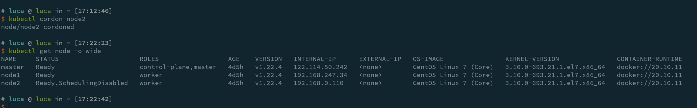

# kubectl 管理 k8s

## kubectl 概述

你可以使用 Kubectl 命令行工具管理 Kubernetes 集群。 `kubectl` 在 `$HOME/.kube` 目录中查找一个名为 `config` 的配置文件。 你可以通过设置 KUBECONFIG 环境变量或设置 [`--kubeconfig`](https://kubernetes.io/zh/docs/concepts/configuration/organize-cluster-access-kubeconfig/) 参数来指定其它 [kubeconfig](https://kubernetes.io/zh/docs/concepts/configuration/organize-cluster-access-kubeconfig/) 文件。

本文概述了 `kubectl` 语法和命令操作描述，并提供了常见的示例。 有关每个命令的详细信息，包括所有受支持的参数和子命令， 请参阅 [kubectl](https://kubernetes.io/docs/reference/generated/kubectl/kubectl-commands/) 参考文档。 有关安装说明，请参见[安装 kubectl](https://kubernetes.io/zh/docs/tasks/tools/install-kubectl/) 。

### 语法

使用以下语法 `kubectl` 从终端窗口运行命令：

```shell
kubectl [command] [TYPE] [NAME] [flags]
```

其中 `command`、`TYPE`、`NAME` 和 `flags` 分别是：

- `command`：指定要对一个或多个资源执行的操作，例如 `create`、`get`、`describe`、`delete`。

- `TYPE`：指定[资源类型](https://kubernetes.io/zh/docs/reference/kubectl/overview/#资源类型)。资源类型不区分大小写， 可以指定单数、复数或缩写形式。例如，以下命令输出相同的结果:

  ```shell
  kubectl get pod 
  kubectl get pods 
  kubectl get po 
  ```

- `NAME`：指定资源的名称。名称区分大小写。 如果省略名称，则显示所有资源的详细信息 `kubectl get pods`。

  在对多个资源执行操作时，你可以按类型和名称指定每个资源，或指定一个或多个文件：

  - 要按类型和名称指定资源：

    - 要对所有类型相同的资源进行分组，请执行以下操作：`TYPE1 name1 name2 name<#>`。

      例子：`kubectl get pod example-pod1 example-pod2`

    - 分别指定多个资源类型：`TYPE1/name1 TYPE1/name2 TYPE2/name3 TYPE<#>/name<#>`。

      例子：`kubectl get pod/example-pod1 replicationcontroller/example-rc1`

  - 用一个或多个文件指定资源：`-f file1 -f file2 -f file<#>`

    - [使用 YAML 而不是 JSON](https://kubernetes.io/zh/docs/concepts/configuration/overview/#general-configuration-tips) 因为 YAML 更容易使用，特别是用于配置文件时。 例子：`kubectl get -f ./pod.yaml`

- `flags`: 指定可选的参数。例如，可以使用 `-s` 或 `-server` 参数指定 Kubernetes API 服务器的地址和端口。操作

  下表包含所有 kubectl 操作的简短描述和普通语法：

  | 操作            | 语法                                                         | 描述                                                         |
  | --------------- | ------------------------------------------------------------ | ------------------------------------------------------------ |
  | `alpha`         | `kubectl alpha SUBCOMMAND [flags]`                           | 列出与 alpha 特性对应的可用命令，这些特性在 Kubernetes 集群中默认情况下是不启用的。 |
  | `annotate`      | `kubectl annotate (-f FILENAME | TYPE NAME | TYPE/NAME) KEY_1=VAL_1 ... KEY_N=VAL_N [--overwrite] [--all] [--resource-version=version] [flags]` | 添加或更新一个或多个资源的注解。                             |
  | `api-resources` | `kubectl api-resources [flags]`                              | 列出可用的 API 资源。                                        |
  | `api-versions`  | `kubectl api-versions [flags]`                               | 列出可用的 API 版本。                                        |
  | `apply`         | `kubectl apply -f FILENAME [flags]`                          | 从文件或 stdin 对资源应用配置更改。                          |
  | `attach`        | `kubectl attach POD -c CONTAINER [-i] [-t] [flags]`          | 附加到正在运行的容器，查看输出流或与容器（stdin）交互。      |
  | `auth`          | `kubectl auth [flags] [options]`                             | 检查授权。                                                   |
  | `autoscale`     | `kubectl autoscale (-f FILENAME | TYPE NAME | TYPE/NAME) [--min=MINPODS] --max=MAXPODS [--cpu-percent=CPU] [flags]` | 自动伸缩由副本控制器管理的一组 pod。                         |
  | `certificate`   | `kubectl certificate SUBCOMMAND [options]`                   | 修改证书资源。                                               |
  | `cluster-info`  | `kubectl cluster-info [flags]`                               | 显示有关集群中主服务器和服务的端口信息。                     |
  | `completion`    | `kubectl completion SHELL [options]`                         | 为指定的 shell （bash 或 zsh）输出 shell 补齐代码。          |
  | `config`        | `kubectl config SUBCOMMAND [flags]`                          | 修改 kubeconfig 文件。有关详细信息，请参阅各个子命令。       |
  | `convert`       | `kubectl convert -f FILENAME [options]`                      | 在不同的 API 版本之间转换配置文件。配置文件可以是 YAML 或 JSON 格式。 |
  | `cordon`        | `kubectl cordon NODE [options]`                              | 将节点标记为不可调度。                                       |
  | `cp`            | `kubectl cp <file-spec-src> <file-spec-dest> [options]`      | 在容器之间复制文件和目录。                                   |
  | `create`        | `kubectl create -f FILENAME [flags]`                         | 从文件或 stdin 创建一个或多个资源。                          |
  | `delete`        | `kubectl delete (-f FILENAME | TYPE [NAME | /NAME | -l label | --all]) [flags]` | 从文件、标准输入或指定标签选择器、名称、资源选择器或资源中删除资源。 |
  | `describe`      | `kubectl describe (-f FILENAME | TYPE [NAME_PREFIX | /NAME | -l label]) [flags]` | 显示一个或多个资源的详细状态。                               |
  | `diff`          | `kubectl diff -f FILENAME [flags]`                           | 将 live 配置和文件或标准输入做对比 (**BETA**)                |
  | `drain`         | `kubectl drain NODE [options]`                               | 腾空节点以准备维护。                                         |
  | `edit`          | `kubectl edit (-f FILENAME | TYPE NAME | TYPE/NAME) [flags]` | 使用默认编辑器编辑和更新服务器上一个或多个资源的定义。       |
  | `exec`          | `kubectl exec POD [-c CONTAINER] [-i] [-t] [flags] [-- COMMAND [args...]]` | 对 pod 中的容器执行命令。                                    |
  | `explain`       | `kubectl explain [--recursive=false] [flags]`                | 获取多种资源的文档。例如 pod, node, service 等。             |
  | `expose`        | `kubectl expose (-f FILENAME | TYPE NAME | TYPE/NAME) [--port=port] [--protocol=TCP|UDP] [--target-port=number-or-name] [--name=name] [--external-ip=external-ip-of-service] [--type=type] [flags]` | 将副本控制器、服务或 pod 作为新的 Kubernetes 服务暴露。      |
  | `get`           | `kubectl get (-f FILENAME | TYPE [NAME | /NAME | -l label]) [--watch] [--sort-by=FIELD] [[-o | --output]=OUTPUT_FORMAT] [flags]` | 列出一个或多个资源。                                         |
  | `kustomize`     | `kubectl kustomize <dir> [flags] [options]`                  | 列出从 kustomization.yaml 文件中的指令生成的一组 API 资源。参数必须是包含文件的目录的路径，或者是 git 存储库 URL，其路径后缀相对于存储库根目录指定了相同的路径。 |
  | `label`         | `kubectl label (-f FILENAME | TYPE NAME | TYPE/NAME) KEY_1=VAL_1 ... KEY_N=VAL_N [--overwrite] [--all] [--resource-version=version] [flags]` | 添加或更新一个或多个资源的标签。                             |
  | `logs`          | `kubectl logs POD [-c CONTAINER] [--follow] [flags]`         | 在 pod 中打印容器的日志。                                    |
  | `options`       | `kubectl options`                                            | 全局命令行选项列表，适用于所有命令。                         |
  | `patch`         | `kubectl patch (-f FILENAME | TYPE NAME | TYPE/NAME) --patch PATCH [flags]` | 使用策略合并 patch 程序更新资源的一个或多个字段。            |
  | `plugin`        | `kubectl plugin [flags] [options]`                           | 提供用于与插件交互的实用程序。                               |
  | `port-forward`  | `kubectl port-forward POD [LOCAL_PORT:]REMOTE_PORT [...[LOCAL_PORT_N:]REMOTE_PORT_N] [flags]` | 将一个或多个本地端口转发到一个 pod。                         |
  | `proxy`         | `kubectl proxy [--port=PORT] [--www=static-dir] [--www-prefix=prefix] [--api-prefix=prefix] [flags]` | 运行 Kubernetes API 服务器的代理。                           |
  | `replace`       | `kubectl replace -f FILENAME`                                | 从文件或标准输入中替换资源。                                 |
  | `rollout`       | `kubectl rollout SUBCOMMAND [options]`                       | 管理资源的部署。有效的资源类型包括：Deployments, DaemonSets 和 StatefulSets。 |
  | `run`           | `kubectl run NAME --image=image [--env="key=value"] [--port=port] [--dry-run=server | client | none] [--overrides=inline-json] [flags]` | 在集群上运行指定的镜像。                                     |
  | `scale`         | `kubectl scale (-f FILENAME | TYPE NAME | TYPE/NAME) --replicas=COUNT [--resource-version=version] [--current-replicas=count] [flags]` | 更新指定副本控制器的大小。                                   |
  | `set`           | `kubectl set SUBCOMMAND [options]`                           | 配置应用程序资源。                                           |
  | `taint`         | `kubectl taint NODE NAME KEY_1=VAL_1:TAINT_EFFECT_1 ... KEY_N=VAL_N:TAINT_EFFECT_N [options]` | 更新一个或多个节点上的污点。                                 |
  | `top`           | `kubectl top [flags] [options]`                              | 显示资源（CPU/内存/存储）的使用情况。                        |
  | `uncordon`      | `kubectl uncordon NODE [options]`                            | 将节点标记为可调度。                                         |
  | `version`       | `kubectl version [--client] [flags]`                         | 显示运行在客户端和服务器上的 Kubernetes 版本。               |
  | `wait`          | `kubectl wait ([-f FILENAME] | resource.group/resource.name | resource.group [(-l label | --all)]) [--for=delete|--for condition=available] [options]` | 实验性：等待一种或多种资源的特定条件。                       |

  了解更多有关命令操作的信息，请参阅 [kubectl](https://kubernetes.io/zh/docs/reference/kubectl/kubectl/) 参考文档。

### 资源类型

下表列出所有受支持的资源类型及其缩写别名:

(以下输出可以通过 `kubectl api-resources` 获取，内容以 Kubernetes 1.19.1 版本为准。)

| 资源名                            | 缩写名     | API 分组                     | 按命名空间 | 资源类型                       |
| --------------------------------- | ---------- | ---------------------------- | ---------- | ------------------------------ |
| `bindings`                        |            |                              | true       | Binding                        |
| `componentstatuses`               | `cs`       |                              | false      | ComponentStatus                |
| `configmaps`                      | `cm`       |                              | true       | ConfigMap                      |
| `endpoints`                       | `ep`       |                              | true       | Endpoints                      |
| `events`                          | `ev`       |                              | true       | Event                          |
| `limitranges`                     | `limits`   |                              | true       | LimitRange                     |
| `namespaces`                      | `ns`       |                              | false      | Namespace                      |
| `nodes`                           | `no`       |                              | false      | Node                           |
| `persistentvolumeclaims`          | `pvc`      |                              | true       | PersistentVolumeClaim          |
| `persistentvolumes`               | `pv`       |                              | false      | PersistentVolume               |
| `pods`                            | `po`       |                              | true       | Pod                            |
| `podtemplates`                    |            |                              | true       | PodTemplate                    |
| `replicationcontrollers`          | `rc`       |                              | true       | ReplicationController          |
| `resourcequotas`                  | `quota`    |                              | true       | ResourceQuota                  |
| `secrets`                         |            |                              | true       | Secret                         |
| `serviceaccounts`                 | `sa`       |                              | true       | ServiceAccount                 |
| `services`                        | `svc`      |                              | true       | Service                        |
| `mutatingwebhookconfigurations`   |            | admissionregistration.k8s.io | false      | MutatingWebhookConfiguration   |
| `validatingwebhookconfigurations` |            | admissionregistration.k8s.io | false      | ValidatingWebhookConfiguration |
| `customresourcedefinitions`       | `crd,crds` | apiextensions.k8s.io         | false      | CustomResourceDefinition       |
| `apiservices`                     |            | apiregistration.k8s.io       | false      | APIService                     |
| `controllerrevisions`             |            | apps                         | true       | ControllerRevision             |
| `daemonsets`                      | `ds`       | apps                         | true       | DaemonSet                      |
| `deployments`                     | `deploy`   | apps                         | true       | Deployment                     |
| `replicasets`                     | `rs`       | apps                         | true       | ReplicaSet                     |
| `statefulsets`                    | `sts`      | apps                         | true       | StatefulSet                    |
| `tokenreviews`                    |            | authentication.k8s.io        | false      | TokenReview                    |
| `localsubjectaccessreviews`       |            | authorization.k8s.io         | true       | LocalSubjectAccessReview       |
| `selfsubjectaccessreviews`        |            | authorization.k8s.io         | false      | SelfSubjectAccessReview        |
| `selfsubjectrulesreviews`         |            | authorization.k8s.io         | false      | SelfSubjectRulesReview         |
| `subjectaccessreviews`            |            | authorization.k8s.io         | false      | SubjectAccessReview            |
| `horizontalpodautoscalers`        | `hpa`      | autoscaling                  | true       | HorizontalPodAutoscaler        |
| `cronjobs`                        | `cj`       | batch                        | true       | CronJob                        |
| `jobs`                            |            | batch                        | true       | Job                            |
| `certificatesigningrequests`      | `csr`      | certificates.k8s.io          | false      | CertificateSigningRequest      |
| `leases`                          |            | coordination.k8s.io          | true       | Lease                          |
| `endpointslices`                  |            | discovery.k8s.io             | true       | EndpointSlice                  |
| `events`                          | `ev`       | events.k8s.io                | true       | Event                          |
| `ingresses`                       | `ing`      | extensions                   | true       | Ingress                        |
| `flowschemas`                     |            | flowcontrol.apiserver.k8s.io | false      | FlowSchema                     |
| `prioritylevelconfigurations`     |            | flowcontrol.apiserver.k8s.io | false      | PriorityLevelConfiguration     |
| `ingressclasses`                  |            | networking.k8s.io            | false      | IngressClass                   |
| `ingresses`                       | `ing`      | networking.k8s.io            | true       | Ingress                        |
| `networkpolicies`                 | `netpol`   | networking.k8s.io            | true       | NetworkPolicy                  |
| `runtimeclasses`                  |            | node.k8s.io                  | false      | RuntimeClass                   |
| `poddisruptionbudgets`            | `pdb`      | policy                       | true       | PodDisruptionBudget            |
| `podsecuritypolicies`             | `psp`      | policy                       | false      | PodSecurityPolicy              |
| `clusterrolebindings`             |            | rbac.authorization.k8s.io    | false      | ClusterRoleBinding             |
| `clusterroles`                    |            | rbac.authorization.k8s.io    | false      | ClusterRole                    |
| `rolebindings`                    |            | rbac.authorization.k8s.io    | true       | RoleBinding                    |
| `roles`                           |            | rbac.authorization.k8s.io    | true       | Role                           |
| `priorityclasses`                 | `pc`       | scheduling.k8s.io            | false      | PriorityClass                  |
| `csidrivers`                      |            | storage.k8s.io               | false      | CSIDriver                      |
| `csinodes`                        |            | storage.k8s.io               | false      | CSINode                        |
| `storageclasses`                  | `sc`       | storage.k8s.io               | false      | StorageClass                   |
| `volumeattachments`               |            | storage.k8s.io               | false      | VolumeAttachment               |

### 输出选项

有关如何格式化或排序某些命令的输出的信息，请使用以下部分。有关哪些命令支持各种输出选项的详细信息，请参阅[kubectl](https://kubernetes.io/zh/docs/reference/kubectl/kubectl/) 参考文档。

### 格式化输出

所有 `kubectl` 命令的默认输出格式都是人类可读的纯文本格式。要以特定格式向终端窗口输出详细信息，可以将 `-o` 或 `--output` 参数添加到受支持的 `kubectl` 命令中。

#### 语法

```shell
kubectl [command] [TYPE] [NAME] -o=<output_format>
```

根据 `kubectl` 操作，支持以下输出格式：

| Output format                       | Description                                                  |
| ----------------------------------- | ------------------------------------------------------------ |
| `-o custom-columns=<spec>`          | 使用逗号分隔的[自定义列](https://kubernetes.io/zh/docs/reference/kubectl/overview/#custom-columns)列表打印表。 |
| `-o custom-columns-file=<filename>` | 使用 `<filename>` 文件中的[自定义列](https://kubernetes.io/zh/docs/reference/kubectl/overview/#custom-columns)模板打印表。 |
| `-o json`                           | 输出 JSON 格式的 API 对象                                    |
| `-o jsonpath=<template>`            | 打印 [jsonpath](https://kubernetes.io/zh/docs/reference/kubectl/jsonpath/) 表达式定义的字段 |
| `-o jsonpath-file=<filename>`       | 打印 `<filename>` 文件中 [jsonpath](https://kubernetes.io/zh/docs/reference/kubectl/jsonpath/) 表达式定义的字段。 |
| `-o name`                           | 仅打印资源名称而不打印任何其他内容。                         |
| `-o wide`                           | 以纯文本格式输出，包含任何附加信息。对于 pod 包含节点名。    |
| `-o yaml`                           | 输出 YAML 格式的 API 对象。                                  |

##### 示例

在此示例中，以下命令将单个 pod 的详细信息输出为 YAML 格式的对象：

```shell
kubectl get pod web-pod-13je7 -o yaml
```

请记住：有关每个命令支持哪种输出格式的详细信息，请参阅 [kubectl](https://kubernetes.io/zh/docs/reference/kubectl/kubectl/) 参考文档。

### 自定义列

要定义自定义列并仅将所需的详细信息输出到表中，可以使用该 custom-columns 选项。你可以选择内联定义自定义列或使用模板文件：`-o=custom-columns=<spec>` 或 `-o=custom-columns-file=<filename>`。

##### 示例

内联：

```shell
kubectl get pods <pod-name> -o custom-columns=NAME:.metadata.name,RSRC:.metadata.resourceVersion
```

模板文件：

```shell
kubectl get pods <pod-name> -o custom-columns-file=template.txt
```

其中，`template.txt` 文件包含：

```
NAME          RSRC
metadata.name metadata.resourceVersion
```

运行任何一个命令的结果类似于:

```shell
NAME           RSRC
submit-queue   610995
```

### Server-side 列

`kubectl` 支持从服务器接收关于对象的特定列信息。 这意味着对于任何给定的资源，服务器将返回与该资源相关的列和行，以便客户端打印。 通过让服务器封装打印的细节，这允许在针对同一集群使用的客户端之间提供一致的人类可读输出。

此功能默认启用。要禁用它，请将该 `--server-print=false` 参数添加到 `kubectl get` 命令中。

##### 例子：

要打印有关 pod 状态的信息，请使用如下命令：

```shell
kubectl get pods <pod-name> --server-print=false
```

输出类似于：

```shell
NAME       AGE
pod-name   1m
```

### 排序列表对象

要将对象排序后输出到终端窗口，可以将 `--sort-by` 参数添加到支持的 `kubectl` 命令。通过使用 `--sort-by` 参数指定任何数字或字符串字段来对对象进行排序。要指定字段，请使用 [jsonpath](https://kubernetes.io/zh/docs/reference/kubectl/jsonpath/) 表达式。

#### 语法

```shell
kubectl [command] [TYPE] [NAME] --sort-by=<jsonpath_exp>
```

##### 示例

要打印按名称排序的 pod 列表，请运行：

```shell
kubectl get pods --sort-by=.metadata.name
```

### 示例：常用操作

使用以下示例集来帮助你熟悉运行常用 kubectl 操作：

`kubectl apply` - 以文件或标准输入为准应用或更新资源。

```shell
# 使用 example-service.yaml 中的定义创建服务。
kubectl apply -f example-service.yaml

# 使用 example-controller.yaml 中的定义创建 replication controller。
kubectl apply -f example-controller.yaml

# 使用 <directory> 路径下的任意 .yaml, .yml, 或 .json 文件 创建对象。
kubectl apply -f <directory>
```

`kubectl get` - 列出一个或多个资源。

```shell
# 以纯文本输出格式列出所有 pod。
kubectl get pods

# 以纯文本输出格式列出所有 pod，并包含附加信息(如节点名)。
kubectl get pods -o wide

# 以纯文本输出格式列出具有指定名称的副本控制器。提示：你可以使用别名 'rc' 缩短和替换 'replicationcontroller' 资源类型。
kubectl get replicationcontroller <rc-name>

# 以纯文本输出格式列出所有副本控制器和服务。
kubectl get rc,services

# 以纯文本输出格式列出所有守护程序集，包括未初始化的守护程序集。
kubectl get ds --include-uninitialized

# 列出在节点 server01 上运行的所有 pod
kubectl get pods --field-selector=spec.nodeName=server01
```

`kubectl describe` - 显示一个或多个资源的详细状态，默认情况下包括未初始化的资源。

```shell
# 显示名称为 <node-name> 的节点的详细信息。
kubectl describe nodes <node-name>

# 显示名为 <pod-name> 的 pod 的详细信息。
kubectl describe pods/<pod-name>

# 显示由名为 <rc-name> 的副本控制器管理的所有 pod 的详细信息。
# 记住：副本控制器创建的任何 pod 都以复制控制器的名称为前缀。
kubectl describe pods <rc-name>

# 描述所有的 pod，不包括未初始化的 pod
kubectl describe pods
```

**说明：**

`kubectl get` 命令通常用于检索同一资源类型的一个或多个资源。 它具有丰富的参数，允许你使用 `-o` 或 `--output` 参数自定义输出格式。你可以指定 `-w` 或 `--watch` 参数以开始观察特定对象的更新。 `kubectl describe` 命令更侧重于描述指定资源的许多相关方面。它可以调用对 `API 服务器` 的多个 API 调用来为用户构建视图。 例如，该 `kubectl describe node` 命令不仅检索有关节点的信息，还检索在其上运行的 pod 的摘要，为节点生成的事件等。

`kubectl delete` - 从文件、stdin 或指定标签选择器、名称、资源选择器或资源中删除资源。

```shell
# 使用 pod.yaml 文件中指定的类型和名称删除 pod。
kubectl delete -f pod.yaml

# 删除所有带有 '<label-key>=<label-value>' 标签的 Pod 和服务。
kubectl delete pods,services -l <label-key>=<label-value>

# 删除所有 pod，包括未初始化的 pod。
kubectl delete pods --all
```

`kubectl exec` - 对 pod 中的容器执行命令。

```shell
# 从 pod <pod-name> 中获取运行 'date' 的输出。默认情况下，输出来自第一个容器。
kubectl exec <pod-name> -- date

# 运行输出 'date' 获取在容器的 <container-name> 中 pod <pod-name> 的输出。
kubectl exec <pod-name> -c <container-name> -- date

# 获取一个交互 TTY 并运行 /bin/bash <pod-name >。默认情况下，输出来自第一个容器。
kubectl exec -ti <pod-name> -- /bin/bash
```

`kubectl logs` - 打印 Pod 中容器的日志。

```shell
# 从 pod 返回日志快照。
kubectl logs <pod-name>

# 从 pod <pod-name> 开始流式传输日志。这类似于 'tail -f' Linux 命令。
kubectl logs -f <pod-name>
```

## 示例：创建和使用插件

使用以下示例来帮助你熟悉编写和使用 `kubectl` 插件：

```shell
# 用任何语言创建一个简单的插件，并为生成的可执行文件命名
# 以前缀 "kubectl-" 开始
cat ./kubectl-hello
#!/bin/sh

# 这个插件打印单词 "hello world"
echo "hello world"
```

这个插件写好了，把它变成可执行的：

```bash
sudo chmod a+x ./kubectl-hello

# 并将其移动到路径中的某个位置
sudo mv ./kubectl-hello /usr/local/bin
sudo chown root:root /usr/local/bin

# 你现在已经创建并"安装了"一个 kubectl 插件。
# 你可以开始使用这个插件，从 kubectl 调用它，就像它是一个常规命令一样
kubectl hello
hello world
# 你可以"卸载"一个插件，只需从你的路径中删除它
sudo rm /usr/local/bin/kubectl-hello
```

为了查看可用的所有 `kubectl` 插件，你可以使用 `kubectl plugin list` 子命令：

```shell
kubectl plugin list
```

输出类似于：

```
The following kubectl-compatible plugins are available:

/usr/local/bin/kubectl-hello
/usr/local/bin/kubectl-foo
/usr/local/bin/kubectl-bar
```

`kubectl plugin list`指令也可以向你告警哪些插件被运行，或是被其它插件覆盖了,例如:

```shell
sudo chmod -x /usr/local/bin/kubectl-foo # 删除执行权限
kubectl plugin list
The following kubectl-compatible plugins are available:

/usr/local/bin/kubectl-hello
/usr/local/bin/kubectl-foo
  - warning: /usr/local/bin/kubectl-foo identified as a plugin, but it is not executable
/usr/local/bin/kubectl-bar

error: one plugin warning was found
```

你可以将插件视为在现有 kubectl 命令之上构建更复杂功能的一种方法：

```shell
cat ./kubectl-whoami
```

接下来的几个示例假设你已经将 `kubectl-whoami` 设置为以下内容:

```shell
#!/bin/bash

#这个插件利用 `kubectl config` 命令基于当前所选上下文输出当前用户的信息
kubectl config view --template='{{ range .contexts }}{{ if eq .name "'$(kubectl config current-context)'" }}Current user: {{ printf "%s\n" .context.user }}{{ end }}{{ end }}'
```

运行以上命令将为你提供一个输出，其中包含 KUBECONFIG 文件中当前上下文的用户:

```shell
#!/bin/bash
# 使文件成为可执行的
sudo chmod +x ./kubectl-whoami

# 然后移动到你的路径中
sudo mv ./kubectl-whoami /usr/local/bin

kubectl whoami
Current user: plugins-user
```

## kubectl创建和删除pod

```bash
$ kubectl run --help
Create and run a particular image in a pod.

Examples:
  # Start a nginx pod
  kubectl run nginx --image=nginx

  # Start a hazelcast pod and let the container expose port 5701
  kubectl run hazelcast --image=hazelcast/hazelcast --port=5701

  # Start a hazelcast pod and set environment variables "DNS_DOMAIN=cluster" and
"POD_NAMESPACE=default" in the container
  kubectl run hazelcast --image=hazelcast/hazelcast --env="DNS_DOMAIN=cluster"
--env="POD_NAMESPACE=default"

  # Start a hazelcast pod and set labels "app=hazelcast" and "env=prod" in the
container
  kubectl run hazelcast --image=hazelcast/hazelcast
--labels="app=hazelcast,env=prod"

  # Dry run; print the corresponding API objects without creating them
  kubectl run nginx --image=nginx --dry-run=client

  # Start a nginx pod, but overload the spec with a partial set of values parsed
from JSON
  kubectl run nginx --image=nginx --overrides='{ "apiVersion": "v1", "spec": {
... } }'

  # Start a busybox pod and keep it in the foreground, don't restart it if it
exits
  kubectl run -i -t busybox --image=busybox --restart=Never

  # Start the nginx pod using the default command, but use custom arguments
(arg1 .. argN) for that command
  kubectl run nginx --image=nginx -- <arg1> <arg2> ... <argN>

  # Start the nginx pod using a different command and custom arguments
  kubectl run nginx --image=nginx --command -- <cmd> <arg1> ... <argN>

Options:
      --allow-missing-template-keys=true: If true, ignore any errors in
templates when a field or map key is missing in the template. Only applies to
golang and jsonpath output formats.
      --annotations=[]: Annotations to apply to the pod.
      --attach=false: If true, wait for the Pod to start running, and then
attach to the Pod as if 'kubectl attach ...' were called.  Default false, unless
'-i/--stdin' is set, in which case the default is true. With '--restart=Never'
the exit code of the container process is returned.
      --cascade='background': Must be "background", "orphan", or "foreground".
Selects the deletion cascading strategy for the dependents (e.g. Pods created by
a ReplicationController). Defaults to background.
      --command=false: If true and extra arguments are present, use them as the
'command' field in the container, rather than the 'args' field which is the
default.
      --dry-run='none': Must be "none", "server", or "client". If client
strategy, only print the object that would be sent, without sending it. If
server strategy, submit server-side request without persisting the resource.
      --env=[]: Environment variables to set in the container.
      --expose=false: If true, service is created for the container(s) which are
run
      --field-manager='kubectl-run': Name of the manager used to track field
ownership.
  -f, --filename=[]: to use to replace the resource.
      --force=false: If true, immediately remove resources from API and bypass
graceful deletion. Note that immediate deletion of some resources may result in
inconsistency or data loss and requires confirmation.
      --grace-period=-1: Period of time in seconds given to the resource to
terminate gracefully. Ignored if negative. Set to 1 for immediate shutdown. Can
only be set to 0 when --force is true (force deletion).
      --image='': 指定容器要运行的镜像.
      --image-pull-policy='': 容器的镜像拉取策略. 如果为空,
这个值将不会 被 client 指定且使用 server 端的默认值
  -k, --kustomize='': Process a kustomization directory. This flag can't be used
together with -f or -R.
  -l, --labels='': Comma separated labels to apply to the pod(s). Will override
previous values.
      --leave-stdin-open=false: If the pod is started in interactive mode or
with stdin, leave stdin open after the first attach completes. By default, stdin
will be closed after the first attach completes.
  -o, --output='': Output format. One of:
json|yaml|name|go-template|go-template-file|template|templatefile|jsonpath|jsonpath-as-json|jsonpath-file.
      --overrides='': An inline JSON override for the generated object. If this
is non-empty, it is used to override the generated object. Requires that the
object supply a valid apiVersion field.
      --pod-running-timeout=1m0s: The length of time (like 5s, 2m, or 3h, higher
than zero) to wait until at least one pod is running
      --port='': The port that this container exposes.
      --privileged=false: If true, run the container in privileged mode.
  -q, --quiet=false: If true, suppress prompt messages.
  -R, --recursive=false: Process the directory used in -f, --filename
recursively. Useful when you want to manage related manifests organized within
the same directory.
      --restart='Always': The restart policy for this Pod.  Legal values
[Always, OnFailure, Never].
      --rm=false: If true, delete resources created in this command for attached
containers.
      --save-config=false: If true, the configuration of current object will be
saved in its annotation. Otherwise, the annotation will be unchanged. This flag
is useful when you want to perform kubectl apply on this object in the future.
      --show-managed-fields=false: If true, keep the managedFields when printing
objects in JSON or YAML format.
  -i, --stdin=false: Keep stdin open on the container(s) in the pod, even if
nothing is attached.
      --template='': Template string or path to template file to use when
-o=go-template, -o=go-template-file. The template format is golang templates
[http://golang.org/pkg/text/template/#pkg-overview].
      --timeout=0s: The length of time to wait before giving up on a delete,
zero means determine a timeout from the size of the object
  -t, --tty=false: Allocated a TTY for each container in the pod.
      --wait=false: If true, wait for resources to be gone before returning.
This waits for finalizers.

Usage:
  kubectl run NAME --image=image [--env="key=value"] [--port=port]
[--dry-run=server|client] [--overrides=inline-json] [--command] -- [COMMAND]
[args...] [options]

Use "kubectl options" for a list of global command-line options (applies to all
commands).


# luca @ luca in ~ [11:15:24]
$ kubectl run  nginx --image=nginx  --image-pull-policy="IfNotPresent" --port=80
pod/nginx created
$ kubectl describe pod nginx
Name:         nginx
Namespace:    default
Priority:     0
Node:         node2/192.168.0.110
Start Time:   Sat, 11 Dec 2021 11:15:57 +0800
Labels:       run=nginx
Annotations:  cni.projectcalico.org/podIP: 192.168.104.47/32
              cni.projectcalico.org/podIPs: 192.168.104.47/32
Status:       Running
IP:           192.168.104.47
IPs:
  IP:  192.168.104.47
Containers:
  nginx:
    Container ID:   docker://b3c3f898906b56bfdc82e65625bf4af2ea6638372a6367c44f34973fbd43b2aa
    Image:          nginx
    Image ID:       docker://sha256:3f8a4339aadda5897b744682f5f774dc69991a81af8d715d37a616bb4c99edf5
    Port:           80/TCP
    Host Port:      0/TCP
    State:          Running
      Started:      Sat, 11 Dec 2021 11:15:59 +0800
    Ready:          True
    Restart Count:  0
    Environment:    <none>
    Mounts:
      /var/run/secrets/kubernetes.io/serviceaccount from kube-api-access-h6qqj (ro)
Conditions:
  Type              Status
  Initialized       True
  Ready             True
  ContainersReady   True
  PodScheduled      True
Volumes:
  kube-api-access-h6qqj:
    Type:                    Projected (a volume that contains injected data from multiple sources)
    TokenExpirationSeconds:  3607
    ConfigMapName:           kube-root-ca.crt
    ConfigMapOptional:       <nil>
    DownwardAPI:             true
QoS Class:                   BestEffort
Node-Selectors:              <none>
Tolerations:                 node.kubernetes.io/not-ready:NoExecute op=Exists for 300s
                             node.kubernetes.io/unreachable:NoExecute op=Exists for 300s
Events:
  Type    Reason     Age   From               Message
  ----    ------     ----  ----               -------
  Normal  Scheduled  53s   default-scheduler  Successfully assigned default/nginx to node2
  Normal  Pulled     51s   kubelet            Container image "nginx" already present on machine
  Normal  Created    51s   kubelet            Created container nginx
  Normal  Started    51s   kubelet            Started container nginx
  
  
  # 删除nginx这个pod
  
# luca @ luca in ~ [11:17:02]
$ kubectl delete pod nginx
pod "nginx" deleted

# 查看namespace是kube-system下pod的详细信息
# luca @ luca in ~ [11:20:59]
$ kubectl get  pod -n kube-system -o wide
NAME                                       READY   STATUS    RESTARTS      AGE     IP                NODE     NOMINATED NODE   READINESS GATES
名字                                       就绪      状态      重启次数      启动时长   ip   调度节点    
calico-kube-controllers-67bb5696f5-dwfmf   1/1     Running   5 (13h ago)   3d23h   192.168.166.153   node1    <none>           <none>
calico-node-4fd8c                          1/1     Running   2 (13h ago)   3d23h   192.168.0.110     node2    <none>           <none>
calico-node-8xp57                          1/1     Running   2 (13h ago)   3d23h   192.168.247.34    node1    <none>           <none>
calico-node-xs9hf                          1/1     Running   2 (13h ago)   3d23h   122.114.50.242    master   <none>           <none>
coredns-7d89d9b6b8-766ml                   1/1     Running   2 (13h ago)   3d23h   192.168.166.154   node1    <none>           <none>
coredns-7d89d9b6b8-qh4d8                   1/1     Running   2 (13h ago)   3d23h   192.168.166.152   node1    <none>           <none>
etcd-master                                1/1     Running   3 (13h ago)   3d23h   122.114.50.242    master   <none>           <none>
kube-apiserver-master                      1/1     Running   3 (13h ago)   3d23h   122.114.50.242    master   <none>           <none>
kube-controller-manager-master             1/1     Running   4 (13h ago)   3d23h   122.114.50.242    master   <none>           <none>
kube-proxy-24np4                           1/1     Running   2 (13h ago)   3d23h   192.168.247.34    node1    <none>           <none>
kube-proxy-hvvzd                           1/1     Running   2 (13h ago)   3d23h   122.114.50.242    master   <none>           <none>
kube-proxy-z6vc8                           1/1     Running   2 (13h ago)   3d23h   192.168.0.110     node2    <none>           <none>
kube-scheduler-master                      1/1     Running   4 (13h ago)   3d23h   122.114.50.242    master   <none>           <none>
```

强制删除pod

```shell
# luca @ luca in ~ [11:28:27]
$ kubectl delete pod nginx  --force --grace-period=0  # 强制删除 等待时间是0秒
warning: Immediate deletion does not wait for confirmation that the running resource has been terminated. The resource may continue to run on the cluster indefinitely.
pod "nginx" force deleted

```


## [yaml语法规则](./yaml_concept.md)

1. 大小写敏感
2. 使用缩进表示层级关系
3. 缩进时使用空格而不是tab[各系统tab不一致]
4. 缩进的空格数不重要，只要相同层级的元素堆砌左侧即可
5. #表示注释，从#到行尾都会被解释器忽略

## kubectl 创建yaml 生成deploy

[mysql-deployment.yaml](./yml/chpt11/mysql-deployment.yaml)

```yaml
kind: Deployment
apiVersion: apps/v1
metadata:
  name: mysql
  namespace: default
  labels:
    k8s-app: mysql
spec:
  selector: 
    matchLabels:
      k8s-app: mysql
  replicas: 2   # 副本数
  template:    #模版
    metadata:
      labels:
        k8s-app: mysql
    spec:
      containers:
      - name: mysql
        image: docker.io/mysql/mysql-server
        imagePullPolicy: IfNotPresent
        ports:
        - containerPort: 3306
          protocol: TCP
        env:  #环境变量
          - name: MYSQL_ROOT_PASSWORD
            value: "Lucaissolucky"


```

可以使用命令查看帮助[类似pod]

```bash
# luca @ luca in ~ [12:00:04] C:130
$ kubectl explain deploy
KIND:     Deployment
VERSION:  apps/v1

DESCRIPTION:
     Deployment enables declarative updates for Pods and ReplicaSets.

FIELDS:
   apiVersion	<string>
     APIVersion defines the versioned schema of this representation of an
     object. Servers should convert recognized schemas to the latest internal
     value, and may reject unrecognized values. More info:
     https://git.k8s.io/community/contributors/devel/sig-architecture/api-conventions.md#resources

   kind	<string>
     Kind is a string value representing the REST resource this object
     represents. Servers may infer this from the endpoint the client submits
     requests to. Cannot be updated. In CamelCase. More info:
     https://git.k8s.io/community/contributors/devel/sig-architecture/api-conventions.md#types-kinds

   metadata	<Object>
     Standard object's metadata. More info:
     https://git.k8s.io/community/contributors/devel/sig-architecture/api-conventions.md#metadata

   spec	<Object>
     Specification of the desired behavior of the Deployment.

   status	<Object>
     Most recently observed status of the Deployment.

```

```shell
$ kubectl apply -f ./yml/chpt11/mysql-deployment.yaml
deployment.apps/mysql created
# luca @ luca in ~ [12:31:07]
$ kubectl get pod -o wide
NAME                   READY   STATUS    RESTARTS   AGE   IP                NODE    NOMINATED NODE   READINESS GATES
mysql-769b9b44-2wknl   1/1     Running   0          4s    192.168.104.52    node2   <none>           <none>
mysql-769b9b44-cptjn   1/1     Running   0          86s   192.168.166.155   node1   <none>           <none>
# luca @ luca in ~ [12:31:41]
$ kubectl get deploy --show-labels
NAME    READY   UP-TO-DATE   AVAILABLE   AGE     LABELS
mysql   2/2     2            2           7m47s   k8s-app=mysql

```


## 使用kubectl管理集群

`kubectl edit`  编辑服务器侧的资源

`kubectl replace` 替换，使用yaml配置文件替换正在运行的配置参数

`kubectl path` 部分更新资源相关信息

 `kubectl apply` 使用文件或者标准输入更改配置

`kubectl scale` 设定 Deployment，ReplicaSet，RC的size

`kubectl autoscale` Deployment，ReplicaSet，RC的自动扩展

`kubectl cordon`  设定node不可用

`kubectl uncordon`  设定node可以使用

`kubectl drain`  设定node进入维护节点


### kubectl edit 演示

更新[nginx-deployment.yaml](./yml/chpt11/nginx-deployment.yaml) 和 [nginx-svc.yaml](./yml/chpt11/nginx-svc.yaml) 两个yaml文件

```yaml
# luca @ luca in ~/Documents/k8s-ops/yml/chpt11 on git:main x [14:48:20] 
$ kubectl apply -f nginx-svc.yaml                    
service/nginx created

# luca @ luca in ~/Documents/k8s-ops/yml/chpt11 on git:main x [14:48:55] 
$ kubectl apply -f nginx-deployment.yaml 
deployment.apps/nginx created

# luca @ luca in ~/Documents/k8s-ops/yml/chpt11 on git:main x [14:49:00] 
$ kubectl get rs                        
NAME               DESIRED   CURRENT   READY   AGE
nginx-54d66fc654   2         2         2       16s

# luca @ luca in ~/Documents/k8s-ops/yml/chpt11 on git:main x [14:49:17] 
$ kubectl get rs -o wide
NAME               DESIRED   CURRENT   READY   AGE   CONTAINERS   IMAGES                   SELECTOR
nginx-54d66fc654   2         2         2       24s   nginx        docker.io/nginx:latest   k8s-app=nginx,pod-template-hash=54d66fc654
# luca @ luca in ~ [14:53:20]
$ kubectl get deploy
NAME    READY   UP-TO-DATE   AVAILABLE   AGE
nginx   2/2     2            2           4m26s

# luca @ luca in ~ [14:53:27]
$ kubectl get svc
NAME         TYPE        CLUSTER-IP      EXTERNAL-IP   PORT(S)          AGE
kubernetes   ClusterIP   10.96.0.1       <none>        443/TCP          4d3h
nginx        NodePort    10.111.45.143   <none>        3000:31001/TCP   4m37s
[root@master1 ~]# curl master1:31001
<!DOCTYPE html>
<html>
<head>
<title>Welcome to nginx!</title>
<style>
    body {
        width: 35em;
        margin: 0 auto;
        font-family: Tahoma, Verdana, Arial, sans-serif;
    }
</style>
</head>
<body>
<h1>Welcome to nginx!</h1>
<p>If you see this page, the nginx web server is successfully installed and
working. Further configuration is required.</p>

<p>For online documentation and support please refer to
<a href="http://nginx.org/">nginx.org</a>.<br/>
Commercial support is available at
<a href="http://nginx.com/">nginx.com</a>.</p>

<p><em>Thank you for using nginx.</em></p>
</body>
</html>
```

```shell
# luca @ luca in ~ [14:57:50] C:130
$ kubectl get svc
NAME         TYPE        CLUSTER-IP      EXTERNAL-IP   PORT(S)          AGE
kubernetes   ClusterIP   10.96.0.1       <none>        443/TCP          4d3h
nginx        NodePort    10.111.45.143   <none>        3000:31001/TCP   9m13s

# luca @ luca in ~ [14:58:09]
$ kubectl edit svc nginx
 - nodePort: 30150  # 修改此处
    port: 3000
    protocol: TCP
    targetPort: 80
  selector:
    k8s-app: nginx

# luca @ luca in ~ [15:05:06]
$ kubectl get svc
NAME         TYPE        CLUSTER-IP      EXTERNAL-IP   PORT(S)          AGE
kubernetes   ClusterIP   10.96.0.1       <none>        443/TCP          4d3h
nginx        NodePort    10.111.45.143   <none>        3000:30150/TCP   16m

```


可以看到修改之后即刻生效

### kebectl replace 演示

```yaml
kind: Service
apiVersion: v1
metadata:
  name: nginx
  labels:
    k8s-app: nginx
spec:
  type: NodePort
  ports:
  - protocol: TCP
    nodePort: 30151
    targetPort: 80
    port: 3000
  selector:
    k8s-app: nginx

```

```shell
# luca @ luca in ~/Documents/k8s-ops/yml/chpt11 on git:main x [16:38:31] C:130
$ kubectl replace -f nginx-svc.yaml                                              
service/nginx replaced

# luca @ luca in ~/Documents/k8s-ops/yml/chpt11 on git:main x [16:38:49] 
$ kubectl get svc                  
NAME         TYPE        CLUSTER-IP      EXTERNAL-IP   PORT(S)          AGE
kubernetes   ClusterIP   10.96.0.1       <none>        443/TCP          4d4h
nginx        NodePort    10.111.45.143   <none>        3000:30151/TCP   109m
```

### kebectl patch 演示

```shell
# luca @ luca in ~ [16:47:38] C:1
$ kubectl patch pod nginx-54d66fc654-pq6t8 -p '{"spec":{"containers":[{"name":"nginx","images":"richarvey/nginx-php-fpm:latest"}]}}'

pod/nginx-54d66fc654-pq6t8 patched (no change)
```

### kubectl scale 演示

```shell

# luca @ luca in ~ [17:08:40]
$ kubectl scale --current-replicas=2 --replicas=3 deployment/nginx
deployment.apps/nginx scaled

# luca @ luca in ~ [17:09:19]
$ kubectl get deploy
NAME    READY   UP-TO-DATE   AVAILABLE   AGE
nginx   3/3     3            3           140m

# luca @ luca in ~ [17:09:23]
$ kubectl get pod
NAME                     READY   STATUS    RESTARTS   AGE
nginx-54d66fc654-544xx   1/1     Running   0          11s
nginx-54d66fc654-pq6t8   1/1     Running   0          140m
nginx-54d66fc654-xnm9b   1/1     Running   0          140m
```

### kubectl autoscale 演示

最大副本数5 最小副本数2

```shell
# luca @ luca in ~ [17:09:30]
$ kubectl autoscale deployment nginx --min=2 --max=5
horizontalpodautoscaler.autoscaling/nginx autoscaled

```

### kubectl cordon 演示

在实际维护中会出现某个node坏掉或者做一些处理，暂时不让生成pod再某node上运行，需要通知kubernetes让其不要创建过来，这条命令就是cordon，uncordon则是取消这个要求。



```shell
# luca @ luca in ~ [17:12:40]
$ kubectl cordon node2
node/node2 cordoned

# luca @ luca in ~ [17:22:23]
$ kubectl get node -o wide
NAME     STATUS                     ROLES                  AGE    VERSION   INTERNAL-IP      EXTERNAL-IP   OS-IMAGE                KERNEL-VERSION               CONTAINER-RUNTIME
master   Ready                      control-plane,master   4d5h   v1.22.4   122.114.50.242   <none>        CentOS Linux 7 (Core)   3.10.0-693.21.1.el7.x86_64   docker://20.10.11
node1    Ready                      worker                 4d5h   v1.22.4   192.168.247.34   <none>        CentOS Linux 7 (Core)   3.10.0-693.21.1.el7.x86_64   docker://20.10.11
node2    Ready,SchedulingDisabled   worker                 4d5h   v1.22.4   192.168.0.110    <none>        CentOS Linux 7 (Core)   3.10.0-693.21.1.el7.x86_64   docker://20.10.11

```

执行scale命令，再次横向扩容，看是否有pod飘到node2上，结果防线只有之前的pod，没有新的pod飘过去

```shell
# luca @ luca in ~ [17:24:46] C:130
$ kubectl get pod -o wide
NAME                     READY   STATUS    RESTARTS   AGE    IP               NODE    NOMINATED NODE   READINESS GATES
nginx-54d66fc654-544xx   1/1     Running   0          15m    192.168.104.55   node2   <none>           <none>
nginx-54d66fc654-pq6t8   1/1     Running   0          155m   192.168.104.53   node2   <none>           <none>
nginx-54d66fc654-xnm9b   1/1     Running   0          155m   192.168.104.54   node2   <none>           <none>

# luca @ luca in ~ [17:24:56]
$ kubectl scale --replicas=5 deployment/nginx
deployment.apps/nginx scaled

# luca @ luca in ~ [17:25:18]
$ kubectl get pod -o wide
NAME                     READY   STATUS    RESTARTS   AGE    IP                NODE    NOMINATED NODE   READINESS GATES
nginx-54d66fc654-544xx   1/1     Running   0          16m    192.168.104.55    node2   <none>           <none>
nginx-54d66fc654-8khw6   1/1     Running   0          4s     192.168.166.156   node1   <none>           <none>
nginx-54d66fc654-lr7zx   1/1     Running   0          4s     192.168.166.157   node1   <none>           <none>
nginx-54d66fc654-pq6t8   1/1     Running   0          156m   192.168.104.53    node2   <none>           <none>
nginx-54d66fc654-xnm9b   1/1     Running   0          156m   192.168.104.54    node2   <none>           <none>
```

解除cordon

```shell
# luca @ luca in ~ [17:25:18]
$ kubectl get pod -o wide
NAME                     READY   STATUS    RESTARTS   AGE    IP                NODE    NOMINATED NODE   READINESS GATES
nginx-54d66fc654-544xx   1/1     Running   0          16m    192.168.104.55    node2   <none>           <none>
nginx-54d66fc654-8khw6   1/1     Running   0          4s     192.168.166.156   node1   <none>           <none>
nginx-54d66fc654-lr7zx   1/1     Running   0          4s     192.168.166.157   node1   <none>           <none>
nginx-54d66fc654-pq6t8   1/1     Running   0          156m   192.168.104.53    node2   <none>           <none>
nginx-54d66fc654-xnm9b   1/1     Running   0          156m   192.168.104.54    node2   <none>           <none>

# luca @ luca in ~ [17:25:21]
$ kubectl uncordon node2
node/node2 uncordoned

# luca @ luca in ~ [17:27:21]
$ kubectl get node -o wide
NAME     STATUS   ROLES                  AGE    VERSION   INTERNAL-IP      EXTERNAL-IP   OS-IMAGE                KERNEL-VERSION               CONTAINER-RUNTIME
master   Ready    control-plane,master   4d5h   v1.22.4   122.114.50.242   <none>        CentOS Linux 7 (Core)   3.10.0-693.21.1.el7.x86_64   docker://20.10.11
node1    Ready    worker                 4d5h   v1.22.4   192.168.247.34   <none>        CentOS Linux 7 (Core)   3.10.0-693.21.1.el7.x86_64   docker://20.10.11
node2    Ready    worker                 4d5h   v1.22.4   192.168.0.110    <none>        CentOS Linux 7 (Core)   3.10.0-693.21.1.el7.x86_64   docker://20.10.11
```

### kubectl drain 演示

drain的两个作用

1. 设定此node不可以使用（cordon）
2. evict驱逐pod到其他正常的node上

```shell
# luca @ luca in ~ [21:41:15]
$ kubectl drain node2 --ignore-daemonsets  # 进入维护模式，忽略守护进程
node/node2 cordoned
WARNING: ignoring DaemonSet-managed Pods: kube-system/calico-node-4fd8c, kube-system/kube-proxy-z6vc8
evicting pod default/nginx-54d66fc654-xnm9b  # 驱逐 pod
evicting pod default/nginx-54d66fc654-544xx  # 驱逐 pod
evicting pod default/nginx-54d66fc654-pq6t8  # 驱逐 pod
pod/nginx-54d66fc654-pq6t8 evicted  # pod已经被驱逐
pod/nginx-54d66fc654-544xx evicted   # pod已经被驱逐
pod/nginx-54d66fc654-xnm9b evicted   # pod已经被驱逐
node/node2 evicted   # pod已经被驱逐


#此时 node2的状态是禁用调度

# luca @ luca in ~ [21:54:02]
$ kubectl get pod -o wide -A
NAMESPACE              NAME                                         READY   STATUS    RESTARTS      AGE     IP                NODE     NOMINATED NODE   READINESS GATES
default                nginx-54d66fc654-8khw6                       1/1     Running   0             4h28m   192.168.166.156   node1    <none>           <none>
default                nginx-54d66fc654-lr7zx                       1/1     Running   0             4h28m   192.168.166.157   node1    <none>           <none>
default                nginx-54d66fc654-rtjdd                       1/1     Running   0             3m19s   192.168.166.159   node1    <none>           <none>
default                nginx-54d66fc654-t54gt                       1/1     Running   0             3m19s   192.168.166.158   node1    <none>           <none>
default                nginx-54d66fc654-vglg7                       1/1     Running   0             3m19s   192.168.166.160   node1    <none>           <none>
kube-system            calico-kube-controllers-67bb5696f5-dwfmf     1/1     Running   5 (23h ago)   4d10h   192.168.166.153   node1    <none>           <none>
kube-system            calico-node-4fd8c                            1/1     Running   2 (23h ago)   4d10h   192.168.0.110     node2    <none>           <none>
kube-system            calico-node-8xp57                            1/1     Running   2 (23h ago)   4d10h   192.168.247.34    node1    <none>           <none>
kube-system            calico-node-xs9hf                            1/1     Running   2 (23h ago)   4d10h   122.114.50.242    master   <none>           <none>
kube-system            coredns-7d89d9b6b8-766ml                     1/1     Running   2 (23h ago)   4d10h   192.168.166.154   node1    <none>           <none>
kube-system            coredns-7d89d9b6b8-qh4d8                     1/1     Running   2 (23h ago)   4d10h   192.168.166.152   node1    <none>           <none>
kube-system            etcd-master                                  1/1     Running   3 (23h ago)   4d10h   122.114.50.242    master   <none>           <none>
kube-system            kube-apiserver-master                        1/1     Running   3 (23h ago)   4d10h   122.114.50.242    master   <none>           <none>
kube-system            kube-controller-manager-master               1/1     Running   4 (23h ago)   4d10h   122.114.50.242    master   <none>           <none>
kube-system            kube-proxy-24np4                             1/1     Running   2 (23h ago)   4d10h   192.168.247.34    node1    <none>           <none>
kube-system            kube-proxy-hvvzd                             1/1     Running   2 (23h ago)   4d10h   122.114.50.242    master   <none>           <none>
kube-system            kube-proxy-z6vc8                             1/1     Running   2 (23h ago)   4d10h   192.168.0.110     node2    <none>           <none>
kube-system            kube-scheduler-master                        1/1     Running   4 (23h ago)   4d10h   122.114.50.242    master   <none>           <none>
kubernetes-dashboard   dashboard-metrics-scraper-778b77d469-bfttk   1/1     Running   1 (23h ago)   34h     192.168.219.69    master   <none>           <none>
kubernetes-dashboard   kubernetes-dashboard-86899d4bc7-8hkgv        1/1     Running   1 (23h ago)   34h     192.168.219.70    master   <none>           <none>
kubernetes-dashboard   kubernetes-dashboard-86899d4bc7-zmv4w        1/1     Running   1 (23h ago)   34h     192.168.219.68    master   <none>           <none>


# luca @ luca in ~ [21:54:32]
$ kubectl get node -o wide
NAME     STATUS                     ROLES                  AGE     VERSION   INTERNAL-IP      EXTERNAL-IP   OS-IMAGE                KERNEL-VERSION               CONTAINER-RUNTIME
master   Ready                      control-plane,master   4d10h   v1.22.4   122.114.50.242   <none>        CentOS Linux 7 (Core)   3.10.0-693.21.1.el7.x86_64   docker://20.10.11
node1    Ready                      worker                 4d10h   v1.22.4   192.168.247.34   <none>        CentOS Linux 7 (Core)   3.10.0-693.21.1.el7.x86_64   docker://20.10.11
node2    Ready,SchedulingDisabled   worker                 4d10h   v1.22.4   192.168.0.110    <none>        CentOS Linux 7 (Core)   3.10.0-693.21.1.el7.x86_64   docker://20.10.11
```

维护完成，取消cordon,scale 水平扩展查看调度状态

```shell
# luca @ luca in ~ [21:54:47]
$ kubectl uncordon node2
node/node2 uncordoned

# luca @ luca in ~ [21:56:02]
$ kubectl get node -o wide
NAME     STATUS   ROLES                  AGE     VERSION   INTERNAL-IP      EXTERNAL-IP   OS-IMAGE                KERNEL-VERSION               CONTAINER-RUNTIME
master   Ready    control-plane,master   4d10h   v1.22.4   122.114.50.242   <none>        CentOS Linux 7 (Core)   3.10.0-693.21.1.el7.x86_64   docker://20.10.11
node1    Ready    worker                 4d10h   v1.22.4   192.168.247.34   <none>        CentOS Linux 7 (Core)   3.10.0-693.21.1.el7.x86_64   docker://20.10.11
node2    Ready    worker                 4d10h   v1.22.4   192.168.0.110    <none>        CentOS Linux 7 (Core)   3.10.0-693.21.1.el7.x86_64   docker://20.10.11

# luca @ luca in ~ [21:59:20]
$ kubectl scale  --replicas=1 deployment/nginx
deployment.apps/nginx scaled

# luca @ luca in ~ [21:59:36]
$ kubectl get pod -o wide
NAME                     READY   STATUS        RESTARTS   AGE     IP                NODE    NOMINATED NODE   READINESS GATES
nginx-54d66fc654-8khw6   1/1     Terminating   0          4h34m   192.168.166.156   node1   <none>           <none>
nginx-54d66fc654-fbw4k   1/1     Terminating   0          27s     192.168.104.58    node2   <none>           <none>
nginx-54d66fc654-lr7zx   1/1     Running       0          4h34m   192.168.166.157   node1   <none>           <none>
nginx-54d66fc654-tbhxb   1/1     Terminating   0          27s     192.168.104.56    node2   <none>           <none>

# luca @ luca in ~ [21:59:39]
$ kubectl scale  --replicas=2 deployment/nginx
deployment.apps/nginx scaled

# luca @ luca in ~ [21:59:56]
$ kubectl get pod -o wide
NAME                     READY   STATUS    RESTARTS   AGE     IP                NODE    NOMINATED NODE   READINESS GATES
nginx-54d66fc654-lr7zx   1/1     Running   0          4h34m   192.168.166.157   node1   <none>           <none>
nginx-54d66fc654-stvh2   1/1     Running   0          17s     192.168.104.59    node2   <none>           <none>

```

### [linux 中的自动补全bash](https://kubernetes.io/zh/docs/tasks/tools/included/optional-kubectl-configs-bash-linux/)

kubectl 的 Bash 补全脚本可以用命令 `kubectl completion bash` 生成。 在 shell 中导入（Sourcing）补全脚本，将启用 kubectl 自动补全功能。

然而，补全脚本依赖于工具 [**bash-completion**](https://github.com/scop/bash-completion)， 所以要先安装它（可以用命令 `type _init_completion` 检查 bash-completion 是否已安装）。

#### 安装 bash-completion

很多包管理工具均支持 bash-completion（参见[这里](https://github.com/scop/bash-completion#installation)）。 可以通过 `apt-get install bash-completion` 或 `yum install bash-completion` 等命令来安装它。

上述命令将创建文件 `/usr/share/bash-completion/bash_completion`，它是 bash-completion 的主脚本。 依据包管理工具的实际情况，你需要在 `~/.bashrc` 文件中手工导入此文件。

要查看结果，请重新加载你的 shell，并运行命令 `type _init_completion`。 如果命令执行成功，则设置完成，否则将下面内容添加到文件 `~/.bashrc` 中：

```bash
source /usr/share/bash-completion/bash_completion
```

重新加载 shell，再输入命令 `type _init_completion` 来验证 bash-completion 的安装状态。

#### 启动 kubectl 自动补全功能

你现在需要确保一点：kubectl 补全脚本已经导入（sourced）到 shell 会话中。 这里有两种验证方法：

- 在文件 `~/.bashrc` 中导入（source）补全脚本：

  ```bash
  echo 'source <(kubectl completion bash)' >>~/.bashrc
  ```

- 将补全脚本添加到目录 `/etc/bash_completion.d` 中：

  ```bash
  kubectl completion bash >/etc/bash_completion.d/kubectl
  ```

如果 kubectl 有关联的别名，你可以扩展 shell 补全来适配此别名：

```bash
echo 'alias k=kubectl' >>~/.bashrc
echo 'complete -F __start_kubectl k' >>~/.bashrc
```

**说明：**

bash-completion 负责导入 `/etc/bash_completion.d` 目录中的所有补全脚本。

两种方式的效果相同。重新加载 shell 后，kubectl 自动补全功能即可生效。

### [osx中的自动补全zsh](https://kubernetes.io/zh/docs/tasks/tools/included/optional-kubectl-configs-zsh/)

kubectl 通过命令 `kubectl completion zsh` 生成 Zsh 自动补全脚本。 在 shell 中导入（Sourcing）该自动补全脚本，将启动 kubectl 自动补全功能。

为了在所有的 shell 会话中实现此功能，请将下面内容加入到文件 `~/.zshrc` 中。

```zsh
source <(kubectl completion zsh)
```

如果你为 kubectl 定义了别名，可以扩展脚本补全，以兼容该别名。

```zsh
echo 'alias k=kubectl' >>~/.zshrc
echo 'compdef __start_kubectl k' >>~/.zshrc
```

重新加载 shell 后，kubectl 自动补全功能将立即生效。

如果你收到 `complete:13: command not found: compdef` 这样的错误提示，那请将下面内容添加到 `~/.zshrc` 文件的开头：

```zsh
autoload -Uz compinit
compinit
```