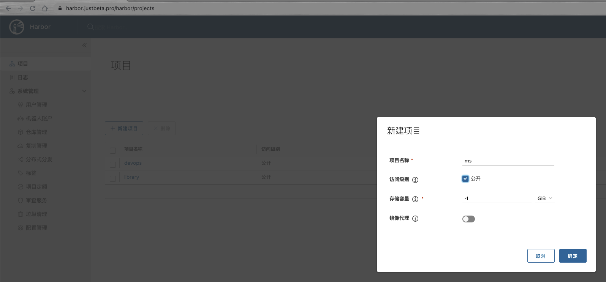
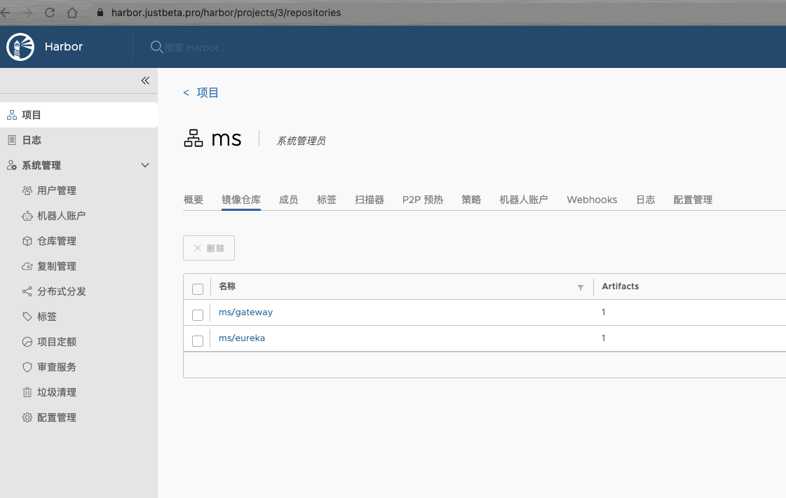

# 微服务部署

## k8s准备工作

```bash
kubectl create ns ms  # 创建一个名称空间
kubectl create secret docker-registry registry-pull-secret --docker-server=harbor服务器 --docker-username=用户名 --docker-password=密码 -n ms
```

# habor准备工作

在harbor上创建一个用来存放为服务镜像的项目



## 镜像制作

```bash
#上传基础进行解压
scp -P 22000    jave-8.tar.gz root@master:/root/microservic-test/eureka-service/target/
# 加载基础镜像
[root@master target]# ls
classes  eureka-service.jar  eureka-service.jar.original  generated-sources  jave-8.tar.gz  maven-archiver  maven-status
[root@master target]# docker load -i jave-8.tar.gz 
9f8566ee5135: Loading layer [==================================================>]  5.054MB/5.054MB
78075328e0da: Loading layer [==================================================>]  3.584kB/3.584kB
a1e7033f082e: Loading layer [==================================================>]    141MB/141MB
Loaded image: java:8-jdk-alpine


```

查看dockerfil

```bash
cd /root/microservic-test/eureka-service
vi  Dockerfile 
FROM java:8-jdk-alpine  # 基础镜像
RUN  apk add -U tzdata && \
     ln -sf /usr/share/zoneinfo/Asia/Shanghai /etc/localtime  # 时区修改为上海
COPY ./target/eureka-service.jar ./    # 把mvn打包好的jar包拉进来
EXPOSE 8888
CMD java -jar -Deureka.instance.hostname=${MY_POD_NAME}.eureka.ms /eureka-service.jar # 容器启动的时候要执行的命令，使用此命令来启动服务
```

构建镜像并上传harbor

```bash
[root@master eureka-service]# docker build  -t  harbor.justbeta.pro/ms/eureka:1.0  .
Sending build context to Docker daemon  193.3MB
Step 1/5 : FROM java:8-jdk-alpine
 ---> 3fd9dd82815c
Step 2/5 : RUN  apk add -U tzdata &&      ln -sf /usr/share/zoneinfo/Asia/Shanghai /etc/localtime
 ---> Running in 73d5109a2204
fetch http://dl-cdn.alpinelinux.org/alpine/v3.4/main/x86_64/APKINDEX.tar.gz
fetch http://dl-cdn.alpinelinux.org/alpine/v3.4/community/x86_64/APKINDEX.tar.gz
(1/1) Installing tzdata (2016d-r0)

Executing busybox-1.24.2-r13.trigger
OK: 144 MiB in 36 packages
Removing intermediate container 73d5109a2204
 ---> ce4b371c50f8
Step 3/5 : COPY ./target/eureka-service.jar ./
 ---> 545c91cf1aa3
Step 4/5 : EXPOSE 8888
 ---> Running in 549ad25914a1
Removing intermediate container 549ad25914a1
 ---> 17473955e74f
Step 5/5 : CMD java -jar -Deureka.instance.hostname=${MY_POD_NAME}.eureka.ms /eureka-service.jar
 ---> Running in a7875f3b8508
Removing intermediate container a7875f3b8508
 ---> 109a735f091b
Successfully built 109a735f091b
Successfully tagged harbor.justbeta.pro/ms/eureka:1.0
[root@master eureka-service]# docker push  harbor.justbeta.pro/ms/eureka:1.0
The push refers to repository [harbor.justbeta.pro/ms/eureka]
20a1fb839b15: Pushed 
91db4a229c92: Pushed 
a1e7033f082e: Pushed 
78075328e0da: Pushed 
9f8566ee5135: Pushed 
1.0: digest: sha256:a718e84869600876a4e6e6649857950ea6313c35f73d59b0ba1a64a933177e0c size: 1370
```

编辑eureka yaml文件

```yaml
---
apiVersion: networking.k8s.io/v1
kind: Ingress
metadata:
  name: eureka 
  namespace: ms 
  annotations:           #注解信息
    kubernetes.io/ingress.class: "nginx"
spec:
  rules:
    - host: eureka.justbeta.pro   # ingress 规则 
      http:
        paths:
        - path: /
          pathType:  Prefix
          backend:
            service:           # 后端服务
              name: eureka
              port:
                number: 8888
---
apiVersion: v1           # 服务资源
kind: Service
metadata:
  name: eureka
  namespace: ms
spec:
  clusterIP: None
  ports:
  - port: 8888
    name: eureka 
  selector:
    project: ms
    app: eureka

---

apiVersion: apps/v1     # 有状态服务
kind: StatefulSet
metadata:
  name: eureka
  namespace: ms 
spec:
  replicas: 3
  selector:
    matchLabels:         #标签选择器
      project: ms
      app: eureka
  service:
"eureka"
  template:
    metadata:
      labels:          # 模板中的标签
        project: ms 
        app: eureka
    spec:
      imagePullSecrets:
      - name: registry-pull-secret
      containers:
      - name: eureka
        image: harbor.justbeta.pro/ms/eureka:1.0
        imagePullPolicy: IfNotPresent   # 不存在就拉取
        ports:
          - protocol: TCP
            containerPort: 8888
        env:
          - name: MY_POD_NAME
            valueFrom:
              fieldRef:
                fieldPath: metadata.name
        resources:       #资源申请限制
          requests:      #最低需求资源
            cpu: 0.5
            memory: 256Mi
          limits:       #限制最高资源
            cpu: 1 
            memory: 1Gi
        readinessProbe:   # 服务可用性探测
          tcpSocket:
            port: 8888
          initialDelaySeconds: 60
          periodSeconds: 10
        livenessProbe:    # 存活性探测
          tcpSocket:
            port: 8888
          initialDelaySeconds: 60
          periodSeconds: 10

```

## 应用yaml文件

```bash
# luca @ luca in ~/Documents/文稿/k8s-ops/yml/chpt24_business on git:main x [15:34:53] C:1
$ k apply -f 9_eureka.yaml
ingress.networking.k8s.io/eureka created
service/eureka unchanged
statefulset.apps/eureka configured
# luca @ luca in ~/Documents/文稿/k8s-ops/yml/chpt24_business on git:main x [15:41:42] 
$ k get pods -n ms                  
NAME       READY   STATUS    RESTARTS   AGE
eureka-0   1/1     Running   0          13m
eureka-1   1/1     Running   0          12m
eureka-2   1/1     Running   0          11m
```

# 应用程序准备工作

## 制作gateway镜像

```bash
[root@master gateway-service]# docker build  -t  harbor.justbeta.pro/ms/gateway:1.0  .
Sending build context to Docker daemon  43.45MB
Step 1/5 : FROM java:8-jdk-alpine
 ---> 3fd9dd82815c
Step 2/5 : RUN  apk add -U tzdata &&      ln -sf /usr/share/zoneinfo/Asia/Shanghai /etc/localtime
 ---> Using cache
 ---> ce4b371c50f8
Step 3/5 : COPY ./target/gateway-service.jar ./
 ---> 6dd2740cd6db
Step 4/5 : EXPOSE 9999
 ---> Running in 039224c63c93
Removing intermediate container 039224c63c93
 ---> 214f32518415
Step 5/5 : CMD java -jar /gateway-service.jar
 ---> Running in 4a5302e38094
Removing intermediate container 4a5302e38094
 ---> 41226a01b7cd
Successfully built 41226a01b7cd
Successfully tagged harbor.justbeta.pro/ms/gateway:1.0
[root@master gateway-service]# docker push  harbor.justbeta.pro/ms/gateway:1.0
The push refers to repository [harbor.justbeta.pro/ms/gateway]
b15114959965: Pushed
91db4a229c92: Mounted from ms/eureka
a1e7033f082e: Mounted from ms/eureka
78075328e0da: Mounted from ms/eureka
9f8566ee5135: Mounted from ms/eureka
1.0: digest: sha256:70cfc3c12545097e14f41087ffc8f699056e9ae29637dceec881f9cdd598ce8a size: 1370
```



## 编写gateway yaml 文件

```yaml
# 创建对象签发证书
apiVersion: cert-manager.io/v1
kind: Certificate
metadata:
  name: justbeta-pro-certificate
  namespace: ms
spec:
  secretName: justbeta-pro-secret # 证书保存在这个 secret 中
  issuerRef:
    name: dnspod # 这里使用自动生成出来的 ClusterIssuer
    kind: ClusterIssuer
    group: cert-manager.io
  dnsNames: # 填入需要签发证书的域名列表，支持泛域名，确保域名是使用 dnspod 管理的
  - "*.justbeta.pro"
---
apiVersion: networking.k8s.io/v1
kind: Ingress
metadata:
  name: gateway 
  namespace: ms 
spec:
  tls:
  - hosts:
    -  gateway.justbeta.pro
    secretName: justbeta-pro-secret
  rules:
  - host: gateway.justbeta.pro
    http:
      paths:
      - path: /
        pathType:  Prefix
        backend:
         service:
           name: gateway
           port:
            number: 9999
---
apiVersion: v1
kind: Service
metadata:
  name: gateway
  namespace: ms
spec:
  ports:
  - port: 9999 
    name: gateway
  selector:
    project: ms
    app: gateway
---
apiVersion: apps/v1
kind: Deployment 
metadata:
  name: gateway
  namespace: ms 
spec:
  replicas: 1
  selector:
    matchLabels:
      project: ms
      app: gateway
  template:
    metadata:
      labels:
        project: ms 
        app: gateway
    spec:
      imagePullSecrets:
      - name: registry-pull-secret
      containers:
      - name: gateway
        image: harbor.justbeta.pro/ms/gateway:1.0
        imagePullPolicy: IfNotPresent 
        ports:
          - protocol: TCP
            containerPort: 9999 
        resources:
          requests:
            cpu: 0.2
            memory: 128Mi
          limits:
            cpu: 1
            memory: 1Gi
        readinessProbe:
          tcpSocket:
            port: 9999
          initialDelaySeconds: 60
          periodSeconds: 10
        livenessProbe:
          tcpSocket:
            port: 9999
          initialDelaySeconds: 60
          periodSeconds: 10

```

## 应用配置文件以及查看状态

```bash
$ k apply -f yml/chpt24_business/10_gateway.yaml 
ingress.networking.k8s.io/gateway created
service/gateway created
deployment.apps/gateway created
$ k get pods -n ms  -w                         
NAME                       READY   STATUS    RESTARTS   AGE
eureka-0                   1/1     Running   0          107m
eureka-1                   1/1     Running   0          109m
gateway-5b459fb668-pcmbp   0/1     Running   0          24s
gateway-5b459fb668-pcmbp   1/1     Running   0          70s
```

## 制作上传protal镜像

```bash
[root@master portal-service]# docker build  -t  harbor.justbeta.pro/ms/portal:1.0  .
Sending build context to Docker daemon  47.53MB
Step 1/5 : FROM java:8-jdk-alpine
 ---> 3fd9dd82815c
Step 2/5 : RUN  apk add -U tzdata &&      ln -sf /usr/share/zoneinfo/Asia/Shanghai /etc/localtime
 ---> Using cache
 ---> ce4b371c50f8
Step 3/5 : COPY ./target/portal-service.jar ./
 ---> 697471f5b08b
Step 4/5 : EXPOSE 8080
 ---> Running in 648630c8cc00
Removing intermediate container 648630c8cc00
 ---> 1d5d204a076d
Step 5/5 : CMD java -jar /portal-service.jar
 ---> Running in e72897a152fb
Removing intermediate container e72897a152fb
 ---> 62faaa6af2f1
Successfully built 62faaa6af2f1
Successfully tagged harbor.justbeta.pro/ms/portal:1.0
[root@master portal-service]# docker push  harbor.justbeta.pro/ms/portal:1.0
The push refers to repository [harbor.justbeta.pro/ms/portal]
4623b31392d6: Pushed
91db4a229c92: Mounted from ms/gateway
a1e7033f082e: Mounted from ms/gateway
78075328e0da: Mounted from ms/gateway
9f8566ee5135: Mounted from ms/gateway
1.0: digest: sha256:ff8d0859d9c0244e85814ddebe535a6b81b26ba24250503a771f119435de0975 size: 1370
```


## protal yaml 文件编写

```yaml
apiVersion: networking.k8s.io/v1
kind: Ingress
metadata:
  name: portal 
  namespace: ms 
spec:
  tls:
  - hosts:
    -  portal.justbeta.pro
    secretName: justbeta-pro-secret
  rules:
  - host: portal.justbeta.pro
    http:
      paths:
      - path: /
        pathType:  Prefix
        backend:
         service:
           name: portal
           port:
            number: 8080
---
apiVersion: v1
kind: Service
metadata:
  name: portal
  namespace: ms
spec:
  ports:
  - port: 8080
    name: portal 
  selector:
    project: ms
    app: portal
---
apiVersion: apps/v1
kind: Deployment 
metadata:
  name: portal
  namespace: ms 
spec:
  replicas: 1
  selector:
    matchLabels:
      project: ms
      app: portal
  template:
    metadata:
      labels:
        project: ms 
        app: portal
    spec:
      imagePullSecrets:
      - name: registry-pull-secret
      containers:
      - name: portal
        image: harbor.justbeta.pro/ms/portal:1.0
        imagePullPolicy: IfNotPresent 
        ports:
          - protocol: TCP
            containerPort: 8080 
        resources:
          limits:
            cpu: 0.2
            memory: 1Gi
        readinessProbe:
          tcpSocket:
            port: 8080
          initialDelaySeconds: 60
          periodSeconds: 10
        livenessProbe:
          tcpSocket:
            port: 8080
          initialDelaySeconds: 60
          periodSeconds: 10

```

## 应用并查看

```shell
# luca @ luca in ~/Documents/文稿/k8s-ops on git:main x [21:04:57] 
$ k apply -f yml/chpt24_business/11_portal.yaml 
ingress.networking.k8s.io/portal created
service/portal created
deployment.apps/portal created

# luca @ luca in ~/Documents/文稿/k8s-ops on git:main x [21:05:17] 
$ k get pods -n ms                             
NAME                       READY   STATUS              RESTARTS   AGE
eureka-0                   1/1     Running             0          141m
eureka-1                   1/1     Running             0          143m
gateway-5b459fb668-pcmbp   1/1     Running             0          34m
portal-788f5b8fc8-9pwh5    0/1     ContainerCreating   0          3s

# luca @ luca in ~/Documents/文稿/k8s-ops on git:main x [21:05:20] 
$ k get pods -n ms 
NAME                       READY   STATUS    RESTARTS   AGE
eureka-0                   1/1     Running   0          141m
eureka-1                   1/1     Running   0          143m
gateway-5b459fb668-pcmbp   1/1     Running   0          34m
portal-788f5b8fc8-9pwh5    0/1     Running   0          14s

```

