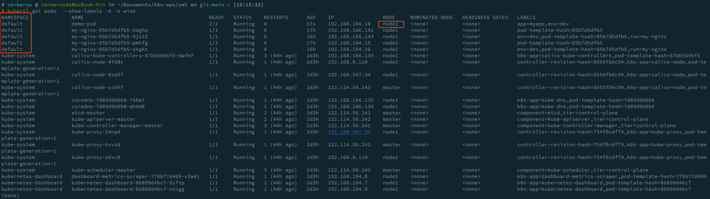
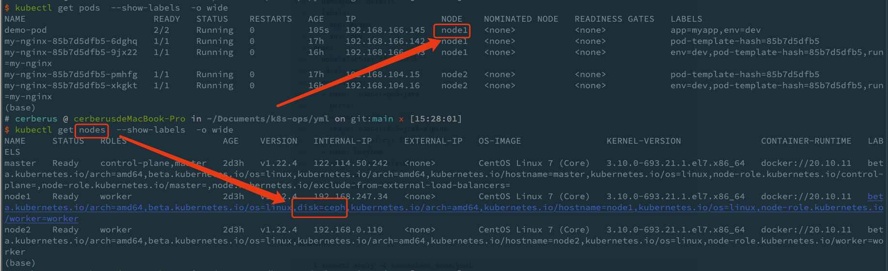
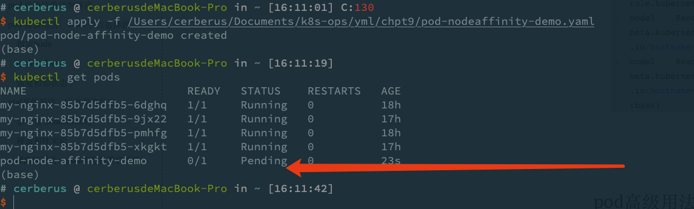
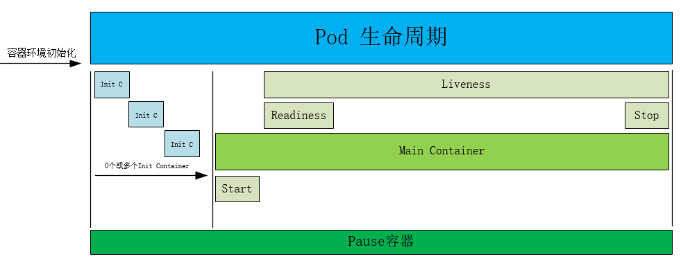
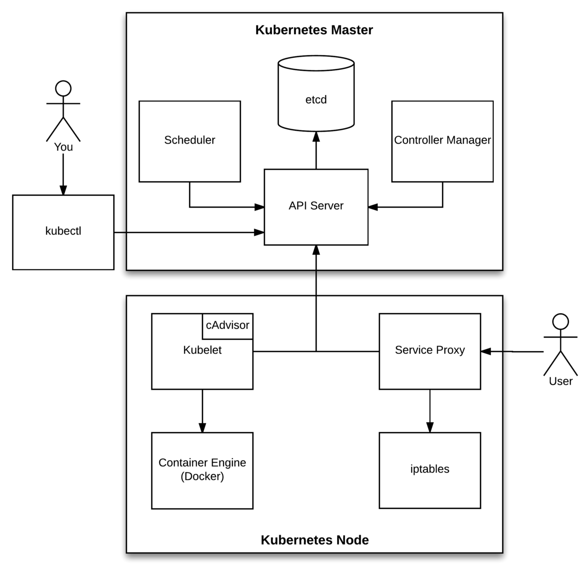

# label 标签使用技巧

在k8s上每一种资源都可以有标签。

现实使用中pod数量越来越多，我们期望能够进行分类管理，最简单和直接的效果就是把pod分成很多不同的小组。

无论对开发还是运维都能提高管理效率，况且我们的控制器、service资源需要标签来识别他们所管理域或 关联的资源。

**当我们给pod或者任何资源设定标签的时候，都可以使用标签查看，删除等对其执行相应的管理操作。**

简单来说标签就是附加在对应资源上的**键值对**，一个资源可以存在多个标签。

标签：

​	key:value (key value最多63个字符，key只能字符、数字、下划线组成。key只能以字母开头结尾，不能为空；value也是只能以字母数字开头和结尾，可以为空)

## *查看所有命名空间pod 的标签*

```bash
# cerberus @ cerberusdeMacBook-Pro in ~/Documents/k8s_gitlab/yml on git:main x [21:42:06]
$ kubectl get pods --show-labels -A
NAMESPACE              NAME                                         READY   STATUS              RESTARTS      AGE   LABELS
default                my-nginx-5b56ccd65f-6g82m                    1/1     Running             0             96s   pod-template-hash=5b56ccd65f,run=my-nginx
default                my-nginx-5b56ccd65f-rj2w7                    1/1     Running             0             96s   pod-template-hash=5b56ccd65f,run=my-nginx
default                my-nginx-85b7d5dfb5-6dghq                    0/1     ContainerCreating   0             14s   env=dev,pod-template-hash=85b7d5dfb5,run=my-nginx
kube-system            calico-kube-controllers-67bb5696f5-dwfmf     1/1     Running             3 (27h ago)   34h   k8s-app=calico-kube-controllers,pod-template-hash=67bb5696f5
kube-system            calico-node-4fd8c                            1/1     Running             1 (27h ago)   34h   controller-revision-hash=8556fb6c94,k8s-app=calico-node,pod-template-generation=1
kube-system            calico-node-8xp57                            1/1     Running             1 (27h ago)   34h   controller-revision-hash=8556fb6c94,k8s-app=calico-node,pod-template-generation=1
kube-system            calico-node-xs9hf                            1/1     Running             1 (27h ago)   34h   controller-revision-hash=8556fb6c94,k8s-app=calico-node,pod-template-generation=1
kube-system            coredns-7d89d9b6b8-766ml                     1/1     Running             1 (27h ago)   34h   k8s-app=kube-dns,pod-template-hash=7d89d9b6b8
kube-system            coredns-7d89d9b6b8-qh4d8                     1/1     Running             1 (27h ago)   34h   k8s-app=kube-dns,pod-template-hash=7d89d9b6b8
kube-system            etcd-master                                  1/1     Running             2 (27h ago)   34h   component=etcd,tier=control-plane
kube-system            kube-apiserver-master                        1/1     Running             2 (27h ago)   34h   component=kube-apiserver,tier=control-plane
kube-system            kube-controller-manager-master               1/1     Running             3 (27h ago)   34h   component=kube-controller-manager,tier=control-plane
kube-system            kube-proxy-24np4                             1/1     Running             1 (27h ago)   34h   controller-revision-hash=754f9cdf79,k8s-app=kube-proxy,pod-template-generation=1
kube-system            kube-proxy-hvvzd                             1/1     Running             1 (27h ago)   34h   controller-revision-hash=754f9cdf79,k8s-app=kube-proxy,pod-template-generation=1
kube-system            kube-proxy-z6vc8                             1/1     Running             1 (27h ago)   34h   controller-revision-hash=754f9cdf79,k8s-app=kube-proxy,pod-template-generation=1
kube-system            kube-scheduler-master                        1/1     Running             3 (27h ago)   34h   component=kube-scheduler,tier=control-plane
kubernetes-dashboard   dashboard-metrics-scraper-778b77d469-x2w4j   1/1     Running             1 (27h ago)   33h   k8s-app=dashboard-metrics-scraper,pod-template-hash=778b77d469
kubernetes-dashboard   kubernetes-dashboard-86899d4bc7-5xftp        1/1     Running             2 (27h ago)   33h   k8s-app=kubernetes-dashboard,pod-template-hash=86899d4bc7
kubernetes-dashboard   kubernetes-dashboard-86899d4bc7-stcgg        1/1     Running             1 (27h ago)   33h   k8s-app=kubernetes-dashboard,pod-template-hash=86899d4bc7
```

## *查看所有标签下拥有run这个标签的标签值* **不常用**

```bash
$   kubectl get pods -L run -A
NAMESPACE              NAME                                         READY   STATUS    RESTARTS      AGE     RUN
default                my-nginx-85b7d5dfb5-6dghq                    1/1     Running   0             9m20s   my-nginx
default                my-nginx-85b7d5dfb5-pmhfg                    1/1     Running   0             9m3s    my-nginx
kube-system            calico-kube-controllers-67bb5696f5-dwfmf     1/1     Running   3 (27h ago)   34h
kube-system            calico-node-4fd8c                            1/1     Running   1 (27h ago)   34h
kube-system            calico-node-8xp57                            1/1     Running   1 (27h ago)   34h
kube-system            calico-node-xs9hf                            1/1     Running   1 (27h ago)   34h
kube-system            coredns-7d89d9b6b8-766ml                     1/1     Running   1 (27h ago)   34h
kube-system            coredns-7d89d9b6b8-qh4d8                     1/1     Running   1 (27h ago)   34h
kube-system            etcd-master                                  1/1     Running   2 (27h ago)   34h
kube-system            kube-apiserver-master                        1/1     Running   2 (27h ago)   34h
kube-system            kube-controller-manager-master               1/1     Running   3 (27h ago)   34h
kube-system            kube-proxy-24np4                             1/1     Running   1 (27h ago)   34h
kube-system            kube-proxy-hvvzd                             1/1     Running   1 (27h ago)   34h
kube-system            kube-proxy-z6vc8                             1/1     Running   1 (27h ago)   34h
kube-system            kube-scheduler-master                        1/1     Running   3 (27h ago)   34h
kubernetes-dashboard   dashboard-metrics-scraper-778b77d469-x2w4j   1/1     Running   1 (27h ago)   33h
kubernetes-dashboard   kubernetes-dashboard-86899d4bc7-5xftp        1/1     Running   2 (27h ago)   33h
kubernetes-dashboard   kubernetes-dashboard-86899d4bc7-stcgg        1/1     Running   1 (27h ago)   33h
```

## *查看具有run标签的资源对象*

```bash
# cerberus @ cerberusdeMacBook-Pro in ~/Documents/k8s_gitlab/yml on git:main x [21:45:29] C:1
$ kubectl get pods -l run -A
NAMESPACE   NAME                        READY   STATUS    RESTARTS   AGE
default     my-nginx-85b7d5dfb5-6dghq   1/1     Running   0          3m29s
default     my-nginx-85b7d5dfb5-pmhfg   1/1     Running   0          3m12s
```

## *查看所有具有k8s标签的资源并且打印相关标签*

```bash
# cerberus @ cerberusdeMacBook-Pro in ~/Documents/k8s_gitlab/yml on git:main x [21:56:49]
$ kubectl get pods -l k8s-app -A  --show-labels
NAMESPACE              NAME                                         READY   STATUS    RESTARTS      AGE   LABELS
kube-system            calico-kube-controllers-67bb5696f5-dwfmf     1/1     Running   3 (27h ago)   34h   k8s-app=calico-kube-controllers,pod-template-hash=67bb5696f5
kube-system            calico-node-4fd8c                            1/1     Running   1 (27h ago)   34h   controller-revision-hash=8556fb6c94,k8s-app=calico-node,pod-template-generation=1
kube-system            calico-node-8xp57                            1/1     Running   1 (27h ago)   34h   controller-revision-hash=8556fb6c94,k8s-app=calico-node,pod-template-generation=1
kube-system            calico-node-xs9hf                            1/1     Running   1 (27h ago)   34h   controller-revision-hash=8556fb6c94,k8s-app=calico-node,pod-template-generation=1
kube-system            coredns-7d89d9b6b8-766ml                     1/1     Running   1 (27h ago)   34h   k8s-app=kube-dns,pod-template-hash=7d89d9b6b8
kube-system            coredns-7d89d9b6b8-qh4d8                     1/1     Running   1 (27h ago)   34h   k8s-app=kube-dns,pod-template-hash=7d89d9b6b8
kube-system            kube-proxy-24np4                             1/1     Running   1 (27h ago)   34h   controller-revision-hash=754f9cdf79,k8s-app=kube-proxy,pod-template-generation=1
kube-system            kube-proxy-hvvzd                             1/1     Running   1 (27h ago)   34h   controller-revision-hash=754f9cdf79,k8s-app=kube-proxy,pod-template-generation=1
kube-system            kube-proxy-z6vc8                             1/1     Running   1 (27h ago)   34h   controller-revision-hash=754f9cdf79,k8s-app=kube-proxy,pod-template-generation=1
kubernetes-dashboard   dashboard-metrics-scraper-778b77d469-x2w4j   1/1     Running   1 (27h ago)   33h   k8s-app=dashboard-metrics-scraper,pod-template-hash=778b77d469
kubernetes-dashboard   kubernetes-dashboard-86899d4bc7-5xftp        1/1     Running   2 (27h ago)   33h   k8s-app=kubernetes-dashboard,pod-template-hash=86899d4bc7
kubernetes-dashboard   kubernetes-dashboard-86899d4bc7-stcgg        1/1     Running   1 (27h ago)   33h   k8s-app=kubernetes-dashboard,pod-template-hash=86899d4bc7
```


## *给运行的pod打标签:* 

给所有run 标签的pod 打上k8sapp=nginx的标签 强制更改可以使用--overwrite

```bash
$ kubectl get pods -l run -A  --show-labels
NAMESPACE   NAME                        READY   STATUS    RESTARTS   AGE   LABELS
default     my-nginx-85b7d5dfb5-6dghq   1/1     Running   0          19m   env=dev,pod-template-hash=85b7d5dfb5,run=my-nginx
default     my-nginx-85b7d5dfb5-pmhfg   1/1     Running   0          18m   env=dev,pod-template-hash=85b7d5dfb5,run=my-nginx
(base)
# cerberus @ cerberusdeMacBook-Pro in ~/Documents/k8s_gitlab/yml on git:main x [22:01:06]
$ kubectl label pod  my-nginx-85b7d5dfb5-6dghq  k8s-app=nginx 
pod/my-nginx-85b7d5dfb5-6dghq labeled
(base)
$ kubectl label pod  my-nginx-85b7d5dfb5-pmhfg  k8s-app=abc

# cerberus @ cerberusdeMacBook-Pro in ~/Documents/k8s_gitlab/yml on git:main x [22:09:31]
$ kubectl label pod  my-nginx-85b7d5dfb5-pmhfg  k8s-app=nginx
error: 'k8s-app' already has a value (abc), and --overwrite is false
(base)
# cerberus @ cerberusdeMacBook-Pro in ~/Documents/k8s_gitlab/yml on git:main x [22:09:41] C:1
$ kubectl label pod  my-nginx-85b7d5dfb5-pmhfg  k8s-app=nginx --overwrite
pod/my-nginx-85b7d5dfb5-pmhfg labeled
(base)
# cerberus @ cerberusdeMacBook-Pro in ~/Documents/k8s_gitlab/yml on git:main x [22:02:56]
$ kubectl get pods -l k8s-app -A  --show-labels
NAMESPACE              NAME                                         READY   STATUS    RESTARTS      AGE   LABELS
default                my-nginx-85b7d5dfb5-6dghq                    1/1     Running   0             20m   env=dev,k8s-app=nginx,pod-template-hash=85b7d5dfb5,run=my-nginx
default                my-nginx-85b7d5dfb5-pmhfg                    1/1     Running   0             20m   env=dev,k8s-app=nginx,pod-template-hash=85b7d5dfb5,run=my-nginx
kube-system            calico-kube-controllers-67bb5696f5-dwfmf     1/1     Running   3 (27h ago)   34h   k8s-app=calico-kube-controllers,pod-template-hash=67bb5696f5
kube-system            calico-node-4fd8c                            1/1     Running   1 (27h ago)   34h   controller-revision-hash=8556fb6c94,k8s-app=calico-node,pod-template-generation=1
kube-system            calico-node-8xp57                            1/1     Running   1 (27h ago)   34h   controller-revision-hash=8556fb6c94,k8s-app=calico-node,pod-template-generation=1
kube-system            calico-node-xs9hf                            1/1     Running   1 (27h ago)   34h   controller-revision-hash=8556fb6c94,k8s-app=calico-node,pod-template-generation=1
kube-system            coredns-7d89d9b6b8-766ml                     1/1     Running   1 (27h ago)   34h   k8s-app=kube-dns,pod-template-hash=7d89d9b6b8
kube-system            coredns-7d89d9b6b8-qh4d8                     1/1     Running   1 (27h ago)   34h   k8s-app=kube-dns,pod-template-hash=7d89d9b6b8
kube-system            kube-proxy-24np4                             1/1     Running   1 (27h ago)   34h   controller-revision-hash=754f9cdf79,k8s-app=kube-proxy,pod-template-generation=1
kube-system            kube-proxy-hvvzd                             1/1     Running   1 (27h ago)   34h   controller-revision-hash=754f9cdf79,k8s-app=kube-proxy,pod-template-generation=1
kube-system            kube-proxy-z6vc8                             1/1     Running   1 (27h ago)   34h   controller-revision-hash=754f9cdf79,k8s-app=kube-proxy,pod-template-generation=1
kubernetes-dashboard   dashboard-metrics-scraper-778b77d469-x2w4j   1/1     Running   1 (27h ago)   33h   k8s-app=dashboard-metrics-scraper,pod-template-hash=778b77d469
kubernetes-dashboard   kubernetes-dashboard-86899d4bc7-5xftp        1/1     Running   2 (27h ago)   33h   k8s-app=kubernetes-dashboard,pod-template-hash=86899d4bc7
kubernetes-dashboard   kubernetes-dashboard-86899d4bc7-stcgg        1/1     Running   1 (27h ago)   33h   k8s-app=kubernetes-dashboard,pod-template-hash=86899d4bc7
```

## *查看所有命名空间下既有k8s-app 又有run的 标签*

```bash
# cerberus @ cerberusdeMacBook-Pro in ~/Documents/k8s_gitlab/yml on git:main x [22:03:02]
$ kubectl get pods -l k8s-app,run -A  --show-labels
NAMESPACE   NAME                        READY   STATUS    RESTARTS   AGE   LABELS
default     my-nginx-85b7d5dfb5-6dghq   1/1     Running   0          25m   env=dev,k8s-app=nginx,pod-template-hash=85b7d5dfb5,run=my-nginx
default     my-nginx-85b7d5dfb5-pmhfg   1/1     Running   0          25m   env=dev,k8s-app=nginx,pod-template-hash=85b7d5dfb5,run=my-nginx
```

## *给node节点打标签*

查看node节点的标签

```bash
# cerberus @ cerberusdeMacBook-Pro in ~/Documents/k8s_gitlab/yml on git:main x [22:12:51]
$ kubectl get nodes --show-labels
NAME     STATUS   ROLES                  AGE   VERSION   LABELS
master   Ready    control-plane,master   34h   v1.22.4   beta.kubernetes.io/arch=amd64,beta.kubernetes.io/os=linux,kubernetes.io/arch=amd64,kubernetes.io/hostname=master,kubernetes.io/os=linux,node-role.kubernetes.io/control-plane=,node-role.kubernetes.io/master=,node.kubernetes.io/exclude-from-external-load-balancers=
node1    Ready    worker                 34h   v1.22.4   beta.kubernetes.io/arch=amd64,beta.kubernetes.io/os=linux,kubernetes.io/arch=amd64,kubernetes.io/hostname=node1,kubernetes.io/os=linux,node-role.kubernetes.io/worker=worker
node2    Ready    worker                 34h   v1.22.4   beta.kubernetes.io/arch=amd64,beta.kubernetes.io/os=linux,kubernetes.io/arch=amd64,kubernetes.io/hostname=node2,kubernetes.io/os=linux,node-role.kubernetes.io/worker=worker
(base)
```

打标签

```bash
# cerberus @ cerberusdeMacBook-Pro in ~/Documents/k8s_gitlab/yml on git:main x [22:12:51]
$ kubectl get nodes --show-labels
NAME     STATUS   ROLES                  AGE   VERSION   LABELS
master   Ready    control-plane,master   34h   v1.22.4   beta.kubernetes.io/arch=amd64,beta.kubernetes.io/os=linux,kubernetes.io/arch=amd64,kubernetes.io/hostname=master,kubernetes.io/os=linux,node-role.kubernetes.io/control-plane=,node-role.kubernetes.io/master=,node.kubernetes.io/exclude-from-external-load-balancers=
node1    Ready    worker                 34h   v1.22.4   beta.kubernetes.io/arch=amd64,beta.kubernetes.io/os=linux,kubernetes.io/arch=amd64,kubernetes.io/hostname=node1,kubernetes.io/os=linux,node-role.kubernetes.io/worker=worker
node2    Ready    worker                 34h   v1.22.4   beta.kubernetes.io/arch=amd64,beta.kubernetes.io/os=linux,kubernetes.io/arch=amd64,kubernetes.io/hostname=node2,kubernetes.io/os=linux,node-role.kubernetes.io/worker=worker
(base)
# cerberus @ cerberusdeMacBook-Pro in ~/Documents/k8s_gitlab/yml on git:main x [22:13:24]
$ kubectl label nodes node1 useful=1
node/node1 labeled
(base)
# cerberus @ cerberusdeMacBook-Pro in ~/Documents/k8s_gitlab/yml on git:main x [22:16:15]
$ kubectl get nodes --show-labels
NAME     STATUS   ROLES                  AGE   VERSION   LABELS
master   Ready    control-plane,master   34h   v1.22.4   beta.kubernetes.io/arch=amd64,beta.kubernetes.io/os=linux,kubernetes.io/arch=amd64,kubernetes.io/hostname=master,kubernetes.io/os=linux,node-role.kubernetes.io/control-plane=,node-role.kubernetes.io/master=,node.kubernetes.io/exclude-from-external-load-balancers=
node1    Ready    worker                 34h   v1.22.4   beta.kubernetes.io/arch=amd64,beta.kubernetes.io/os=linux,kubernetes.io/arch=amd64,kubernetes.io/hostname=node1,kubernetes.io/os=linux,node-role.kubernetes.io/worker=worker,useful=1
node2    Ready    worker                 34h   v1.22.4   beta.kubernetes.io/arch=amd64,beta.kubernetes.io/os=linux,kubernetes.io/arch=amd64,kubernetes.io/hostname=node2,kubernetes.io/os=linux,node-role.kubernetes.io/worker=worker
(base)
```

## 删除标签 

kubectl label node  [节点名]  [键值对中的键]+[-]

```bash
$ kubectl get nodes -l useful --show-labels
NAME    STATUS   ROLES    AGE   VERSION   LABELS
node1   Ready    worker   34h   v1.22.4   beta.kubernetes.io/arch=amd64,beta.kubernetes.io/os=linux,kubernetes.io/arch=amd64,kubernetes.io/hostname=node1,kubernetes.io/os=linux,node-role.kubernetes.io/worker=worker,useful=1
(base)
# cerberus @ cerberusdeMacBook-Pro in ~/Documents/k8s_gitlab/yml on git:main x [22:25:23]
$ kubectl label nodes node1 useful-
node/node1 labeled
(base)
# cerberus @ cerberusdeMacBook-Pro in ~/Documents/k8s_gitlab/yml on git:main x [22:25:43]
$ kubectl get nodes -l useful --show-labels
No resources found
```

pod 同理

```bash
# cerberus @ cerberusdeMacBook-Pro in ~/Documents/k8s_gitlab/yml on git:main x [22:27:01] C:1
$ kubectl get pods  --show-labels -A
NAMESPACE              NAME                                         READY   STATUS    RESTARTS      AGE   LABELS
default                my-nginx-85b7d5dfb5-6dghq                    1/1     Running   0             45m   env=dev,k8s-app=nginx,pod-template-hash=85b7d5dfb5,run=my-nginx
default                my-nginx-85b7d5dfb5-pmhfg                    1/1     Running   0             44m   env=dev,k8s-app=nginx,pod-template-hash=85b7d5dfb5,run=my-nginx
kube-system            calico-kube-controllers-67bb5696f5-dwfmf     1/1     Running   3 (27h ago)   34h   k8s-app=calico-kube-controllers,pod-template-hash=67bb5696f5
kube-system            calico-node-4fd8c                            1/1     Running   1 (27h ago)   34h   controller-revision-hash=8556fb6c94,k8s-app=calico-node,pod-template-generation=1
kube-system            calico-node-8xp57                            1/1     Running   1 (27h ago)   34h   controller-revision-hash=8556fb6c94,k8s-app=calico-node,pod-template-generation=1
kube-system            calico-node-xs9hf                            1/1     Running   1 (27h ago)   34h   controller-revision-hash=8556fb6c94,k8s-app=calico-node,pod-template-generation=1
kube-system            coredns-7d89d9b6b8-766ml                     1/1     Running   1 (27h ago)   34h   k8s-app=kube-dns,pod-template-hash=7d89d9b6b8
kube-system            coredns-7d89d9b6b8-qh4d8                     1/1     Running   1 (27h ago)   34h   k8s-app=kube-dns,pod-template-hash=7d89d9b6b8
kube-system            etcd-master                                  1/1     Running   2 (27h ago)   34h   component=etcd,tier=control-plane
kube-system            kube-apiserver-master                        1/1     Running   2 (27h ago)   34h   component=kube-apiserver,tier=control-plane
kube-system            kube-controller-manager-master               1/1     Running   3 (27h ago)   34h   component=kube-controller-manager,tier=control-plane
kube-system            kube-proxy-24np4                             1/1     Running   1 (27h ago)   34h   controller-revision-hash=754f9cdf79,k8s-app=kube-proxy,pod-template-generation=1
kube-system            kube-proxy-hvvzd                             1/1     Running   1 (27h ago)   34h   controller-revision-hash=754f9cdf79,k8s-app=kube-proxy,pod-template-generation=1
kube-system            kube-proxy-z6vc8                             1/1     Running   1 (27h ago)   34h   controller-revision-hash=754f9cdf79,k8s-app=kube-proxy,pod-template-generation=1
kube-system            kube-scheduler-master                        1/1     Running   3 (27h ago)   34h   component=kube-scheduler,tier=control-plane
kubernetes-dashboard   dashboard-metrics-scraper-778b77d469-x2w4j   1/1     Running   1 (27h ago)   34h   k8s-app=dashboard-metrics-scraper,pod-template-hash=778b77d469
kubernetes-dashboard   kubernetes-dashboard-86899d4bc7-5xftp        1/1     Running   2 (27h ago)   34h   k8s-app=kubernetes-dashboard,pod-template-hash=86899d4bc7
kubernetes-dashboard   kubernetes-dashboard-86899d4bc7-stcgg        1/1     Running   1 (27h ago)   34h   k8s-app=kubernetes-dashboard,pod-template-hash=86899d4bc7
(base)
# cerberus @ cerberusdeMacBook-Pro in ~/Documents/k8s_gitlab/yml on git:main x [22:27:04]
$ kubectl label pod  my-nginx-85b7d5dfb5-pmhfg  k8s-app-
pod/my-nginx-85b7d5dfb5-pmhfg labeled
(base)
# cerberus @ cerberusdeMacBook-Pro in ~/Documents/k8s_gitlab/yml on git:main x [22:27:38]
$ kubectl label pod  my-nginx-85b7d5dfb5-6dghq  k8s-app- env-
pod/my-nginx-85b7d5dfb5-6dghq labeled
(base)
# cerberus @ cerberusdeMacBook-Pro in ~/Documents/k8s_gitlab/yml on git:main x [22:28:09]
$ kubectl label pod  my-nginx-85b7d5dfb5-pmhfg  k8s-app- env-
label "k8s-app" not found.
pod/my-nginx-85b7d5dfb5-pmhfg labeled
(base)
# cerberus @ cerberusdeMacBook-Pro in ~/Documents/k8s_gitlab/yml on git:main x [22:28:28]
$ kubectl get pods  --show-labels -A
NAMESPACE              NAME                                         READY   STATUS    RESTARTS      AGE   LABELS
default                my-nginx-85b7d5dfb5-6dghq                    1/1     Running   0             46m   pod-template-hash=85b7d5dfb5,run=my-nginx
default                my-nginx-85b7d5dfb5-pmhfg                    1/1     Running   0             46m   pod-template-hash=85b7d5dfb5,run=my-nginx
kube-system            calico-kube-controllers-67bb5696f5-dwfmf     1/1     Running   3 (27h ago)   34h   k8s-app=calico-kube-controllers,pod-template-hash=67bb5696f5
kube-system            calico-node-4fd8c                            1/1     Running   1 (27h ago)   34h   controller-revision-hash=8556fb6c94,k8s-app=calico-node,pod-template-generation=1
kube-system            calico-node-8xp57                            1/1     Running   1 (27h ago)   34h   controller-revision-hash=8556fb6c94,k8s-app=calico-node,pod-template-generation=1
kube-system            calico-node-xs9hf                            1/1     Running   1 (27h ago)   34h   controller-revision-hash=8556fb6c94,k8s-app=calico-node,pod-template-generation=1
kube-system            coredns-7d89d9b6b8-766ml                     1/1     Running   1 (27h ago)   34h   k8s-app=kube-dns,pod-template-hash=7d89d9b6b8
kube-system            coredns-7d89d9b6b8-qh4d8                     1/1     Running   1 (27h ago)   34h   k8s-app=kube-dns,pod-template-hash=7d89d9b6b8
kube-system            etcd-master                                  1/1     Running   2 (27h ago)   34h   component=etcd,tier=control-plane
kube-system            kube-apiserver-master                        1/1     Running   2 (27h ago)   34h   component=kube-apiserver,tier=control-plane
kube-system            kube-controller-manager-master               1/1     Running   3 (27h ago)   34h   component=kube-controller-manager,tier=control-plane
kube-system            kube-proxy-24np4                             1/1     Running   1 (27h ago)   34h   controller-revision-hash=754f9cdf79,k8s-app=kube-proxy,pod-template-generation=1
kube-system            kube-proxy-hvvzd                             1/1     Running   1 (27h ago)   34h   controller-revision-hash=754f9cdf79,k8s-app=kube-proxy,pod-template-generation=1
kube-system            kube-proxy-z6vc8                             1/1     Running   1 (27h ago)   34h   controller-revision-hash=754f9cdf79,k8s-app=kube-proxy,pod-template-generation=1
kube-system            kube-scheduler-master                        1/1     Running   3 (27h ago)   34h   component=kube-scheduler,tier=control-plane
kubernetes-dashboard   dashboard-metrics-scraper-778b77d469-x2w4j   1/1     Running   1 (27h ago)   34h   k8s-app=dashboard-metrics-scraper,pod-template-hash=778b77d469
kubernetes-dashboard   kubernetes-dashboard-86899d4bc7-5xftp        1/1     Running   2 (27h ago)   34h   k8s-app=kubernetes-dashboard,pod-template-hash=86899d4bc7
kubernetes-dashboard   kubernetes-dashboard-86899d4bc7-stcgg        1/1     Running   1 (27h ago)   34h   k8s-app=kubernetes-dashboard,pod-template-hash=86899d4bc7
```


# 名称空间

namespace 是k8s集群基本的资源，可以给不同的用户、租户、环境、项目创建对应的命名空间。例如可以给development、qa、productioin应用环境分别创建自己的命名空间。

其他集群级别的资源node、pod、pv。他们不属于任何命名空间，因此同类资源名称必须唯一。

k8s默认提供了几个namespace 用于特定的目的。例如 kube-system主要用于运行系统级资源，而default 是为那些没有制定namespace的资源操作而提供的一个默认空间。

## 查看命名空间

```bash
$ kubectl get namespaces  或 kubectl get ns
NAME                   STATUS   AGE
default                Active   2d1h
kube-node-lease        Active   2d1h
kube-public            Active   2d1h
kube-system            Active   2d1h
kubernetes-dashboard   Active   2d1h
```

前四个是默认的命名空间。

查看ns 描述

```bash
$ kubectl describe ns default
Name:         default
Labels:       kubernetes.io/metadata.name=default
Annotations:  <none>
Status:       Active

No resource quota.

No LimitRange resource.
```

## 管理ns资源

创建ns

```bash
# cerberus @ cerberusdeMacBook-Pro in ~ [13:35:19]
$ kubectl create ns shaw
namespace/shaw created
(base)
```

准备实验数据

```bash
$ cat pod_ns_shaw.yaml
apiVersion: v1
kind: Pod
metadata:
  name: tomcat-pod
  namespace: shaw
  labels:
    tomcat:  tomcat-pod
spec:
  containers:
  - name:  tomcat-pod-java
    ports:
    - containerPort: 8080
    image: tomcat:8.5-jre8-alpine
    imagePullPolicy: IfNotPresent
  - name:  nginx
    ports:
    - containerPort: 80
    image: nginx
    imagePullPolicy: IfNotPresent  #本地有就用本地，如果没有就拉取官方镜像
    
$ kubectl apply -f pod_ns_shaw.yaml
pod/tomcat-pod unchanged
(base)
$ kubectl get pods  --show-labels -A
NAMESPACE              NAME                                         READY   STATUS    RESTARTS      AGE    LABELS
default                my-nginx-85b7d5dfb5-6dghq                    1/1     Running   0             16h    pod-template-hash=85b7d5dfb5
default                my-nginx-85b7d5dfb5-9jx22                    1/1     Running   0             15h    env=dev,pod-template-hash=85b7d5dfb5,run=my-nginx
default                my-nginx-85b7d5dfb5-pmhfg                    1/1     Running   0             16h    pod-template-hash=85b7d5dfb5
default                my-nginx-85b7d5dfb5-xkgkt                    1/1     Running   0             15h    env=dev,pod-template-hash=85b7d5dfb5,run=my-nginx
kube-system            calico-kube-controllers-67bb5696f5-dwfmf     1/1     Running   3 (43h ago)   2d2h   k8s-app=calico-kube-controllers,pod-template-hash=67bb5696f5
kube-system            calico-node-4fd8c                            1/1     Running   1 (43h ago)   2d2h   controller-revision-hash=8556fb6c94,k8s-app=calico-node,pod-template-generation=1
kube-system            calico-node-8xp57                            1/1     Running   1 (43h ago)   2d2h   controller-revision-hash=8556fb6c94,k8s-app=calico-node,pod-template-generation=1
kube-system            calico-node-xs9hf                            1/1     Running   1 (43h ago)   2d2h   controller-revision-hash=8556fb6c94,k8s-app=calico-node,pod-template-generation=1
kube-system            coredns-7d89d9b6b8-766ml                     1/1     Running   1 (43h ago)   2d2h   k8s-app=kube-dns,pod-template-hash=7d89d9b6b8
kube-system            coredns-7d89d9b6b8-qh4d8                     1/1     Running   1 (43h ago)   2d2h   k8s-app=kube-dns,pod-template-hash=7d89d9b6b8
kube-system            etcd-master                                  1/1     Running   2 (43h ago)   2d2h   component=etcd,tier=control-plane
kube-system            kube-apiserver-master                        1/1     Running   2 (43h ago)   2d2h   component=kube-apiserver,tier=control-plane
kube-system            kube-controller-manager-master               1/1     Running   3 (43h ago)   2d2h   component=kube-controller-manager,tier=control-plane
kube-system            kube-proxy-24np4                             1/1     Running   1 (43h ago)   2d2h   controller-revision-hash=754f9cdf79,k8s-app=kube-proxy,pod-template-generation=1
kube-system            kube-proxy-hvvzd                             1/1     Running   1 (43h ago)   2d2h   controller-revision-hash=754f9cdf79,k8s-app=kube-proxy,pod-template-generation=1
kube-system            kube-proxy-z6vc8                             1/1     Running   1 (43h ago)   2d2h   controller-revision-hash=754f9cdf79,k8s-app=kube-proxy,pod-template-generation=1
kube-system            kube-scheduler-master                        1/1     Running   3 (43h ago)   2d2h   component=kube-scheduler,tier=control-plane
kubernetes-dashboard   dashboard-metrics-scraper-778b77d469-x2w4j   1/1     Running   1 (43h ago)   2d1h   k8s-app=dashboard-metrics-scraper,pod-template-hash=778b77d469
kubernetes-dashboard   kubernetes-dashboard-86899d4bc7-5xftp        1/1     Running   2 (43h ago)   2d1h   k8s-app=kubernetes-dashboard,pod-template-hash=86899d4bc7
kubernetes-dashboard   kubernetes-dashboard-86899d4bc7-stcgg        1/1     Running   1 (43h ago)   2d1h   k8s-app=kubernetes-dashboard,pod-template-hash=86899d4bc7
shaw                   tomcat-pod                                   2/2     Running   0             88s    tomcat=tomcat-pod
```


## 删除资源

```bash
$ kubectl delete all -n shaw
# 删除ns为shaw下的所有资源
```


# pod 资源清单详细解读

 ```yaml
apiVersion: v1  #版本号
kind: Pod  # 资源类型
metadata:  #元数据
  annotations: #注释
    cni.projectcalico.org/podIP: 192.168.166.142/32
    cni.projectcalico.org/podIPs: 192.168.166.142/32
  creationTimestamp: "2021-12-08T13:42:03Z"
  generateName: my-nginx-85b7d5dfb5-  #名字
  labels:  # 标签
    pod-template-hash: 85b7d5dfb5  #标签1
  name: my-nginx-85b7d5dfb5-6dghq  #标签2
  namespace: default  # 命名空间
  resourceVersion: "177224" # 资源版本号
  uid: da61f2f5-f833-4636-aad2-b1be5b39fb8e
spec: #pod容器总的详细定义
  containers: # 容器列表
  - image: nginx  # 容器镜像
    imagePullPolicy: Always  # 容器拉取策略 [Always | Never | IfNotPresent] Alawys 表示下载镜像 IfnotPresent 表示优先使用本地镜像，否则下载镜像，Nerver 表示仅使用本地镜像
    name: my-nginx  # 容器名字 
    ports:  # 暴露的端口
    - containerPort: 80  
      protocol: TCP  #协议，tcp/udp都支持默认tcp
    resources: {}
    terminationMessagePath: /dev/termination-log
    terminationMessagePolicy: File
    volumeMounts:
    - mountPath: /var/run/secrets/kubernetes.io/serviceaccount  # 挂载到容器内部的存储卷配置
      name: kube-api-access-8kxxh   # 引用pod定义的共享存储卷的名称,要和volumes定义的一致
      readOnly: true  # 是否为只读模式
  dnsPolicy: ClusterFirst  # dns 策略
  enableServiceLinks: true  #是否允许服务链接
  nodeName: node1   #运行容器的节点
  preemptionPolicy: PreemptLowerPriority 
  priority: 0
  restartPolicy: Always  # 重启策略
  schedulerName: default-scheduler 
  securityContext: {}
  serviceAccount: default
  serviceAccountName: default
  terminationGracePeriodSeconds: 30
  tolerations:
  - effect: NoExecute
    key: node.kubernetes.io/not-ready
    operator: Exists
    tolerationSeconds: 300
  - effect: NoExecute
    key: node.kubernetes.io/unreachable
    operator: Exists
    tolerationSeconds: 300
  volumes:
  - name: kube-api-access-8kxxh
    projected:
      defaultMode: 420
      sources:
      - serviceAccountToken:
          expirationSeconds: 3607
          path: token
      - configMap:
          items:
          - key: ca.crt
            path: ca.crt
          name: kube-root-ca.crt
      - downwardAPI:
          items:
          - fieldRef:
              apiVersion: v1
              fieldPath: metadata.namespace
            path: namespace
status:
  conditions:
  - lastProbeTime: null
    lastTransitionTime: "2021-12-08T13:42:03Z"
    status: "True"
    type: Initialized
  - lastProbeTime: null
    lastTransitionTime: "2021-12-08T13:42:20Z"
    status: "True"
    type: Ready
  - lastProbeTime: null
    lastTransitionTime: "2021-12-08T13:42:20Z"
    status: "True"
    type: ContainersReady
  - lastProbeTime: null
    lastTransitionTime: "2021-12-08T13:42:03Z"
    status: "True"
    type: PodScheduled
  containerStatuses:
  - containerID: docker://6095d9710be9ad00aa9a481a770da3ae1d43236bd5ebd8a1a5085c814e1e1a2c
    image: nginx:latest
    imageID: docker-pullable://nginx@sha256:9522864dd661dcadfd9958f9e0de192a1fdda2c162a35668ab6ac42b465f0603
    lastState: {}
    name: my-nginx
    ready: true
    restartCount: 0
    started: true
    state:
      running:
        startedAt: "2021-12-08T13:42:20Z"
  hostIP: 192.168.247.34
  phase: Running
  podIP: 192.168.166.142
  podIPs:
  - ip: 192.168.166.142
  qosClass: BestEffort
  startTime: "2021-12-08T13:42:03Z"
 ```


# pod 高级用法： node节点选择器

## 指定node

```bash
[root@node1 ~]# docker load -i /opt/tomcat.tar.gz  
Loaded image: tomcat:8.5-jre8-alpine
[root@node1 ~]# docker images
REPOSITORY                                                       TAG               IMAGE ID       CREATED        SIZE
nginx                                                            latest            f652ca386ed1   6 days ago     141MB
registry.aliyuncs.com/google_containers/kube-proxy               v1.22.4           edeff87e4802   3 weeks ago    104MB
registry.cn-hangzhou.aliyuncs.com/google_containers/kube-proxy   v1.22.4           edeff87e4802   3 weeks ago    104MB
registry.aliyuncs.com/google_containers/coredns                  v1.8.4            8d147537fb7d   6 months ago   47.6MB
registry.cn-hangzhou.aliyuncs.com/google_containers/coredns      v1.8.4            8d147537fb7d   6 months ago   47.6MB
registry.aliyuncs.com/google_containers/pause                    3.5               ed210e3e4a5b   8 months ago   683kB
registry.cn-hangzhou.aliyuncs.com/google_containers/pause        3.5               ed210e3e4a5b   8 months ago   683kB
calico/pod2daemon-flexvol                                        v3.18.0           2a22066e9588   9 months ago   21.7MB
calico/node                                                      v3.18.0           5a7c4970fbc2   9 months ago   172MB
calico/cni                                                       v3.18.0           727de170e4ce   9 months ago   131MB
calico/kube-controllers                                          v3.18.0           9a154323fbf7   9 months ago   53.4MB
kubernetesui/dashboard                                           v2.0.0-beta8      eb51a3597525   2 years ago    90.8MB
kubernetesui/metrics-scraper                                     v1.0.1            709901356c11   2 years ago    40.1MB
tomcat                                                           8.5-jre8-alpine   8b8b1eb786b5   2 years ago    106MB
busybox                                                          1.28              8c811b4aec35   3 years ago    1.15MB
nginx                                                            1.9.1             94ec7e53edfc   6 years ago    133MB
```

重写一个pod的yaml,并且应用 vi node_pods.yaml

```yaml

apiVersion: v1
kind: Pod
metadata:
  name: demo-pod
  namespace: default
  labels:
    app: myapp
    env: dev
spec:
  nodeName: node2  #指定运行的pod
  containers:
  - name:  tomcat-pod-java
    ports:
    - containerPort: 8080
    image: tomcat:8.5-jre8-alpine
    imagePullPolicy: IfNotPresent
  - name: busybox
    image: busybox:latest
    command:
    - "/bin/sh"
    - "-c"
    - "sleep 3600"


```

```bash
$ kubectl apply -f node_pods.yaml
pod/demo-pod created
(base)
# cerberus @ cerberusdeMacBook-Pro in ~/Documents/k8s-ops/yml on git:main x [15:15:33]
$ kubectl get pods  --show-labels -A -o wide

```



## node selector 

将指定的pod 调度到具有指定标签的节点上

首先给节点打标签

```bash
# cerberus @ cerberusdeMacBook-Pro in ~/Documents/k8s-ops/yml on git:main x [15:16:32]
$ kubectl label nodes node1 disk=ceph
node/node1 labeled
$ kubectl get nodes  --show-labels  # 查看是否打上了标签
NAME     STATUS   ROLES                  AGE    VERSION   LABELS
master   Ready    control-plane,master   2d3h   v1.22.4   beta.kubernetes.io/arch=amd64,beta.kubernetes.io/os=linux,kubernetes.io/arch=amd64,kubernetes.io/hostname=master,kubernetes.io/os=linux,node-role.kubernetes.io/control-plane=,node-role.kubernetes.io/master=,node.kubernetes.io/exclude-from-external-load-balancers=
node1    Ready    worker                 2d3h   v1.22.4   beta.kubernetes.io/arch=amd64,beta.kubernetes.io/os=linux,disk=ceph,kubernetes.io/arch=amd64,kubernetes.io/hostname=node1,kubernetes.io/os=linux,node-role.kubernetes.io/worker=worker
node2    Ready    worker                 2d3h   v1.22.4   beta.kubernetes.io/arch=amd64,beta.kubernetes.io/os=linux,kubernetes.io/arch=amd64,kubernetes.io/hostname=node2,kubernetes.io/os=linux,node-role.kubernetes.io/worker=worker
(base)
```

新建yaml文件cat nodeselect_pods.yaml

```yaml
apiVersion: v1
kind: Pod
metadata:
  name: demo-pod
  namespace: default
  labels:
    app: myapp
    env: dev
spec:
  nodeSelector: #节点选择器
   disk: ceph
  containers:
  - name:  tomcat-pod-java
    ports:
    - containerPort: 8080
    image: tomcat:8.5-jre8-alpine
    imagePullPolicy: IfNotPresent
  - name: busybox
    image: busybox:latest
    command:
    - "/bin/sh"
    - "-c"
    - "sleep 3600"
```

应用 查看结果

```bash
$ kubectl apply -f nodeselect_pods.yaml
pod/demo-pod created
(base)
$ kubectl get pods  --show-labels  -o wide
NAME                        READY   STATUS    RESTARTS   AGE    IP                NODE    NOMINATED NODE   READINESS GATES   LABELS
demo-pod                    2/2     Running   0          105s   192.168.166.145   node1   <none>           <none>            app=myapp,env=dev
my-nginx-85b7d5dfb5-6dghq   1/1     Running   0          17h    192.168.166.142   node1   <none>           <none>            pod-template-hash=85b7d5dfb5
my-nginx-85b7d5dfb5-9jx22   1/1     Running   0          16h    192.168.166.143   node1   <none>           <none>            env=dev,pod-template-hash=85b7d5dfb5,run=my-nginx
my-nginx-85b7d5dfb5-pmhfg   1/1     Running   0          17h    192.168.104.15    node2   <none>           <none>            pod-template-hash=85b7d5dfb5
my-nginx-85b7d5dfb5-xkgkt   1/1     Running   0          16h    192.168.104.16    node2   <none>           <none>            env=dev,pod-template-hash=85b7d5dfb5,run=my-nginx
# cerberus @ cerberusdeMacBook-Pro in ~/Documents/k8s-ops/yml on git:main x [15:27:57]
$ kubectl get pods  --show-labels  -o wide
NAME                        READY   STATUS    RESTARTS   AGE    IP                NODE    NOMINATED NODE   READINESS GATES   LABELS
demo-pod                    2/2     Running   0          105s   192.168.166.145   node1   <none>           <none>            app=myapp,env=dev
my-nginx-85b7d5dfb5-6dghq   1/1     Running   0          17h    192.168.166.142   node1   <none>           <none>            pod-template-hash=85b7d5dfb5
my-nginx-85b7d5dfb5-9jx22   1/1     Running   0          16h    192.168.166.143   node1   <none>           <none>            env=dev,pod-template-hash=85b7d5dfb5,run=my-nginx
my-nginx-85b7d5dfb5-pmhfg   1/1     Running   0          17h    192.168.104.15    node2   <none>           <none>            pod-template-hash=85b7d5dfb5
my-nginx-85b7d5dfb5-xkgkt   1/1     Running   0          16h    192.168.104.16    node2   <none>           <none>            env=dev,pod-template-hash=85b7d5dfb5,run=my-nginx
(base)
# cerberus @ cerberusdeMacBook-Pro in ~/Documents/k8s-ops/yml on git:main x [15:28:01]
$ kubectl get nodes  --show-labels  -o wide
NAME     STATUS   ROLES                  AGE    VERSION   INTERNAL-IP      EXTERNAL-IP   OS-IMAGE                KERNEL-VERSION               CONTAINER-RUNTIME   LABELS
master   Ready    control-plane,master   2d3h   v1.22.4   122.114.50.242   <none>        CentOS Linux 7 (Core)   3.10.0-693.21.1.el7.x86_64   docker://20.10.11   beta.kubernetes.io/arch=amd64,beta.kubernetes.io/os=linux,kubernetes.io/arch=amd64,kubernetes.io/hostname=master,kubernetes.io/os=linux,node-role.kubernetes.io/control-plane=,node-role.kubernetes.io/master=,node.kubernetes.io/exclude-from-external-load-balancers=
node1    Ready    worker                 2d3h   v1.22.4   192.168.247.34   <none>        CentOS Linux 7 (Core)   3.10.0-693.21.1.el7.x86_64   docker://20.10.11   beta.kubernetes.io/arch=amd64,beta.kubernetes.io/os=linux,disk=ceph,kubernetes.io/arch=amd64,kubernetes.io/hostname=node1,kubernetes.io/os=linux,node-role.kubernetes.io/worker=worker
node2    Ready    worker                 2d3h   v1.22.4   192.168.0.110    <none>        CentOS Linux 7 (Core)   3.10.0-693.21.1.el7.x86_64   docker://20.10.11   beta.kubernetes.io/arch=amd64,beta.kubernetes.io/os=linux,kubernetes.io/arch=amd64,kubernetes.io/hostname=node2,kubernetes.io/os=linux,node-role.kubernetes.io/worker=worker
(base)
```




## 恢复初始状态

```bash
$ kubectl label nodes node1 disk-
node/node1 labeled
(base)
# cerberus @ cerberusdeMacBook-Pro in ~/Documents/k8s-ops/yml on git:main x [15:36:03]
$ kubectl get nodes  --show-labels  -o wide
NAME     STATUS   ROLES                  AGE    VERSION   INTERNAL-IP      EXTERNAL-IP   OS-IMAGE                KERNEL-VERSION               CONTAINER-RUNTIME   LABELS
master   Ready    control-plane,master   2d3h   v1.22.4   122.114.50.242   <none>        CentOS Linux 7 (Core)   3.10.0-693.21.1.el7.x86_64   docker://20.10.11   beta.kubernetes.io/arch=amd64,beta.kubernetes.io/os=linux,kubernetes.io/arch=amd64,kubernetes.io/hostname=master,kubernetes.io/os=linux,node-role.kubernetes.io/control-plane=,node-role.kubernetes.io/master=,node.kubernetes.io/exclude-from-external-load-balancers=
node1    Ready    worker                 2d3h   v1.22.4   192.168.247.34   <none>        CentOS Linux 7 (Core)   3.10.0-693.21.1.el7.x86_64   docker://20.10.11   beta.kubernetes.io/arch=amd64,beta.kubernetes.io/os=linux,kubernetes.io/arch=amd64,kubernetes.io/hostname=node1,kubernetes.io/os=linux,node-role.kubernetes.io/worker=worker
node2    Ready    worker                 2d3h   v1.22.4   192.168.0.110    <none>        CentOS Linux 7 (Core)   3.10.0-693.21.1.el7.x86_64   docker://20.10.11   beta.kubernetes.io/arch=amd64,beta.kubernetes.io/os=linux,kubernetes.io/arch=amd64,kubernetes.io/hostname=node2,kubernetes.io/os=linux,node-role.kubernetes.io/worker=worker
```


#  pod高级用法：亲和性和反亲和性

## 亲和度  nodeAffinity

查看一下用法

```bash
# cerberus @ cerberusdeMacBook-Pro in ~/Documents/k8s-ops/yml on git:main x [15:36:11]
$ kubectl explain pods.spec.affinity
KIND:     Pod
VERSION:  v1

RESOURCE: affinity <Object>

DESCRIPTION:
     If specified, the pod's scheduling constraints

     Affinity is a group of affinity scheduling rules.

FIELDS:
   nodeAffinity	<Object>
     Describes node affinity scheduling rules for the pod.

   podAffinity	<Object>
     Describes pod affinity scheduling rules (e.g. co-locate this pod in the
     same node, zone, etc. as some other pod(s)).

   podAntiAffinity	<Object>
     Describes pod anti-affinity scheduling rules (e.g. avoid putting this pod
     in the same node, zone, etc. as some other pod(s)).

$ kubectl explain pods.spec.affinity.nodeAffinity
KIND:     Pod
VERSION:  v1

RESOURCE: nodeAffinity <Object>

DESCRIPTION:
     Describes node affinity scheduling rules for the pod.

     Node affinity is a group of node affinity scheduling rules.

FIELDS:
   preferredDuringSchedulingIgnoredDuringExecution	<[]Object>
     The scheduler will prefer to schedule pods to nodes that satisfy the
     affinity expressions specified by this field, but it may choose a node that
     violates one or more of the expressions. The node that is most preferred is
     the one with the greatest sum of weights, i.e. for each node that meets all
     of the scheduling requirements (resource request, requiredDuringScheduling
     affinity expressions, etc.), compute a sum by iterating through the
     elements of this field and adding "weight" to the sum if the node matches
     the corresponding matchExpressions; the node(s) with the highest sum are
     the most preferred.
     # preferred 有节点尽量满足这个位置定义的亲和性，这不是一个必须条件，软亲和性
   requiredDuringSchedulingIgnoredDuringExecution	<Object>
     If the affinity requirements specified by this field are not met at
     scheduling time, the pod will not be scheduled onto the node. If the
     affinity requirements specified by this field cease to be met at some point
     during pod execution (e.g. due to an update), the system may or may not try
     to eventually evict the pod from its node.
     #required 必须满足这个位置定义的亲和性，这是硬性条件。硬亲和性


#继续查看硬亲和性的注解

$ kubectl explain pods.spec.affinity.nodeAffinity.requiredDuringSchedulingIgnoredDuringExecution
KIND:     Pod
VERSION:  v1

RESOURCE: requiredDuringSchedulingIgnoredDuringExecution <Object>

DESCRIPTION:
     If the affinity requirements specified by this field are not met at
     scheduling time, the pod will not be scheduled onto the node. If the
     affinity requirements specified by this field cease to be met at some point
     during pod execution (e.g. due to an update), the system may or may not try
     to eventually evict the pod from its node.

     A node selector represents the union of the results of one or more label
     queries over a set of nodes; that is, it represents the OR of the selectors
     represented by the node selector terms.

FIELDS:
   nodeSelectorTerms	<[]Object> -required-
     Required. A list of node selector terms. The terms are ORed.


# 继续往下走
# cerberus @ cerberusdeMacBook-Pro in ~/Documents/k8s-ops/yml on git:main x [15:49:37]
$ kubectl explain pods.spec.affinity.nodeAffinity.requiredDuringSchedulingIgnoredDuringExecution.nodeSelectorTerms
KIND:     Pod
VERSION:  v1

RESOURCE: nodeSelectorTerms <[]Object>

DESCRIPTION:
     Required. A list of node selector terms. The terms are ORed.

     A null or empty node selector term matches no objects. The requirements of
     them are ANDed. The TopologySelectorTerm type implements a subset of the
     NodeSelectorTerm.

FIELDS:
   matchExpressions	<[]Object>
     A list of node selector requirements by node's labels.

   matchFields	<[]Object>
     A list of node selector requirements by node's fields.
     
     
     
 
 
 # cerberus @ cerberusdeMacBook-Pro in ~/Documents/k8s-ops/yml on git:main x [15:51:15]
$ kubectl explain pods.spec.affinity.nodeAffinity.requiredDuringSchedulingIgnoredDuringExecution.nodeSelectorTerms.matchExpressions
KIND:     Pod
VERSION:  v1

RESOURCE: matchExpressions <[]Object>

DESCRIPTION:
     A list of node selector requirements by node's labels.

     A node selector requirement is a selector that contains values, a key, and
     an operator that relates the key and values.

FIELDS:
   key	<string> -required-
     The label key that the selector applies to.

   operator	<string> -required-
     Represents a key's relationship to a set of values. Valid operators are In,
     NotIn, Exists, DoesNotExist. Gt, and Lt.

   values	<[]string>
     An array of string values. If the operator is In or NotIn, the values array
     must be non-empty. If the operator is Exists or DoesNotExist, the values
     array must be empty. If the operator is Gt or Lt, the values array must
     have a single element, which will be interpreted as an integer. This array
     is replaced during a strategic merge patch.

```

## 硬亲和性实验

```bash
[root@master1 opt]# scp myapp-v1.tar.gz  node1:/opt/
myapp-v1.tar.gz                                                                                                                    100%   15MB  67.1MB/s   00:00
[root@master1 opt]# scp myapp-v1.tar.gz  node2:/opt/
myapp-v1.tar.gz
[root@node1 ~]# docker load -i /opt/myapp-v1.tar.gz
d39d92664027: Loading layer [==================================================>]  4.232MB/4.232MB
8460a579ab63: Loading layer [==================================================>]  11.61MB/11.61MB
c1dc81a64903: Loading layer [==================================================>]  3.584kB/3.584kB
68695a6cfd7d: Loading layer [==================================================>]  4.608kB/4.608kB
05a9e65e2d53: Loading layer [==================================================>]  16.38kB/16.38kB
a0d2c4392b06: Loading layer [==================================================>]   7.68kB/7.68kB
Loaded image: ikubernetes/myapp:v1
[root@node1 ~]# 登出
Connection to node1 closed.
[root@master1 opt]# ssh node2
Last login: Thu Dec  9 15:05:27 2021 from 183.195.14.17
[root@node2 ~]# docker load -i /opt/myapp-v1.tar.gz
d39d92664027: Loading layer [==================================================>]  4.232MB/4.232MB
8460a579ab63: Loading layer [==================================================>]  11.61MB/11.61MB
c1dc81a64903: Loading layer [==================================================>]  3.584kB/3.584kB
68695a6cfd7d: Loading layer [==================================================>]  4.608kB/4.608kB
05a9e65e2d53: Loading layer [==================================================>]  16.38kB/16.38kB
a0d2c4392b06: Loading layer [==================================================>]   7.68kB/7.68kB
Loaded image: ikubernetes/myapp:v1

```

pod-nodeaffinity-demo.yaml

```yaml
apiVersion: v1
kind: Pod
metadata:
        name: pod-node-affinity-demo
        namespace: default
        labels:
            app: myapp
            tier: frontend
spec:
    containers:
    - name: myapp
      image: ikubernetes/myapp:v1
      imagePullPolicy: IfNotPresent
    affinity:
        nodeAffinity:
            requiredDuringSchedulingIgnoredDuringExecution:
                   nodeSelectorTerms:
                   - matchExpressions:
                     - key: zone
                       operator: In
                       values:
                       - foo
                       - bar
# 这个yaml 会找zone 等于 for 或者bar的标签

```

此时节点标签如下,没有zone=foo 或者 zone=bar的标签

```bash
# cerberus @ cerberusdeMacBook-Pro in ~ [16:08:50]
$ kubectl get nodes  --show-labels
NAME     STATUS   ROLES                  AGE    VERSION   LABELS
master   Ready    control-plane,master   2d4h   v1.22.4   beta.kubernetes.io/arch=amd64,beta.kubernetes.io/os=linux,kubernetes.io/arch=amd64,kubernetes.io/hostname=master,kubernetes.io/os=linux,node-role.kubernetes.io/control-plane=,node-role.kubernetes.io/master=,node.kubernetes.io/exclude-from-external-load-balancers=
node1    Ready    worker                 2d4h   v1.22.4   beta.kubernetes.io/arch=amd64,beta.kubernetes.io/os=linux,kubernetes.io/arch=amd64,kubernetes.io/hostname=node1,kubernetes.io/os=linux,node-role.kubernetes.io/worker=worker
node2    Ready    worker                 2d4h   v1.22.4   beta.kubernetes.io/arch=amd64,beta.kubernetes.io/os=linux,kubernetes.io/arch=amd64,kubernetes.io/hostname=node2,kubernetes.io/os=linux,node-role.kubernetes.io/worker=worker
(base)
```

 

查看失败原因

```bash
# cerberus @ cerberusdeMacBook-Pro in ~ [16:11:42]
$ kubectl describe pods pod-node-affinity-demo
Name:         pod-node-affinity-demo
Namespace:    default
Priority:     0
Node:         <none>
Labels:       app=myapp
              tier=frontend
Annotations:  <none>
Status:       Pending
IP:
IPs:          <none>
Containers:
  myapp:
    Image:        ikubernetes/myapp:v1
    Port:         <none>
    Host Port:    <none>
    Environment:  <none>
    Mounts:
      /var/run/secrets/kubernetes.io/serviceaccount from kube-api-access-d82f5 (ro)
Conditions:
  Type           Status
  PodScheduled   False
Volumes:
  kube-api-access-d82f5:
    Type:                    Projected (a volume that contains injected data from multiple sources)
    TokenExpirationSeconds:  3607
    ConfigMapName:           kube-root-ca.crt
    ConfigMapOptional:       <nil>
    DownwardAPI:             true
QoS Class:                   BestEffort
Node-Selectors:              <none>
Tolerations:                 node.kubernetes.io/not-ready:NoExecute op=Exists for 300s
                             node.kubernetes.io/unreachable:NoExecute op=Exists for 300s
Events:
  Type     Reason            Age   From               Message
  ----     ------            ----  ----               -------
  Warning  FailedScheduling  97s   default-scheduler  0/3 nodes are available: 1 node(s) had taint {node-role.kubernetes.io/master: }, that the pod didn't tolerate, 2 node(s) didn't match Pod's node affinity/selector.
  Warning  FailedScheduling  24s   default-scheduler  0/3 nodes are available: 1 node(s) had taint {node-role.kubernetes.io/master: }, that the pod didn't tolerate, 2 node(s) didn't match Pod's node affinity/selector.
```

给pod打上标签即可

```bash
cerberus @ cerberusdeMacBook-Pro in ~ [16:12:56]
$ kubectl  label nodes node1 zone=bar
node/node1 labeled
(base)
# cerberus @ cerberusdeMacBook-Pro in ~ [16:17:36]
$ kubectl apply -f /Users/cerberus/Documents/k8s-ops/yml/chpt9/pod-nodeaffinity-demo.yaml
pod/pod-node-affinity-demo unchanged
(base)
# cerberus @ cerberusdeMacBook-Pro in ~ [16:17:45]
$ kubectl get pods
NAME                        READY   STATUS    RESTARTS   AGE
my-nginx-85b7d5dfb5-6dghq   1/1     Running   0          18h
my-nginx-85b7d5dfb5-9jx22   1/1     Running   0          17h
my-nginx-85b7d5dfb5-pmhfg   1/1     Running   0          18h
my-nginx-85b7d5dfb5-xkgkt   1/1     Running   0          17h
pod-node-affinity-demo      1/1     Running   0          6m31s
(base)
```


# pod高级用法：node污点和pod容忍度

## 污点、容忍度

污点给了节点选择的主动权，我们给节点打上一个污点，不能容忍的pod就不会运行上来，污点就是定义在节点上的键值属性数据，可以决定拒绝哪些pod

taints 是键值数据，用在节点上，定义污点

tolerations是键值数据，用在pod上，定义容忍度，能容忍哪些污点

查看node1节点的yaml格式配置

$ kubectl get nodes node1 -o yaml  #没有污点

```yaml
apiVersion: v1
kind: Node
metadata:
  annotations:
    kubeadm.alpha.kubernetes.io/cri-socket: /var/run/dockershim.sock
    node.alpha.kubernetes.io/ttl: "0"
    projectcalico.org/IPv4Address: 192.168.247.34/16
    projectcalico.org/IPv4IPIPTunnelAddr: 192.168.166.128
    volumes.kubernetes.io/controller-managed-attach-detach: "true"
  creationTimestamp: "2021-12-07T03:39:50Z"
  labels:
    beta.kubernetes.io/arch: amd64
    beta.kubernetes.io/os: linux
    kubernetes.io/arch: amd64
    kubernetes.io/hostname: node1
    kubernetes.io/os: linux
    node-role.kubernetes.io/worker: worker
    zone: bar
  name: node1
  resourceVersion: "291968"
  uid: 551cd0c3-b559-41f9-b53a-8d20241ba096
spec:
  podCIDR: 192.168.1.0/24
  podCIDRs:
  - 192.168.1.0/24
status:
  addresses:
  - address: 192.168.247.34
    type: InternalIP
  - address: node1
    type: Hostname
  allocatable:
    cpu: "2"
    ephemeral-storage: "28415217208"
    hugepages-1Gi: "0"
    hugepages-2Mi: "0"
    memory: 3779176Ki
    pods: "110"
  capacity:
    cpu: "2"
    ephemeral-storage: 30832484Ki
    hugepages-1Gi: "0"
    hugepages-2Mi: "0"
    memory: 3881576Ki
    pods: "110"
  conditions:
  - lastHeartbeatTime: "2021-12-07T10:33:26Z"
    lastTransitionTime: "2021-12-07T10:33:26Z"
    message: Calico is running on this node
    reason: CalicoIsUp
    status: "False"
    type: NetworkUnavailable
  - lastHeartbeatTime: "2021-12-09T13:15:20Z"
    lastTransitionTime: "2021-12-07T03:39:50Z"
    message: kubelet has sufficient memory available
    reason: KubeletHasSufficientMemory
    status: "False"
    type: MemoryPressure
  - lastHeartbeatTime: "2021-12-09T13:15:20Z"
    lastTransitionTime: "2021-12-07T03:39:50Z"
    message: kubelet has no disk pressure
    reason: KubeletHasNoDiskPressure
    status: "False"
    type: DiskPressure
  - lastHeartbeatTime: "2021-12-09T13:15:20Z"
    lastTransitionTime: "2021-12-07T03:39:50Z"
    message: kubelet has sufficient PID available
    reason: KubeletHasSufficientPID
    status: "False"
    type: PIDPressure
  - lastHeartbeatTime: "2021-12-09T13:15:20Z"
    lastTransitionTime: "2021-12-07T10:33:34Z"
    message: kubelet is posting ready status
    reason: KubeletReady
    status: "True"
    type: Ready
  daemonEndpoints:
    kubeletEndpoint:
      Port: 10250
  images:
  - names:
    - calico/node@sha256:e207db848adb688ae3edac439c650b0ec44c0675efc3b735721f7541e0320100
    - calico/node:v3.18.0
    sizeBytes: 172152587
  - names:
    - nginx@sha256:9522864dd661dcadfd9958f9e0de192a1fdda2c162a35668ab6ac42b465f0603
    - nginx:latest
    sizeBytes: 141490839
  - names:
    - nginx:1.9.1
    sizeBytes: 132835913
  - names:
    - calico/cni@sha256:9d692b3ce9003469f5d50de91dc66ee37d76d78715ed5c1f4884b5d901411489
    - calico/cni:v3.18.0
    sizeBytes: 131137949
  - names:
    - tomcat:8.5-jre8-alpine
    sizeBytes: 106452221
  - names:
    - registry.aliyuncs.com/google_containers/kube-proxy@sha256:7cd096e334df4bdad417fe91616d34d9f0a134af9aed19db12083e39d60e76a5
    - registry.cn-hangzhou.aliyuncs.com/google_containers/kube-proxy@sha256:7cd096e334df4bdad417fe91616d34d9f0a134af9aed19db12083e39d60e76a5
    - registry.aliyuncs.com/google_containers/kube-proxy:v1.22.4
    - registry.cn-hangzhou.aliyuncs.com/google_containers/kube-proxy:v1.22.4
    sizeBytes: 103649165
  - names:
    - kubernetesui/dashboard:v2.0.0-beta8
    sizeBytes: 90835427
  - names:
    - calico/kube-controllers@sha256:12515fb6e2f35a2ce86133cb2f17fa8039381c9ac031c2b300af398f8589651f
    - calico/kube-controllers:v3.18.0
    sizeBytes: 53382916
  - names:
    - registry.aliyuncs.com/google_containers/coredns@sha256:6e5a02c21641597998b4be7cb5eb1e7b02c0d8d23cce4dd09f4682d463798890
    - registry.cn-hangzhou.aliyuncs.com/google_containers/coredns@sha256:6e5a02c21641597998b4be7cb5eb1e7b02c0d8d23cce4dd09f4682d463798890
    - registry.aliyuncs.com/google_containers/coredns:v1.8.4
    - registry.cn-hangzhou.aliyuncs.com/google_containers/coredns:v1.8.4
    sizeBytes: 47554275
  - names:
    - kubernetesui/metrics-scraper:v1.0.1
    sizeBytes: 40101504
  - names:
    - calico/pod2daemon-flexvol@sha256:63939cfbd430345c6add6548fc7a22e3082d0738f455ae747dd6264c834bcd4e
    - calico/pod2daemon-flexvol:v3.18.0
    sizeBytes: 21666928
  - names:
    - ikubernetes/myapp:v1
    sizeBytes: 15504557
  - names:
    - busybox@sha256:b5cfd4befc119a590ca1a81d6bb0fa1fb19f1fbebd0397f25fae164abe1e8a6a
    - busybox:latest
    sizeBytes: 1239820
  - names:
    - busybox:1.28
    sizeBytes: 1146369
  - names:
    - registry.aliyuncs.com/google_containers/pause@sha256:1ff6c18fbef2045af6b9c16bf034cc421a29027b800e4f9b68ae9b1cb3e9ae07
    - registry.cn-hangzhou.aliyuncs.com/google_containers/pause@sha256:1ff6c18fbef2045af6b9c16bf034cc421a29027b800e4f9b68ae9b1cb3e9ae07
    - registry.aliyuncs.com/google_containers/pause:3.5
    - registry.cn-hangzhou.aliyuncs.com/google_containers/pause:3.5
    sizeBytes: 682696
  nodeInfo:
    architecture: amd64
    bootID: 5a65ffc5-598d-4940-814a-796da25ce990
    containerRuntimeVersion: docker://20.10.11
    kernelVersion: 3.10.0-693.21.1.el7.x86_64
    kubeProxyVersion: v1.22.4
    kubeletVersion: v1.22.4
    machineID: 1a8794da328f494cab266e8cf2fc3c84
    operatingSystem: linux
    osImage: CentOS Linux 7 (Core)
    systemUUID: DBD45810-BDC0-4989-AD6F-6555891090D8
```

查看master是否有污点

$ kubectl get nodes master -o yaml   此处有污点   **Taints:             node-role.kubernetes.io/master:NoSchedule**

```bash
apiVersion: v1
kind: Node
metadata:
  annotations:
    kubeadm.alpha.kubernetes.io/cri-socket: /var/run/dockershim.sock
    node.alpha.kubernetes.io/ttl: "0"
    projectcalico.org/IPv4Address: 192.168.187.145/16
    projectcalico.org/IPv4IPIPTunnelAddr: 192.168.219.64
    volumes.kubernetes.io/controller-managed-attach-detach: "true"
  creationTimestamp: "2021-12-07T03:39:15Z"
  labels:
    beta.kubernetes.io/arch: amd64
    beta.kubernetes.io/os: linux
    kubernetes.io/arch: amd64
    kubernetes.io/hostname: master
    kubernetes.io/os: linux
    node-role.kubernetes.io/control-plane: ""
    node-role.kubernetes.io/master: ""
    node.kubernetes.io/exclude-from-external-load-balancers: ""
  name: master
  resourceVersion: "292369"
  uid: f57fc697-7ba3-4149-b302-fe267397e878
spec:
  podCIDR: 192.168.0.0/24
  podCIDRs:
  - 192.168.0.0/24
  taints:
  - effect: NoSchedule
    key: node-role.kubernetes.io/master
status:
  addresses:
  - address: 122.114.50.242
    type: InternalIP
  - address: master
    type: Hostname
  allocatable:
    cpu: "2"
    ephemeral-storage: "28415217208"
    hugepages-1Gi: "0"
    hugepages-2Mi: "0"
    memory: 3779176Ki
    pods: "110"
  capacity:
    cpu: "2"
    ephemeral-storage: 30832484Ki
    hugepages-1Gi: "0"
    hugepages-2Mi: "0"
    memory: 3881576Ki
    pods: "110"
  conditions:
  - lastHeartbeatTime: "2021-12-07T10:33:25Z"
    lastTransitionTime: "2021-12-07T10:33:25Z"
    message: Calico is running on this node
    reason: CalicoIsUp
    status: "False"
    type: NetworkUnavailable
  - lastHeartbeatTime: "2021-12-09T13:20:08Z"
    lastTransitionTime: "2021-12-07T03:39:10Z"
    message: kubelet has sufficient memory available
    reason: KubeletHasSufficientMemory
    status: "False"
    type: MemoryPressure
  - lastHeartbeatTime: "2021-12-09T13:20:08Z"
    lastTransitionTime: "2021-12-07T03:39:10Z"
    message: kubelet has no disk pressure
    reason: KubeletHasNoDiskPressure
    status: "False"
    type: DiskPressure
  - lastHeartbeatTime: "2021-12-09T13:20:08Z"
    lastTransitionTime: "2021-12-07T03:39:10Z"
    message: kubelet has sufficient PID available
    reason: KubeletHasSufficientPID
    status: "False"
    type: PIDPressure
  - lastHeartbeatTime: "2021-12-09T13:20:08Z"
    lastTransitionTime: "2021-12-07T10:33:34Z"
    message: kubelet is posting ready status
    reason: KubeletReady
    status: "True"
    type: Ready
  daemonEndpoints:
    kubeletEndpoint:
      Port: 10250
  images:
  - names:
    - registry.aliyuncs.com/google_containers/etcd@sha256:9ce33ba33d8e738a5b85ed50b5080ac746deceed4a7496c550927a7a19ca3b6d
    - registry.cn-hangzhou.aliyuncs.com/google_containers/etcd@sha256:9ce33ba33d8e738a5b85ed50b5080ac746deceed4a7496c550927a7a19ca3b6d
    - registry.aliyuncs.com/google_containers/etcd:3.5.0-0
    - registry.cn-hangzhou.aliyuncs.com/google_containers/etcd:3.5.0-0
    sizeBytes: 294536887
  - names:
    - calico/node@sha256:e207db848adb688ae3edac439c650b0ec44c0675efc3b735721f7541e0320100
    - calico/node:v3.18.0
    sizeBytes: 172152587
  - names:
    - calico/cni@sha256:9d692b3ce9003469f5d50de91dc66ee37d76d78715ed5c1f4884b5d901411489
    - calico/cni:v3.18.0
    sizeBytes: 131137949
  - names:
    - registry.aliyuncs.com/google_containers/kube-apiserver@sha256:c52183c0c9cd24f0349d36607c95c9d861df569c568877ddf5755e8e8364c110
    - registry.cn-hangzhou.aliyuncs.com/google_containers/kube-apiserver@sha256:c52183c0c9cd24f0349d36607c95c9d861df569c568877ddf5755e8e8364c110
    - registry.aliyuncs.com/google_containers/kube-apiserver:v1.22.4
    - registry.cn-hangzhou.aliyuncs.com/google_containers/kube-apiserver:v1.22.4
    sizeBytes: 128319037
  - names:
    - registry.aliyuncs.com/google_containers/kube-controller-manager@sha256:fc31b9bd0c4fae88bb10f87b17d7c81f18278fd99f6e46832c22a6ad4f2a617c
    - registry.cn-hangzhou.aliyuncs.com/google_containers/kube-controller-manager@sha256:fc31b9bd0c4fae88bb10f87b17d7c81f18278fd99f6e46832c22a6ad4f2a617c
    - registry.aliyuncs.com/google_containers/kube-controller-manager:v1.22.4
    - registry.cn-hangzhou.aliyuncs.com/google_containers/kube-controller-manager:v1.22.4
    sizeBytes: 122011513
  - names:
    - registry.aliyuncs.com/google_containers/kube-proxy@sha256:7cd096e334df4bdad417fe91616d34d9f0a134af9aed19db12083e39d60e76a5
    - registry.cn-hangzhou.aliyuncs.com/google_containers/kube-proxy@sha256:7cd096e334df4bdad417fe91616d34d9f0a134af9aed19db12083e39d60e76a5
    - registry.aliyuncs.com/google_containers/kube-proxy:v1.22.4
    - registry.cn-hangzhou.aliyuncs.com/google_containers/kube-proxy:v1.22.4
    sizeBytes: 103649165
  - names:
    - registry.aliyuncs.com/google_containers/kube-scheduler@sha256:35e7fb6d7e570caa10f9545c46f7c5d852c7c23781efa933d97d1c12dbcd877b
    - registry.cn-hangzhou.aliyuncs.com/google_containers/kube-scheduler@sha256:35e7fb6d7e570caa10f9545c46f7c5d852c7c23781efa933d97d1c12dbcd877b
    - registry.aliyuncs.com/google_containers/kube-scheduler:v1.22.4
    - registry.cn-hangzhou.aliyuncs.com/google_containers/kube-scheduler:v1.22.4
    sizeBytes: 52682589
  - names:
    - registry.aliyuncs.com/google_containers/coredns@sha256:6e5a02c21641597998b4be7cb5eb1e7b02c0d8d23cce4dd09f4682d463798890
    - registry.cn-hangzhou.aliyuncs.com/google_containers/coredns@sha256:6e5a02c21641597998b4be7cb5eb1e7b02c0d8d23cce4dd09f4682d463798890
    - registry.aliyuncs.com/google_containers/coredns:v1.8.4
    - registry.cn-hangzhou.aliyuncs.com/google_containers/coredns:v1.8.4
    sizeBytes: 47554275
  - names:
    - calico/pod2daemon-flexvol@sha256:63939cfbd430345c6add6548fc7a22e3082d0738f455ae747dd6264c834bcd4e
    - calico/pod2daemon-flexvol:v3.18.0
    sizeBytes: 21666928
  - names:
    - registry.aliyuncs.com/google_containers/pause@sha256:1ff6c18fbef2045af6b9c16bf034cc421a29027b800e4f9b68ae9b1cb3e9ae07
    - registry.cn-hangzhou.aliyuncs.com/google_containers/pause@sha256:1ff6c18fbef2045af6b9c16bf034cc421a29027b800e4f9b68ae9b1cb3e9ae07
    - registry.aliyuncs.com/google_containers/pause:3.5
    - registry.cn-hangzhou.aliyuncs.com/google_containers/pause:3.5
    sizeBytes: 682696
  nodeInfo:
    architecture: amd64
    bootID: 955b32a0-b4f8-4019-a98c-e72ab4b0bfdb
    containerRuntimeVersion: docker://20.10.11
    kernelVersion: 3.10.0-693.21.1.el7.x86_64
    kubeProxyVersion: v1.22.4
    kubeletVersion: v1.22.4
    machineID: 1a8794da328f494cab266e8cf2fc3c84
    operatingSystem: linux
    osImage: CentOS Linux 7 (Core)
    systemUUID: F4CA4B89-1DF3-48C6-AFB3-E242184757BA
```

或者使用describe 命令

```bash
# cerberus @ cerberusdeMacBook-Pro in ~/Documents/k8s-ops/yml/chpt9 on git:main x [21:29:31] C:1
$ kubectl describe nodes master
Name:               master
Roles:              control-plane,master
Labels:             beta.kubernetes.io/arch=amd64
                    beta.kubernetes.io/os=linux
                    kubernetes.io/arch=amd64
                    kubernetes.io/hostname=master
                    kubernetes.io/os=linux
                    node-role.kubernetes.io/control-plane=
                    node-role.kubernetes.io/master=
                    node.kubernetes.io/exclude-from-external-load-balancers=
Annotations:        kubeadm.alpha.kubernetes.io/cri-socket: /var/run/dockershim.sock
                    node.alpha.kubernetes.io/ttl: 0
                    projectcalico.org/IPv4Address: 192.168.187.145/16
                    projectcalico.org/IPv4IPIPTunnelAddr: 192.168.219.64
                    volumes.kubernetes.io/controller-managed-attach-detach: true
CreationTimestamp:  Tue, 07 Dec 2021 11:39:15 +0800
Taints:             node-role.kubernetes.io/master:NoSchedule
Unschedulable:      false
Lease:
  HolderIdentity:  master
  AcquireTime:     <unset>
  RenewTime:       Thu, 09 Dec 2021 21:29:27 +0800
Conditions:
  Type                 Status  LastHeartbeatTime                 LastTransitionTime                Reason                       Message
  ----                 ------  -----------------                 ------------------                ------                       -------
  NetworkUnavailable   False   Tue, 07 Dec 2021 18:33:25 +0800   Tue, 07 Dec 2021 18:33:25 +0800   CalicoIsUp                   Calico is running on this node
  MemoryPressure       False   Thu, 09 Dec 2021 21:25:10 +0800   Tue, 07 Dec 2021 11:39:10 +0800   KubeletHasSufficientMemory   kubelet has sufficient memory available
  DiskPressure         False   Thu, 09 Dec 2021 21:25:10 +0800   Tue, 07 Dec 2021 11:39:10 +0800   KubeletHasNoDiskPressure     kubelet has no disk pressure
  PIDPressure          False   Thu, 09 Dec 2021 21:25:10 +0800   Tue, 07 Dec 2021 11:39:10 +0800   KubeletHasSufficientPID      kubelet has sufficient PID available
  Ready                True    Thu, 09 Dec 2021 21:25:10 +0800   Tue, 07 Dec 2021 18:33:34 +0800   KubeletReady                 kubelet is posting ready status
Addresses:
  InternalIP:  122.114.50.242
  Hostname:    master
Capacity:
  cpu:                2
  ephemeral-storage:  30832484Ki
  hugepages-1Gi:      0
  hugepages-2Mi:      0
  memory:             3881576Ki
  pods:               110
Allocatable:
  cpu:                2
  ephemeral-storage:  28415217208
  hugepages-1Gi:      0
  hugepages-2Mi:      0
  memory:             3779176Ki
  pods:               110
System Info:
  Machine ID:                 1a8794da328f494cab266e8cf2fc3c84
  System UUID:                F4CA4B89-1DF3-48C6-AFB3-E242184757BA
  Boot ID:                    955b32a0-b4f8-4019-a98c-e72ab4b0bfdb
  Kernel Version:             3.10.0-693.21.1.el7.x86_64
  OS Image:                   CentOS Linux 7 (Core)
  Operating System:           linux
  Architecture:               amd64
  Container Runtime Version:  docker://20.10.11
  Kubelet Version:            v1.22.4
  Kube-Proxy Version:         v1.22.4
PodCIDR:                      192.168.0.0/24
PodCIDRs:                     192.168.0.0/24
Non-terminated Pods:          (6 in total)
  Namespace                   Name                              CPU Requests  CPU Limits  Memory Requests  Memory Limits  Age
  ---------                   ----                              ------------  ----------  ---------------  -------------  ---
  kube-system                 calico-node-xs9hf                 250m (12%)    0 (0%)      0 (0%)           0 (0%)         2d9h
  kube-system                 etcd-master                       100m (5%)     0 (0%)      100Mi (2%)       0 (0%)         2d9h
  kube-system                 kube-apiserver-master             250m (12%)    0 (0%)      0 (0%)           0 (0%)         2d9h
  kube-system                 kube-controller-manager-master    200m (10%)    0 (0%)      0 (0%)           0 (0%)         2d9h
  kube-system                 kube-proxy-hvvzd                  0 (0%)        0 (0%)      0 (0%)           0 (0%)         2d9h
  kube-system                 kube-scheduler-master             100m (5%)     0 (0%)      0 (0%)           0 (0%)         2d9h
Allocated resources:
  (Total limits may be over 100 percent, i.e., overcommitted.)
  Resource           Requests    Limits
  --------           --------    ------
  cpu                900m (45%)  0 (0%)
  memory             100Mi (2%)  0 (0%)
  ephemeral-storage  0 (0%)      0 (0%)
  hugepages-1Gi      0 (0%)      0 (0%)
  hugepages-2Mi      0 (0%)      0 (0%)
Events:              <none>
```

默认创建node的时候是不会定义容忍度的

### 创建污点

### 关于污点的说明

```bash
# cerberus @ cerberusdeMacBook-Pro in ~/Documents/k8s-ops/yml/chpt9 on git:main x [21:34:16]
$ kubectl explain node.spec.taints
KIND:     Node
VERSION:  v1

RESOURCE: taints <[]Object>

DESCRIPTION:
     If specified, the node's taints.

     The node this Taint is attached to has the "effect" on any pod that does
     not tolerate the Taint.

FIELDS:
   effect	<string> -required-
     Required. The effect of the taint on pods that do not tolerate the taint.
     Valid effects are NoSchedule, PreferNoSchedule and NoExecute.
     # 排斥等级 
     # NoSchedule  仅影响调度过程，当pod能够容忍这个节点的污点，就可以调度到当前节点，如果后面新家了一个污点，使得之前调度过来的pod不能容忍了，那么对现存的pod是不产生影响的 即 不追诉过往
     # NoExecute 既影响调度过程，又影响现存pod
     # PreferNoSchedule 最好不调度，如果硬要调度也可以

   key	<string> -required-
     Required. The taint key to be applied to a node.

   timeAdded	<string>
     TimeAdded represents the time at which the taint was added. It is only
     written for NoExecute taints.

   value	<string>
     The taint value corresponding to the taint key.

(base)
# cerberus @ cerberusdeMacBook-Pro in ~/Documents/k8s-ops/yml/chpt9 on git:main x [21:34:27]
# cerberus @ cerberusdeMacBook-Pro in ~/Documents/k8s-ops/yml/chpt9 on git:main x [21:34:27]
$ kubectl explain node.spec.taints.effect
KIND:     Node
VERSION:  v1

FIELD:    effect <string>

DESCRIPTION:
     Required. The effect of the taint on pods that do not tolerate the taint.
     Valid effects are NoSchedule, PreferNoSchedule and NoExecute.
(base)
$ kubectl explain node.spec.taints.key
KIND:     Node
VERSION:  v1

FIELD:    key <string>

DESCRIPTION:
     Required. The taint key to be applied to a node.
(base)
# cerberus @ cerberusdeMacBook-Pro in ~/Documents/k8s-ops/yml/chpt9 on git:main x [21:35:36]
```

在pod上定义容忍度 支持两种

1. 等值密钥: key 和value的值完全匹配
2. 存在判断Lkkey 和effect必须同时匹配，value 可以为空

pod上定义的污点可能不止一个，在节点上定义的污点也可能有多个，需要猪哥检查容忍度和污点能否匹配，每个污点都被容忍，才能完成调度，如果不能容忍，需要查看pod的容忍度 

查看pod的容忍度

首先查看pod

```bash
$ kubectl get pods -n kube-system  -o wide
NAME                                       READY   STATUS    RESTARTS        AGE     IP                NODE     NOMINATED NODE   READINESS GATES
calico-kube-controllers-67bb5696f5-dwfmf   1/1     Running   3 (2d15h ago)   2d22h   192.168.166.134   node1    <none>           <none>
calico-node-4fd8c                          1/1     Running   1 (2d15h ago)   2d22h   192.168.0.110     node2    <none>           <none>
calico-node-8xp57                          1/1     Running   1 (2d15h ago)   2d22h   192.168.247.34    node1    <none>           <none>
calico-node-xs9hf                          1/1     Running   1 (2d15h ago)   2d22h   122.114.50.242    master   <none>           <none>
coredns-7d89d9b6b8-766ml                   1/1     Running   1 (2d15h ago)   2d22h   192.168.166.135   node1    <none>           <none>
coredns-7d89d9b6b8-qh4d8                   1/1     Running   1 (2d15h ago)   2d22h   192.168.166.136   node1    <none>           <none>
etcd-master                                1/1     Running   2 (2d15h ago)   2d22h   122.114.50.242    master   <none>           <none>
kube-apiserver-master                      1/1     Running   2 (2d15h ago)   2d22h   122.114.50.242    master   <none>           <none>
kube-controller-manager-master             1/1     Running   3 (2d15h ago)   2d22h   122.114.50.242    master   <none>           <none>
kube-proxy-24np4                           1/1     Running   1 (2d15h ago)   2d22h   192.168.247.34    node1    <none>           <none>
kube-proxy-hvvzd                           1/1     Running   1 (2d15h ago)   2d22h   122.114.50.242    master   <none>           <none>
kube-proxy-z6vc8                           1/1     Running   1 (2d15h ago)   2d22h   192.168.0.110     node2    <none>           <none>
kube-scheduler-master                      1/1     Running   3 (2d15h ago)   2d22h   122.114.50.242    master   <none>           <none>
```

查看具有非调度污点的master上运行的apiserverpod的描述信息，应该定义了容忍度

```bash
# luca @ luca in ~ [10:13:08] C:1
$ kubectl describe pods kube-apiserver-master -n kube-system
Name:                 kube-apiserver-master
Namespace:            kube-system
Priority:             2000001000
Priority Class Name:  system-node-critical
Node:                 master/122.114.50.242
Start Time:           Tue, 07 Dec 2021 18:33:01 +0800
Labels:               component=kube-apiserver
                      tier=control-plane
Annotations:          kubeadm.kubernetes.io/kube-apiserver.advertise-address.endpoint: 122.114.50.242:6443
                      kubernetes.io/config.hash: 5e0c843f3e098f186efaaaaf43ce7471
                      kubernetes.io/config.mirror: 5e0c843f3e098f186efaaaaf43ce7471
                      kubernetes.io/config.seen: 2021-12-07T11:39:18.997330913+08:00
                      kubernetes.io/config.source: file
                      seccomp.security.alpha.kubernetes.io/pod: runtime/default
Status:               Running
IP:                   122.114.50.242
IPs:
  IP:           122.114.50.242
Controlled By:  Node/master
Containers:
  kube-apiserver:
    Container ID:  docker://62ffef035982632bf22f3fda95a0d36e2f0023da0b74d98cc1734c9e69d2e425
    Image:         registry.cn-hangzhou.aliyuncs.com/google_containers/kube-apiserver:v1.22.4
    Image ID:      docker-pullable://registry.aliyuncs.com/google_containers/kube-apiserver@sha256:c52183c0c9cd24f0349d36607c95c9d861df569c568877ddf5755e8e8364c110
    Port:          <none>
    Host Port:     <none>
    Command:
      kube-apiserver
      --advertise-address=122.114.50.242
      --allow-privileged=true
      --authorization-mode=Node,RBAC
      --client-ca-file=/etc/kubernetes/pki/ca.crt
      --enable-admission-plugins=NodeRestriction
      --enable-bootstrap-token-auth=true
      --etcd-cafile=/etc/kubernetes/pki/etcd/ca.crt
      --etcd-certfile=/etc/kubernetes/pki/apiserver-etcd-client.crt
      --etcd-keyfile=/etc/kubernetes/pki/apiserver-etcd-client.key
      --etcd-servers=https://127.0.0.1:2379
      --kubelet-client-certificate=/etc/kubernetes/pki/apiserver-kubelet-client.crt
      --kubelet-client-key=/etc/kubernetes/pki/apiserver-kubelet-client.key
      --kubelet-preferred-address-types=InternalIP,ExternalIP,Hostname
      --proxy-client-cert-file=/etc/kubernetes/pki/front-proxy-client.crt
      --proxy-client-key-file=/etc/kubernetes/pki/front-proxy-client.key
      --requestheader-allowed-names=front-proxy-client
      --requestheader-client-ca-file=/etc/kubernetes/pki/front-proxy-ca.crt
      --requestheader-extra-headers-prefix=X-Remote-Extra-
      --requestheader-group-headers=X-Remote-Group
      --requestheader-username-headers=X-Remote-User
      --secure-port=6443
      --service-account-issuer=https://kubernetes.default.svc.cluster.local
      --service-account-key-file=/etc/kubernetes/pki/sa.pub
      --service-account-signing-key-file=/etc/kubernetes/pki/sa.key
      --service-cluster-ip-range=10.96.0.0/12
      --tls-cert-file=/etc/kubernetes/pki/apiserver.crt
      --tls-private-key-file=/etc/kubernetes/pki/apiserver.key
    State:          Running
      Started:      Tue, 07 Dec 2021 18:33:02 +0800
    Last State:     Terminated
      Reason:       Error
      Exit Code:    137
      Started:      Tue, 07 Dec 2021 12:47:09 +0800
      Finished:     Tue, 07 Dec 2021 18:32:41 +0800
    Ready:          True
    Restart Count:  2
    Requests:
      cpu:        250m
    Liveness:     http-get https://122.114.50.242:6443/livez delay=10s timeout=15s period=10s #success=1 #failure=8
    Readiness:    http-get https://122.114.50.242:6443/readyz delay=0s timeout=15s period=1s #success=1 #failure=3
    Startup:      http-get https://122.114.50.242:6443/livez delay=10s timeout=15s period=10s #success=1 #failure=24
    Environment:  <none>
    Mounts:
      /etc/kubernetes/pki from k8s-certs (ro)
      /etc/pki from etc-pki (ro)
      /etc/ssl/certs from ca-certs (ro)
Conditions:
  Type              Status
  Initialized       True
  Ready             True
  ContainersReady   True
  PodScheduled      True
Volumes:
  ca-certs:
    Type:          HostPath (bare host directory volume)
    Path:          /etc/ssl/certs
    HostPathType:  DirectoryOrCreate
  etc-pki:
    Type:          HostPath (bare host directory volume)
    Path:          /etc/pki
    HostPathType:  DirectoryOrCreate
  k8s-certs:
    Type:          HostPath (bare host directory volume)
    Path:          /etc/kubernetes/pki
    HostPathType:  DirectoryOrCreate
QoS Class:         Burstable
Node-Selectors:    <none>
Tolerations:       :NoExecute op=Exists
Events:            <none>
```

这里定义了容忍度,能够容忍节点上的排斥等你几 NoExcute，可以容忍调度级别。所以apiserver可以调度到控制节点master上 

```
Tolerations:       :NoExecute op=Exists
```

### 管理污点

```bash
# luca @ luca in ~ [10:20:46]
$ kubectl taint --help
Update the taints on one or more nodes.

  *  A taint consists of a key, value, and effect. As an argument here, it is
expressed as key=value:effect.
  *  The key must begin with a letter or number, and may contain letters,
numbers, hyphens, dots, and underscores, up to  253 characters.
  *  Optionally, the key can begin with a DNS subdomain prefix and a single '/',
like example.com/my-app.
  *  The value is optional. If given, it must begin with a letter or number, and
may contain letters, numbers, hyphens, dots, and underscores, up to  63
characters.
  *  The effect must be NoSchedule, PreferNoSchedule or NoExecute.
  *  Currently taint can only apply to node.

Examples:
  # Update node 'foo' with a taint with key 'dedicated' and value 'special-user'
and effect 'NoSchedule'
  # If a taint with that key and effect already exists, its value is replaced as
specified
  kubectl taint nodes foo dedicated=special-user:NoSchedule

  # Remove from node 'foo' the taint with key 'dedicated' and effect
'NoSchedule' if one exists
  kubectl taint nodes foo dedicated:NoSchedule-

  # Remove from node 'foo' all the taints with key 'dedicated'
  kubectl taint nodes foo dedicated-

  # Add a taint with key 'dedicated' on nodes having label mylabel=X
  kubectl taint node -l myLabel=X  dedicated=foo:PreferNoSchedule

  # Add to node 'foo' a taint with key 'bar' and no value
  kubectl taint nodes foo bar:NoSchedule

Options:
      --all=false: Select all nodes in the cluster
      --allow-missing-template-keys=true: If true, ignore any errors in
templates when a field or map key is missing in the template. Only applies to
golang and jsonpath output formats.
      --dry-run='none': Must be "none", "server", or "client". If client
strategy, only print the object that would be sent, without sending it. If
server strategy, submit server-side request without persisting the resource.
      --field-manager='kubectl-taint': Name of the manager used to track field
ownership.
  -o, --output='': Output format. One of:
json|yaml|name|go-template|go-template-file|template|templatefile|jsonpath|jsonpath-as-json|jsonpath-file.
      --overwrite=false: If true, allow taints to be overwritten, otherwise
reject taint updates that overwrite existing taints.
  -l, --selector='': Selector (label query) to filter on, supports '=', '==',
and '!='.(e.g. -l key1=value1,key2=value2)
      --show-managed-fields=false: If true, keep the managedFields when printing
objects in JSON or YAML format.
      --template='': Template string or path to template file to use when
-o=go-template, -o=go-template-file. The template format is golang templates
[http://golang.org/pkg/text/template/#pkg-overview].
      --validate=true: If true, use a schema to validate the input before
sending it

Usage:
  kubectl taint NODE NAME KEY_1=VAL_1:TAINT_EFFECT_1 ...
KEY_N=VAL_N:TAINT_EFFECT_N [options]

Use "kubectl options" for a list of global command-line options (applies to all
commands).
```

我们可以做一个容忍度，node1环境生产专用，其他节点时测试的

**kubectl taint node 节点名 key=value:排斥等级**

```bash
# luca @ luca in ~ [10:21:38]
$ kubectl taint node node1 node-type=prod:NoSchedule
node/node1 tainted
# luca @ luca in ~ [10:35:58]
$ kubectl describe nodes node1
Name:               node1
Roles:              worker
Labels:             beta.kubernetes.io/arch=amd64
                    beta.kubernetes.io/os=linux
                    kubernetes.io/arch=amd64
                    kubernetes.io/hostname=node1
                    kubernetes.io/os=linux
                    node-role.kubernetes.io/worker=worker
                    zone=bar
Annotations:        kubeadm.alpha.kubernetes.io/cri-socket: /var/run/dockershim.sock
                    node.alpha.kubernetes.io/ttl: 0
                    projectcalico.org/IPv4Address: 192.168.247.34/16
                    projectcalico.org/IPv4IPIPTunnelAddr: 192.168.166.128
                    volumes.kubernetes.io/controller-managed-attach-detach: true
CreationTimestamp:  Tue, 07 Dec 2021 11:39:50 +0800
Taints:             node-type=prod:NoSchedule
Unschedulable:      false
Lease:
  HolderIdentity:  node1
  AcquireTime:     <unset>
  RenewTime:       Fri, 10 Dec 2021 10:37:28 +0800
Conditions:
  Type                 Status  LastHeartbeatTime                 LastTransitionTime                Reason                       Message
  ----                 ------  -----------------                 ------------------                ------                       -------
  NetworkUnavailable   False   Tue, 07 Dec 2021 18:33:26 +0800   Tue, 07 Dec 2021 18:33:26 +0800   CalicoIsUp                   Calico is running on this node
  MemoryPressure       False   Fri, 10 Dec 2021 10:34:21 +0800   Tue, 07 Dec 2021 11:39:50 +0800   KubeletHasSufficientMemory   kubelet has sufficient memory available
  DiskPressure         False   Fri, 10 Dec 2021 10:34:21 +0800   Tue, 07 Dec 2021 11:39:50 +0800   KubeletHasNoDiskPressure     kubelet has no disk pressure
  PIDPressure          False   Fri, 10 Dec 2021 10:34:21 +0800   Tue, 07 Dec 2021 11:39:50 +0800   KubeletHasSufficientPID      kubelet has sufficient PID available
  Ready                True    Fri, 10 Dec 2021 10:34:21 +0800   Tue, 07 Dec 2021 18:33:34 +0800   KubeletReady                 kubelet is posting ready status
Addresses:
  InternalIP:  192.168.247.34
  Hostname:    node1
Capacity:
  cpu:                2
  ephemeral-storage:  30832484Ki
  hugepages-1Gi:      0
  hugepages-2Mi:      0
  memory:             3881576Ki
  pods:               110
Allocatable:
  cpu:                2
  ephemeral-storage:  28415217208
  hugepages-1Gi:      0
  hugepages-2Mi:      0
  memory:             3779176Ki
  pods:               110
System Info:
  Machine ID:                 1a8794da328f494cab266e8cf2fc3c84
  System UUID:                DBD45810-BDC0-4989-AD6F-6555891090D8
  Boot ID:                    5a65ffc5-598d-4940-814a-796da25ce990
  Kernel Version:             3.10.0-693.21.1.el7.x86_64
  OS Image:                   CentOS Linux 7 (Core)
  Operating System:           linux
  Architecture:               amd64
  Container Runtime Version:  docker://20.10.11
  Kubelet Version:            v1.22.4
  Kube-Proxy Version:         v1.22.4
PodCIDR:                      192.168.1.0/24
PodCIDRs:                     192.168.1.0/24
Non-terminated Pods:          (5 in total)
  Namespace                   Name                                        CPU Requests  CPU Limits  Memory Requests  Memory Limits  Age
  ---------                   ----                                        ------------  ----------  ---------------  -------------  ---
  kube-system                 calico-kube-controllers-67bb5696f5-dwfmf    0 (0%)        0 (0%)      0 (0%)           0 (0%)         2d22h
  kube-system                 calico-node-8xp57                           250m (12%)    0 (0%)      0 (0%)           0 (0%)         2d22h
  kube-system                 coredns-7d89d9b6b8-766ml                    100m (5%)     0 (0%)      70Mi (1%)        170Mi (4%)     2d22h
  kube-system                 coredns-7d89d9b6b8-qh4d8                    100m (5%)     0 (0%)      70Mi (1%)        170Mi (4%)     2d22h
  kube-system                 kube-proxy-24np4                            0 (0%)        0 (0%)      0 (0%)           0 (0%)         2d22h
Allocated resources:
  (Total limits may be over 100 percent, i.e., overcommitted.)
  Resource           Requests    Limits
  --------           --------    ------
  cpu                450m (22%)  0 (0%)
  memory             140Mi (3%)  340Mi (9%)
  ephemeral-storage  0 (0%)      0 (0%)
  hugepages-1Gi      0 (0%)      0 (0%)
  hugepages-2Mi      0 (0%)      0 (0%)
Events:              <none>
```

一个创建pod的yaml文件内容，这个yaml定义的pod 应该会被调度到node2 节点，应为node1，master节点已经打了污点

```yaml
apiVersion: v1   # api版本
kind: Pod   #资源类型
metadata:  # 元数据
  name: taint-pod  # 名字
  namespace: default  # 命名空间
  labels:   # 标签
    tomcat:  tomcat-pod # 标签的键值对
spec:
  containers:   # 容器
  - name:  taint-pod   # 容器名
    ports:
    - containerPort: 8080  # 暴露端口
    image: tomcat:8.5-jre8-alpine   # 镜像
    imagePullPolicy: IfNotPresent  # 镜像拉取规则


```

查看该yaml文件定义的对应pod，可以看到是调度到node2上面的

```
# luca @ luca in ~ [10:48:10] C:1
$ kubectl apply -f /Users/luca/Documents/k8s-ops/yml/chpt10/pod-taint-no-tolerations.yaml
pod/taint-pod created
# luca @ luca in ~ [10:49:19]
$ kubectl get pods   -o wide
NAME        READY   STATUS    RESTARTS   AGE   IP               NODE    NOMINATED NODE   READINESS GATES
taint-pod   1/1     Running   0          59s   192.168.104.21   node2   <none>           <none>

```

我们删除这个pod ，把node2也打上污点，看看这个pod是怎么调度的.

```bash
# luca @ luca in ~ [10:59:14]
$ kubectl taint node node2 node-type=dev:NoExecute --overwrite
node/node2 tainted

# luca @ luca in ~ [10:59:26]
$ kubectl apply -f /Users/luca/Documents/k8s-ops/yml/chpt10/pod-taint-no-tolerations.yaml
pod/taint-pod created

# luca @ luca in ~ [10:59:33]
$ kubectl get pods   -o wide
NAME        READY   STATUS    RESTARTS   AGE   IP       NODE     NOMINATED NODE   READINESS GATES
taint-pod   0/1     Pending   0          12s   <none>   <none>   <none>           <none>

```

可以看到一直是pending状态，无法调度。

查看当前node的污点

```bash
# luca @ luca in ~ [11:21:58]
$ kubectl describe nodes node1|grep Taints
Taints:             node-type=prod:NoSchedule

# luca @ luca in ~ [11:22:23]
$ kubectl describe nodes node2|grep Taints
Taints:             node-type=dev:NoExecute
```


创建一个新的yaml，定义容忍度

```yaml
apiVersion: v1  # api版本
kind: Pod   # 资源类型
metadata:   # 元数据
  name: myapp-deploy  # 名字
  namespace: default  # 命名空间
  labels:    # 标签
    app: myapp
    release: dev
spec:
      containers:
      - name: myapp  # 容器名
        image: ikubernetes/myapp:v1  # 镜像
        imagePullPolicy: IfNotPresent  # 镜像拉取规则        
        ports:
        - name: http
          containerPort: 80  # 容器端口
      tolerations:  # 容忍度
      - key: "node-type"  # key值
        operator: "Equal" # 运算符
        value: "prod" # 标签
        effect: "NoSchedule" # 级别
# 此pod 能够容热 key是node-type 等于 prod 策略级别是 NoSchedule 
```

```bash

# luca @ luca in ~/Documents/k8s-ops on git:main o [10:53:50] 
$ kubectl apply -f /Users/luca/Documents/k8s-ops/yml/chpt10/pod-taint-yes-tolerations.yaml 
pod/myapp-deploy created
# luca @ luca in ~ [11:31:12]
$  kubectl get pods
NAME           READY   STATUS    RESTARTS   AGE
myapp-deploy   1/1     Running   0          5s
taint-pod      0/1     Pending   0          31m

```

可以看到pod 已经起来了

定一个pod资源使用noexcte 级别

```yaml
apiVersion: v1  # api版本
kind: Pod   # 资源类型
metadata:   # 元数据
  name: myapp-dev # 名字
  namespace: default  # 命名空间
  labels:    # 标签
    app: myapp
    release: dev
spec:
      containers:
      - name: myapp  # 容器名
        image: ikubernetes/myapp:v1  # 镜像
        imagePullPolicy: IfNotPresent  # 镜像拉取规则        
        ports:
        - name: http
          containerPort: 80  # 容器端口

      tolerations:  # 容忍度
      - key: "node-type"  # key值
        operator: "Equal" # 运算符
        value: "dev" # 标签
        effect: "NoExecute" # 级别
        tolerationSeconds: 36 # 36秒后驱逐
```

应用pod资源定义文件，查看结果

```
# luca @ luca in ~/Documents/k8s-ops on git:main x [11:52:24] 
$ kubectl apply -f /Users/luca/Documents/k8s-ops/yml/chpt10/pod-taint-yes-tolerations-Noexcute.yaml  
pod/myapp-deploy created
# luca @ luca in ~ [12:41:06]
$ kubectl get pods
NAME        READY   STATUS    RESTARTS   AGE
myapp-dev   1/1     Running   0          22s

```

运算符尾 exists  只要满足 key 和 调度级别就可以调度过去

```yaml
apiVersion: v1  # api版本
kind: Pod   # 资源类型
metadata:   # 元数据
  name: myapp-dev # 名字
  namespace: default  # 命名空间
  labels:    # 标签
    app: myapp
    release: dev
spec:
      containers:
      - name: myapp  # 容器名
        image: ikubernetes/myapp:v1  # 镜像
        imagePullPolicy: IfNotPresent  # 镜像拉取规则        
        ports:
        - name: http
          containerPort: 80  # 容器端口

      tolerations:  # 容忍度
      - key: "node-type"  # key值
        operator: "Exists" # 运算符
        value: "" # 标签
        effect: "NoSchedule" # 级别
```

结果

```bash
# luca @ luca in ~/Documents/k8s-ops on git:main x [12:46:37] 
$ kubectl get pods  -o wide               
NAME        READY   STATUS    RESTARTS   AGE   IP                NODE    NOMINATED NODE   READINESS GATES
myapp-dev   1/1     Running   0          10s   192.168.166.150   node1   <none>           <none>

# luca @ luca in ~/Documents/k8s-ops on git:main x [12:46:42] 
$ kubectl describe nodes node1|grep Taints
Taints:             node-type=prod:NoSchedule
```

### 使用案例

污点Taints和容忍度tolerations 可以灵活的控制pod 远离特定node或者不应该运行的pod从node上排出。

1. 专用node  特定的node给特定的应用使用，在使用亲和性配合使用
2. 拥有特定硬件的node(gpu)


# Pod 高级用法: pod的生命周期

## [pod状态和重启策略](https://kubernetes.io/zh/docs/concepts/workloads/pods/pod-lifecycle/)

### 常见的pod状态

**Pending** 挂起状态，条件不满足

**Running** pod已经绑定在一个节点上，Pod重的所有容器都被创建，至少有一个容器正在运行

**Succeeded** pod中所有的容器都被成功终止，不会再被重启（控制器）

**Failed** Pod中的所有容器已经终止，并且至少有一个容器是因为失败而终止

**Unknown** 未知状态，pod的状态是有apiserver和kubelet通讯回去的信息，如果节点上的kubelet本身出现问题，apiserver连接不上，得不到信息，就会Unknown

**Crashloopbackoff**  pod 一直重启，极有可能是因为容器配置错误

**Evicted** node节点资源不足

### [重启策略](https://kubernetes.io/zh/docs/concepts/workloads/pods/pod-lifecycle/#restart-policy)

Pod 的 `spec` 中包含一个 `restartPolicy` 字段，其可能取值包括 Always、OnFailure 和 Never。默认值是 Always。

`restartPolicy` 适用于 Pod 中的所有容器。`restartPolicy` 仅针对同一节点上 `kubelet` 的容器重启动作。当 Pod 中的容器退出时，`kubelet` 会按指数回退 方式计算重启的延迟（10s、20s、40s、...），其最长延迟为 5 分钟。 一旦某容器执行了 10 分钟并且没有出现问题，`kubelet` 对该容器的重启回退计时器执行 重置操作。

​			 	

Pod 遵循一个预定义的生命周期，起始于 `Pending` [阶段](https://kubernetes.io/zh/docs/concepts/workloads/pods/pod-lifecycle/#pod-phase)，如果至少 其中有一个主要容器正常启动，则进入 `Running`，之后取决于 Pod 中是否有容器以 失败状态结束而进入 `Succeeded` 或者 `Failed` 阶段。

在 Pod 运行期间，`kubelet` 能够重启容器以处理一些失效场景。 在 Pod 内部，Kubernetes 跟踪不同容器的[状态](https://kubernetes.io/zh/docs/concepts/workloads/pods/pod-lifecycle/#container-states) 并确定使 Pod 重新变得健康所需要采取的动作。

在 Kubernetes API 中，Pod 包含规约部分和实际状态部分。 Pod 对象的状态包含了一组 [Pod 状况（Conditions）](https://kubernetes.io/zh/docs/concepts/workloads/pods/pod-lifecycle/#pod-conditions)。 如果应用需要的话，你也可以向其中注入[自定义的就绪性信息](https://kubernetes.io/zh/docs/concepts/workloads/pods/pod-lifecycle/#pod-readiness-gate)。

Pod 在其生命周期中只会被[调度](https://kubernetes.io/zh/docs/concepts/scheduling-eviction/)一次。 一旦 Pod 被调度（分派）到某个节点，Pod 会一直在该节点运行，直到 Pod 停止或者 被[终止](https://kubernetes.io/zh/docs/concepts/workloads/pods/pod-lifecycle/#pod-termination)。

初始化容器和主容器的区别

1. init容器不支持Readiiness，因为在pod就绪之前已经运行完成
2. 每个init容器必须运行成功下个容器才能运行
3. 如果pod的初始化容器运行失败，kubernetes会不断的重启该pod直到init容器成功为止，然而pod对应的restartplolicy的值尾always，他会不断重启

```bash
# luca @ luca in ~ [13:47:03]
$ kubectl explain pod.spec.initContainers
KIND:     Pod
VERSION:  v1

RESOURCE: initContainers <[]Object>

DESCRIPTION:
     List of initialization containers belonging to the pod. Init containers are
     executed in order prior to containers being started. If any init container
     fails, the pod is considered to have failed and is handled according to its
     restartPolicy. The name for an init container or normal container must be
     unique among all containers. Init containers may not have Lifecycle
     actions, Readiness probes, Liveness probes, or Startup probes. The
     resourceRequirements of an init container are taken into account during
     scheduling by finding the highest request/limit for each resource type, and
     then using the max of of that value or the sum of the normal containers.
     Limits are applied to init containers in a similar fashion. Init containers
     cannot currently be added or removed. Cannot be updated. More info:
     https://kubernetes.io/docs/concepts/workloads/pods/init-containers/

     A single application container that you want to run within a pod.

FIELDS:
   args	<[]string>
     Arguments to the entrypoint. The docker image's CMD is used if this is not
     provided. Variable references $(VAR_NAME) are expanded using the
     container's environment. If a variable cannot be resolved, the reference in
     the input string will be unchanged. Double $$ are reduced to a single $,
     which allows for escaping the $(VAR_NAME) syntax: i.e. "$$(VAR_NAME)" will
     produce the string literal "$(VAR_NAME)". Escaped references will never be
     expanded, regardless of whether the variable exists or not. Cannot be
     updated. More info:
     https://kubernetes.io/docs/tasks/inject-data-application/define-command-argument-container/#running-a-command-in-a-shell

   command	<[]string>
     Entrypoint array. Not executed within a shell. The docker image's
     ENTRYPOINT is used if this is not provided. Variable references $(VAR_NAME)
     are expanded using the container's environment. If a variable cannot be
     resolved, the reference in the input string will be unchanged. Double $$
     are reduced to a single $, which allows for escaping the $(VAR_NAME)
     syntax: i.e. "$$(VAR_NAME)" will produce the string literal "$(VAR_NAME)".
     Escaped references will never be expanded, regardless of whether the
     variable exists or not. Cannot be updated. More info:
     https://kubernetes.io/docs/tasks/inject-data-application/define-command-argument-container/#running-a-command-in-a-shell

   env	<[]Object>
     List of environment variables to set in the container. Cannot be updated.

   envFrom	<[]Object>
     List of sources to populate environment variables in the container. The
     keys defined within a source must be a C_IDENTIFIER. All invalid keys will
     be reported as an event when the container is starting. When a key exists
     in multiple sources, the value associated with the last source will take
     precedence. Values defined by an Env with a duplicate key will take
     precedence. Cannot be updated.

   image	<string>
     Docker image name. More info:
     https://kubernetes.io/docs/concepts/containers/images This field is
     optional to allow higher level config management to default or override
     container images in workload controllers like Deployments and StatefulSets.

   imagePullPolicy	<string>
     Image pull policy. One of Always, Never, IfNotPresent. Defaults to Always
     if :latest tag is specified, or IfNotPresent otherwise. Cannot be updated.
     More info:
     https://kubernetes.io/docs/concepts/containers/images#updating-images

   lifecycle	<Object>
     Actions that the management system should take in response to container
     lifecycle events. Cannot be updated.

   livenessProbe	<Object>
     Periodic probe of container liveness. Container will be restarted if the
     probe fails. Cannot be updated. More info:
     https://kubernetes.io/docs/concepts/workloads/pods/pod-lifecycle#container-probes

   name	<string> -required-
     Name of the container specified as a DNS_LABEL. Each container in a pod
     must have a unique name (DNS_LABEL). Cannot be updated.

   ports	<[]Object>
     List of ports to expose from the container. Exposing a port here gives the
     system additional information about the network connections a container
     uses, but is primarily informational. Not specifying a port here DOES NOT
     prevent that port from being exposed. Any port which is listening on the
     default "0.0.0.0" address inside a container will be accessible from the
     network. Cannot be updated.

   readinessProbe	<Object>
     Periodic probe of container service readiness. Container will be removed
     from service endpoints if the probe fails. Cannot be updated. More info:
     https://kubernetes.io/docs/concepts/workloads/pods/pod-lifecycle#container-probes

   resources	<Object>
     Compute Resources required by this container. Cannot be updated. More info:
     https://kubernetes.io/docs/concepts/configuration/manage-resources-containers/

   securityContext	<Object>
     SecurityContext defines the security options the container should be run
     with. If set, the fields of SecurityContext override the equivalent fields
     of PodSecurityContext. More info:
     https://kubernetes.io/docs/tasks/configure-pod-container/security-context/

   startupProbe	<Object>
     StartupProbe indicates that the Pod has successfully initialized. If
     specified, no other probes are executed until this completes successfully.
     If this probe fails, the Pod will be restarted, just as if the
     livenessProbe failed. This can be used to provide different probe
     parameters at the beginning of a Pod's lifecycle, when it might take a long
     time to load data or warm a cache, than during steady-state operation. This
     cannot be updated. More info:
     https://kubernetes.io/docs/concepts/workloads/pods/pod-lifecycle#container-probes

   stdin	<boolean>
     Whether this container should allocate a buffer for stdin in the container
     runtime. If this is not set, reads from stdin in the container will always
     result in EOF. Default is false.

   stdinOnce	<boolean>
     Whether the container runtime should close the stdin channel after it has
     been opened by a single attach. When stdin is true the stdin stream will
     remain open across multiple attach sessions. If stdinOnce is set to true,
     stdin is opened on container start, is empty until the first client
     attaches to stdin, and then remains open and accepts data until the client
     disconnects, at which time stdin is closed and remains closed until the
     container is restarted. If this flag is false, a container processes that
     reads from stdin will never receive an EOF. Default is false

   terminationMessagePath	<string>
     Optional: Path at which the file to which the container's termination
     message will be written is mounted into the container's filesystem. Message
     written is intended to be brief final status, such as an assertion failure
     message. Will be truncated by the node if greater than 4096 bytes. The
     total message length across all containers will be limited to 12kb.
     Defaults to /dev/termination-log. Cannot be updated.

   terminationMessagePolicy	<string>
     Indicate how the termination message should be populated. File will use the
     contents of terminationMessagePath to populate the container status message
     on both success and failure. FallbackToLogsOnError will use the last chunk
     of container log output if the termination message file is empty and the
     container exited with an error. The log output is limited to 2048 bytes or
     80 lines, whichever is smaller. Defaults to File. Cannot be updated.

   tty	<boolean>
     Whether this container should allocate a TTY for itself, also requires
     'stdin' to be true. Default is false.

   volumeDevices	<[]Object>
     volumeDevices is the list of block devices to be used by the container.

   volumeMounts	<[]Object>
     Pod volumes to mount into the container's filesystem. Cannot be updated.

   workingDir	<string>
     Container's working directory. If not specified, the container runtime's
     default will be used, which might be configured in the container image.
     Cannot be updated.

```

主容器

1. 容器钩子,在容器启动之后和停止之前可以用钩子钩住一些命令，来做开场前的预设以及结束前的清理

   1. 有两个回调暴露给容器：

      ```
      PostStart
      ```

      这个回调在容器被创建之后立即被执行，如果执行失败，该容器会被杀死，根据重启策略决定容器是否重启。 但是，不能保证回调会在容器入口点（ENTRYPOINT）之前执行。 没有参数传递给处理程序。

      ```
      PreStop
      ```

      在容器因 API 请求或者管理事件（诸如存活态探针、启动探针失败、资源抢占、资源竞争等） 而被终止之前，此回调会被调用。 如果容器已经处于已终止或者已完成状态，则对 preStop 回调的调用将失败。 在用来停止容器的 TERM 信号被发出之前，回调必须执行结束。 Pod 的终止宽限周期在 `PreStop` 回调被执行之前即开始计数，所以无论 回调函数的执行结果如何，容器最终都会在 Pod 的终止宽限期内被终止。 没有参数会被传递给处理程序。 


```bash
$ kubectl explain pod.spec.containers.lifecycle
KIND:     Pod
VERSION:  v1

RESOURCE: lifecycle <Object>

DESCRIPTION:
     Actions that the management system should take in response to container
     lifecycle events. Cannot be updated.

     Lifecycle describes actions that the management system should take in
     response to container lifecycle events. For the PostStart and PreStop
     lifecycle handlers, management of the container blocks until the action is
     complete, unless the container process fails, in which case the handler is
     aborted.

FIELDS:
   postStart	<Object>
     PostStart is called immediately after a container is created. If the
     handler fails, the container is terminated and restarted according to its
     restart policy. Other management of the container blocks until the hook
     completes. More info:
     https://kubernetes.io/docs/concepts/containers/container-lifecycle-hooks/#container-hooks

   preStop	<Object>
     PreStop is called immediately before a container is terminated due to an
     API request or management event such as liveness/startup probe failure,
     preemption, resource contention, etc. The handler is not called if the
     container crashes or exits. The reason for termination is passed to the
     handler. The Pod's termination grace period countdown begins before the
     PreStop hooked is executed. Regardless of the outcome of the handler, the
     container will eventually terminate within the Pod's termination grace
     period. Other management of the container blocks until the hook completes
     or until the termination grace period is reached. More info:
     https://kubernetes.io/docs/concepts/containers/container-lifecycle-hooks/#container-hooks
# luca @ luca in ~/Documents/k8s-ops/yml/chpt10 on git:main x [15:37:58] C:1
$ kubectl explain pod.spec.containers.lifecycle.preStop.httpGet
KIND:     Pod
VERSION:  v1

RESOURCE: httpGet <Object>

DESCRIPTION:
     HTTPGet specifies the http request to perform.

     HTTPGetAction describes an action based on HTTP Get requests.

FIELDS:
   host	<string>
     Host name to connect to, defaults to the pod IP. You probably want to set
     "Host" in httpHeaders instead.

   httpHeaders	<[]Object>
     Custom headers to set in the request. HTTP allows repeated headers.

   path	<string>
     Path to access on the HTTP server.

   port	<string> -required-
     Name or number of the port to access on the container. Number must be in
     the range 1 to 65535. Name must be an IANA_SVC_NAME.

   scheme	<string>
     Scheme to use for connecting to the host. Defaults to HTTP.
```

pod-lifecyle.yaml 

```yaml
apiVersion: v1
kind: Pod
metadata:
  name: lifecycle-pod
  namespace: default
  labels:
    tomcat:  tomcat-pod
spec:
  containers:
  - name:  lifecycle-pod
    ports:
    - containerPort: 8080
    image: tomcat:8.5-jre8-alpine
    imagePullPolicy: IfNotPresent 
    lifecycle:
      postStart:  #启动之后把tomcatRUNNING.txt 拷贝到 /opt
        exec:
          command:
            - "echo"
            - "\"what a fuck day\""
      preStop:  # 停止之前发送告警到监控平台
        httpGet:
          host: monitor.com
          path: /waring
          port: 8080
          scheme: HTTP

```

应用该yaml，查看状态

```bash
# luca @ luca in ~/Documents/k8s-ops/yml/chpt10 on git:main x [15:48:06] 
$ kubectl apply -f pod-lifecyle.yaml 
pod/lifecycle-pod created

# luca @ luca in ~/Documents/k8s-ops/yml/chpt10 on git:main x [15:48:24] 
$ kubectl get pods  -o wide 
NAME            READY   STATUS    RESTARTS   AGE   IP               NODE    NOMINATED NODE   READINESS GATES
lifecycle-pod   1/1     Running   0          4s    192.168.104.30   node2   <none>           <none>
taint-pod       1/1     Running   0          26m   192.168.104.28   node2   <none>           <none>

# luca @ luca in ~/Documents/k8s-ops/yml/chpt10 on git:main x [15:48:28] 
$ kubectl describe pods lifecycle-pod                                    
Name:         lifecycle-pod
Namespace:    default
Priority:     0
Node:         node2/192.168.0.110
Start Time:   Fri, 10 Dec 2021 15:48:24 +0800
Labels:       tomcat=tomcat-pod
Annotations:  cni.projectcalico.org/podIP: 192.168.104.30/32
              cni.projectcalico.org/podIPs: 192.168.104.30/32
Status:       Running
IP:           192.168.104.30
IPs:
  IP:  192.168.104.30
Containers:
  lifecycle-pod:
    Container ID:   docker://e8b046d32ec1c29f189c09a324bfb0036249802c5c6007db8464fdc5d260c6a7
    Image:          tomcat:8.5-jre8-alpine
    Image ID:       docker://sha256:8b8b1eb786b54145731e1cd36e1de208d10defdbb0b707617c3e7ddb9d6d99c8
    Port:           8080/TCP
    Host Port:      0/TCP
    State:          Running
      Started:      Fri, 10 Dec 2021 15:48:26 +0800
    Ready:          True
    Restart Count:  0
    Environment:    <none>
    Mounts:
      /var/run/secrets/kubernetes.io/serviceaccount from kube-api-access-57bkb (ro)
Conditions:
  Type              Status
  Initialized       True 
  Ready             True 
  ContainersReady   True 
  PodScheduled      True 
Volumes:
  kube-api-access-57bkb:
    Type:                    Projected (a volume that contains injected data from multiple sources)
    TokenExpirationSeconds:  3607
    ConfigMapName:           kube-root-ca.crt
    ConfigMapOptional:       <nil>
    DownwardAPI:             true
QoS Class:                   BestEffort
Node-Selectors:              <none>
Tolerations:                 node.kubernetes.io/not-ready:NoExecute op=Exists for 300s
                             node.kubernetes.io/unreachable:NoExecute op=Exists for 300s
Events:
  Type    Reason     Age   From               Message
  ----    ------     ----  ----               -------
  Normal  Scheduled  13s   default-scheduler  Successfully assigned default/lifecycle-pod to node2
  Normal  Pulled     12s   kubelet            Container image "tomcat:8.5-jre8-alpine" already present on machine
  Normal  Created    12s   kubelet            Created container lifecycle-pod
  Normal  Started    12s   kubelet            Started container lifecycle-pod
```


### Pod 生命期 

和一个个独立的应用容器一样，Pod 也被认为是相对临时性（而不是长期存在）的实体。 Pod 会被创建、赋予一个唯一的 ID（[UID](https://kubernetes.io/zh/docs/concepts/overview/working-with-objects/names/#uids)）， 并被调度到节点，并在终止（根据重启策略）或删除之前一直运行在该节点。

如果一个[节点](https://kubernetes.io/zh/docs/concepts/architecture/nodes/)死掉了，调度到该节点 的 Pod 也被计划在给定超时期限结束后[删除](https://kubernetes.io/zh/docs/concepts/workloads/pods/pod-lifecycle/#pod-garbage-collection)。

Pod 自身不具有自愈能力。如果 Pod 被调度到某[节点](https://kubernetes.io/zh/docs/concepts/architecture/nodes/) 而该节点之后失效，Pod 会被删除；类似地，Pod 无法在因节点资源 耗尽或者节点维护而被驱逐期间继续存活。Kubernetes 使用一种高级抽象 来管理这些相对而言可随时丢弃的 Pod 实例，称作 [控制器](https://kubernetes.io/zh/docs/concepts/architecture/controller/)。

任何给定的 Pod （由 UID 定义）从不会被“重新调度（rescheduled）”到不同的节点； 相反，这一 Pod 可以被一个新的、几乎完全相同的 Pod 替换掉。 如果需要，新 Pod 的名字可以不变，但是其 UID 会不同。

如果某物声称其生命期与某 Pod 相同，例如存储[卷](https://kubernetes.io/zh/docs/concepts/storage/volumes/)， 这就意味着该对象在此 Pod （UID 亦相同）存在期间也一直存在。 如果 Pod 因为任何原因被删除，甚至某完全相同的替代 Pod 被创建时， 这个相关的对象（例如这里的卷）也会被删除并重建。

### pod 创建的阶段

1. 自主pod（kind: pod）

   

   ​                           

   当用户创建 pod 时，这个请求给 apiserver，apiserver 把创建请求的状态保存在 etcd 中; 接下来 apiserver 会请求 scheduler 来完成调度，如果调度成功，会把调度的结果(如调度到哪个
   节点上了，运行在哪个节点上了，把它更新到 etcd 的 pod 资源状态中)保存在 etcd 中，一旦存到 etcd 中并且完成更新以后，如调度到 node1 上，那么 node1 节点上的 kubelet 通过 apiserver 当中的状态变化知道有一些任务被执行了，所以此时此 kubelet 会拿到用户创建时所提交的 清单，这个清单会在当前节点上运行或者启动这个 pod，如果创建成功或者失败会有一个当前状态，当 前这个状态会发给 apiserver，apiserver 在存到 etcd 中;在这个过程中，etcd 和 apiserver 一直在打 交道，不停的交互，scheduler 也参与其中，负责调度 pod 到合适的 node 节点上，这个就是 pod 的创 建过程
   pod 在整个生命周期中有非常多的用户行为:
   1、初始化容器完成初始化
   2、主容器启动后可以做启动后钩子
   3、主容器结束前可以做结束前钩子
   4、在主容器运行中可以做一些健康检测，如 `liveness probe`，`readness probe`，`startupProbe`

   

# pod高级用法:  pod 容器探针深度讲解

### pod健康监测

[Probe](https://kubernetes.io/docs/reference/generated/kubernetes-api/v1.23/#probe-v1-core) 是由 [kubelet](https://kubernetes.io/zh/docs/reference/command-line-tools-reference/kubelet/) 对容器执行的定期诊断。 要执行诊断，kubelet 调用由容器实现的 [Handler](https://kubernetes.io/docs/reference/generated/kubernetes-api/v1.23/#handler-v1-core) （处理程序）。有三种类型的处理程序：

- [ExecAction](https://kubernetes.io/docs/reference/generated/kubernetes-api/v1.23/#execaction-v1-core)： 在容器内执行指定命令。如果命令退出时返回码为 0 则认为诊断成功。
- [TCPSocketAction](https://kubernetes.io/docs/reference/generated/kubernetes-api/v1.23/#tcpsocketaction-v1-core)： 对容器的 IP 地址上的指定端口执行 TCP 检查。如果端口打开，则诊断被认为是成功的。
- [HTTPGetAction](https://kubernetes.io/docs/reference/generated/kubernetes-api/v1.23/#httpgetaction-v1-core)： 对容器的 IP 地址上指定端口和路径执行 HTTP Get 请求。如果响应的状态码大于等于 200 且小于 400，则诊断被认为是成功的。

每次探测都将获得以下三种结果之一：

- `Success`（成功）：容器通过了诊断。
- `Failure`（失败）：容器未通过诊断。
- `Unknown`（未知）：诊断失败，因此不会采取任何行动。

针对运行中的容器，`kubelet` 可以选择是否执行以下三种探针，以及如何针对探测结果作出反应：

- `livenessProbe`：指示容器是否正在运行。如果存活态探测失败，则 kubelet 会杀死容器， 并且容器将根据其[重启策略](https://kubernetes.io/zh/docs/concepts/workloads/pods/pod-lifecycle/#restart-policy)决定未来。如果容器不提供存活探针， 则默认状态为 `Success`。
  - 许多应用长时间运行最终过度到无法运行的状态，除了重启，无法恢复。同行强况下，k8s会发现应用程序已经终止，然后重启应用程序pod，有事应用程序因为某些原因导致暂时无法对外提供服务，但是应用软件没有终止，导致k8s无法隔离有故障的pod，调用者可能会访问到有故障的pod，导致业务运行不稳定。k8s提供 livenessprobe来监测应用程序是否正常运行，并且对相应的情况进行补救。
- `readinessProbe`：指示容器是否准备好为请求提供服务。如果就绪态探测失败， 端点控制器将从与 Pod 匹配的所有服务的端点列表中删除该 Pod 的 IP 地址。 初始延迟之前的就绪态的状态值默认为 `Failure`。 如果容器不提供就绪态探针，则默认状态为 `Success`。
  -  在没有配置readinessProbe的资源对象中，pod中的容器启动完成后，就认为pod中的应用程序可以对外提供服务，该pod会加入相对应的service，对外提供服务，但有时一些容器启动后需要经过较长时间的加载，才能对外提供服务，这时候如果对外提供服务，执行结果必然无法达到预期，并且影响用户体验。比如tomcat应用程序并不是简单的tomcat 启动就可以对外提供服务，还需要等待spring容器初始化，连接上数据库等。。。 
- `startupProbe`: 指示容器中的应用是否已经启动。如果提供了启动探针，则所有其他探针都会被 禁用，直到此探针成功为止。如果启动探测失败，`kubelet` 将杀死容器，而容器依其 [重启策略](https://kubernetes.io/zh/docs/concepts/workloads/pods/pod-lifecycle/#restart-policy)进行重启。 如果容器没有提供启动探测，则默认状态为 `Success`。


#### 何时该使用存活态探针? 

**FEATURE STATE:** `Kubernetes v1.0 [stable]`

如果容器中的进程能够在遇到问题或不健康的情况下自行崩溃，则不一定需要存活态探针; `kubelet` 将根据 Pod 的`restartPolicy` 自动执行修复操作。

如果你希望容器在探测失败时被杀死并重新启动，那么请指定一个存活态探针， 并指定`restartPolicy` 为 "`Always`" 或 "`OnFailure`"。

#### 何时该使用就绪态探针? 

**FEATURE STATE:** `Kubernetes v1.0 [stable]`

如果要仅在探测成功时才开始向 Pod 发送请求流量，请指定就绪态探针。 在这种情况下，就绪态探针可能与存活态探针相同，但是规约中的就绪态探针的存在意味着 Pod 将在启动阶段不接收任何数据，并且只有在探针探测成功后才开始接收数据。

如果你希望容器能够自行进入维护状态，也可以指定一个就绪态探针，检查某个特定于 就绪态的因此不同于存活态探测的端点。

如果你的应用程序对后端服务有严格的依赖性，你可以同时实现存活态和就绪态探针。 当应用程序本身是健康的，存活态探针检测通过后，就绪态探针会额外检查每个所需的后端服务是否可用。 这可以帮助你避免将流量导向只能返回错误信息的 Pod。

如果你的容器需要在启动期间加载大型数据、配置文件或执行迁移，你可以使用 [启动探针](https://kubernetes.io/zh/docs/concepts/workloads/pods/pod-lifecycle/#when-should-you-use-a-startup-probe)。 然而，如果你想区分已经失败的应用和仍在处理其启动数据的应用，你可能更倾向于使用就绪探针。

**说明：**

请注意，如果你只是想在 Pod 被删除时能够排空请求，则不一定需要使用就绪态探针； 在删除 Pod 时，Pod 会自动将自身置于未就绪状态，无论就绪态探针是否存在。 等待 Pod 中的容器停止期间，Pod 会一直处于未就绪状态。

#### 何时该使用启动探针？ 

**FEATURE STATE:** `Kubernetes v1.18 [beta]`

对于所包含的容器需要较长时间才能启动就绪的 Pod 而言，启动探针是有用的。 你不再需要配置一个较长的存活态探测时间间隔，只需要设置另一个独立的配置选定， 对启动期间的容器执行探测，从而允许使用远远超出存活态时间间隔所允许的时长。

如果你的容器启动时间通常超出 `initialDelaySeconds + failureThreshold × periodSeconds` 总值，你应该设置一个启动探测，对存活态探针所使用的同一端点执行检查。 `periodSeconds` 的默认值是 10 秒。你应该将其 `failureThreshold` 设置得足够高， 以便容器有充足的时间完成启动，并且避免更改存活态探针所使用的默认值。 这一设置有助于减少死锁状况的发生。

具体用法如下

```bash
$ kubectl explain pod.spec.containers.livenessProbe
KIND:     Pod
VERSION:  v1

RESOURCE: livenessProbe <Object>

DESCRIPTION:
     Periodic probe of container liveness. Container will be restarted if the
     probe fails. Cannot be updated. More info:
     https://kubernetes.io/docs/concepts/workloads/pods/pod-lifecycle#container-probes

     Probe describes a health check to be performed against a container to
     determine whether it is alive or ready to receive traffic.

FIELDS:
   exec	<Object>
     One and only one of the following should be specified. Exec specifies the
     action to take.

   failureThreshold	<integer> # 探测失败的充实次数，重试一定的次数之后视为失败
     Minimum consecutive failures for the probe to be considered failed after
     having succeeded. Defaults to 3. Minimum value is 1.

   httpGet	<Object>
     HTTPGet specifies the http request to perform.

   initialDelaySeconds	<integer>   #容器启动之后多少秒进行存活探测
     Number of seconds after the container has started before liveness probes
     are initiated. More info:
     https://kubernetes.io/docs/concepts/workloads/pods/pod-lifecycle#container-probes

   periodSeconds	<integer>  # 检查间隔
     How often (in seconds) to perform the probe. Default to 10 seconds. Minimum
     value is 1.

   successThreshold	<integer>  #失败之后多少次成功状态视为状态健康
     Minimum consecutive successes for the probe to be considered successful
     after having failed. Defaults to 1. Must be 1 for liveness and startup.
     Minimum value is 1.

   tcpSocket	<Object>  # tcp 端口监测
     TCPSocket specifies an action involving a TCP port. TCP hooks not yet
     supported

   terminationGracePeriodSeconds	<integer>
     Optional duration in seconds the pod needs to terminate gracefully upon
     probe failure. The grace period is the duration in seconds after the
     processes running in the pod are sent a termination signal and the time
     when the processes are forcibly halted with a kill signal. Set this value
     longer than the expected cleanup time for your process. If this value is
     nil, the pod's terminationGracePeriodSeconds will be used. Otherwise, this
     value overrides the value provided by the pod spec. Value must be
     non-negative integer. The value zero indicates stop immediately via the
     kill signal (no opportunity to shut down). This is a beta field and
     requires enabling ProbeTerminationGracePeriod feature gate. Minimum value
     is 1. spec.terminationGracePeriodSeconds is used if unset.

   timeoutSeconds	<integer>  # 多少秒之后视为超时
     Number of seconds after which the probe times out. Defaults to 1 second.
     Minimum value is 1. More info:
     https://kubernetes.io/docs/concepts/workloads/pods/pod-lifecycle#container-probes
```

   ReadinessProbe 和LivenessProbe的可以使用相同的探测方式，对pod的处置方式不同

1. ReadinessProbe 当监测失败后，将pod的ip和port 从对应的EndPoint列表中删除[service 提供服务的列表]
2. LivenessProbe 当监测失败后，会傻子容器并且根据Pod重启策略来绝地个作出相对应的措施

## liveness探针exec例子

```yaml
apiVersion: v1
kind: Pod
metadata:
  labels:
    test: liveness
  name: liveness-exec
spec:
  containers:
  - name: liveness
    image: registry.cn-hangzhou.aliyuncs.com/google_containers/busybox
    args:
    - /bin/sh
    - -c
    - touch /tmp/healthy; sleep 30; rm -rf /tmp/healthy; sleep 60
    livenessProbe:
      exec:
        command:
        - cat
        - /tmp/healthy
      initialDelaySeconds: 5
      periodSeconds: 5


```

在这个配置文件中，可以看到 Pod 中只有一个容器。 `periodSeconds` 字段指定了 kubelet 应该每 5 秒执行一次存活探测。 `initialDelaySeconds` 字段告诉 kubelet 在执行第一次探测前应该等待 5 秒。 kubelet 在容器内执行命令 `cat /tmp/healthy` 来进行探测。 如果命令执行成功并且返回值为 0，kubelet 就会认为这个容器是健康存活的。 如果这个命令返回非 0 值，kubelet 会杀死这个容器并重新启动它。

```bash

# luca @ luca in ~/Documents/k8s-ops/yml/chpt10 on git:main x [16:44:51] 
$ kubectl apply -f exec-liveness-prob.yaml               
pod/liveness-exec created
$ kubectl get pods  -o wide
NAME            READY   STATUS    RESTARTS   AGE   IP               NODE    NOMINATED NODE   READINESS GATES
liveness-exec   1/1     Running   0          10s   192.168.104.37   node2   <none>           <none>
taint-pod       1/1     Running   0          99m   192.168.104.28   node2   <none>           <none>
# luca @ luca in ~/Documents/k8s-ops/yml/chpt10 on git:main x [17:17:10]
$ kubectl describe pods liveness-exec
Name:         liveness-exec
Namespace:    default
Priority:     0
Node:         node2/192.168.0.110
Start Time:   Fri, 10 Dec 2021 17:06:44 +0800
Labels:       test=liveness
Annotations:  cni.projectcalico.org/podIP: 192.168.104.38/32
              cni.projectcalico.org/podIPs: 192.168.104.38/32
Status:       Running
IP:           192.168.104.38
IPs:
  IP:  192.168.104.38
Containers:
  liveness:
    Container ID:  docker://575f688cecc84b8655799bd661a8d5282a88c76f059cb36d3ef0a5ea0c45f5bb
    Image:         registry.cn-hangzhou.aliyuncs.com/google_containers/busybox
    Image ID:      docker-pullable://registry.cn-hangzhou.aliyuncs.com/google_containers/busybox@sha256:d8d3bc2c183ed2f9f10e7258f84971202325ee6011ba137112e01e30f206de67
    Port:          <none>
    Host Port:     <none>
    Args:
      /bin/sh
      -c
      touch /tmp/healthy; sleep 30; rm -rf /tmp/healthy; sleep 60
    State:          Running
      Started:      Fri, 10 Dec 2021 17:17:00 +0800
    Last State:     Terminated
      Reason:       Error
      Exit Code:    137
      Started:      Fri, 10 Dec 2021 17:15:45 +0800
      Finished:     Fri, 10 Dec 2021 17:16:59 +0800
    Ready:          True
    Restart Count:  7
    Liveness:       exec [cat /tmp/healthy] delay=5s timeout=1s period=5s #success=1 #failure=3
    Environment:    <none>
    Mounts:
      /var/run/secrets/kubernetes.io/serviceaccount from kube-api-access-qz6sn (ro)
Conditions:
  Type              Status
  Initialized       True
  Ready             True
  ContainersReady   True
  PodScheduled      True
Volumes:
  kube-api-access-qz6sn:
    Type:                    Projected (a volume that contains injected data from multiple sources)
    TokenExpirationSeconds:  3607
    ConfigMapName:           kube-root-ca.crt
    ConfigMapOptional:       <nil>
    DownwardAPI:             true
QoS Class:                   BestEffort
Node-Selectors:              <none>
Tolerations:                 node.kubernetes.io/not-ready:NoExecute op=Exists for 300s
                             node.kubernetes.io/unreachable:NoExecute op=Exists for 300s
Events:
  Type     Reason     Age                    From               Message
  ----     ------     ----                   ----               -------
  Normal   Scheduled  10m                    default-scheduler  Successfully assigned default/liveness-exec to node2
  Normal   Pulled     10m                    kubelet            Successfully pulled image "registry.cn-hangzhou.aliyuncs.com/google_containers/busybox" in 674.887568ms
  Normal   Pulled     9m21s                  kubelet            Successfully pulled image "registry.cn-hangzhou.aliyuncs.com/google_containers/busybox" in 739.679987ms
  Normal   Created    8m7s (x3 over 10m)     kubelet            Created container liveness
  Normal   Pulled     8m7s                   kubelet            Successfully pulled image "registry.cn-hangzhou.aliyuncs.com/google_containers/busybox" in 667.773107ms
  Warning  Unhealthy  7m22s (x9 over 10m)    kubelet            Liveness probe failed: cat: can't open '/tmp/healthy': No such file or directory
  Normal   Killing    7m22s (x3 over 9m52s)  kubelet            Container liveness failed liveness probe, will be restarted
  Normal   Started    5m36s (x5 over 10m)    kubelet            Started container liveness
  Normal   Pulling    22s (x8 over 10m)      kubelet            Pulling image "registry.cn-hangzhou.aliyuncs.com/google_containers/busybox"

# luca @ luca in ~/Documents/k8s-ops/yml/chpt10 on git:main x [17:17:21]
$ kubectl get pod liveness-exec
NAME            READY   STATUS             RESTARTS      AGE
liveness-exec   0/1     CrashLoopBackOff   7 (50s ago)   12m

```

可以看到容器被重启了七次，然后crash了。

## liveness探针httpget例子


```yaml
apiVersion: v1
kind: Pod
metadata:
  labels:
    test: liveness
  name: liveness-http
spec:
  containers:
  - name: liveness
    image: mydlqclub/springboot-helloworld:0.0.1
    livenessProbe:
      httpGet:
        path: /actuator/health
        port: 8081
      initialDelaySeconds: 3
      periodSeconds: 3
      

```

应用yaml文件

```bash
$ kubectl apply -f httpGet-liveness-prob.yaml 
pod/liveness-http created

```

在这个配置文件中，可以看到 Pod 也只有一个容器。 `periodSeconds` 字段指定了 kubelet 每隔 3 秒执行一次存活探测。 `initialDelaySeconds` 字段告诉 kubelet 在执行第一次探测前应该等待 3 秒。 kubelet 会向容器内运行的服务（服务会监听 8080 端口）发送一个 HTTP GET 请求来执行探测。 如果服务器上 `/healthz` 路径下的处理程序返回成功代码，则 kubelet 认为容器是健康存活的。 如果处理程序返回失败代码，则 kubelet 会杀死这个容器并且重新启动它。

任何大于或等于 200 并且小于 400 的返回代码标示成功，其它返回代码都标示失败。

可以在这里看服务的源码 [hello-world-spring-boot)](https://github.com/ragsns/hello-world-spring-boot)。

容器存活的最开始 10 秒中，`/healthz` 处理程序返回一个 200 的状态码。之后处理程序返回 500 的状态码。

```bash
# luca @ luca in ~/Documents/k8s-ops/yml/chpt10 on git:main x [21:19:36] C:1
$ kubectl get pod
NAME            READY   STATUS    RESTARTS   AGE
liveness-http   1/1     Running   0          33s

# luca @ luca in ~/Documents/k8s-ops/yml/chpt10 on git:main x [21:23:02]
$ kubectl describe pod liveness-http
Name:         liveness-http
Namespace:    default
Priority:     0
Node:         node2/192.168.0.110
Start Time:   Fri, 10 Dec 2021 21:22:30 +0800
Labels:       test=liveness
Annotations:  cni.projectcalico.org/podIP: 192.168.104.43/32
              cni.projectcalico.org/podIPs: 192.168.104.43/32
Status:       Running
IP:           192.168.104.43
IPs:
  IP:  192.168.104.43
Containers:
  liveness:
    Container ID:   docker://aba6fa23b1e24c23d1fc0963db2ababbcfeb546c2c7e8203174cd6031b489f47
    Image:          mydlqclub/springboot-helloworld:0.0.1
    Image ID:       docker-pullable://mydlqclub/springboot-helloworld@sha256:4ab2090669e655768687f4b1fc7c9906c6732e173f9201be434e9b725bc711f1
    Port:           <none>
    Host Port:      <none>
    State:          Running
      Started:      Fri, 10 Dec 2021 21:22:31 +0800
    Ready:          True
    Restart Count:  0
    Liveness:       http-get http://:8081/actuator/health delay=3s timeout=10s period=3s #success=1 #failure=3
    Environment:    <none>
    Mounts:
      /var/run/secrets/kubernetes.io/serviceaccount from kube-api-access-4hdzk (ro)
Conditions:
  Type              Status
  Initialized       True
  Ready             True
  ContainersReady   True
  PodScheduled      True
Volumes:
  kube-api-access-4hdzk:
    Type:                    Projected (a volume that contains injected data from multiple sources)
    TokenExpirationSeconds:  3607
    ConfigMapName:           kube-root-ca.crt
    ConfigMapOptional:       <nil>
    DownwardAPI:             true
QoS Class:                   BestEffort
Node-Selectors:              <none>
Tolerations:                 node.kubernetes.io/not-ready:NoExecute op=Exists for 300s
                             node.kubernetes.io/unreachable:NoExecute op=Exists for 300s
Events:
  Type     Reason     Age                From               Message
  ----     ------     ----               ----               -------
  Normal   Scheduled  43s                default-scheduler  Successfully assigned default/liveness-http to node2
  Normal   Pulled     43s                kubelet            Container image "mydlqclub/springboot-helloworld:0.0.1" already present on machine
  Normal   Created    43s                kubelet            Created container liveness
  Normal   Started    43s                kubelet            Started container liveness
  Warning  Unhealthy  35s (x2 over 38s)  kubelet            Liveness probe failed: Get "http://192.168.104.43:8081/actuator/health": dial tcp 192.168.104.43:8081: connect: connection refused

# luca @ luca in ~/Documents/k8s-ops/yml/chpt10 on git:main x [21:23:14]
$ kubectl logs -f   liveness-http liveness

  .   ____          _            __ _ _
 /\\ / ___'_ __ _ _(_)_ __  __ _ \ \ \ \
( ( )\___ | '_ | '_| | '_ \/ _` | \ \ \ \
 \\/  ___)| |_)| | | | | || (_| |  ) ) ) )
  '  |____| .__|_| |_|_| |_\__, | / / / /
 =========|_|==============|___/=/_/_/_/
 :: Spring Boot ::        (v2.1.4.RELEASE)

2021-12-10 21:22:33.817  INFO 1 --- [           main] c.mydlq.springboothelloword.Application  : Starting Application v0.0.1 on liveness-http with PID 1 (/app.jar started by root in /)
2021-12-10 21:22:33.826  INFO 1 --- [           main] c.mydlq.springboothelloword.Application  : No active profile set, falling back to default profiles: default
2021-12-10 21:22:37.327  INFO 1 --- [           main] o.s.b.w.embedded.tomcat.TomcatWebServer  : Tomcat initialized with port(s): 8080 (http)
2021-12-10 21:22:37.417  INFO 1 --- [           main] o.apache.catalina.core.StandardService   : Starting service [Tomcat]
2021-12-10 21:22:37.418  INFO 1 --- [           main] org.apache.catalina.core.StandardEngine  : Starting Servlet engine: [Apache Tomcat/9.0.17]
2021-12-10 21:22:37.621  INFO 1 --- [           main] o.a.c.c.C.[Tomcat].[localhost].[/]       : Initializing Spring embedded WebApplicationContext
2021-12-10 21:22:37.621  INFO 1 --- [           main] o.s.web.context.ContextLoader            : Root WebApplicationContext: initialization completed in 3669 ms
2021-12-10 21:22:38.422  INFO 1 --- [           main] o.s.s.concurrent.ThreadPoolTaskExecutor  : Initializing ExecutorService 'applicationTaskExecutor'
2021-12-10 21:22:39.531  INFO 1 --- [           main] o.s.b.w.embedded.tomcat.TomcatWebServer  : Tomcat initialized with port(s): 8081 (http)
2021-12-10 21:22:39.533  INFO 1 --- [           main] o.apache.catalina.core.StandardService   : Starting service [Tomcat]
2021-12-10 21:22:39.533  INFO 1 --- [           main] org.apache.catalina.core.StandardEngine  : Starting Servlet engine: [Apache Tomcat/9.0.17]
2021-12-10 21:22:39.540  INFO 1 --- [           main] o.a.c.c.C.[Tomcat-1].[localhost].[/]     : Initializing Spring embedded WebApplicationContext
2021-12-10 21:22:39.540  INFO 1 --- [           main] o.s.web.context.ContextLoader            : Root WebApplicationContext: initialization completed in 177 ms
2021-12-10 21:22:39.624  INFO 1 --- [           main] o.s.b.a.e.web.EndpointLinksResolver      : Exposing 15 endpoint(s) beneath base path '/actuator'
2021-12-10 21:22:39.812  INFO 1 --- [           main] o.s.b.w.embedded.tomcat.TomcatWebServer  : Tomcat started on port(s): 8081 (http) with context path ''
2021-12-10 21:22:39.840  INFO 1 --- [           main] o.s.b.w.embedded.tomcat.TomcatWebServer  : Tomcat started on port(s): 8080 (http) with context path ''
2021-12-10 21:22:39.841  INFO 1 --- [           main] c.mydlq.springboothelloword.Application  : Started Application in 7.573 seconds (JVM running for 8.413)
2021-12-10 21:22:42.397  INFO 1 --- [nio-8081-exec-1] o.a.c.c.C.[Tomcat-1].[localhost].[/]     : Initializing Spring DispatcherServlet 'dispatcherServlet'
2021-12-10 21:22:42.397  INFO 1 --- [nio-8081-exec-1] o.s.web.servlet.DispatcherServlet        : Initializing Servlet 'dispatcherServlet'
2021-12-10 21:22:42.418  INFO 1 --- [nio-8081-exec-1] o.s.web.servlet.DispatcherServlet        : Completed initialization in 20 ms
```

## liveness探针tcp例子

